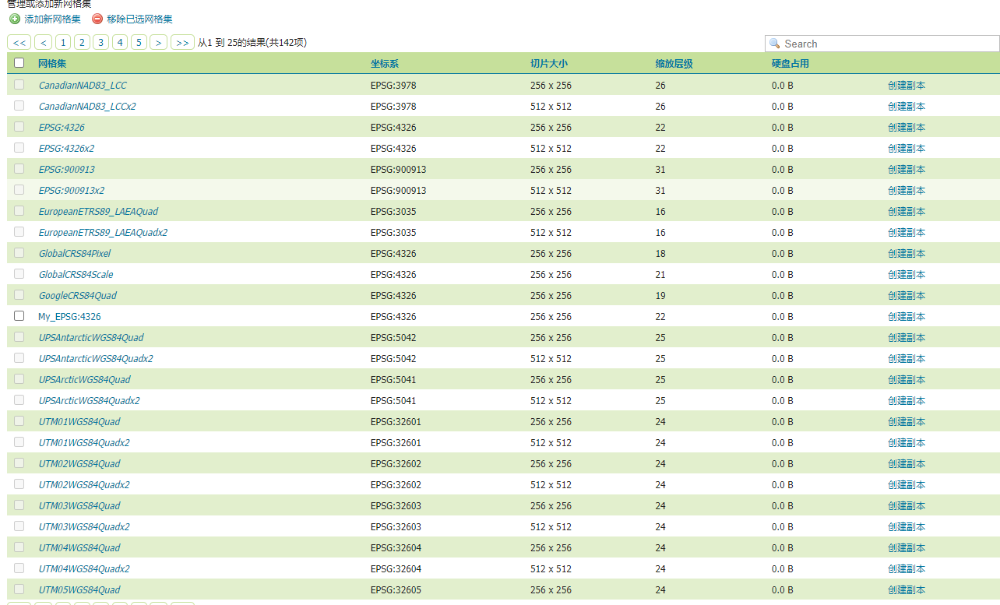

# GeoServer 2.21.2 切片服务

## GeoServer 网格定义

GeoServer 默认提供了很多种 切片的方式，基于不同的方式可以切出不同的坐标系（*切片服务，一旦切片，坐标系就是唯一，这个和WMS 服务有所不同，WMS 服务可以修改坐标系*）

+ `EPSG:4326` ：WGS 84 坐标系，(*需要注意的是，这种切片，不是正方形，是矩形，2 * 1 切片)
+ `EPSG:900913` ：Google 墨卡托（球面墨卡托），是一种非官方的定义方式，也就是我们常见的 `EPSG:3857`


## GeoServer 默认提供的是 WMTS 方式的切片

GeoServer 以 WMTS 的方向对图层进行缓存、切片
需要注意的是， WMTS 和 TMS 类似，官方规定，瓦片地图 Web-Mercator 投影坐标系的原点是 *东经 180 °，南纬85.05°，X轴向东延伸，Y轴向上延伸*


WMTS 切片出来的图片，文件夹组织方式，有嵌套的关系（*猜测是为了更好的进行数据加载*）

+ `EPSG_4326_06`：地图的切片方式 + 地图的缩放层级
+ `01_02`：次级文件夹（*目前不知道是代表什么意思*）
+ `0019_0040.png`：底层图片， X_Y，列号和行号


### GeoWebCache ：GeoServer 提供的数据切片方式（GWC）
由GeoServer 提供的一个可以独立运行的服务
这个服务 本质上是一个实时缓存的服务，也就是说用户浏览到某一个位置，才会缓存特定的瓦片。
而 预计算瓦片的过程称为 **seeding** 。（本质上也就是我们所说的切片过程）

## Openlayer 默认 XYZ 数据源加载

XYZ 数据源的配置 和 WMTS 区别非常小，唯一的区别在于坐标原点的不同。
XYZ 切片方式中，规定以 *东经 180 °，北纬 85.05°* 为原点，也就是说 ，和 TMS 只有Y轴是相反的，其他是完全一样。

Openlayer 中，渲染一个瓦片图层，和一种特定的坐标系 和 View 对象相关

+ 坐标系定义了 经纬度的组织方式 （如果有投影，也会定义具体的投影方式）
+ View 定义了每一个图层的 分辨率 `resolution`，也就定义了渲染
+ 本质上 Openlayers 的 图片请求方式（XYZ 中 图片），就是根据当前视图范围，当前的坐标系，分辨率`resolution` 计算出来的，
	+ 举个例子：以 level = 1 来说，因为resolution 规定了 level = 1时分辨率的大小，同时根据屏幕大小、当前的中心点，就可以计算出屏幕，所处的范围
	+ 得到了 Extend，就可以计算，需要哪些瓦片，比如说如果当前是 EPSG：4326坐标系，当前地图的范围为（60E,45N) (12E,30S)，并且通过 tileFunction，得到需要 0.0，和 0.1 这两块瓦片，并且请求瓦片，放置在对应的位置。

```js
 // Web-Mercator 投影的分辨率，这个分辨率再乘上 图片的大小，256*256，就是整个地图大小
    let resolutions = [
      156543.03390625,
      78271.516953125,
      39135.7584765625,
      19567.87923828125,
      9783.939619140625,
      4891.9698095703125,
      2445.9849047851562,
      1222.9924523925781,
      611.4962261962891,
      305.74811309814453,
      152.87405654907226,
      76.43702827453613,
      38.218514137268066,
      19.109257068634033,
      9.554628534317017,
      4.777314267158508,
      2.388657133579254,
      1.194328566789627,
      0.5971642833948135,
      0.29858214169740677,
      0.14929107084870338,
      0.07464553542435169,
      0.037322767712175846,
      0.018661383856087923,
      0.009330691928043961,
      0.004665345964021981,
      0.0023326729820109904,
      0.0011663364910054952,
      5.831682455027476e-4,
      2.915841227513738e-4,
      1.457920613756869e-4,
    ];
```

### 实际操作

具体的有两种实现方式

+ 直接修改 GeoServer 切片出来的瓦片数据
+ 修改 tileFunction，实现 tileCoordinate 到 GeoServer切片图层 转换

不论是哪一种，首先需要对GeoServer 切片数据，进行一次简单的出来，**需要去掉次级文件夹**，直接把数据，放到对应层的文件夹下
