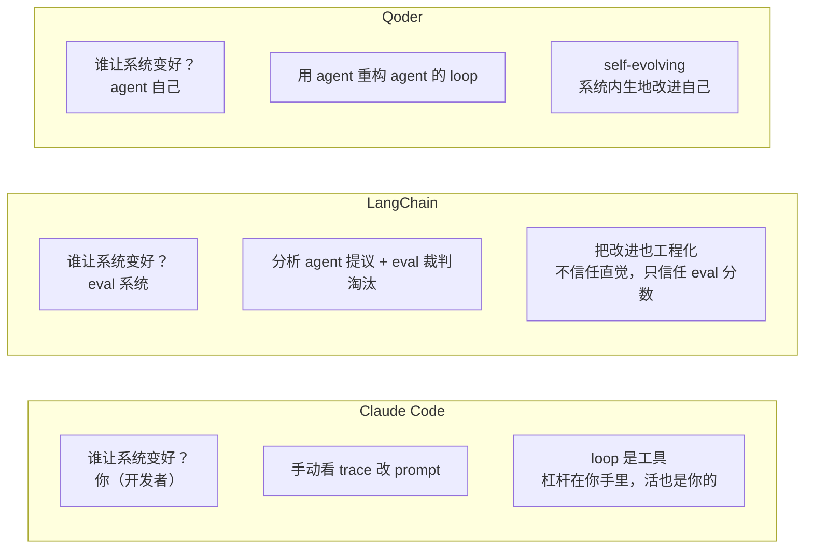

[概念篇](/posts/loop-engineering-概念篇/)讲了五积木框架。这篇看谁在做、怎么做，以及一条关键路线分歧：谁负责让系统变好。

## Claude Code 的四种 loop

Anthropic 把 loop 按触发方式和停止条件分了四类。这个分类比 Osmani 的五积木更贴近使用者视角，它问的是你愿意放开哪一环。

| Loop 类型 | 你交出去的是什么 | 什么时候用 | 工具 |
|---|---|---|---|
| Turn-based（轮次型） | 检查环节 | 你在探索或决策时 | verification skills |
| Goal-based（目标型） | 停止条件 | 你知道 done 长什么样 | `/goal` |
| Time-based（时间型） | 触发时机 | 工作发生在项目外部、按排程 | `/loop`, `/schedule` |
| Proactive（主动型） | 整个 prompt | 工作是反复出现且定义清晰的 | 上面所有 + dynamic workflows |

具体命令：

```bash
# 时间型：每 5 分钟跑一次
/loop 5m check my PR, address review comments, and fix failing CI

# 目标型：跑到分数达标或 5 轮为止
/goal get the homepage Lighthouse score to 90 or above, stop after 5 tries

# 主动型：定时触发 + 目标条件组合
/schedule every hour: check #project-feedback for bug reports. /goal: ...
```

`/goal` 的机制值得拆开看。它不是一个简单的 while 循环，是三个组件：

1. **Producer agent**：执行任务（写代码、修 bug）
2. **独立 evaluator 模型**：判断是否达标，跟 producer 不是同一个模型实例
3. **Done-check 契约**：你定义的停止条件，比如 "Lighthouse >= 90" 或 "所有测试通过"

这个 producer != grader 的分离是 Loop Engineering 里 Sub-agents 积木的核心实现。模型给自己打分太仁慈了，Reza Rezvani 的实测里专门强调了这一点。

Cherny 的态度：loop design 比 prompt engineering 更难。loop 是你手里的工具，但 harness 的改进是你自己的活。Claude Code 不替你做系统自我改进。

## OpenAI Codex Automations

Codex 的实现偏调度驱动，跟 Claude Code 的条件驱动不同。

核心机制：
- cron 定时触发
- Triage inbox（分类收件箱），处理不了的进收件箱等人
- skills 用 `$name` 语法引用
- 每个 thread 一个 worktree

OpenAI 自己工程团队用 Codex Automations 跑 "Morning Brief"：每天早晨自动汇总待办、CI 状态、issue 分流。这是目前公开的最具体的 Codex Automations 实际用例。

## 国内厂商：功能对齐，概念沉默

**阿里。** 产品层面，Qoder 的 Quest 模式 2025 年 8 月上线，是多步自主执行 Agent。通义灵码、Qwen Code（基于 Qwen3-Coder 开源）也具备 agent 能力。但官方没用 Loop Engineering 这个词。

社区层面，阿里云开发者社区有篇《Loop Engineering 与 SDD 结合下的 token 收敛》，提了一个海外文章几乎不谈的痛点：Token 爆炸。作者自述硬生生用下了一天快 200 刀的花费。

提出的解法是 Loop + SDD（Spec-Driven Development）：用 spec 文档把 AI 的搜索空间从"全宇宙压缩到一个小房间"来控制 token。具体做法是先写一份 spec：

```markdown
# Spec: 修复 auth 模块 token 刷新 bug

## 问题
token 在过期前 5 分钟没有自动刷新，导致偶发 401

## 约束
- 只改 src/auth/refresh.ts
- 不要动 src/auth/middleware.ts（上次改了出过事故）
- 测试必须通过 npm test auth
```

有了 spec，agent 的搜索范围被限制在指定文件里，token 消耗从"全仓库扫描"降到"单文件修改"。

**腾讯。** CodeBuddy 功能完整：Craft Agent Mode、CodeBuddy Code CLI（`npm install -g @tencent-ai/codebuddy-code`）、Agent SDK（TS/JS + Python）、MCP 和 ACP 协议支持。但没找到腾讯官方使用 Loop Engineering 这个术语的任何材料。典型的做而不说。

国内厂商在产品能力上没有掉队，但概念话语权完全在英文社区手里。国内唯一有原创贡献的是阿里社区那篇讲 token 成本的文章。

## LangChain 的四层模型

LangChain 直接把概念产品化了。Harrison Chase 的团队 2026 年 6 月发了 *The Art of Loop Engineering*，提出四层循环堆叠模型（loopcraft）。核心思想：每一层外循环的转动，都会让内层循环更有效。


四层对应的产品 primitive：

| 层 | 作用 | LangChain 产品 |
|---|---|---|
| Loop 1 - Agent Loop | 模型反复调工具直到完成 | `create_agent` |
| Loop 2 - Verification Loop | grader 拿输出对照 rubric 打分，不过关退回重做 | `RubricMiddleware` |
| Loop 3 - Event-Driven Loop | 事件/定时/webhook 触发 agent | LangSmith Deployment（cron + webhook）, Fleet channels |
| Loop 4 - Hill Climbing Loop | 分析 trace，改写 harness 配置，eval A/B 裁判 | LangSmith Engine |

Loop 1-3 自动化的是工作。Loop 4 自动化的是改进工作方式本身。

Loop 4 的具体流程：

```
生产 agent 每次跑 -> 全量 trace 进 LangSmith
        ↓
聚类 + 评分：哪些 trace 失败了、为什么
        ↓
分析 agent 读 trace 找 pattern
        ↓
提议 harness 改动（prompt/tool/grader/系统提示）
        ↓
在 eval set 上 A/B 测试新 harness vs 旧 harness
        ↓
赢了才 ship，输了回滚
```

关键点：harness 改动不是凭感觉上，是先在固定 eval set 上跑 A/B。LangChain 原话：harness 改进是一个 evals 问题，不是直觉问题。

效果数据：LangChain 用这套方法把自家 coding agent 从 Terminal Bench Top 30 提到 Top 5。这是目前公开的最硬的 Loop 4 效果数据。

文章最关键的一句：回退箭头不只是绕回顶端，而是伸进内部、直接改写 agent loop 本身。外层循环每转一圈，内层循环就更有效。

如果团队跑开源模型，trace/eval 信号还能反过来做 RL 微调，直接改模型权重，不只是改 harness。

## Qoder Quest 1.0

这里有个插曲。我第一轮调研判断"Qoder 没有 Loop 4 能力"，第二轮抓到 Quest 1.0 博客后纠正了。

Qoder Quest 1.0 在 2026 年 1 月 13 日发布，官方定位 "the world's first self-evolving autonomous agent"，博客标题 *Quest 1.0: Refactoring the Loop*。

Qoder 把 self-evolving 能力拆成三个工程支柱：

1. **Context management**：长循环里不让 context 失控。对应 Skills + State 积木
2. **Tool selection**：agent 在循环中动态决定该调哪个工具。对应 Connectors 积木
3. **Agent Loop**：用 agent 重构 agent 的 loop。标题 "Refactoring the Agent with the Agent" 就是这个意思

另外有个 LangChain 没强调的差异化：intelligent model routing。Quest 1.0 在 loop 里动态选模型，不同任务/步骤用不同模型。贵的步骤用强模型，简单步骤用便宜的。Reddit FinOps 帖提到把分类任务从 $30/1M 模型路由到 $0.05/1M 模型有 600x 成本差异，但没有工具没人执行。Qoder 把这个做进了 loop 里。

Loop 4 这个赛道不是 LangChain 独占。LangChain 证据更硬（Terminal Bench 数据），Qoder 商用更早（2026 年 1 月）。

## 谁负责让系统变好：三种哲学

三家的一手材料抓完，差异本质上是对"谁负责让系统变好"的不同回答。



Claude Code 把人当核心。适合你想保持深度掌控的场景。你得自己看 trace、自己改 prompt、自己调 skill。

LangChain 把 eval 当核心。适合你能定义清楚"好坏标准"的场景，比如有测试集。harness 改进不信任直觉，只信任 eval 分数。

Qoder 把 agent 当核心。适合你想尽量少干预、让它自己跑起来的场景。系统内生地改进自己。

一句话：Claude Code 给你一把好用的电钻（各种 /loop /goal 命令），LangChain 给你一个会自己磨钻头的工厂，Qoder 给你一个会自己进化钻头形状的工厂。

---

**参考来源：**

- Anthropic / Boris Cherny, *Loop engineering: Getting started with loops*
- LangChain, *The Art of Loop Engineering*, *Better Harness: A Recipe for Harness Hill-Climbing with Evals*
- Qoder, *Quest 1.0: Refactoring the Loop*
- 阿里云开发者社区, *Loop Engineering 与 Spec-Driven Development 结合下的 token 收敛*
- 腾讯 CodeBuddy 官网及博客

> 完整链接列表见[系列第三篇](/posts/loop-engineering-真实场景篇/)末尾。
