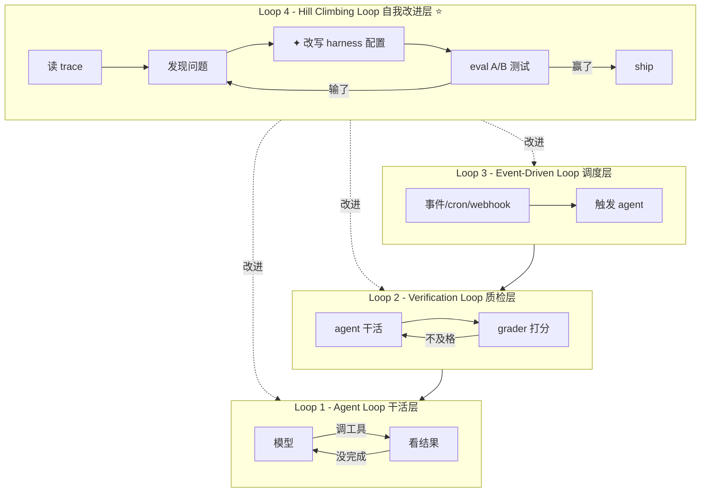
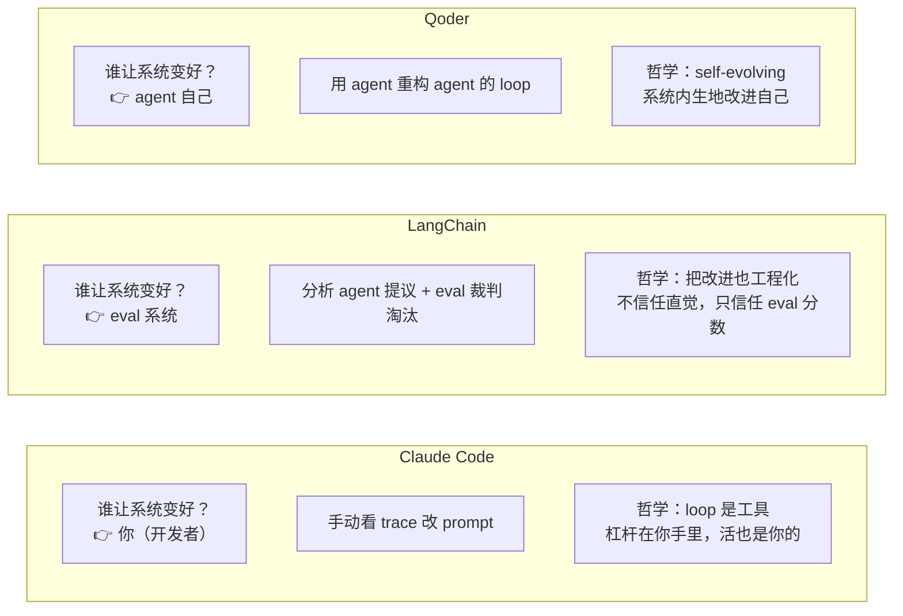

> 这是 Loop Engineering 调研系列的第二篇。第一篇讲了概念，本篇讲落地：各家厂商是怎么把"五积木"做成产品的，以及它们之间有一条很重要的路线分歧。

第一篇里我讲了 Loop Engineering 的概念和五积木框架。但概念再漂亮，也得看谁在做、怎么做。这一篇梳理三件事：Claude Code 的四种 loop 形态、国内厂商的响应、以及最关键的--LangChain、Claude Code、Qoder 三家代表的三种哲学分歧。

## Claude Code：四种 loop 形态

Anthropic 在官方博客里把 loop 按触发方式和停止条件分了四类。这个分类非常实用，因为它直接对应你可以交出去给 loop 的"是什么"：

| Loop 类型 | 你交出去的是什么 | 什么时候用 | 工具 |
|---|---|---|---|
| **Turn-based（轮次型）** | 检查环节 | 你在探索或决策时 | verification skills |
| **Goal-based（目标型）** | 停止条件 | 你知道"done 长什么样" | `/goal` |
| **Time-based（时间型）** | 触发时机 | 工作发生在项目外部、按排程 | `/loop`、`/schedule` |
| **Proactive（主动型）** | 整个 prompt | 工作是反复出现且定义清晰的 | 上面所有 + dynamic workflows |

具体命令长这样：

```bash
# 时间型：每 5 分钟跑一次
/loop 5m check my PR, address review comments, and fix failing CI

# 目标型：跑到分数达标或 5 轮为止
/goal get the homepage Lighthouse score to 90 or above, stop after 5 tries

# 主动型：整条流水线自动化
/schedule every hour: check #project-feedback for bug reports. /goal: ...
```

这个分类法比 Osmani 的五积木更贴近使用者视角：它不问"系统由什么构成"，而问**"你愿意放开哪一环"**。

Claude Code 负责人 Boris Cherny 的态度值得单独点出来：

> loop design 比 prompt engineering 更难，而不是更简单--杠杆点搬家了，但工作量没消失。

这句话定了 Claude Code 的产品基调：**loop 是你手里的工具，你想怎么跑怎么跑，但 harness 的改进是你自己的活。** 你得自己看 trace、自己改 prompt、自己调 skill。Claude Code 不替你做 Loop 4（系统自我改进）。这个选择后面会跟 LangChain 形成鲜明对比。

## 国内厂商：功能对齐，概念沉默

调研国内厂商时，我原本预期阿里、腾讯会有一些跟进，结果发现一个有意思的格局：**功能上大家差不多，叙事上国内在跟跑。**

按响应力度分三档：

| 档位 | 厂商 | 特征 |
|---|---|---|
| 第一档 | LangChain | 官方博客 + 报告，直接产品化 |
| 第二档 | 阿里 | 产品能力具备，术语跟进偏社区化 |
| 第三档 | 腾讯 | 功能层面齐全，概念层面沉默 |

**阿里**要分两层看。产品层面，Qoder 的 Quest 模式（2025年8月上线）已经是多步自主执行 / Agent 模式，自主拆解任务、循环执行、自我纠错--这其实就是 Loop Engineering 的产品化形态，只是早于这个术语流行。通义灵码、Qwen Code 也具备 agent 能力。但官方没用"Loop Engineering"这个词。社区层面，阿里云开发者社区有篇深度长文《Loop Engineering 与 SDD 结合下的 token 收敛》，提了一个挺有价值的本土视角：**重点强调海外文章几乎不谈的痛点--Token 爆炸**。作者自述"硬生生用下了一天快 200 刀的花费"，提出用 SDD（Spec-Driven Development）把 AI 的搜索空间压缩来控制 token。

**腾讯**的 CodeBuddy 功能上很完整（Craft Agent Mode、CodeBuddy Code CLI、Agent SDK、MCP 支持），但**没有找到腾讯官方使用 "Loop Engineering" 这个术语的任何材料**。典型的"做而不说"--产品能力对齐了，但没有跟进这个概念叙事。这跟国内大厂一贯不爱蹭英文社区新造术语的风格一致。

一句话：**国内厂商在产品能力上没有掉队，但在概念话语权上明显缺席。** 这个概念的定义权目前完全在英文社区手里。国内唯一有原创贡献的，是阿里社区那篇文章提出的"Loop + SDD 做 token 收敛"角度--这是个很务实的本土视角，但传播力远不及海外那几位 KOL。

## LangChain 的四层模型：把概念彻底产品化

LangChain 不只是"提了一下"，是直接把概念产品化了。Harrison Chase 的团队在 2026 年 6 月发了官方博客 *The Art of Loop Engineering*，没有照搬 Osmani 的五积木，而是提出了自己的**四层循环堆叠模型（loopcraft）**。关键思想是：每一层外循环的转动，都会让内层循环更有效。



四层分别是：

- **Loop 1 - Agent Loop（干活层）**：模型反复调工具直到任务完成。对应 `create_agent`。
- **Loop 2 - Verification Loop（质检层）**：grader 拿输出对照 rubric 打分，不过关带反馈退回重做。对应 `RubricMiddleware`。
- **Loop 3 - Event-Driven Loop（调度层）**：事件/定时/webhook 触发 agent。对应 LangSmith Deployment + Fleet channels。
- **Loop 4 - Hill Climbing Loop（自我改进层）⭐**：这是全文的核弹。**前三层自动化的是"工作"，第四层自动化的是"改进工作方式本身"。**

Loop 4 的机制是：每次 agent 跑都产生 trace -> 分析 agent 读 trace 找 pattern -> **直接改写 harness 配置**（prompt/tool/grader）-> 在 eval set 上 A/B 测试 -> 赢了才 ship。LangChain 用这套方法把自家 coding agent 从 Terminal Bench Top 30 提到 Top 5--这是目前公开的最硬的 Loop 4 效果数据。

关键的一句：**"回退箭头不只是绕回顶端，而是伸进内部、直接改写 agent loop 本身。外层循环每转一圈，内层循环就更有效。"**

## Qoder Quest 1.0：Loop 4 赛道的竞争者

调研过程中我有一个需要记录的自我修正：第一轮判断"Qoder 没有 Loop 4 能力"，第二轮抓到 Quest 1.0 博客后纠正了。

Qoder Quest 1.0（2026年1月13日发布）官方定位就是 **"the world's first self-evolving autonomous agent"**，博客标题直接叫 *Quest 1.0: Refactoring the Loop*。它做的恰好就是 Loop 4。Qoder 把 self-evolving 能力拆成三个工程支柱：Context management、Tool selection、Agent Loop。标题 "Refactoring the Agent with the Agent" 就是这个意思--**用 agent 重构 agent 的 loop**。

所以 Loop 4 这个赛道不是 LangChain 独占，而是有真金白银的竞争。LangChain 证据更硬（有 Terminal Bench 数据），Qoder 商用更早（2026年1月）。

## 三种 loop 哲学

抓完三家的一手材料，我觉得它们的差异本质上是对**"谁负责让系统变好"**这个问题的不同回答：



这三种没有绝对优劣，反映的是不同的产品立场：

- **Claude Code 把人当核心**--适合你想保持深度掌控的场景。
- **LangChain 把 eval 当核心**--适合你能定义清楚"好坏标准"的场景（比如有测试集）。
- **Qoder 把 agent 当核心**--适合你想尽量少干预、让它自己跑起来的场景。

一句话概括差异：

> **Claude Code 给你的是一把好用的"电钻"（各种 /loop /goal 命令），LangChain 给你的是一个会自己磨钻头的"工厂"，Qoder 给你的是一个会自己进化钻头形状的"工厂"。**

## 小结

从"谁在做"这一层看，Loop Engineering 的产品化已经起步，但路线分歧很大。Claude Code 给工具、LangChain 给平台、Qoder 给自演化系统，三家哲学互不兼容。国内厂商在功能上跟上了（Quest、Craft、灵码），但在概念话语权上缺席，唯一有原创贡献的是阿里社区那篇讲 token 成本的文章。

但产品化不等于能用。第三篇会回到最关键的问题：**真的有人用起来了吗，成本可控吗。**

---

**参考来源：**

- Anthropic / Boris Cherny, *Loop engineering: Getting started with loops*
- LangChain, *The Art of Loop Engineering*；*Better Harness: A Recipe for Harness Hill-Climbing with Evals*
- Qoder, *Quest 1.0: Refactoring the Loop*
- 阿里云开发者社区，*Loop Engineering 与 Spec-Driven Development 结合下的 token 收敛*
- 腾讯 CodeBuddy 官网及博客

> 完整链接列表见系列第三篇末尾。
