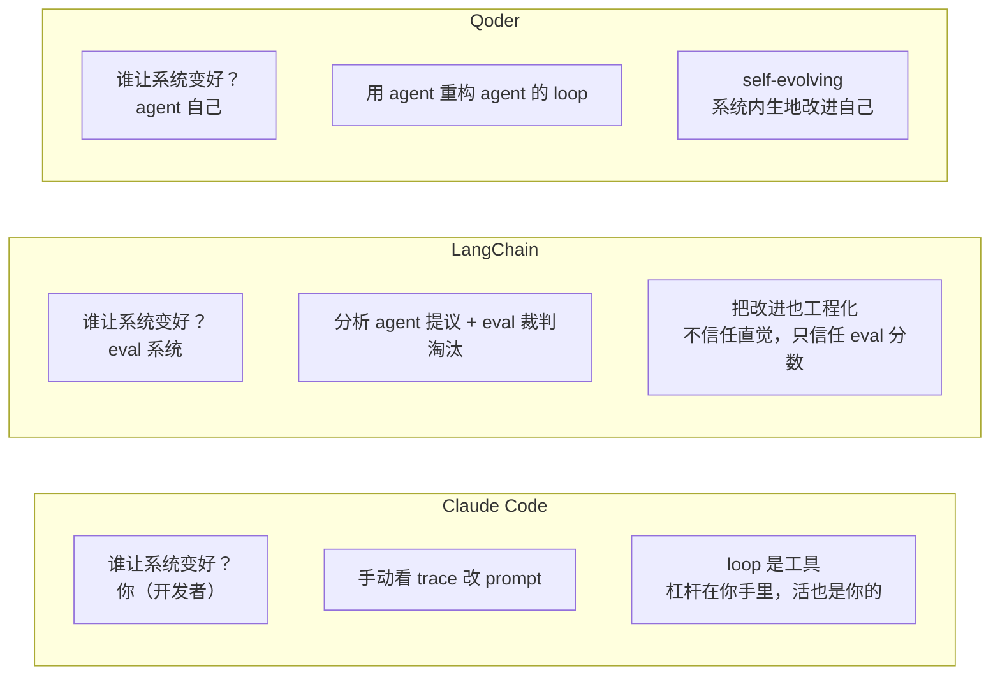

[概念篇](/posts/loop-engineering-概念篇/)讲了 Loop Engineering 的五积木框架。但概念再漂亮，也得看谁在做、怎么做。这篇梳理三件事：Claude Code 的四种 loop 形态、国内厂商的响应、以及最关键的一条路线分歧：谁负责让系统变好。

## Claude Code 把 loop 分成四种，按你愿意放开哪一环来分

Anthropic 在官方博客里把 loop 按触发方式和停止条件分了四类。这个分类比 Osmani 的五积木更贴近使用者视角，因为它不问"系统由什么构成"，而问你愿意放开哪一环。

| Loop 类型 | 你交出去的是什么 | 什么时候用 | 工具 |
|---|---|---|---|
| Turn-based（轮次型） | 检查环节 | 你在探索或决策时 | verification skills |
| Goal-based（目标型） | 停止条件 | 你知道"done 长什么样" | `/goal` |
| Time-based（时间型） | 触发时机 | 工作发生在项目外部、按排程 | `/loop`, `/schedule` |
| Proactive（主动型） | 整个 prompt | 工作是反复出现且定义清晰的 | 上面所有 + dynamic workflows |

命令长这样：

```bash
# 时间型：每 5 分钟跑一次
/loop 5m check my PR, address review comments, and fix failing CI

# 目标型：跑到分数达标或 5 轮为止
/goal get the homepage Lighthouse score to 90 or above, stop after 5 tries

# 主动型：整条流水线自动化
/schedule every hour: check #project-feedback for bug reports. /goal: ...
```

Claude Code 负责人 Boris Cherny 的态度值得注意。他说 loop design 比 prompt engineering 更难，不是更简单，杠杆点搬家了但工作量没消失。

这句话定了 Claude Code 的产品基调：loop 是你手里的工具，你想怎么跑怎么跑，但 harness 的改进是你自己的活。你得自己看 trace、自己改 prompt、自己调 skill。Claude Code 不替你做系统自我改进。这个选择后面跟 LangChain 形成了鲜明对比。

## 国内厂商：功能对齐，概念沉默

调研国内厂商时我发现一个有意思的格局：功能上大家差不多，叙事上国内在跟跑。

阿里要分两层看。产品层面，Qoder 的 Quest 模式 2025 年 8 月上线，已经是多步自主执行、自主拆解任务、循环执行、自我纠错的 Agent 模式。这其实就是 Loop Engineering 的产品化形态，只是早于这个术语流行。但官方没用这个词。

社区层面，阿里云开发者社区有篇深度长文《Loop Engineering 与 SDD 结合下的 token 收敛》，提了一个海外文章几乎不谈的痛点：Token 爆炸。作者自述硬生生用下了一天快 200 刀的花费，提出用 SDD 把 AI 的搜索空间压缩来控制 token。这个视角很务实，但传播力远不及海外那几位 KOL。

腾讯的 CodeBuddy 功能上很完整，Craft Agent Mode、CodeBuddy Code CLI、Agent SDK、MCP 支持都有。但我没找到腾讯官方使用 "Loop Engineering" 这个术语的任何材料。典型的做而不说，产品能力对齐了但不跟进概念叙事。这跟国内大厂一贯不爱蹭英文社区新造术语的风格一致。

国内厂商在产品能力上没有掉队，但在概念话语权上明显缺席。这个概念的定义权目前完全在英文社区手里。

## LangChain 的四层模型，第四层是核弹

LangChain 不只是提了一下，是直接把概念产品化了。Harrison Chase 的团队 2026 年 6 月发了官方博客 *The Art of Loop Engineering*，没有照搬 Osmani 的五积木，提出了自己的四层循环堆叠模型（loopcraft）。核心思想是每一层外循环的转动，都会让内层循环更有效。


前三层自动化的是工作，第四层自动化的是改进工作方式本身。

Loop 4 的机制是：每次 agent 跑都产生 trace，分析 agent 读 trace 找 pattern，直接改写 harness 配置（prompt/tool/grader），在 eval set 上 A/B 测试，赢了才 ship。LangChain 用这套方法把自家 coding agent 从 Terminal Bench Top 30 提到 Top 5。这是目前公开的最硬的 Loop 4 效果数据。

文章里最关键的一句：回退箭头不只是绕回顶端，而是伸进内部、直接改写 agent loop 本身。外层循环每转一圈，内层循环就更有效。

## Qoder Quest 1.0：调研过程中我纠正了一个判断

这里有个插曲。我第一轮调研判断"Qoder 没有 Loop 4 能力"，第二轮抓到 Quest 1.0 博客后纠正了。

Qoder Quest 1.0 在 2026 年 1 月 13 日发布，官方定位是 "the world's first self-evolving autonomous agent"，博客标题叫 *Quest 1.0: Refactoring the Loop*。它做的恰好就是 Loop 4。Qoder 把 self-evolving 能力拆成三个工程支柱：Context management, Tool selection, Agent Loop。标题 "Refactoring the Agent with the Agent" 说白了就是用 agent 重构 agent 的 loop。

所以 Loop 4 这个赛道不是 LangChain 独占，是有真金白银的竞争。LangChain 证据更硬（有 Terminal Bench 数据），Qoder 商用更早（2026 年 1 月）。

这个纠正本身也说明了一个问题：调研任务里"还有没有没覆盖的视角"很难靠机器判定，往往依赖你换一个搜索方向再戳一下。第三篇会展开讲这个。

## 谁负责让系统变好：三种哲学

三家的一手材料抓完，我发现它们的差异本质上是对"谁负责让系统变好"这个问题的不同回答。



Claude Code 把人当核心，适合你想保持深度掌控的场景。LangChain 把 eval 当核心，适合你能定义清楚"好坏标准"的场景，比如有测试集。Qoder 把 agent 当核心，适合你想尽量少干预、让它自己跑起来的场景。

一句话：Claude Code 给你一把好用的电钻（各种 /loop /goal 命令），LangChain 给你一个会自己磨钻头的工厂，Qoder 给你一个会自己进化钻头形状的工厂。

## 产品化不等于能用

从"谁在做"这一层看，Loop Engineering 的产品化已经起步，但路线分歧很大。三家哲学互不兼容。国内厂商在功能上跟上了，但在概念话语权上缺席。

但产品化不等于能用。[第三篇](/posts/loop-engineering-真实场景篇/)回到最关键的问题：真的有人用起来了吗，成本可控吗。

---

**参考来源：**

- Anthropic / Boris Cherny, *Loop engineering: Getting started with loops*
- LangChain, *The Art of Loop Engineering*, *Better Harness: A Recipe for Harness Hill-Climbing with Evals*
- Qoder, *Quest 1.0: Refactoring the Loop*
- 阿里云开发者社区, *Loop Engineering 与 Spec-Driven Development 结合下的 token 收敛*
- 腾讯 CodeBuddy 官网及博客

> 完整链接列表见[系列第三篇](/posts/loop-engineering-真实场景篇/)末尾。
