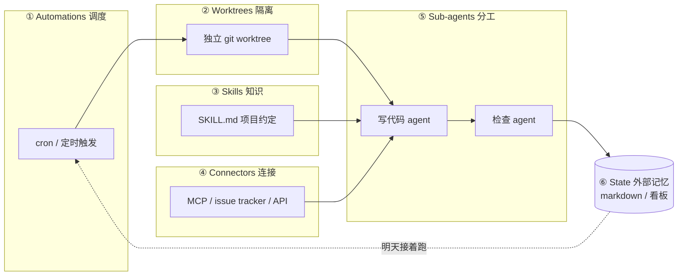

> 这是 Loop Engineering 调研系列的第一篇。这个系列共三篇：
> - **（一）概念篇** -- 一个新概念是怎么回事（本篇）
> - **（二）厂商与路线篇** -- 谁在做，怎么做的
> - **（三）真实场景篇** -- 真的有人用起来了吗

2026 年中，AI 编码圈冒出一个新词 **Loop Engineering（循环工程）**。最初是从 Addy Osmani（Google）、Boris Cherny（Anthropic，Claude Code 负责人）、Peter Steinberger 这几个人的文章和推文里传出来的。本系列是我对这个词做的一次系统调研，尽量分清"是什么""谁在做""真的能用吗"三件事。

## 一句话定义

**Loop Engineering 的核心主张是：**

> 你不再应该亲手 prompt 你的 AI 编码代理了。你应该设计一个会自动 prompt 代理的"循环系统"。

过去两年人和 AI 协作的主流方式是「你写 prompt → AI 回应 → 你再写 prompt」，一轮一轮由人主导。Loop Engineering 想把这件事往前推一层：**由你设计一个小系统，它去找工作、派工作、检查工作、记录进度，然后决定下一件事——这个系统替你去戳代理，而不是你亲自戳。**

## 它是相对于什么提出来的？

要理解一个新概念，最快的方式是看它说自己替代了什么。这套东西有一个清晰的层级对照：

| 层级 | 谁干活 | 例子 |
|---|---|---|
| **Prompt Engineering** | 你写好 prompt，AI 执行 | ChatGPT / Claude 早期用法 |
| **Agent Harness Engineering** | 你打造一个让单个代理运行的环境 | 自己写 bash 脚本维护循环 |
| **Loop Engineering** | 你设计一个会自己按表跑、会生小帮手的系统 | Codex Automations、Claude Code `/loop` |

关键区别在于"谁启动"：harness 还停在那儿等你启动，而 loop 会**按表自己跑**。阿里云开发者社区的一篇文章进一步把它定位为"第四代 AI 工程范式"：Prompt → Context → Harness → Loop。

## 五个积木 + 一个记忆

Addy Osmani 把一个完整的 loop 拆成 5 个原语 + 1 个外部记忆。这套"积木"说法是理解这个概念最实用的框架：

逐个解释：

1. **Automations（自动化调度）**——loop 的"心跳"。按排程触发，自动做 discovery（发现）和 triage（分流）。比如每天早上扫一遍 CI 失败、open issues、最近的 commits。
2. **Worktrees（工作树隔离）**——让多个并行跑的代理不会互相踩到文件。基于 `git worktree`，每个代理有自己独立的工作目录。
3. **Skills（技能）**——把项目知识（约定、build 步骤、"我们不这么干，因为上次那个事故"）写成 `SKILL.md`，让代理每次跑都能读，不用你像金鱼一样重讲项目背景。
4. **Plugins / Connectors（插件和连接器）**——基于 MCP，让代理能读 issue tracker、查数据库、打 staging API、发 Slack。让 loop 能"动手做事"而不只是"告诉你该怎么做"。
5. **Sub-agents（子代理）**——**最重要的结构性手段**：把"写代码的人"和"检查代码的人"拆开。模型给自己打分太仁慈了，需要另一个独立的代理来 review。
6. **State（外部记忆）**——一份 markdown 文件或 Linear 看板，记录"试过什么、过了什么、还开着什么"。因为**模型每次跑之间会忘光一切，记忆必须存在磁盘上，不在 context 里。代理会忘，repo 不会忘。**

## 一个完整的 loop 长什么样？

Osmani 给了他自己常用的形态，我直接引述：

> 每天早上一个 automation 在 repo 上跑，它的 prompt 调用一个 triage skill，读昨天的 CI 失败、open issues、最近的 commits，把发现写进一份 markdown 或 Linear 看板。对每个值得做的发现，开一个隔离的 worktree，派一个 sub-agent 草拟修法，再派**第二个 sub-agent** 对着项目 skills 和现有测试审查那份草稿。Connectors 让 loop 自己开 PR、更新 ticket。处理不了的进 triage 收件箱等我。状态文件是整件事的脊椎——明天早上那一轮，能从今天结束的地方接上。

**回头看你做了什么：你只设计过一次，没有任何一步是你 prompt 的。** 这是 Loop Engineering 想达到的终态。

## 三个被反复强调的警告

了解了"是什么"之后，更重要的是看推动者自己怎么泼冷水。这几篇文章都敲了同样的警钟，这其实是这个概念最值得关注的部分：

**1. 验证仍然是你的事。** 一个没人盯着跑的 loop，也是一个没人盯着犯错的 loop。loop 说的"完成了"是一个主张，不是证明。你的工作是出货「你亲自确认过能跑」的代码。

**2. Comprehension Debt（理解负债）——被点名为"新的技术负债"。** loop 出货"不是你写的代码"越快，「存在的代码」和「你真正理解的代码」之间的鸿沟就越大。一个顺畅的 loop 只会让它长得更快，**除非你去读 loop 做的东西**。

**3. Cognitive Surrender（认知投降）是最舒服的陷阱。** 当 loop 自己在跑，你会很想停止有自己的判断，直接收下它丢回来的东西。**同一个 loop，一个工程师用来在他深刻理解的工作上加速，另一个用来回避理解任何工作——loop 分不出差异，只有你知道。**

Osmani 的结论很直白：

> "把 loop 搭起来，但要像一个打算继续当工程师的人那样搭，不要像一个只想当按下启动键的人那样搭。"

Cherny（Anthropic）也强调，loop design 比 prompt engineering 更难，而不是更简单——**杠杆点搬家了，但工作量没消失。**

## 小结

从"是什么"这一层看，Loop Engineering 的概念本身是清晰、自洽的：它不是新工具，而是一种新的协作范式，把人从"每轮手动 prompt"推进到"设计一个会自己 prompt 代理的系统"。五积木框架（Automations / Worktrees / Skills / Connectors / Sub-agents + State）给了这套范式一个可拆解的结构。

但概念清晰不等于落地成熟。在后续两篇里我会继续拆：第二篇看各家厂商（Claude Code、LangChain、Qoder、阿里、腾讯）是怎么把这套概念产品化的、路线有什么分歧；第三篇回到最关键的问题——**真的有人用起来了吗，成本可控吗。**

---

**参考来源：**

- Addy Osmani, *Loop Engineering*, 2026-06-07
- Anthropic / Boris Cherny, *Loop engineering: Getting started with loops*
- 动区动趋，*Google 工程師教你什麼是 Loop Engineering？五個積木＋外部記憶*
- Cobus Greyling, *Loop Engineering Playbook*

> 完整链接列表见系列第三篇末尾。
