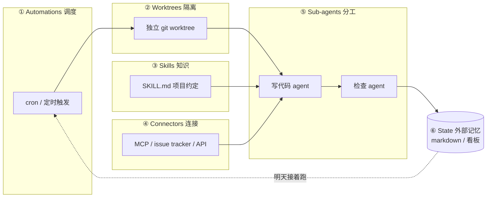

2026 年中，AI 编码圈在传一个说法：别再亲手 prompt 你的 coding agent 了，设计一个循环来替你做这件事。

这个说法从 Addy Osmani（Google）、Boris Cherny（Anthropic，Claude Code 负责人）、Peter Steinberger 几个人的文章里传出来，叫 Loop Engineering。这篇讲概念本身和五积木框架，[第二篇](/posts/loop-engineering-厂商与路线篇/)讲厂商落地，[第三篇](/posts/loop-engineering-真实场景篇/)讲真实使用场景。

## 核心主张

你设计一个小系统，它去找工作、派工作、检查工作、记录进度，然后决定下一件事。这个系统替你去戳代理，而不是你亲自戳。

过去两年人和 AI 协作的方式是你写 prompt，AI 回应，你再写 prompt。Loop Engineering 要把这件事往前推一层。你是设计者，不是操作员。

Osmani 给了一个层级对照：

| 层级 | 谁干活 | 例子 |
|---|---|---|
| Prompt Engineering | 你写好 prompt，AI 执行 | ChatGPT / Claude 早期用法 |
| Agent Harness Engineering | 你打造一个让单个代理运行的环境 | 自己写 bash 脚本维护循环 |
| Loop Engineering | 你设计一个会自己按表跑的系统 | Codex Automations, Claude Code `/loop` |

关键区别在谁启动。Harness 停在那儿等你启动，Loop 按表自己跑。

## 五个积木加一个记忆

Addy Osmani 把一个完整的 loop 拆成 5 个原语加 1 个外部记忆。



### ① Automations：调度层

Loop 的心跳。按 cron 触发，自动做 discovery 和 triage。

Claude Code 的实现：

```bash
# 每 5 分钟检查 PR 评论并修复 CI
/loop 5m check my PR, address review comments, and fix failing CI

# 每小时扫一次 issue
/schedule every hour: check #project-feedback for bug reports
```

Codex Automations 的实现是 cron + Triage inbox（分类收件箱），每个 thread 一个 worktree， skills 用 `$name` 语法引用。

### ② Worktrees：隔离层

多个并行跑的代理不能互相踩文件。基于 `git worktree`：

```bash
# 为每个 agent 创建独立工作目录
git worktree add ../fix-auth-bug -b fix/auth-bug
git worktree add ../refactor-api -b refactor/api
```

Claude Code 和 Codex 都在内部自动管理 worktree 生命周期，你不需要手动 cleanup。

### ③ Skills：项目知识

把项目约定、build 步骤、"我们不这么干因为上次那个事故"写成 `SKILL.md`。代理每次跑都能读，不用你重讲项目背景。

一个 SKILL.md 的结构大致是：

```markdown
# 项目：ai-paper 博客

## 构建
- `pnpm dev` 启动开发服务器（端口 4321）
- `pnpm build` 构建生产版本

## 约定
- 文章放 src/content/posts/，文件名用英文
- front matter 必须有 published 字段，格式 YYYY-MM-DD
- Mermaid 用 flowchart，不要用 quadrantChart（beautiful-mermaid 不支持）

## 不要做
- 不要改 _config.yml 的 theme 字段
- 不要删 public/assets/img/post/ 目录（文章图片在这里）
```

### ④ Connectors：连接器

基于 MCP（Model Context Protocol），让代理能读 issue tracker、查数据库、打 staging API、发 Slack。

实际配置一个 MCP server 的例子：

```json
{
  "mcpServers": {
    "github": {
      "command": "npx",
      "args": ["-y", "@modelcontextprotocol/server-github"],
      "env": { "GITHUB_TOKEN": "ghp_xxx" }
    },
    "notion": {
      "command": "npx",
      "args": ["-y", "@notionhq/notion-mcp-server"],
      "env": { "NOTION_API_KEY": "ntn_xxx" }
    }
  }
}
```

有了这个，agent 能自己开 PR、更新 Linear ticket、往 Notion 写调研笔记。

### ⑤ Sub-agents：分工

最重要的结构性手段。把写代码的人和检查代码的人拆开。

模型给自己打分太仁慈了。Claude Code 的 `/goal` 命令就是这个机制：

```bash
# agent + 独立 evaluator 模型 + done-check 契约
/goal get the homepage Lighthouse score to 90 or above, stop after 5 tries
```

这里有个 producer 和 grader 的分离。Producer agent 写代码，grader（独立的 evaluator 模型）判断是否达标。不是同一个模型自己审自己。

Osmani 的原话：需要另一个独立的代理来 review。

### ⑥ State：外部记忆

一份 markdown 文件或 Linear 看板，记录试过什么、过了什么、还开着什么。

模型每次跑之间会忘光一切。记忆必须存在磁盘上，不在 context 里。代理会忘，repo 不会忘。

一个 state 文件长这样：

```markdown
# Loop State - 2026-07-12

## 已完成
- [x] 修复 auth 模块的 token 刷新 bug（PR #42 已合并）
- [x] CI flaky test 修复（test_auth_expiry 稳定通过）

## 进行中
- [ ] API rate limiting 中间件（draft PR #45，grader 反馈缺少边界测试）

## 待处理
- [ ] 升级 React 19（依赖冲突，需要人工介入）
- [ ] 数据库索引优化（需要 DBA 确认执行计划）
```

明天早上那一轮，能从今天结束的地方接上。

## 一个完整的 loop 长什么样

Osmani 给了他自己常用的形态：

> 每天早上一个 automation 在 repo 上跑，它的 prompt 调用一个 triage skill，读昨天的 CI 失败、open issues、最近的 commits，把发现写进一份 markdown 或 Linear 看板。对每个值得做的发现，开一个隔离的 worktree，派一个 sub-agent 草拟修法，再派第二个 sub-agent 对着项目 skills 和现有测试审查那份草稿。Connectors 让 loop 自己开 PR、更新 ticket。处理不了的进 triage 收件箱等我。状态文件是整件事的脊椎，明天早上那一轮能从今天结束的地方接上。

回头看你做了什么：你只设计过一次，没有任何一步是你 prompt 的。

## 三个警告

推动者自己也在泼冷水。

**验证仍然是你的事。** loop 说的"完成了"是一个主张，不是证明。你的工作是出货你亲自确认过能跑的代码。

**Comprehension Debt（理解负债）。** loop 出货"不是你写的代码"越快，存在的代码和你真正理解的代码之间的鸿沟就越大。除非你去读 loop 做的东西，否则这个鸿沟只会扩大。这跟技术债类似，但更隐蔽，因为代码"能跑"。

**Cognitive Surrender（认知投降）。** 当 loop 自己在跑，你会很想停止有自己的判断，直接收下它丢回来的东西。同一个 loop，一个工程师用来在深刻理解的工作上加速，另一个用来回避理解任何工作。loop 分不出差异，只有你知道。

Osmani 的结论：把 loop 搭起来，但要像一个打算继续当工程师的人那样搭，不要像一个只想当按下启动键的人那样搭。

Cherny 说了类似的话：loop design 比 prompt engineering 更难。杠杆点搬家了，但工作量没消失。

---

**参考来源：**

- Addy Osmani, *Loop Engineering*, 2026-06-07
- Anthropic / Boris Cherny, *Loop engineering: Getting started with loops*
- 动区动趋, *Google 工程師教你什麼是 Loop Engineering？五個積木＋外部記憶*
- Cobus Greyling, *Loop Engineering Playbook*

> 完整链接列表见[系列第三篇](/posts/loop-engineering-真实场景篇/)末尾。
