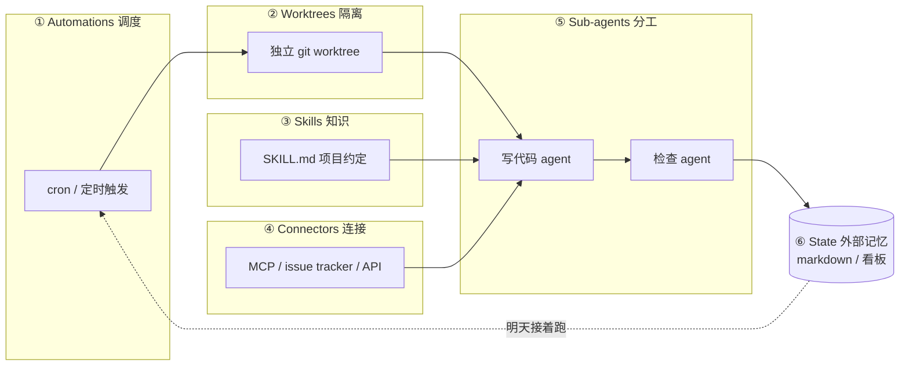

2026 年中，AI 编码圈在传一个说法：别再亲手 prompt 你的 coding agent 了，开始设计循环来替你做这件事。

这个说法从 Addy Osmani（Google）、Boris Cherny（Anthropic，Claude Code 负责人）、Peter Steinberger 几个人的文章和推文里传出来，被叫做 Loop Engineering（循环工程）。我花了一些时间把它搞清楚，这篇讲概念本身，后面两篇讲厂商怎么落地的、以及有没有人真用起来。

## 它到底在说什么

核心主张一句话：你设计一个小系统，它去找工作、派工作、检查工作、记录进度，然后决定下一件事。这个系统替你去戳代理，而不是你亲自戳。

过去两年人和 AI 协作的主流方式是你写 prompt，AI 回应，你再写 prompt，一轮一轮由人主导。Loop Engineering 想把这件事往前推一层。你是设计者，不是操作员。

关键区别在"谁启动"。在这之前有个中间阶段叫 Agent Harness Engineering，你打造一个让单个代理运行的环境，但它停在那儿等你启动。Loop 会按表自己跑。

阿里云开发者社区的一篇文章把它定位成"第四代 AI 工程范式"：Prompt, Context, Harness, Loop。

## 五个积木加一个记忆

Addy Osmani 把一个完整的 loop 拆成 5 个原语加 1 个外部记忆。这套积木说法是目前理解这个概念最实用的框架。

逐个说。

**Automations** 是 loop 的心跳。按排程触发，自动做 discovery 和 triage。比如每天早上扫一遍 CI 失败、open issues、最近的 commits。

**Worktrees** 让多个并行跑的代理不会互相踩到文件。基于 `git worktree`，每个代理有自己独立的工作目录。

**Skills** 把项目知识写成 `SKILL.md`。约定、build 步骤、"我们不这么干因为上次那个事故"这些东西，让代理每次跑都能读，不用你像金鱼一样重讲项目背景。这个我自己的感受很深，每次开新 session 都要重新解释一遍项目上下文，真的很烦。

**Connectors** 基于 MCP，让代理能读 issue tracker、查数据库、打 staging API、发 Slack。让 loop 能动手做事而不只是告诉你该怎么做。

**Sub-agents** 是最重要的结构性手段：把写代码的人和检查代码的人拆开。模型给自己打分太仁慈了，需要另一个独立的代理来 review。这一条我一开始觉得是多余的，后来想明白了，自己给自己改的 bug 谁会认真审呢，模型也一样。

**State** 是一份 markdown 文件或 Linear 看板，记录试过什么、过了什么、还开着什么。模型每次跑之间会忘光一切，记忆必须存在磁盘上，不在 context 里。代理会忘，repo 不会忘。

## 一个完整的 loop 长什么样

Osmani 给了他自己常用的形态：

> 每天早上一个 automation 在 repo 上跑，它的 prompt 调用一个 triage skill，读昨天的 CI 失败、open issues、最近的 commits，把发现写进一份 markdown 或 Linear 看板。对每个值得做的发现，开一个隔离的 worktree，派一个 sub-agent 草拟修法，再派第二个 sub-agent 对着项目 skills 和现有测试审查那份草稿。Connectors 让 loop 自己开 PR、更新 ticket。处理不了的进 triage 收件箱等我。状态文件是整件事的脊椎，明天早上那一轮能从今天结束的地方接上。

回头看你做了什么：你只设计过一次，没有任何一步是你 prompt 的。这是 Loop Engineering 想达到的终态。

听起来很美好，但推动者自己也在泼冷水。这部分我觉得比概念本身更值得看。

## 验证仍然是你的事

一个没人盯着跑的 loop，也是一个没人盯着犯错的 loop。loop 说的"完成了"是一个主张，不是证明。你的工作是出货你亲自确认过能跑的代码。

## Comprehension Debt：新的技术负债

loop 出货"不是你写的代码"越快，存在的代码和你真正理解的代码之间的鸿沟就越大。一个顺畅的 loop 只会让它长得更快，除非你去读 loop 做的东西。

这个概念点到了一个真问题。我见过太多团队引入 AI 辅助之后，PR 合得飞快，但真出 bug 的时候没人能说清那段代码为什么这么写。

## Cognitive Surrender 是最舒服的陷阱

当 loop 自己在跑，你会很想停止有自己的判断，直接收下它丢回来的东西。

同一个 loop，一个工程师用来在他深刻理解的工作上加速，另一个用来回避理解任何工作。loop 分不出差异，只有你知道。

Osmani 的结论：

> 把 loop 搭起来，但要像一个打算继续当工程师的人那样搭，不要像一个只想当按下启动键的人那样搭。

Cherny 也说了类似的话：loop design 比 prompt engineering 更难，不是更简单。杠杆点搬家了，但工作量没消失。

## 概念清晰不等于落地成熟

从"是什么"这一层看，Loop Engineering 的概念本身是清晰自洽的。五积木框架给了它一个可拆解的结构。

但概念清晰不等于落地成熟。后面两篇会继续拆：[第二篇](/posts/loop-engineering-厂商与路线篇/)看各家厂商怎么把这套概念产品化的、路线有什么分歧；[第三篇](/posts/loop-engineering-真实场景篇/)回到最关键的问题，真的有人用起来了吗，成本可控吗。

---

**参考来源：**

- Addy Osmani, *Loop Engineering*, 2026-06-07
- Anthropic / Boris Cherny, *Loop engineering: Getting started with loops*
- 动区动趋, *Google 工程師教你什麼是 Loop Engineering？五個積木＋外部記憶*
- Cobus Greyling, *Loop Engineering Playbook*

> 完整链接列表见[系列第三篇](/posts/loop-engineering-真实场景篇/)末尾。
