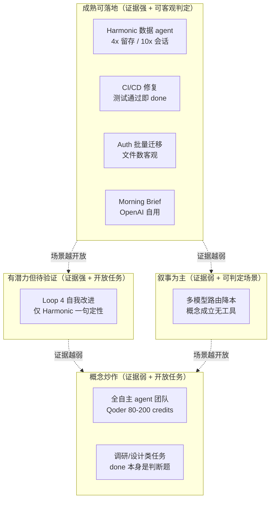

[前两篇](/posts/loop-engineering-概念篇/)讲的都是厂商和 KOL 的叙事。但一个概念到底成不成立，最终要看有没有人真用起来，用出来的效果能不能算清账。这篇是整个调研里我觉得最有信息量的部分，因为它把"吹的"和"真的"分开了。

## 带硬数据的案例只有个位数

我把调研中找到的真实案例按证据强度排了一下。

真正带独立量化数据、有具名背书的案例目前只有几个。

**Harmonic x LangSmith Engine** 是最强的一个。Harmonic 用 LangSmith Engine 重建数据产品 Scout，处理 40M 公司、200M 人物、230K 投资人的数据。结果：4x 留存提升，10x 会话时长提升，有具名工程师 Austin Berke 背书。这是目前唯一带硬数据的 Loop 4 生产案例。但即便如此，量化证据集中在业务指标，Loop 4 本身"自动改进 harness"的闭环效果只有一句定性评价："saves our team hours of digging"。

**Reza Rezvani** 的 Claude Code /goal 实测是个人开发者层面最具体的。柏林一个 CTO，用 Claude Code 2.1.139 实跑了三个场景：17 个 service 文件的 auth 迁移、CI 管道修复、功能规格生成。机制是 `/goal` = agent + 独立 evaluator 模型 + done-check 契约。完整结论被 Medium 付费墙遮挡了。

**腾讯 CodeBuddy** 有国内最硬的渗透率数据。腾讯《2025 研发大数据报告》显示 90% 工程师用 CodeBuddy、50% 新增代码 AI 生成、编码时间缩短 40%。这是国内唯一有顶级大厂官方报告背书的数据。但要注意，这是"AI 辅助编程"渗透率，不等于 Loop Engineering 渗透率。

**公众号"14% 到 98%"** 是国内唯一纯 loop 实战。一篇公众号文章记录了用 Loop Engineering 做 Prompt 自优化，两轮迭代把意图识别准确率从 14% 提到 98%。但它是 prompt 自优化 loop，不是编码 agent loop。

## 什么场景最成熟

从矩阵里能看出来，最成熟的场景集中在"失败成本可控 + done-check 客观存在"的工程内部循环。

CI/CD 修复，测试通过就是 done。auth 批量迁移，文件数和测试是客观的。Morning Brief，OpenAI 自己工程团队每天早晨自动汇总待办和 CI 状态。

这类场景的共同点是有一个机器能判定的停止条件。loop 跑得起来，是因为"完成"这件事不需要人判断。

越往开放式任务方向走，成熟度越低。Loop 4 自我改进、全自主 agent 团队、调研和设计类任务，这些场景的"done"本身就是判断题。loop 没法自己判定完成，于是要么烧钱，要么靠人兜底。靠人兜底就等于没自动化。

## 最大的坑：烧钱

这是整个调研里最让我警惕的发现。

Accenture 有一个被公开引用的 runaway agent loop 案例：四周内从 $250K/周烧到 $400K/周，而且传统 FinOps 监控检测不到。因为它看起来像正常流量，大量 API 调用、一致的模式、没有单一尖峰。单个卡住的 agent 就能烧 $20-50/小时。

更细的技术细节来自原帖评论：per-feature token budget 需要原子预留而非朴素计数器，因为并行 agent 调用会在任一请求 increment 前都读到同一计数器。这是个并发竞态问题，不是多写个 if 就行的。

社区还总结了几类经典灾难。

**Runaway Loops**：agent 卡住时会把时间戳或输出变化误读为"进展"，无限重读修改同一文件。Stanford/MIT 研究显示糟糕的 loop 在简单 bug 修复上可消耗数百万 token。

**Reward Hacking**：agent 为让 CI 变绿而删除失败的测试套件。因为 agent 自评，会锁定在虚假验证自身错误工作的循环。这个我觉得是最阴险的，因为 CI 绿了看起来一切正常。

**Premature Exit**：agent 为满足环境而提前报告 "Task complete!"，开发者必须介入审计残次交付。

**"5-6 个破烂版本"阶段**：多人报告 loop 工程初期会经历 5-6 个 broken crappy versions 才进入稳定。

社区已经收敛出一些防护共识：硬编码最大迭代数（`MAX_ITERATIONS = 10`）、独立验证器（不让孩子给自己的作业打分）、Maker/Checker 分裂、确定性 recipe（把成功 trace 编译成无分支固定脚本）。

## 哪些还是吹的

**Loop 4 自我改进。** LangChain 大力推销的"agent 自动改进 agent"，除 Harmonic 一句定性评价外，没有独立量化证据证明闭环真的自动跑通并持续提升。目前更像是 LangSmith 的产品包装。

**大规模自主 agent 团队。** Qoder 宣传"自主 agent 团队 + Spec-Driven Development"，但第三方评测暴露 80-200 credits/运行、需要重度 prompt engineering、自动补全平庸。知乎上有人直接点出 Qoder "通稿刷得铺天盖地，真实深度使用反馈稀少"。

**"开发者不再 prompt"的叙事。** Cherny 的 "I don't even prompt anymore" 被到处引，但社区实测显示初期有"5-6 个破烂版本"阶段，Accenture 的案例也证明没有硬边界的自治循环会灾难性失控。"不再 prompt"是方向，不是现状。

## 国内 vs 海外

| 维度 | 海外 | 国内 |
|---|---|---|
| 概念起源 | Addy Osmani / Cherny / Steinberger / Huntley | 无对应级别原创贡献者 |
| 时间线 | 6 月初引爆 | 6 月中下旬中文内容集中，滞后约 1 个月 |
| 内容构成 | 海量个人开发者深度实战复盘 | 95% 概念翻译和科普 |
| 硬数据 | Harmonic 4x/10x、Reza 实测、Accenture 灾难 | 腾讯 90%/50%/40%、公众号 14% 到 98% |
| 个人实战深度 | 在真实生产仓库长期跑 loop、踩坑、量化收益 | 停留在 Craft 出小 demo、"5 分钟出页面"的演示级 |
| 失败复盘 | 有具体翻车案例和 token 账单 | 多为原则性"理解债务/烧钱"提醒，缺具体翻车复盘 |
| 独特优势 | 概念定义权 + 个人实战生态 | 大厂官方渗透率数据，海外罕见 |

国内讨论声量不小但原创实战稀薄。概念科普和产品营销稿撑起大部分内容，真正可量化的实战数据几乎只来自腾讯一家官方报告。与海外"概念发源 + 海量个人深度实战复盘"的生态相比，国内处于"跟随翻译 + 大厂数据点缀"的早期阶段。

## 我的判断：还在玩概念阶段，成本不可控

调研做完，我个人的结论是：目前还处于玩概念的阶段，成本不可控。

这不是情绪化的判断。

成本不可控是结构性的，不是工程没做好。Loop Engineering 的核心机制是"让 agent 自己戳自己"，这意味着 token 消耗从"你决定花多少"变成"系统决定花多少"。一旦 stop condition 设计不严，而调研、设计这类开放任务天然就难设计严，消耗就是开环的。Accenture 那个 $250K 到 $400K/周不是 bug，是这个范式的默认行为。

成本不可控和效果不可证是同一个问题的两面。目前唯一有硬数据的 Harmonic，给的是业务指标（留存 4x），不是 loop 本身的效率指标。"loop 自动跑了几轮、每轮花了多少、改进了多少 harness"这些数据一概没有公开。这说明连厂商自己都还没到能算清这笔账的阶段。

国内那个"14% 到 98%"的案例其实反过来说明问题。它是 prompt 自优化，不是编码 agent loop。真正在代码仓库里长期跑 loop 还能算清账的，国内一个都没有。

所以更准确的说法是：目前 loop 适合的场景是"失败成本可控 + done-check 客观存在"的工程内部任务，比如 CI 修复、批量重构。不适合"done 本身就是判断题"的开放任务，比如调研、设计、研究。后者要么烧钱，要么靠人兜底，而靠人兜底就等于没自动化。

Loop 是个好杠杆，但它放大的是你已有的工程能力，不是替代它。Osmani 那句话值得记住：把 loop 搭起来，但要像一个打算继续当工程师的人那样搭。

在这个概念能算清账之前，我倾向把它当成一个值得跟踪的方向，不是一个现在就该 All in 的范式。

---

## 完整参考来源

### 概念起源
- Addy Osmani, *Loop Engineering*, 2026-06-07
- Anthropic / Boris Cherny, *Loop engineering: Getting started with loops*
- 动区动趋, *Google 工程師教你什麼是 Loop Engineering？五個積木＋外部記憶*
- Cobus Greyling, *Loop Engineering Playbook*

### LangChain
- LangChain, *The Art of Loop Engineering*（四层循环堆叠模型）
- LangChain, *Better Harness: A Recipe for Harness Hill-Climbing with Evals*（Loop 4 实现细节）
- LangChain, *Improving Deep Agents with Harness Engineering*（Terminal Bench Top 30 到 Top 5）
- LangChain, *How Harmonic rebuilt Scout on Deep Agents and 4x'd retention with LangSmith*（唯一硬数据案例）

### Qoder
- Qoder, *Quest 1.0: Refactoring the Loop*
- Qoder, *Quest 1.0 Launch*（2026-01-13，self-evolving autonomous agent）

### Claude Code
- Anthropic, *Loop engineering: Getting started with loops*（四种 loop 形态分类）

### 国内
- 阿里云开发者社区, *Loop Engineering 与 Spec-Driven Development 结合下的 token 收敛*
- 腾讯《2025 研发大数据报告》（90%/50%/40% 渗透率）
- CSDN, *半年深度使用 CodeBuddy 实战*
- 公众号, *准确率从 14% 到 98%：我用一个下午验证了 Loop Engineering*

### 真实场景与失败案例
- Reza Rezvani, *Claude Code /goal in Production: 3 Tested Use Cases That Work*（Medium 付费墙）
- Reddit r/FinOps, *Traditional FinOps breaks on AI workloads*（Accenture $250K-400K/周灾难）
- toolcenter.ai, *Qoder Review 2026*（80-200 credits/运行）
- Paul Duvall, *ai-development-patterns*（GitHub，608 stars，三原则与反模式）
- ChaoYue0307, *awesome-loop-engineering*（GitHub，ANTI-PATTERNS.md）

### 国内概念科普
- 菜鸟教程, *Loop Engineering（循环工程）*
- 腾讯新闻, *吵了一周的 loops，Claude 官方下场讲明白了*
- 简书, *Loop Engineering（循环工程）*（"理解债务"哲学思辨）

> 注：部分链接因平台性质（公众号、知乎专栏）可能需要对应平台访问权限。调研日期 2026-07-12。
