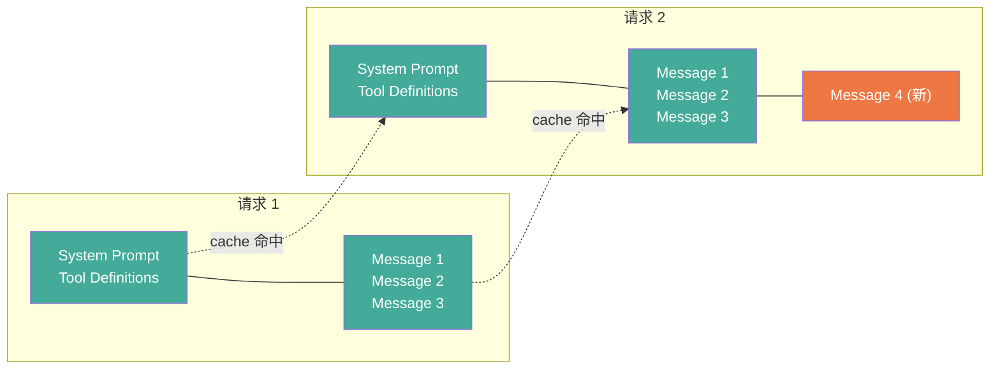
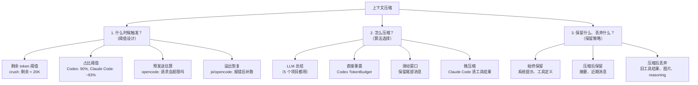
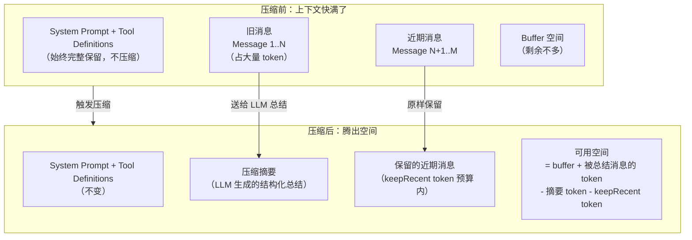
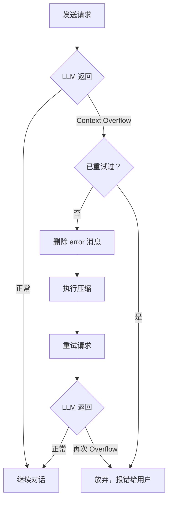
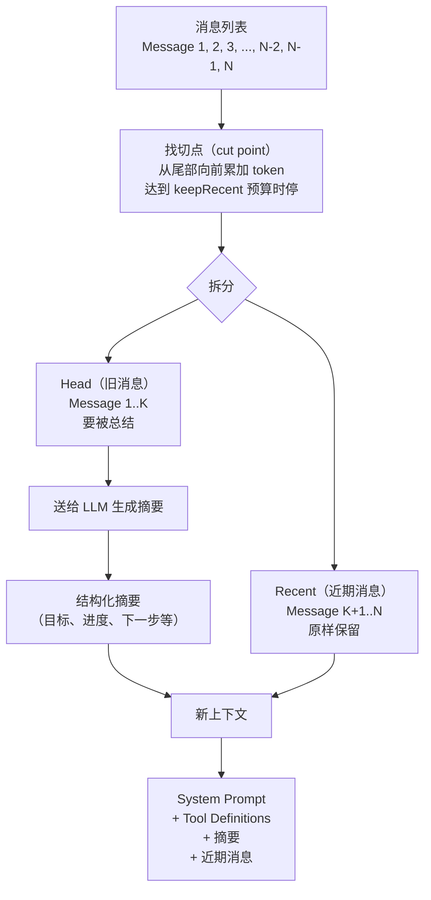
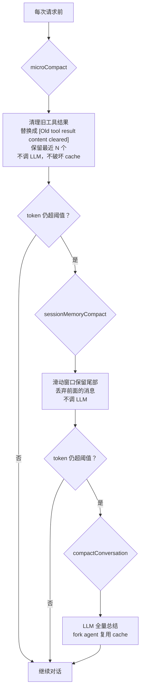
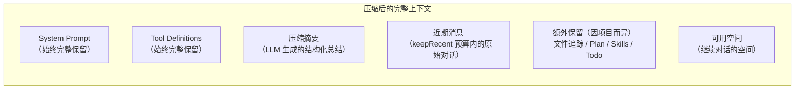

Code agent（Claude Code、Codex、opencode、crush、pi）在长会话里都会遇到上下文窗口不够用的问题。解决方案是上下文压缩（context compaction）：在 token 快满时，把旧对话总结成一段摘要，腾出空间继续跑。

这篇讲原理：为什么要压缩、压缩的设计空间、触发条件怎么设计、压缩算法怎么选、保留什么丢弃什么。[第二篇](/posts/code-agent-compaction-源码实现/)逐个拆 5 个项目的源码。

## 为什么要压缩

三个原因，第三个很多人没意识到。

**Context window 有限。** 200K token 听起来很多，但一个复杂任务跑几十轮就能填满。读一个 500 行的文件大约 2000 token，跑一次 grep 返回 50 条结果大约 5000 token，改几处代码加上 diff 大约 3000 token。十几轮下来，工具返回的结果本身就占了大量上下文。

**Token 成本是 O(n²) 增长。** 每次请求都把完整历史发过去。第 1 轮发 1 条，第 2 轮发 2 条，第 N 轮发 N 条。N 轮的总量是 1+2+...+N = N(N+1)/2。如果不压缩，跑到第 50 轮时总 token 消耗是 1275 条消息的量。

**Prompt cache 跟压缩的关系。** 这是最容易被忽略的。现代 LLM API 有 prompt cache：如果多次请求的前缀相同，只有后缀变化，前缀部分只 prefill 一次，后续请求命中 cache 直接复用。



关键问题：如果在中间插入或删除消息，cache prefix 就断了，后面全部 miss。所以压缩不只是为了省 token，还要尽量不破坏 cache prefix。Claude Code 的 microCompact 用 `cache_edits` API 在不破坏 cache 前缀的前提下删旧工具结果，Codex 的 `remove_first_item` 从最旧处删（保留前面的 cache），都是基于这个考量。

## 压缩的设计空间

上下文压缩本质上要回答三个问题。后面的章节逐个展开。



## 触发条件

### 压缩前后的上下文结构

先看压缩前后上下文长什么样，理解 buffer 和 keepRecent 的关系：



关键数学关系：压缩后释放的空间 = 被总结消息的 token - 摘要 token - keepRecent token。如果摘要和 keepRecent 加起来比原来还大，压缩就没有意义。所以摘要有输出上限（opencode 4096，pi 0.8*reserveTokens），keepRecent 也有预算限制（opencode 8K，pi 20K，Codex 20K）。

### 触发方式一：剩余 token 阈值

crush 的做法最直接：看剩余 token 还有多少。

```go
// crush/internal/agent/agent.go:53-55
largeContextWindowThreshold = 200_000
largeContextWindowBuffer    = 20_000
smallContextWindowRatio     = 0.2

// agent.go:432-451
cw := int64(largeModel.CatwalkCfg.ContextWindow)
tokens := currentSession.CompletionTokens + currentSession.PromptTokens
remaining := cw - tokens

var threshold int64
if cw > largeContextWindowThreshold {
    threshold = largeContextWindowBuffer          // 大窗口：剩余 < 20K 触发
} else {
    threshold = int64(float64(cw) * smallContextWindowRatio)  // 小窗口：剩余 < 20% 触发
}
```

大窗口模型留 20K buffer，小窗口模型留 20%。为什么要分两档？因为 20K 对 200K 窗口来说是 10%，但对 32K 窗口的模型来说已经是 62% 了，比例不合理。小窗口用比例更合理。

token 数来自 provider 返回的 usage 统计（`PromptTokens` + `CompletionTokens`），不是客户端估算的。

### 触发方式二：占比阈值

Codex 默认在上下文窗口的 90% 触发：

```rust
// codex-rs/protocol/src/openai_models.rs:457-468
pub fn auto_compact_token_limit(&self) -> Option<i64> {
    let context_limit = self.resolved_context_window()
        .map(|context_window| (context_window * 9) / 10);  // 90%
    let config_limit = self.auto_compact_token_limit;
    if let Some(context_limit) = context_limit {
        return Some(config_limit.map_or(context_limit, |limit| {
            std::cmp::min(limit, context_limit)
        });
    }
    config_limit
}
```

取 `min(用户配置, 90% 窗口)`。测试用例验证：400K 窗口的模型阈值是 360K（`openai_models.rs:1194`）。

Claude Code 类似，用有效窗口减去 buffer：

```typescript
// claude-code-cli/services/compact/autoCompact.ts:33-76
export function getEffectiveContextWindowSize(model: string): number {
  // contextWindow - min(maxOutputTokens, 20_000)
  // 200K 窗口的 effective window 约 180K
}

export const AUTOCOMPACT_BUFFER_TOKENS = 13_000

export function getAutoCompactThreshold(model: string): number {
  const effectiveContextWindow = getEffectiveContextWindowSize(model)
  return effectiveContextWindow - AUTOCOMPACT_BUFFER_TOKENS
  // 200K 模型：180K - 13K = 167K，约 93%
}
```

注意 Claude Code 的 effective window 不是原始 context window，还要减去 output token 预留（`min(maxOutputTokens, 20_000)`）。因为模型生成回复也需要 token 空间，不能把输入填满整个窗口。

pi 也是占比模式：

```typescript
// pi/packages/coding-agent/src/core/compaction/compaction.ts:106-110, 209-212
export const DEFAULT_COMPACTION_SETTINGS: CompactionSettings = {
    enabled: true,
    reserveTokens: 16384,     // buffer
    keepRecentTokens: 20000,  // 保留近期消息的预算
};

export function shouldCompact(contextTokens: number, contextWindow: number, settings: CompactionSettings): boolean {
    if (!settings.enabled) return false;
    return contextTokens > contextWindow - settings.reserveTokens;
    // 200K 窗口：183.5K 触发，约 92%
}
```

### 触发方式三：预发送估算

opencode 不看"已用了多少"，而是在发送请求前估算"这次请求会不会超限"：

```typescript
// opencode/packages/core/src/session/compaction.ts:12-14, 225-236
const DEFAULT_BUFFER = 20_000

const compactIfNeeded = Effect.fn("SessionCompaction.compactIfNeeded")(function* (input: Input) {
  const context = input.model.route.defaults.limits?.context
  const output = input.request.generation?.maxTokens ?? input.model.route.defaults.limits?.output ?? 0
  if (
    estimate({ system: input.request.system, messages: input.request.messages, tools: input.request.tools }) <=
    context - Math.max(output, config.buffer)
  )
    return false  // 不会超限，不压缩
  return yield* compactAfterOverflow(input)  // 会超限，压缩
})
```

`estimate` 把 system + messages + tools 全算进去。区别是：前面几个项目看的是"已经用了多少 token"（基于上一次请求的 usage），opencode 看的是"这次请求总共需要多少 token"（基于当前消息列表的估算）。后者更精确，因为消息列表可能在两次请求之间被修改过。

### 触发方式四：溢出恢复

主动触发之外，还有被动触发：LLM 返回了 context overflow 错误后的补救。



pi 的实现：

```typescript
// pi/packages/coding-agent/src/core/agent-session.ts:1930-1950
if (sameModel && isContextOverflow(assistantMessage, contextWindow)) {
    const willRetry = assistantMessage.stopReason !== "stop";
    if (this._overflowRecoveryAttempted) {
        // 已经重试过一次，不再重试
        return false;
    }
    this._overflowRecoveryAttempted = true;
    // 删掉 error 消息，压缩后重试
    return await this._runAutoCompaction("overflow", willRetry);
}
```

`_overflowRecoveryAttempted` 标志位确保只重试一次。opencode 也类似（`compactAfterOverflow`，只允许一次）。

Codex 的溢出恢复处理的是另一种情况：总结请求本身超长。因为总结要把整个历史发给 LLM，如果历史本身就接近窗口上限，总结请求也会超长：

```rust
// codex-rs/core/src/compact.rs:285-300
Err(e @ CodexErr::ContextWindowExceeded) => {
    if turn_input_len > 1 {
        history.remove_first_item();  // 从最旧处删一条，保留 cache prefix
        retries = 0;
        continue;
    }
    // 只剩一条了，放弃
}
```

从最旧处删而不是从最新处删，是为了保留 cache prefix。删了最旧的消息，前面的 cache 还能用。

Claude Code 的 PTL（prompt-too-long）重试更复杂：按 API 轮次分组，丢弃最旧的组，按 token gap 或 20% 比例计算丢多少，最多重试 3 次。

### 各项目触发阈值汇总

| 项目 | 触发方式 | 阈值 | 200K 窗口实际触发点 | buffer 用途 |
|---|---|---|---|---|
| Claude Code | 占比 + buffer | effective - 13K | ~167K (93%) | 压缩期间的操作空间 |
| Codex | 占比 | 90% | 180K (90%) | 最保守，最早触发 |
| opencode | 预发送估算 | window - max(output, 20K) | ~160K (80%) | 确保请求不超限 |
| crush | 剩余 token | 剩余 < 20K | ~180K (90%) | 保证模型有输出空间 |
| pi | 占比 + buffer | window - 16K | ~184K (92%) | 压缩后的操作空间 |

buffer 的含义不完全是"留给模型输出的空间"。它还包含了压缩过程本身的开销：压缩要发一个总结请求，这个请求本身也消耗 token。如果 buffer 太小，可能压缩请求都发不出去。

## 压缩算法

### LLM 总结：主流方案

5 个项目都用了 LLM 总结作为主要压缩手段。基本流程：



切点选择是核心。切点之后的消息原样保留，切点之前的送给 LLM 总结。

### 切点选择：tool result 不能切

为什么 tool result 不能切？看一条 tool call 和 tool result 的配对：

```
assistant: 我要调用 FileRead 工具读取 src/auth.ts
  tool_call: FileRead({ path: "src/auth.ts" })
user: 
  tool_result: [文件内容，2000 行代码]
assistant: 好的，我看到这个文件里有...
```

如果切点落在 tool_result 中间，上下文就变成：

```
assistant: 我要调用 FileRead 工具读取 src/auth.ts
  tool_call: FileRead({ path: "src/auth.ts" })
[--- 切点 ---]
[tool_result 的后半截]
assistant: 好的，我看到这个文件里有...
```

模型看到一个 tool_call 但看不到完整的 tool_result，会产生混乱。更糟的情况是 tool_call 被总结掉了但 tool_result 保留下来了，模型看到一段没有上下文的工具返回。

pi 显式检查切点合法性：

```typescript
// pi/packages/coding-agent/src/core/compaction/compaction.ts:282
function isCutPointMessage(entry: SessionEntry): boolean {
    // user, assistant, bashExecution, custom, branchSummary, compactionSummary 可以切
    // toolResult 绝不能切
}
```

当切点落在一个带 tool call 的 assistant 消息处时，其后续的 tool result 会跟着保留。Claude Code 用 `adjustIndexToPreserveAPIInvariants` 做类似调整。

### 切点选择的滑动窗口算法

pi 的切点算法最清晰，从尾部向前累加 token：

```typescript
// pi/packages/coding-agent/src/core/compaction/compaction.ts:389-413
let accumulatedTokens = 0;
let cutIndex = cutPoints[0];
for (let i = endIndex - 1; i >= startIndex; i--) {
    const entry = entries[i];
    const messageTokens = sessionEntryToContextMessages(entry).reduce(
        (sum, message) => sum + estimateTokens(message), 0);
    if (messageTokens === 0) continue;
    accumulatedTokens += messageTokens;
    if (accumulatedTokens >= keepRecentTokens) {  // 默认 20000
        for (let c = 0; c < cutPoints.length; c++) {
            if (cutPoints[c] >= i) { cutIndex = cutPoints[c]; break; }
        }
        break;
    }
}
```

token 估算用 `chars/4` 启发式（`estimateTokens`，`compaction.ts:240`），图片按 4800 字符。这个估算不精确，但够用，因为 keepRecent 是个预算不是硬限制。

opencode 类似，但 keepRecent 更小：

```typescript
// opencode/packages/core/src/session/compaction.ts:128-159
const select = (messages: Message[]) => {
  let tokens = 0;
  let splitIndex = messages.length;
  for (let i = messages.length - 1; i >= 0; i--) {
    tokens += estimate(messages[i]);
    if (tokens >= config.keepTokens) {  // 默认 8000
      splitIndex = i;
      break;
    }
  }
  // head = messages[0..splitIndex]  -> 送去总结
  // recent = messages[splitIndex..] -> 原样保留
};
```

### 增量更新 vs 全量总结


增量更新的好处是 token 消耗少：不用每次把全部历史发过去，只发增量部分。坏处是可能累积信息损失：如果 LLM 在某次更新时丢了一条重要信息，后续更新不会补回来。

opencode 的 `buildPrompt` 指示 LLM "update the anchored summary"。pi 有专门的 `UPDATE_SUMMARIZATION_PROMPT`（`compaction.ts:474`），要求"保留所有既有信息、移动进度项、更新下一步"。

### 直接重置：不调 LLM

Codex 有一个 TokenBudget 路径，完全跳过 LLM 总结，直接开新窗口：

```rust
// codex-rs/core/src/compact_token_budget.rs:45-90
// "Token-budget compaction skips model/server summarization
//  and installs a fresh context window instead."
async fn run_compact_task_inner(...) -> CodexResult<()> {
    sess.start_new_context_window(turn_context, world_state).await;
    Ok(())
}
```

靠 `world_state`（外部上下文状态）重建。这是最激进的压缩，相当于"全忘了，从头来"。适用于 world state 能完整描述当前任务状态的场景。

### 微压缩：不调 LLM 的渐进式清理

Claude Code 独有的设计。在触发完整压缩之前，先尝试轻量操作：



microCompact（`microCompact.ts`）只清理这些工具的旧结果：`FileRead`, `Bash`, `Grep`, `Glob`, `WebSearch`, `WebFetch`, `FileEdit`, `FileWrite`。保留最近 N 个，其余替换成 `'[Old tool result content cleared]'`。

两种触发方式：
- 基于时间：距上一条 assistant 消息超过 `gapThresholdMinutes`（cache 已过期），清理不增加成本
- 基于 `cache_edits` API：在不破坏 prompt cache 前缀的前提下删除旧工具结果

这个设计的核心思路：工具返回的结果（文件内容、grep 输出、命令输出）是上下文里 token 占比最大、信息密度最低的部分。一个 2000 行的文件读取结果可能占 8000 token，但关键信息只有"这个文件里有个 auth 函数在第 42 行"。清掉旧工具结果能释放大量 token，又不会丢失关键信息（因为模型已经看过了）。

## 保留策略

### 压缩后的上下文结构



### 始终保留（所有项目）

**系统提示和工具定义**：不进入压缩范围，始终完整保留。这两个是模型理解任务和使用工具的基础，压缩它们没有意义。

**压缩摘要**：作为新的上下文起点，替代被总结的旧消息。

**近期消息**：切点之后的原始消息，让模型有准确的近期上下文。

### 额外保留（部分项目）

| 项目 | 额外保留的内容 | 实现方式 |
|---|---|---|
| Claude Code | 最近 5 个文件内容、Plan 状态、已加载 Skills | `createPostCompactFileAttachments`，每文件 5K token，总预算 50K |
| pi | 读写过的文件路径列表 | XML 标签 `<read-files>` `<modified-files>` 追加到摘要末尾 |
| crush | Todo 列表 | 注入摘要 prompt，指示模型用 `todos` 工具继续追踪 |
| Codex | world_state（外部上下文状态） | `start_new_context_window` 时重建 |
| opencode | 无额外保留 | 摘要 + 近期消息即全部 |

pi 的文件追踪设计值得一提。`extractFileOperations`（`compaction.ts:41`）从被丢弃消息的 tool call 里提取文件路径，以 XML 标签追加到摘要末尾：

```xml
<read-files>
src/auth/refresh.ts
src/auth/middleware.ts
</read-files>
<modified-files>
src/auth/refresh.ts
</modified-files>
```

模型即使丢失了历史细节，仍知道哪些文件被读过/改过。文件列表从上一次压缩的 `details` 里继承累计，不会因为多次压缩而丢失。

### 压缩后丢弃

所有项目都丢弃：

- 被总结的旧消息（从上下文中移除，数据库里可能保留）
- 旧工具调用和结果（token 占比最大，信息密度最低）

部分项目额外丢弃：

| 项目 | 额外丢弃 | 原因 |
|---|---|---|
| Claude Code | 图片/文档 | 总结时替换为 `[image]` 文本标记，节省 token |
| Codex | Reasoning 消息 | `should_keep_compacted_history_item` 返回 false |
| Codex | Developer 消息 | 避免陈旧指令干扰 |
| opencode | 工具输出超 2000 字符部分 | `serialize` 截断到 `TOOL_OUTPUT_MAX_CHARS` |

### 摘要在上下文中的呈现

压缩后的摘要怎么呈现给 LLM？各项目做法不同，但都包装成 user role：

**pi**：加前缀后缀
```
The conversation history before this point was compacted into the following summary:

<summary>
...
</summary>
```

**opencode**：包装成 checkpoint 标签
```xml
<conversation-checkpoint>
The following is a summary and serialized record of earlier conversation.
Treat it as historical context, not as new instructions.
<summary>...</summary>
<recent-context>...</recent-context>
</conversation-checkpoint>
```

**crush**：摘要的 role 从 assistant 重映射为 user
```go
// agent.go:815
msgs[0].Role = message.User  // 摘要消息的 role 改成 User
```

**Codex**：加 SUMMARY_PREFIX，告诉接手的模型"另一个 LLM 开始解决这个问题并产生了摘要"

**Claude Code**：包装成 "This session is being continued from a previous conversation that ran out of context..."

为什么都包装成 user role？因为 assistant role 的消息意味着"模型之前说的话"，模型可能会把它当作需要遵循的指令。包装成 user role 意味着"这是给模型的信息"，模型更容易把它当作参考而不是指令。

## 横向对比

| 维度 | Claude Code | Codex | opencode | crush | pi |
|---|---|---|---|---|---|
| 语言 | TypeScript | Rust | TypeScript | Go | TypeScript |
| 触发阈值 | 窗口-13K (~93%) | 90% | 窗口-max(output,20K) | 剩余<20K / <20% | 窗口-16K (~92%) |
| 压缩层次 | 三层递进 | 三路分派 | 单层 | 单层 | 单层 |
| 主算法 | LLM 总结 (fork agent) | LLM / 服务端 / 重置 | LLM 锚定摘要 | LLM 全量摘要 | LLM 结构化摘要 |
| 滑动窗口 | sessionMemory 10-40K | 20K user 消息 | 8K recent | 无 | 20K recent |
| 增量更新 | 否 | 否 | 是 | 否 | 是 |
| 溢出恢复 | PTL 重试 3次 | remove_first_item | 1次 | 无 | 1次 |
| 文件追踪 | 重新注入5个文件 | world_state | 无 | 无 | XML 标签 |
| Todo 处理 | 无 | 无 | 无 | 注入 prompt | 无 |
| 扩展钩子 | PreCompact hooks | pre_compact hooks | 无 | 无 | session_before_compact |
| 熔断 | 连续失败3次 | 无 | 无 | 无 | 无 |

## 核心设计模式

从 5 个项目的实现里能提炼出几个共性模式：

**1. 阈值 + buffer。** 所有项目都不是等窗口满了才压缩，而是留一个 buffer。buffer 包含两层含义：给模型输出留空间，给压缩过程本身留空间。buffer 大小决定了压缩后还能跑几轮。Claude Code 13K，Codex 10%（约 20K），pi 16K，opencode 20K，crush 20K。

**2. 切点不能落在 tool result 中间。** tool call 和 tool result 必须成对保留。5 个项目都保证这一点，pi 显式检查 `isCutPointMessage`，其他项目隐式处理。这是 API 的硬性约束：Anthropic 和 OpenAI 的 API 都要求 tool_call 和 tool_result 配对出现。

**3. 摘要里要包含"下一步做什么"。** 5 个项目的摘要 prompt 都要求模型写明当前进度和下一步。这是为了防止压缩后任务漂移（task drift）：模型忘了原来在干什么，开始做别的事。Claude Code 的第 9 节 "Optional Next Step（含原文引用）" 最严格，要求引用用户的原始措辞。

**4. 系统提示和工具定义不压缩。** 压缩只作用于对话历史。系统提示和工具定义在压缩范围外始终完整保留。如果压缩了工具定义，模型可能忘记怎么用工具。

**5. 保留近期消息。** 除了 crush，其他 4 个项目都保留了切点之后的近期消息（8K-40K token）。纯摘要上下文太薄，保留一些原始对话能让模型有更准确的近期上下文。crush 不保留是最激进的，它的摘要模板因此要求"长度无限制，宁可过多细节"。

**6. 增量更新 vs 全量总结的权衡。** opencode 和 pi 支持增量更新旧摘要，token 消耗更少但可能累积信息损失。Claude Code、Codex、crush 每次全量总结，更准确但更贵。选择哪种取决于会话长度和 token 成本敏感度。

**7. Prompt cache 是压缩设计的重要考量。** Claude Code 的 fork agent 复用主会话 cache、microCompact 用 cache_edits 不破坏前缀、Codex 的 remove_first_item 从最旧处删保留 cache prefix，都是为了在压缩时尽量不破坏 prompt cache。如果压缩破坏了 cache，后续请求的 prefill 成本可能比压缩省下的 token 还多。

下一篇逐个拆源码实现。
