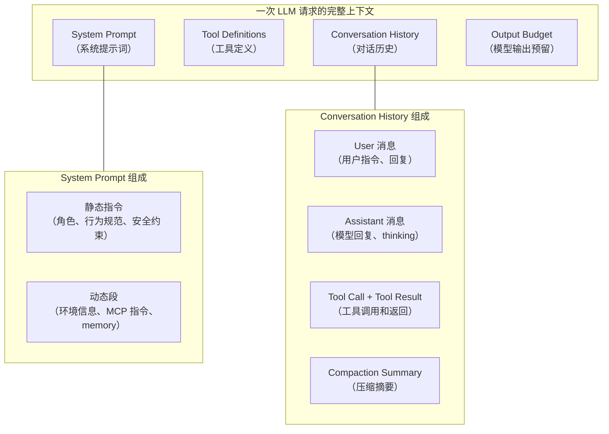
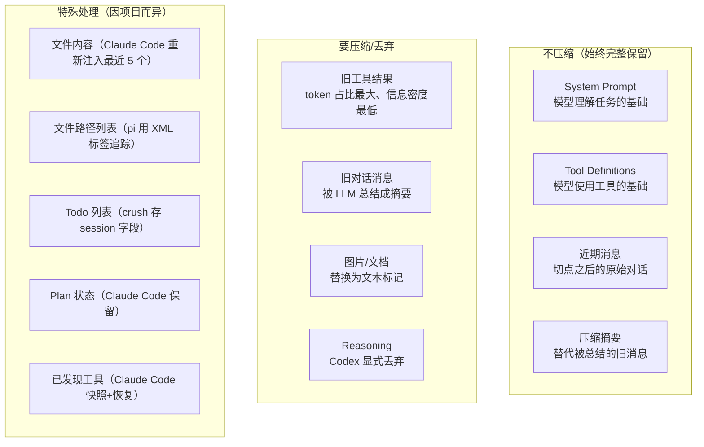

Code agent（Claude Code、Codex、opencode、crush、pi）在长会话里都会遇到上下文窗口不够用的问题。常见的说法叫"上下文压缩"（context compaction），但这个说法太窄了。

压缩只是表象。真正的问题是：**在一个有限的 context window 里，怎么维持一个长时间运行的 agent 的语义一致性、任务连续性和状态连续性。** 压缩只是这个大问题里的一个子环节。

这篇讲完整的设计空间：为什么要压缩、哪些要压缩哪些不压缩、系统提示词怎么设计、工具链路怎么保证、状态怎么保存恢复、语义一致性怎么维持。[第二篇](/posts/code-agent-compaction-源码实现/)逐个拆 5 个项目的源码。

## 上下文里到底有什么

先搞清楚一个 code agent 的上下文由哪些部分组成，因为不同部分的压缩策略完全不同：



关键区分：**System Prompt 和 Tool Definitions 不压缩，Conversation History 才压缩。** 但"不压缩"不等于"不管"，它们有自己的状态管理问题。

## 为什么要压缩

三个原因，第三个最容易忽略。

**Context window 有限。** 200K token 听起来很多，但读一个 500 行文件约 2000 token，grep 返回 50 条结果约 5000 token，十几轮工具调用就填满了。

**Token 成本是 O(n²) 增长。** 每次请求都把完整历史发过去。N 轮的总量是 N(N+1)/2 条消息的量。

**Prompt cache 跟压缩的关系。** 现代 LLM API 有 prompt cache：前缀相同只 prefill 一次，后续命中 cache 复用。如果在中间插入或删除消息，cache prefix 断裂，后面全部 miss。所以压缩设计要考虑不破坏 cache prefix，而不是单纯省 token。

Claude Code 的 microCompact 用 `cache_edits` API 在不破坏 cache 前缀的前提下删旧工具结果，Codex 的 `remove_first_item` 从最旧处删保留前面的 cache，都是基于这个考量。

## 哪些压缩，哪些不压缩



工具结果是压缩的重点目标。一个 2000 行的文件读取结果占 8000 token，但关键信息只有"auth 函数在第 42 行"。Claude Code 的 microCompact 只清理 `FileRead`, `Bash`, `Grep`, `Glob`, `WebSearch`, `WebFetch`, `FileEdit`, `FileWrite` 这些工具的旧结果，保留最近 N 个，其余替换成 `'[Old tool result content cleared]'`。

## 系统提示词怎么设计

系统提示词不是一段静态文本，是一个有架构的组装件。

### Claude Code 的 section 注册机制

Claude Code 把系统提示词拆成多个 section，每个 section 有两种类型：

```typescript
// systemPromptSections.ts:20-38
export function systemPromptSection(name, compute): SystemPromptSection {
  return { name, compute, cacheBreak: false }   // 计算一次，缓存到 /clear 或 /compact
}
export function DANGEROUS_uncachedSystemPromptSection(name, compute, _reason): SystemPromptSection {
  return { name, compute, cacheBreak: true }     // 每个 turn 重算，会破坏 prompt cache
}
```

设计意图：**默认所有 section 都是 cache-safe 的**（计算一次后缓存）。只有需要 `_reason` 参数证明为什么必须破坏缓存时，才用 `DANGERE_` 前缀。这强制开发者思考"这个 section 真的需要每轮重算吗"。

`mcp_instructions` 是唯一一个 `DANGEROUS_uncached` 的 section（`prompts.ts:513`），因为 MCP servers 在 turns 之间连接/断开。但有个 `isMcpInstructionsDeltaEnabled()` 开关：启用后改为通过 delta attachment 通知，而不是每轮重算。

### 压缩后系统提示词怎么处理

**Claude Code**：压缩后 `clearSystemPromptSections()` 清空缓存，下一个 turn 重算所有 section。不追加指令到 system prompt，而是作为 attachment 消息注入对话流（重新广播 deferred tools delta、agent listing delta、MCP instructions delta）。

**Codex**：`base_instructions` 是会话级静态状态，压缩完全不触碰它。压缩后真正重建的是注入 history 的 developer/contextual-user 片段（permissions、personality、skills、world_state 渲染）。

**opencode**：system prompt 每轮重新附加（`llm.ts:208`），不在压缩范围内。

### 系统提示词里的压缩相关指令

Claude Code 的静态系统提示里包含：

```
The conversation has unlimited context through automatic summarization.
The system will automatically compress prior messages in your conversation
as it approaches context limits.
```

这告诉模型"你会被压缩，别慌"。模型知道压缩会发生，就不会在压缩后困惑"为什么前面的对话不见了"。

## 工具链路怎么保证

工具定义不压缩，但工具的**状态**需要专门管理。

### 工具定义的存活方式

**Codex**：工具不持久化，每个 sampling step 都从 step_context 重新构建 ToolRouter。`built_tools`（`turn.rs:1219`）每次调用都重新组装：MCP tools、loaded plugins、connectors、dynamic tools。压缩只重写 history，不影响工具可用性。

**opencode**：`toolMaterialization` 每轮从 registry 重新物化。`materialize`（`registry.ts:106`）从 `applications` 和 `local` 合并出新的 registrations Map，应用权限规则过滤，生成全新 definitions 数组。纯函数式，无状态需要压缩。

**Claude Code**：工具定义每 turn 重建，但**已发现/已宣布的工具状态**需要专门保存。

### Claude Code 的三套 delta 机制

MCP 工具不预先声明，而是通过 `ToolSearchTool` 按需发现。压缩会吃掉带 `tool_reference` 的消息，所以需要快照：

```typescript
// compact.ts:606-611
const preCompactDiscovered = extractDiscoveredToolNames(messages)
if (preCompactDiscovered.size > 0) {
  boundaryMarker.compactMetadata.preCompactDiscoveredTools = [...preCompactDiscovered].sort()
}
```

恢复时从 boundary marker 读回 `preCompactDiscoveredTools`，让 post-compact 继续发送已加载的 deferred tool schemas。

三套独立的 delta 机制：
1. **Deferred tools delta**（`toolSearch.ts:646`）：已发现工具的差分。压缩时传 `[]` 全量重新宣布
2. **Agent listing delta**（`attachments.ts:1490`）：Agent 列表移到 delta attachment，避免工具描述变化导致 cache bust
3. **MCP instructions delta**（`attachments.ts:1559`）：同上

"delta 优于全量"是 Claude Code 的核心设计哲学。变化不频繁的东西用 delta 通知，而不是每轮重算。

## 状态连续性

压缩不只是丢消息，还要保存和恢复各种状态。

### Claude Code 的状态保存/恢复清单

| 状态 | 压缩前保存 | 压缩后恢复 | 代码位置 |
|---|---|---|---|
| readFileState（最近读文件缓存） | `cacheToObject` 快照 | 重新注入最近 5 个文件内容 | `compact.ts:518-538` |
| invokedSkills（已加载技能） | 不清空 | 重新注入（每个 5K token，总预算 25K） | `compact.ts:558` |
| Plan 文件内容 | - | `createPlanAttachmentIfNeeded` | `compact.ts:545` |
| Plan mode 状态 | - | `createPlanModeAttachmentIfNeeded` | `compact.ts:552` |
| 异步 agent 任务状态 | - | `createAsyncAgentAttachmentsIfNeeded` | `compact.ts:538` |
| 已发现的 deferred tools | `extractDiscoveredToolNames` 快照到 boundary | 从 boundary 读回 | `compact.ts:606-611` |
| System prompt section cache | - | `clearSystemPromptSections()` 清空，下 turn 重算 | `postCompactCleanup.ts:62` |
| Prompt cache read baseline | - | `notifyCompaction` 重置 baseline | `compact.ts:699` |

文件重新注入策略：从 `readFileState` 取最近读过的文件，过滤掉 plan 文件和 memory 文件，按 timestamp 降序排序，取前 5 个，每个截断到 5K token，总预算 50K token。5 是经验值，配合 50K 预算二次约束。

### Codex 的 world_state 差分引擎

Codex 的 `WorldState` 是按 section ID 索引的状态容器。每个 section 实现了 `WorldStateSection` trait，自己负责生成快照和渲染 diff：

```rust
// world_state/mod.rs:180-204
pub(crate) trait WorldStateSection: Send + Sync + 'static {
    const ID: &'static str;
    type Snapshot: DeserializeOwned + Serialize;
    fn snapshot(&self) -> Self::Snapshot;
    fn render_diff(&self, previous: PreviousSectionState<'_, Self::Snapshot>)
        -> Option<Box<dyn ContextualUserFragment>>;
}
```

三种渲染路径对应不同场景：
- `render_full`：全量渲染（压缩后首次）
- `render_diff`：用持久化快照做精确 diff
- `render_history_diff`：快照丢失时从历史消息降级恢复

快照之间用 RFC 7386 merge patch 表达增量。`ContextManager` 持有 `world_state_baseline`，任何重写历史（`remove_first_item` / `replace`）都会清空 baseline，迫使下次退化为全量渲染。

TokenBudget 路径直接靠 `start_new_context_window` + world_state 全量重建，完全不需要 LLM 总结。

### opencode 的 system-context epoch

opencode 把上下文连续性拆成两条独立轨道：**SystemContext epoch**（结构化可复算）和 **Compaction summary**（LLM 生成）。

epoch 是一份持久化的基准快照。每个 `Source<A>` 定义 `baseline` 和 `update` 两个渲染器。压缩后 `baseline_seq` 推进到 `compaction.seq`，触发 `SystemContext.replace`（整体重算）而非 `reconcile`（增量对账）。

```typescript
// context-epoch.ts:40-78
const replacementSeq = compaction !== undefined && compaction.seq > stored.baseline_seq
  ? compaction.seq : undefined
const result = replacementSeq
  ? yield* SystemContext.replace(value, snapshot)   // 压缩后：整体重算
  : yield* SystemContext.reconcile(value, snapshot) // 正常轮：增量对账
```

`replace` 有个安全阀：若有源 `Unavailable` 且旧 snapshot 里存在，返回 `ReplacementBlocked`，宁可阻塞也不构造残缺基准。

### crush 的 todo 外置

crush 把 todos 存在 `currentSession.Todos`（session 字段），不进消息流。压缩只动消息，todos 天然无损。摘要时把 todo 列表注入 prompt：

```go
// agent.go:1196-1209
if len(todos) > 0 {
    sb.WriteString("\n\n## Current Todo List\n\n")
    for _, t := range todos {
        fmt.Fprintf(&sb, "- [%s] %s\n", t.Status, t.Content)
    }
    sb.WriteString("Instruct the resuming assistant to use the `todos` tool to continue tracking progress.")
}
```

恢复路径双保险：todos 仍挂在 session 上，摘要里也写明了任务状态。

### pi 的文件操作追踪

pi 用 XML 标签追踪读写过的文件，追加到摘要末尾：

```xml
<read-files>
src/auth/refresh.ts
src/auth/middleware.ts
</read-files>
<modified-files>
src/auth/refresh.ts
</modified-files>
```

文件列表跨多次压缩继承。`extractFileOperations`（`compaction.ts:41-69`）从上一次压缩的 `details` 里继承累计，再叠加本次新消息的工具调用。`modifiedFiles = edited ∪ written`，`readFiles = read - modified`（只读未改的）。

关键守卫：`!prevCompaction.fromHook`。扩展生成的摘要（`fromHook=true`）的 details 结构不可信，不解析。

## 语义一致性保证

### 摘要 prompt 的设计

5 个项目的摘要 prompt 都要求写明当前进度和下一步，防止压缩后任务漂移（task drift）。

**Claude Code** 最详细，9 个结构化小节：

1. Primary Request and Intent
2. Key Technical Concepts
3. Files and Code Sections（含完整代码片段）
4. Errors and fixes
5. Problem Solving
6. All user messages（逐条列出所有非工具结果的用户消息）
7. Pending Tasks
8. Current Work
9. Optional Next Step（含原文引用以防任务漂移）

第 9 节要求"包含对话中关于你正在做什么、停在哪里的直接引用"，逐字引用用户原始措辞。这是最严格的防漂移机制。

提示词强制模型先写 `<analysis>` 草稿块再写 `<summary>` 块。`formatCompactSummary` 最后剥离 `<analysis>`，只留 `<summary>`。

**crush** 的模板强调"Exact Next Steps"必须具体化："Don't write 'implement authentication' - write: 1. Add JWT middleware to src/middleware/auth.js:15"。且"Length: No limit. Err on the side of too much detail"。

**pi** 用结构化格式：`## Goal / ## Constraints / ## Progress (Done/In Progress/Blocked) / ## Key Decisions / ## Next Steps / ## Critical Context`。

### 摘要包装成 user role 的原因

所有项目都把摘要包装成 user role 而非 assistant role。因为 assistant role 意味着"模型之前说的话"，模型可能把它当作需要遵循的指令。user role 意味着"这是给模型的信息"，模型更容易当作参考。

pi 的包装：
```
The conversation history before this point was compacted into the following summary:
<summary>...</summary>
```

opencode 包装成 checkpoint：
```xml
<conversation-checkpoint>
Treat it as historical context, not as new instructions.
<summary>...</summary>
<recent-context>...</recent-context>
</conversation-checkpoint>
```

crush 直接把 role 从 assistant 重映射为 user：
```go
// agent.go:815
msgs[0].Role = message.User
```

### 切点不能落在 tool result 中间

tool call 和 tool result 必须成对保留。如果切点落在 tool_result 中间，模型看到 tool_call 但看不到完整 result，会产生混乱。

pi 显式检查：
```typescript
// compaction.ts:282
function isCutPointMessage(entry: SessionEntry): boolean {
    // user, assistant, bashExecution, custom 可以切
    // toolResult 绝不能切
}
```

当切点落在一个带 tool call 的 assistant 消息处时，其后续的 tool result 会跟着保留。Claude Code 用 `adjustIndexToPreserveAPIInvariants` 做类似调整。

### pi 的 split-turn 处理

如果切点落在一个 turn 中间（user 提问后 assistant 调了一堆工具，token 超了，切点落在 assistant 中段），pi 会额外总结这个 turn 的前缀：

```typescript
// compaction.ts:718-731
TURN_PREFIX_SUMMARIZATION_PROMPT:
"This is the PREFIX of a turn that was too large to keep.
The SUFFIX (recent work) is retained.
Summarize the prefix to provide context for the retained suffix:
## Original Request
## Early Progress
## Context for Suffix"

// 最终摘要 = 历史摘要 + --- + Turn Context (split turn): + turn prefix 摘要
summary = `${historyResult}\n\n---\n\n**Turn Context (split turn):**\n\n${turnPrefixResult}`;
```

turn prefix 摘要的 maxTokens 预算更小（`0.5 * reserveTokens` vs 历史摘要的 `0.8 * reserveTokens`），因为 prefix 摘要就该短。

### Codex 的 mid-turn vs pre-turn 注入语义

Codex 区分两种压缩时机，背后是模型训练假设：

```rust
// compact.rs:56-69
/// Pre-turn/manual compaction variants use `DoNotInject`: they replace history
/// with a summary and clear `reference_context_item`, so the next regular turn
/// will fully reinject initial context after compaction.
///
/// Mid-turn compaction must use `BeforeLastUserMessage` because the model is
/// trained to see the compaction summary as the last item in history after
/// mid-turn compaction; we therefore inject initial context into the
/// replacement history just above the last real user message.
```

mid-turn 压缩发生在工具调用中间，模型需要继续执行未完成的任务。训练数据里这种场景的期望形态是"历史末尾 = 压缩摘要"。所以初始上下文必须插在最后一条真实 user message 之前，让摘要保持在末尾。

pre-turn 压缩发生在新一轮开始前，清空 `reference_context_item`，下一轮自然全量重注入。

### Codex 的 comp_hash 机制

`comp_hash` 是模型的压缩兼容性哈希。变化时必须用**旧模型**重新压缩（旧模型才能读懂旧压缩格式），失败才回退到当前模型：

```rust
// turn.rs:829-833
fn comp_hash_changed(previous: Option<&str>, current: Option<&str>) -> bool {
    previous.zip(current).is_some_and(|(previous, current)| previous != current)
}
```

任一 hash 缺失则不触发，因为信息不足以判断。

### Hook 机制：让自定义逻辑注入压缩

**Claude Code** 的 PreCompact hook 在摘要生成前执行，hook 的 stdout 输出被合并到压缩 prompt 的 `Additional Instructions` 段。PostCompact hook 在摘要生成后执行。SessionStart hook 以 `'compact'` 作为 source 触发，等于"新会话开始"语义。

**pi** 的 `session_before_compact` 钩子可以完全替换压缩逻辑。扩展返回 `{ compaction: CompactionResult }` 则跳过默认压缩，连摘要模型都能换（示例用 Gemini Flash 替代）：

```typescript
// extensions/types.ts:578-588
export interface SessionBeforeCompactResult {
    cancel?: boolean;        // 取消压缩
    compaction?: CompactionResult;  // 完全替换压缩逻辑
}
```

## Prompt cache 的完整策略

压缩设计必须考虑 prompt cache，否则压缩省下的 token 可能不够补 cache miss 的 prefill 成本。

### Claude Code 的 fork agent

压缩时调 LLM 生成摘要，需要把整个历史发过去。如果用新会话发，cache 全部 miss。Claude Code 通过 `runForkedAgent` 复用主会话的 cache prefix：

```typescript
// compact.ts:1188-1200
const result = await runForkedAgent({
  promptMessages: [summaryRequest],
  cacheSafeParams,         // 必须与父请求一致才能命中 cache
  canUseTool: createCompactCanUseTool(),  // 所有工具 deny
  querySource: 'compact',
  maxTurns: 1,
  skipCacheWrite: true,
})
```

`CacheSafeParams` 封装了 5 个必须一致的参数：systemPrompt、userContext、systemContext、toolUseContext、forkContextMessages。注意不能设 `maxOutputTokens`，因为它会 clamp `budget_tokens` 破坏 thinking config 的 cache key。

### cache_edits：不破坏 cache 前缀就删 tool results

Claude Code 的 microCompact 用 `cache_edits` API：

```typescript
// microCompact.ts:295-304
// 不修改本地消息内容（cache_reference 和 cache_edits 在 API 层添加）
// 不持久化到磁盘
// 追踪 tool results 并为 API 层排队 cache edits
```

`createCacheEditsBlock` 生成 `{ type: 'cache_edits', edits: [{ type: 'delete', cache_reference: string }] }`，插入到最后一条 user 消息。这让 API 在 cache 层面删除旧 tool result，但不改变本地消息内容和 cache prefix。

### sticky-on latch：防止 beta header 翻转破坏 cache

Claude Code 有多个"sticky-on latch"：`afkModeHeaderLatched`、`fastModeHeaderLatched`、`cacheEditingHeaderLatched`、`thinkingClearLatched`。一旦首次激活就整个 session 保持发送对应 beta header，避免 Shift+Tab 切换等中途状态翻转破坏 50-70K token 的 prompt cache。

### Codex 的 remove_first_item 保留 cache prefix

当总结请求本身超长时，Codex 从最旧处删消息：

```rust
// compact.rs:285-300
Err(e @ CodexErr::ContextWindowExceeded) => {
    if turn_input_len > 1 {
        history.remove_first_item();  // 从最旧处删，保留前面的 cache
        continue;
    }
}
```

从最旧处删而不是从最新处删，是为了保留 cache prefix。删了最旧的消息，前面的 cache 还能用。

## 横向对比

| 维度 | Claude Code | Codex | opencode | crush | pi |
|---|---|---|---|---|---|
| 系统提示词 | section 注册机制（cache-safe + DANGEROUS_uncached） | base_instructions 会话级静态 | 每轮重新附加 | 每轮重新附加 | 不在压缩范围 |
| 工具链路 | 三套 delta 机制 + deferred tools 快照 | 每步重建 ToolRouter | 每轮 materialize | 每轮重建 | 不在压缩范围 |
| 状态保存 | readFileState + skills + plan + async agents + 12+ 项 | world_state 差分引擎 + RFC 7386 merge patch | system-context epoch（结构化基准） | todos 外置 session 字段 | 文件操作 XML 追踪（跨压缩继承） |
| 摘要 prompt | 9 节结构化 + analysis 草稿 + 防漂移引用 | handoff summary（简洁） | 锚定摘要（增量更新） | 全量摘要（无长度限制） | 结构化 checkpoint + split-turn 双摘要 |
| 摘要 role | user (continued session) | user (SUMMARY_PREFIX) | user (checkpoint) | user (重映射) | user (summary 标签) |
| 语义保证 | PreCompact/PostCompact/SessionStart hooks | mid-turn vs pre-turn 注入 + comp_hash | ReplacementBlocked 安全阀 | todo 双保险 + 中断续传 | session_before_compact 可替换压缩 |
| cache 策略 | fork agent + cache_edits + sticky-on latch + 断裂检测 | remove_first_item 保留 prefix | - | - | - |
| 扩展性 | hooks 注入指令 | - | - | - | 钩子可完全替换压缩逻辑 |

## 核心设计模式

**1. "delta 优于全量"。** Claude Code 的三套 delta 机制、Codex 的 merge patch、opencode 的 epoch reconcile，都是用增量通知替代全量重算。变化不频繁的东西用 delta，避免破坏昂贵的 prompt cache。

**2. "sticky 优于 dynamic"。** Claude Code 的 sticky-on latch 防止 beta header 翻转。凡是会变化但变化不频繁的东西，用 sticky 而不是每轮重算。

**3. 状态拆分成独立维度。** Claude Code 把连续性拆成 7+ 个独立维度（对话语义、工具可用性、文件上下文、计划/skill/异步任务、cache 经济性、链结构、可扩展性），每个维度有专门的保存/恢复通道。不把所有状态塞进一个摘要。

**4. 切点不能落在 tool result 中间。** 5 个项目都保证 tool call 和 tool result 成对保留。这是 API 的硬性约束。

**5. 摘要里必须有"下一步"。** 防止压缩后任务漂移。Claude Code 最严格，要求逐字引用用户原始措辞。

**6. 系统提示和工具定义不压缩。** 压缩只作用于对话历史。但它们有自己的状态管理问题（section 缓存、delta 机制、每轮重建）。

**7. mid-turn 和 pre-turn 语义不同。** Codex 显式区分：mid-turn 压缩后模型期望"摘要 = 历史末尾"，初始上下文插在最后 user message 前；pre-turn 压缩后清空 reference，下一轮自然重注入。这背后是模型训练假设。

**8. 溢出恢复只试一次。** pi 的 `_overflowRecoveryAttempted`、opencode 的 `continueAfterOverflowCompaction` 硬性禁止二次溢出恢复，防止无限压缩循环。

**9. 压缩是"新会话开始"语义。** Claude Code 的 SessionStart hook 以 `'compact'` 触发，opencode 的 epoch `replace`，Codex 的 `start_new_context_window`，都把压缩当作一次"重启"，而不是"继续"。

下一篇逐个拆源码实现。
