Code agent（Claude Code、Codex、opencode、crush、pi）在长会话里都会遇到上下文窗口不够用的问题。常见的说法叫"上下文压缩"（context compaction），但这个说法太窄了。

压缩只是表象。真正的问题是：**在一个有限的 context window 里，怎么维持一个长时间运行的 agent 的语义一致性、任务连续性和状态连续性。** 压缩只是这个大问题里的一个子环节。

这篇讲完整的设计空间：为什么要压缩、哪些要压缩哪些不压缩、系统提示词怎么设计、工具链路怎么保证、状态怎么保存恢复、语义一致性怎么维持、prompt cache 怎么不破坏。[第二篇](/posts/code-agent-compaction-源码实现/)逐个拆 5 个项目的源码。

## 上下文里到底有什么

先搞清楚一个 code agent 的上下文由哪些部分组成，因为不同部分的压缩策略完全不同：

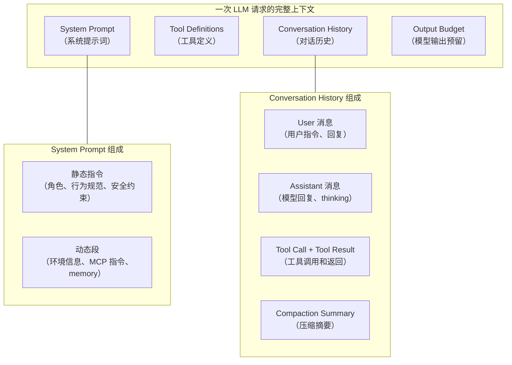

关键区分：**System Prompt 和 Tool Definitions 不压缩，Conversation History 才压缩。** 但"不压缩"不等于"不管"，它们有自己的状态管理问题（后面专门讲）。

Output Budget 也不压缩，但它的存在影响压缩阈值：Claude Code 的 effective window = contextWindow - min(maxOutputTokens, 20000)，因为模型生成回复也需要 token 空间，不能把输入填满整个窗口。

## 为什么要压缩

三个原因，第三个最容易忽略。

**Context window 有限。** 200K token 听起来很多，但读一个 500 行文件约 2000 token，grep 返回 50 条结果约 5000 token，改几处代码加上 diff 约 3000 token。十几轮工具调用就填满了。

**Token 成本是 O(n²) 增长。** 每次请求都把完整历史发过去。第 1 轮发 1 条，第 2 轮发 2 条，第 N 轮发 N 条。N 轮的总量是 1+2+...+N = N(N+1)/2。不压缩的话，跑到第 50 轮总消耗是 1275 条消息的量。

**Prompt cache 跟压缩的关系。** 这是最容易被忽略的：

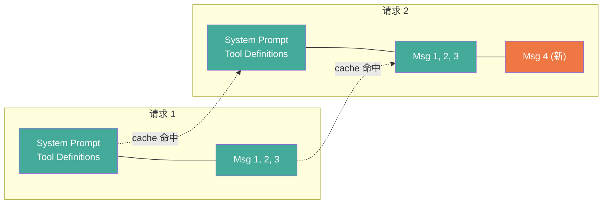

现代 LLM API 有 prompt cache：前缀相同只 prefill 一次，后续命中 cache 复用。如果在中间插入或删除消息，cache prefix 断裂，后面全部 miss。

为什么这很重要？因为压缩本身也要调 LLM（生成摘要），这个请求需要把整个历史发过去。如果用新会话发，cache 全部 miss，prefill 成本可能比压缩省下的 token 还多。所以压缩设计要考虑不破坏 cache prefix。

各项目的做法：
- Claude Code 用 fork agent 复用主会话的 cache prefix
- Claude Code 的 microCompact 用 `cache_edits` API 在不破坏 cache 前缀的前提下删旧工具结果
- Codex 的 `remove_first_item` 从最旧处删（保留前面的 cache）
- Claude Code 有 sticky-on latch 防止 beta header 翻转破坏 cache

## 压缩的设计空间

上下文压缩要回答七个问题，不是三个：

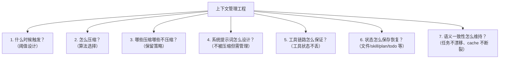

很多人只关注前三个（触发/算法/保留），但后面四个才是区分"能用"和"好用"的关键。下面逐个展开。

## 1. 什么时候触发

### 压缩前后的上下文结构

先看压缩前后上下文长什么样，理解 buffer 和 keepRecent 的数学关系：

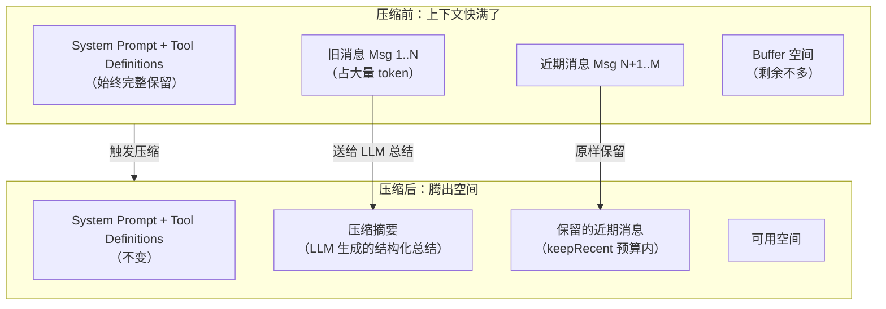

关键数学关系：**压缩后释放的空间 = 被总结消息的 token - 摘要 token - keepRecent token**。

如果摘要和 keepRecent 加起来比原来还大，压缩就没有意义。所以摘要有输出上限（opencode 4096，pi 0.8*reserveTokens），keepRecent 也有预算限制（opencode 8K，pi 20K，Codex 20K）。

buffer 为什么不能太小？两个原因。第一，模型生成回复需要空间，buffer 太小模型可能输出不完整。第二，压缩过程本身也消耗 token：压缩要发一个总结请求，这个请求包含整个历史，如果 buffer 太小，可能压缩请求都发不出去。Claude Code 13K，Codex 10%（约 20K），pi 16K，opencode 20K，crush 20K。

### 触发方式一：剩余 token 阈值

crush 看剩余 token：

```go
// crush/internal/agent/agent.go:53-55
largeContextWindowThreshold = 200_000
largeContextWindowBuffer    = 20_000
smallContextWindowRatio     = 0.2

// agent.go:432-451
remaining := cw - tokens
if cw > largeContextWindowThreshold {
    threshold = largeContextWindowBuffer          // 大窗口：剩余 < 20K
} else {
    threshold = int64(float64(cw) * smallContextWindowRatio)  // 小窗口：剩余 < 20%
}
```

为什么要分两档？20K 对 200K 窗口是 10%，但对 32K 窗口已经是 62% 了，比例不合理。小窗口用比例更合理。`cw == 0` 时跳过自动摘要，给本地/自定义模型留逃生口。

### 触发方式二：占比阈值

Codex 默认 90%：

```rust
// codex-rs/protocol/src/openai_models.rs:457-468
pub fn auto_compact_token_limit(&self) -> Option<i64> {
    let context_limit = self.resolved_context_window()
        .map(|context_window| (context_window * 9) / 10);  // 90%
    let config_limit = self.auto_compact_token_limit;
    // 取 min(用户配置, 90%)
}
```

为什么 Codex 比 Claude Code（93%）更早触发？因为 Codex 有三路分派，其中 TokenBudget 路径完全不调 LLM，压缩成本更低，可以更早触发。Claude Code 的全量压缩要调 LLM，压缩本身有延迟和成本，晚一点触发更经济。

Claude Code 用有效窗口减 buffer：

```typescript
// claude-code-cli/services/compact/autoCompact.ts:62-76
export const AUTOCOMPACT_BUFFER_TOKENS = 13_000

export function getAutoCompactThreshold(model: string): number {
  const effectiveContextWindow = getEffectiveContextWindowSize(model)
  // effectiveContextWindow = contextWindow - min(maxOutputTokens, 20_000)
  return effectiveContextWindow - AUTOCOMPACT_BUFFER_TOKENS
  // 200K 模型：180K - 13K = 167K，约 93%
}
```

pi 也是占比（`compaction.ts:209`）：`contextTokens > contextWindow - 16384`，约 92%。

### 触发方式三：预发送估算

opencode 不看"已用了多少"，而是估算"这次请求会不会超限"：

```typescript
// opencode/packages/core/src/session/compaction.ts:225-236
if (
  estimate({ system, messages, tools }) <=
  context - Math.max(output, config.buffer)
)
  return false  // 不会超限
return yield* compactAfterOverflow(input)  // 会超限，压缩
```

为什么用预发送估算而不是剩余 token？因为消息列表可能在两次请求之间被修改过（比如用户手动编辑了消息、扩展注入了上下文）。基于上一次请求的 usage 可能不准确。opencode 的方式更精确，但每次请求都要做一次完整估算，有额外开销。

### 触发方式四：溢出恢复

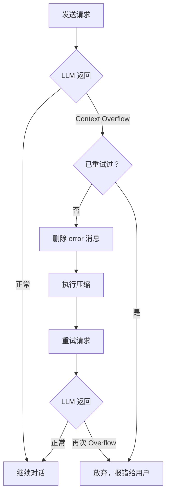

为什么只重试一次？防止无限压缩循环。如果压缩后仍然 overflow，说明问题不是"历史太长"而是"单条消息太长"或"系统提示+工具定义本身就超限"，再压缩也没用。pi 用 `_overflowRecoveryAttempted` 标志位，opencode 用 defect 抛掷硬性禁止二次溢出恢复。

### 触发阈值汇总

| 项目 | 触发方式 | 阈值 | 200K 窗口实际触发点 | 为什么这个阈值 |
|---|---|---|---|---|
| Claude Code | 占比+buffer | effective-13K | ~167K (93%) | 全量压缩要调 LLM，晚触发更经济 |
| Codex | 占比 | 90% | 180K (90%) | TokenBudget 路径不调 LLM，早触发成本低 |
| opencode | 预发送估算 | window-max(output,20K) | ~160K (80%) | 确保请求不超限，最保守 |
| crush | 剩余 token | 剩余<20K | ~180K (90%) | 保证模型有输出空间 |
| pi | 占比+buffer | window-16K | ~184K (92%) | 平衡点 |

## 2. 怎么压缩

### LLM 总结：主流方案

5 个项目都用了 LLM 总结。基本流程：

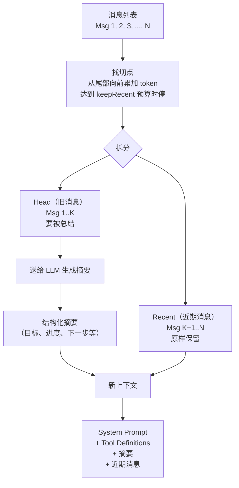

### 切点选择：tool result 不能切

为什么 tool result 不能切？看一条 tool call 和 tool result 的配对：

```
assistant: 我要调用 FileRead 工具读取 src/auth.ts
  tool_call: FileRead({ path: "src/auth.ts" })
user:
  tool_result: [文件内容，2000 行代码]
assistant: 好的，我看到这个文件里有...
```

如果切点落在 tool_result 中间，模型看到 tool_call 但看不到完整 result，会产生混乱。更糟的情况是 tool_call 被总结掉了但 tool_result 保留下来了，模型看到一段没有上下文的工具返回。

这不只是"体验问题"，是 API 的硬性约束：Anthropic 和 OpenAI 的 API 都要求 tool_call 和 tool_result 配对出现。切点落在中间会导致 API 报错。

pi 显式检查：

```typescript
// pi/packages/coding-agent/src/core/compaction/compaction.ts:282
function isCutPointMessage(entry: SessionEntry): boolean {
    // user, assistant, bashExecution, custom 可以切
    // toolResult 绝不能切
}
```

当切点落在一个带 tool call 的 assistant 消息处时，其后续的 tool result 会跟着保留。Claude Code 用 `adjustIndexToPreserveAPIInvariants` 做类似调整。

### 切点的滑动窗口算法

pi 从尾部向前累加 token：

```typescript
// pi/packages/coding-agent/src/core/compaction/compaction.ts:389-413
let accumulatedTokens = 0;
for (let i = endIndex - 1; i >= startIndex; i--) {
    accumulatedTokens += messageTokens;
    if (accumulatedTokens >= keepRecentTokens) {  // 默认 20000
        // 找 >= i 的最近合法切点
        break;
    }
}
```

token 估算用 `chars/4` 启发式（`estimateTokens`，`compaction.ts:240`）。为什么用粗略估算而不是精确 tokenizer？因为 keepRecent 是个预算不是硬限制，估算差一点不影响正确性，但精确 tokenize 每条消息的开销太大。图片按 4800 字符估算。

### 增量更新 vs 全量总结

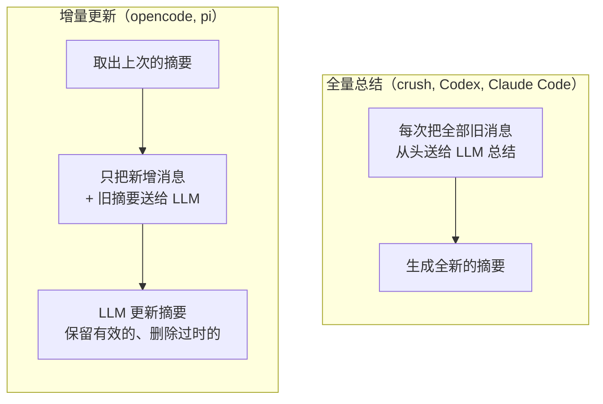

为什么选增量还是全量？这是个 token 成本 vs 准确性的权衡。

增量更新（opencode, pi）：每次只发增量部分，token 消耗少。但可能累积信息损失：如果 LLM 在某次更新时丢了一条重要信息，后续更新不会补回来。适合长会话、token 成本敏感的场景。

全量总结（Claude Code, Codex, crush）：每次从头总结，更准确。但 token 消耗大，因为每次都要把全部历史发过去。适合会话不太长、准确性要求高的场景。

opencode 的 `buildPrompt` 指示 LLM "Preserve still-true details, remove stale details, and merge in the new facts"。pi 有专门的 `UPDATE_SUMMARIZATION_PROMPT`，要求"保留所有既有信息、移动进度项、更新下一步"。

### 直接重置：不调 LLM

Codex 的 TokenBudget 路径完全跳过 LLM 总结：

```rust
// codex-rs/core/src/compact_token_budget.rs:45-90
// "Token-budget compaction skips model/server summarization
//  and installs a fresh context window instead."
sess.start_new_context_window(turn_context, world_state).await;
```

靠 `world_state`（外部上下文状态）重建。为什么能这样做？因为 Codex 的 world_state 是结构化的状态容器，能完整描述当前任务状态（AGENTS.md、环境信息、permissions、personality、skills）。不需要 LLM 总结对话历史，直接从 world_state 重建就够了。

这是最激进的压缩，相当于"全忘了，从头来"。适用于 world state 能完整描述任务状态的场景。

### 微压缩：不调 LLM 的渐进式清理

Claude Code 独有的三层递进设计：

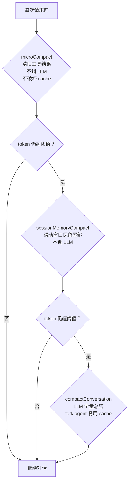

为什么要三层递进？因为压缩的代价不一样。microCompact 不调 LLM、不破坏 cache，代价最低，应该最先尝试。sessionMemory 不调 LLM 但会丢消息，代价中等。compactConversation 要调 LLM、有延迟和成本，应该最后才用。

microCompact 只清理 `FileRead`, `Bash`, `Grep`, `Glob`, `WebSearch`, `WebFetch`, `FileEdit`, `FileWrite` 的旧结果。为什么只清这些？因为它们是 token 占比最大、信息密度最低的部分。一个 2000 行的文件读取结果占 8000 token，但关键信息只有"auth 函数在第 42 行"。模型已经看过了，清掉旧结果不会丢失关键信息。

`cache_edits` 是 microCompact 的核心机制。为什么它能在不破坏 cache 前缀的前提下删 tool results？因为它不修改本地消息内容，只在 API 层添加 `{ type: 'cache_edits', edits: [{ type: 'delete', cache_reference: string }] }`。这让 API 在 cache 层面删除旧 tool result，但本地消息内容和 cache prefix 不变。

## 3. 哪些压缩哪些不压缩

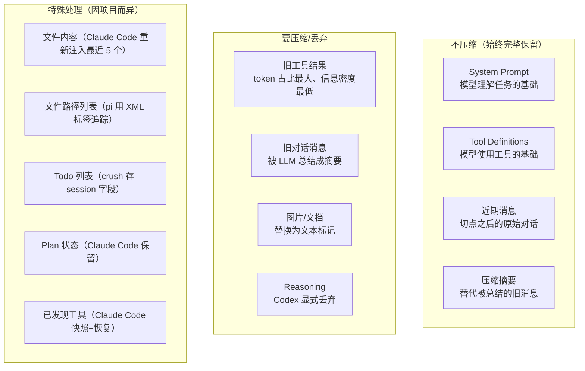

### 摘要包装成 user role 的原因

所有项目都把摘要包装成 user role 而非 assistant role。

为什么？因为 assistant role 意味着"模型之前说的话"，模型可能把它当作需要遵循的指令。user role 意味着"这是给模型的信息"，模型更容易当作参考而不是命令。

pi 的包装：
```
The conversation history before this point was compacted into the following summary:
<summary>...</summary>
```

opencode 包装成 checkpoint：
```xml
<conversation-checkpoint>
Treat it as historical context, not as new instructions.
<summary>...</summary>
<recent-context>...</recent-context>
</conversation-checkpoint>
```

crush 直接把 role 从 assistant 重映射为 user（`agent.go:815: msgs[0].Role = message.User`）。

Codex 加 `SUMMARY_PREFIX`，告诉接手的模型"另一个 LLM 开始解决这个问题并产生了摘要，在此基础上继续工作"。

Claude Code 包装成 "This session is being continued from a previous conversation that ran out of context..."，并且追加 transcript 路径作为逃逸舱："如果需要压缩前的具体细节，读取完整 transcript at: ${transcriptPath}"。

## 4. 系统提示词怎么设计

系统提示词不是一段静态文本，是一个有架构的组装件。

### Claude Code 的 section 注册机制

```typescript
// systemPromptSections.ts:20-38
export function systemPromptSection(name, compute): SystemPromptSection {
  return { name, compute, cacheBreak: false }   // 计算一次，缓存到 /clear 或 /compact
}
export function DANGERE_uncachedSystemPromptSection(name, compute, _reason): SystemPromptSection {
  return { name, compute, cacheBreak: true }     // 每个 turn 重算，破坏 prompt cache
}
```

为什么用两种类型？因为系统提示词里有些内容是静态的（角色定义、行为规范），算一次就够了；有些是动态的（MCP 连接状态、环境信息），每轮都可能变。如果不区分，要么每轮都重算所有内容（破坏 cache），要么都不重算（动态内容过期）。

`DANGERE_` 前缀强制开发者写 `_reason` 参数解释为什么必须破坏 cache。`mcp_instructions` 是唯一一个 DANGERE_ 的 section，因为 MCP servers 在 turns 之间连接/断开。但有个 `isMcpInstructionsDeltaEnabled()` 开关：启用后改为通过 delta attachment 通知，而不是每轮重算。

### 压缩后系统提示词怎么处理

**Claude Code**：压缩后 `clearSystemPromptSections()` 清空缓存，下个 turn 重算所有 section。不追加指令到 system prompt，而是作为 attachment 消息注入对话流。

为什么不直接追加到 system prompt？因为 system prompt 是 cache 的关键部分，追加内容会改变 cache key。用 attachment 消息注入对流式处理更友好。

**Codex**：`base_instructions` 是会话级静态状态，压缩完全不触碰它。压缩后真正重建的是注入 history 的 developer/contextual-user 片段（permissions、personality、skills、world_state 渲染）。

**opencode**：system prompt 每轮重新附加，不在压缩范围内。

### 系统提示词里的压缩相关指令

Claude Code 的静态系统提示里包含：

```
The conversation has unlimited context through automatic summarization.
The system will automatically compress prior messages in your conversation
as it approaches context limits.
```

为什么要告诉模型"你会被压缩"？因为模型不知道压缩机制，如果压缩后它发现前面的对话不见了，可能产生困惑或重复之前的工作。告诉它"会自动压缩"之后，模型知道这是预期行为，压缩后能更自然地继续。

## 5. 工具链路怎么保证

工具定义不压缩，但工具的**状态**需要专门管理。

### 工具定义的存活方式

**Codex**：工具不持久化，每个 sampling step 都从 step_context 重新构建 ToolRouter。`built_tools`（`turn.rs:1219`）每次都重新组装。压缩只重写 history，不影响工具可用性。

**opencode**：`toolMaterialization` 每轮从 registry 重新物化。纯函数式，无状态需要压缩。

**Claude Code**：工具定义每 turn 重建，但**已发现/已宣布的工具状态**需要专门保存。

### Claude Code 的三套 delta 机制

MCP 工具不预先声明，而是通过 `ToolSearchTool` 按需发现。压缩会吃掉带 `tool_reference` 的消息，所以需要快照：

```typescript
// compact.ts:606-611
const preCompactDiscovered = extractDiscoveredToolNames(messages)
if (preCompactDiscovered.size > 0) {
  boundaryMarker.compactMetadata.preCompactDiscoveredTools = [...preCompactDiscovered].sort
}
```

恢复时从 boundary marker 读回。三套独立的 delta 机制：

1. **Deferred tools delta**（`toolSearch.ts:646`）：已发现工具的差分。压缩时传 `[]` 全量重新宣布
2. **Agent listing delta**（`attachments.ts:1490`）：Agent 列表移到 delta attachment，避免工具描述变化导致 cache bust
3. **MCP instructions delta**（`attachments.ts:1559`）：同上

为什么要用 delta 而不是全量？因为"delta 优于全量"是 Claude Code 的核心设计哲学。变化不频繁的东西用 delta 通知，避免每轮重算破坏 cache。Agent listing 移到 delta attachment 的原因：AgentTool 描述里曾内嵌 agent 列表，MCP 异步连接或权限变更会导致描述变化，全 tool-schema cache bust（~10.2% 的 fleet cache_creation）。

## 6. 状态怎么保存恢复

压缩不只是丢消息，还要保存和恢复各种状态。这是"状态连续性"的核心。

### Claude Code 的状态保存/恢复流程

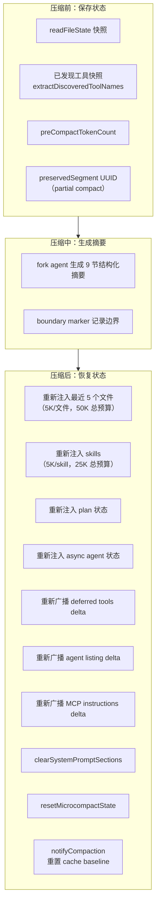

完整的状态清单（12+ 项）：

| 状态 | 压缩前 | 压缩后 | 为什么 |
|---|---|---|---|
| readFileState | 快照 | 重新注入最近 5 个文件 | 模型需要知道最近读过的文件内容 |
| invokedSkills | 不清空 | 重新注入 | skill content 必须跨多次压缩存活 |
| Plan 文件 | - | 重新注入 | 模型需要知道当前 plan 状态 |
| Plan mode | - | 重新注入 | 模型需要知道是否在 plan mode |
| async agents | - | 重新注入 | 异步任务状态不能丢 |
| deferred tools | 快照到 boundary | 从 boundary 读回 | 已发现的工具不能丢 |
| system prompt sections | - | clearSystemPromptSections | 迫使下 turn 重算 |
| prompt cache baseline | - | notifyCompaction | 防止 cache 断裂误报 |
| microcompact state | - | resetMicrocompactState | 清理微压缩状态 |
| memory files cache | - | resetGetMemoryFilesCache | 迫使重新加载 |
| classifier approvals | - | clearClassifierApprovals | 权限状态重置 |
| speculative checks | - | clearSpeculativeChecks | 清理预测检查状态 |

文件重新注入策略：从 `readFileState` 取最近读过的文件，过滤掉 plan 文件和 memory 文件，过滤掉已在 preservedMessages 里的（避免重复注入最多 25K token 的浪费），按 timestamp 降序排序，取前 5 个，每个截断到 5K token，总预算 50K。5 是经验值，配合 50K 预算二次约束（50K / 5K = 10 个理论上限）。

`postCompactCleanup` 区分主线程和 subagent。Subagent 压缩时不重置主线程的 module-level state，否则会损坏主线程状态。

### Codex 的 world_state 差分引擎

```rust
// world_state/mod.rs:180-204
pub(crate) trait WorldStateSection: Send + Sync + 'static {
    const ID: &'static str;
    type Snapshot: DeserializeOwned + Serialize;
    fn snapshot(&self) -> Self::Snapshot;
    fn render_diff(&self, previous: PreviousSectionState<'_, Self::Snapshot>)
        -> Option<Box<dyn ContextualUserFragment>>;
}
```

`PreviousSectionState` 三态：
- `Absent`：全新渲染（压缩后首次）
- `Known`：用持久化快照做精确 diff
- `Unknown`：历史里有旧格式片段但快照丢失，section 自己决定如何降级

为什么用三态而不是简单的"有快照/没快照"？因为 Codex 要处理版本迁移：旧版本的 Codex 可能没有结构化快照，但历史消息里有旧格式的文本片段。`Unknown` 状态让 section 自己决定怎么从旧格式降级恢复。

快照之间用 RFC 7386 merge patch 表达增量。`ContextManager` 持有 `world_state_baseline`，任何重写历史都清空 baseline：

```rust
// history.rs:187-204
pub(crate) fn remove_first_item(&mut self) {
    self.world_state_baseline = None;  // 迫使下次退化为全量
}
```

为什么要清空 baseline？因为历史被重写了，之前的 baseline 对应的是旧历史，不能再用于 diff。清空后下次渲染退化为全量，保证一致性。

### opencode 的 system-context epoch

opencode 把上下文连续性拆成两条独立轨道：**SystemContext epoch**（结构化可复算）和 **Compaction summary**（LLM 生成）。

```typescript
// context-epoch.ts:40-78
const replacementSeq = compaction !== undefined && compaction.seq > stored.baseline_seq
  ? compaction.seq : undefined
const result = replacementSeq
  ? yield* SystemContext.replace(value, snapshot)   // 压缩后：整体重算
  : yield* SystemContext.reconcile(value, snapshot) // 正常轮：增量对账
```

为什么要分两条轨道？因为系统上下文（工作目录、日期、平台）是结构化的，可以精确比较和增量更新，不需要 LLM 总结。对话历史才是非结构化的，需要 LLM 总结。分开管理避免互相污染。

`replace` 有安全阀：若有源 `Unavailable` 且旧 snapshot 里存在，返回 `ReplacementBlocked`。为什么宁可阻塞也不构造残缺基准？因为残缺基准会导致模型缺失关键环境信息（比如不知道当前工作目录），比阻塞更危险。

### crush 的 todo 外置

crush 把 todos 存在 `currentSession.Todos`（session 字段），不进消息流。压缩只动消息，todos 天然无损。

为什么把 todos 放 session 字段而不是消息流？因为 todos 是结构化状态（有 status 和 content），放进消息流会被 LLM 总结时可能丢失或改写。放 session 字段确保精确保留。

恢复双保险：todos 仍挂在 session 上 + 摘要里也写明了任务状态。todos 工具设计成"全量替换"语义，约束 "Exactly ONE task must be in_progress" 保证焦点单一。

### pi 的文件操作追踪

pi 用 XML 标签追踪读写过的文件，追加到摘要末尾：

```xml
<read-files>
src/auth/refresh.ts
src/auth/middleware.ts
</read-files>
<modified-files>
src/auth/refresh.ts
</modified-files>
```

为什么要追踪文件操作？因为压缩后模型丢失了历史细节，但"哪些文件被读过/改过"是关键状态。如果模型不知道自己改过 `src/auth/refresh.ts`，可能重复修改或忽略之前的修改。

`modifiedFiles = edited ∪ written`，`readFiles = read - modified`（只读未改的）。为什么这么分？因为改过的文件比只读的更重要，分开追踪让模型知道哪些文件是"我改过的"vs"我只看过的"。

文件列表跨多次压缩继承。`extractFileOperations`（`compaction.ts:41-69`）从上一次压缩的 `details` 里继承累计。`fromHook` 守卫：扩展生成的摘要（`fromHook=true`）的 details 结构不可信，不解析。

## 7. 语义一致性怎么维持

### 摘要 prompt 的设计

5 个项目的摘要 prompt 都要求写明当前进度和下一步，防止压缩后任务漂移（task drift）。

什么是任务漂移？模型压缩后忘了原来在干什么，开始做别的事。比如用户让它"修复 auth 模块的 bug"，压缩后模型可能开始"重构 auth 模块"。

**Claude Code** 最详细，9 个结构化小节：

```
1. Primary Request and Intent
2. Key Technical Concepts
3. Files and Code Sections（含完整代码片段）
4. Errors and fixes
5. Problem Solving
6. All user messages（逐条列出所有非工具结果的用户消息）
7. Pending Tasks
8. Current Work
9. Optional Next Step（含原文引用以防任务漂移）
```

第 6 节"All user messages"为什么要逐条列出？因为用户消息是最不能丢的信息。工具结果可以总结，assistant 回复可以概括，但用户的原始指令必须完整保留。

第 9 节要求"包含对话中关于你正在做什么、停在哪里的直接引用"，逐字引用用户原始措辞。为什么用原文引用而不是改写？因为改写会引入模型的"理解偏差"，可能把"修复 token 刷新 bug"理解成"优化 token 刷新机制"。原文引用确保模型知道用户到底说了什么。

提示词强制模型先写 `<analysis>` 草稿块再写 `<summary>` 块。`formatCompactSummary` 最后剥离 `<analysis>`，只留 `<summary>`。为什么先写草稿？因为直接写总结容易遗漏，先按时间顺序梳理一遍能提高完整性。

`NO_TOOLS_PREAMBLE` 放最前，`NO_TOOLS_TRAILER` 放最后。因为 cache-sharing fork 继承父线程完整工具集（cache key 必须匹配），Sonnet 4.6+ 有时仍会尝试调工具。

**crush** 的模板强调"Exact Next Steps"必须具体化："Don't write 'implement authentication' - write: 1. Add JWT middleware to src/middleware/auth.js:15"。且"Length: No limit. Err on the side of too much detail"。为什么不限长度？因为 crush 不保留近期消息，摘要是唯一上下文，信息越少越容易漂移。

**pi** 用结构化格式：`## Goal / ## Constraints / ## Progress (Done/In Progress/Blocked) / ## Key Decisions / ## Next Steps / ## Critical Context`。

### Codex 的 mid-turn vs pre-turn 注入语义

Codex 区分两种压缩时机，背后是模型训练假设：

```rust
// compact.rs:56-69
/// Mid-turn compaction must use `BeforeLastUserMessage` because the model is
/// trained to see the compaction summary as the last item in history after
/// mid-turn compaction; we therefore inject initial context into the
/// replacement history just above the last real user message.
///
/// Pre-turn/manual compaction variants use `DoNotInject`: they replace history
/// with a summary and clear `reference_context_item`, so the next regular turn
/// will fully reinject initial context after compaction.
```

为什么 mid-turn 和 pre-turn 处理方式不同？因为模型在训练时见过两种场景：

mid-turn 压缩（工具调用中间被打断）：训练数据里这种场景的期望形态是"历史末尾 = 压缩摘要"。如果此时在末尾追加初始上下文，会破坏模型对"摘要应该是最后一条"的预期。所以初始上下文必须插在最后一条真实 user message 之前，让摘要保持在末尾。

pre-turn 压缩（新一轮开始前）：压缩后清空 `reference_context_item`，下一轮自然全量重注入。不需要压缩时注入，因为下一轮会正常处理。

### Codex 的 comp_hash 机制

`comp_hash` 是模型的压缩兼容性哈希。变化时必须用**旧模型**重新压缩：

```rust
// turn.rs:829-833
fn comp_hash_changed(previous: Option<&str>, current: Option<&str>) -> bool {
    previous.zip(current).is_some_and(|(previous, current)| previous != current)
}
```

为什么要用旧模型压缩？因为新模型可能无法理解旧模型生成的压缩格式（比如加密的 Compaction item 或特定摘要格式）。旧模型才能读懂旧历史，生成的摘要才能被新模型理解。

任一 hash 缺失则不触发。为什么？因为信息不足以判断兼容性，不如不触发。同时准备 fallback_step_context（当前模型）备用，旧模型压缩失败才回退到当前模型。

### pi 的 split-turn 处理

如果切点落在一个 turn 中间（user 提问后 assistant 调了一堆工具，token 超了，切点落在 assistant 中段），pi 会额外总结这个 turn 的前缀：

```typescript
// compaction.ts:718-731
TURN_PREFIX_SUMMARIZATION_PROMPT:
"This is the PREFIX of a turn that was too large to keep.
The SUFFIX (recent work) is retained.
Summarize the prefix to provide context for the retained suffix:
## Original Request
## Early Progress
## Context for Suffix"

// 最终摘要 = 历史摘要 + --- + Turn Context (split turn): + turn prefix 摘要
summary = `${historyResult}\n\n---\n\n**Turn Context (split turn):**\n\n${turnPrefixResult}`;
```

为什么需要单独总结 turn prefix？因为切点落在一个 turn 中间时，切点之前的同一 turn 内的消息既不属于"旧历史"也不属于"保留的 recent"。它们是当前正在进行的 turn 的前缀。如果不总结，保留的 turn 后缀缺少上下文（不知道这个 turn 的原始请求是什么、之前做了什么）。如果跟旧历史一起总结，turn 的语义会被打散。

turn prefix 摘要的 maxTokens 预算更小（`0.5 * reserveTokens` vs 历史摘要的 `0.8 * reserveTokens`），因为 prefix 摘要就该短，只需提供足够的上下文让保留的 suffix 能被理解。

### Hook 机制：让自定义逻辑注入压缩

**Claude Code** 的三个 hook 执行顺序：PreCompact -> 摘要生成 -> SessionStart(trigger='compact') -> PostCompact。

PreCompact 的 stdout 输出被合并到压缩 prompt 的 `Additional Instructions` 段。这给了自定义逻辑注入压缩指令的能力。`trigger` 字段（`auto`/`manual`）允许按触发方式配置不同 hook。

为什么需要 hook？因为不同项目有不同的"不能丢的信息"。一个安全审计项目可能需要在摘要里保留所有安全相关的决策，一个数据库迁移项目可能需要保留所有 schema 变更。PreCompact hook 让项目自定义这些需求。

**pi** 的 `session_before_compact` 钩子可以完全替换压缩逻辑：

```typescript
// extensions/types.ts:578-588
export interface SessionBeforeCompactResult {
    cancel?: boolean;        // 取消压缩
    compaction?: CompactionResult;  // 完全替换压缩逻辑
}
```

示例（`custom-compaction.ts`）用 Gemini Flash 替代摘要模型（更便宜更快），把 messagesToSummarize + turnPrefixMessages 全量合并摘要，丢弃所有旧 turn 只留 summary。`fromHook` 标记让 pi 知道这是扩展生成的摘要，不解析其 details 结构。

## Prompt cache 完整策略

压缩设计必须考虑 prompt cache。如果压缩破坏了 cache，后续请求的 prefill 成本可能比压缩省下的 token 还多。

### Claude Code 的 fork agent

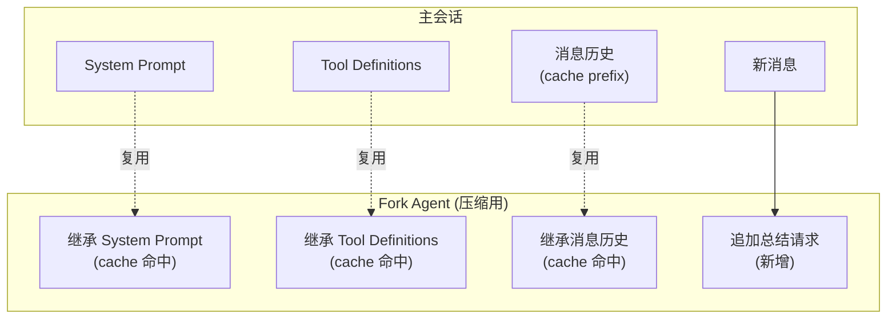

为什么要 fork 而不是新会话？因为压缩时调 LLM 生成摘要，需要把整个历史发过去。如果用新会话发，cache 全部 miss。通过 fork 复用主会话的 cache prefix（系统提示、工具定义、上下文消息前缀），只追加一条总结请求。

`CacheSafeParams` 封装了 5 个必须一致的参数：systemPrompt、userContext、systemContext、toolUseContext、forkContextMessages。注意不能设 `maxOutputTokens`，因为它会 clamp `budget_tokens` 破坏 thinking config 的 cache key。

`contentReplacementState` 默认 clone 而非 fresh。为什么？因为 cache-sharing fork 处理含父 `tool_use_id` 的父消息，fresh state 会把它们当未见，替换决策发散，wire prefix 不同，cache miss。

### sticky-on latch 防止 beta header 翻转

Claude Code 有多个 sticky-on latch：`afkModeHeaderLatched`、`fastModeHeaderLatched`、`cacheEditingHeaderLatched`、`thinkingClearLatched`。一旦首次激活就整个 session 保持发送对应 beta header。

为什么需要 sticky？因为用户可能中途按 Shift+Tab 切换模式（比如从 thinking 切到 fast），这会改变 beta header。beta header 是 cache key 的一部分，变了就 cache miss。一个 50-70K token 的 prompt cache miss 的代价比保持 header 的代价大得多。所以"一旦发过就整个 session 保持"，即使用户切回来了也不变。

### cache 断裂检测

Claude Code 有两阶段检测：
- Phase 1（调用前）：记录 system/tools/model/betas hash
- Phase 2（调用后）：看 cache_read_tokens 是否跌 >5% 且超过 2000 token

`notifyCompaction` 和 `notifyCacheDeletion` 标记"预期内的 cache read 下降"。为什么需要标记？因为压缩和 cache_edits 会合法降低 cache read，不标记的话会被误报为"cache 断裂"，触发不必要的告警和调查。

### Codex 的 remove_first_item 保留 cache prefix

当总结请求本身超长时，Codex 从最旧处删消息：

```rust
// compact.rs:285-300
Err(e @ CodexErr::ContextWindowExceeded) => {
    if turn_input_len > 1 {
        history.remove_first_item();  // 从最旧处删
        continue;
    }
}
```

为什么从最旧处删而不是从最新处删？因为 cache 是前缀匹配的，前面的消息是 cache prefix 的一部分。删了最旧的消息，前面的 cache 还能用。如果删最新的，cache prefix 不变但丢失了最近的上下文，对摘要质量影响更大。

## 横向对比

| 维度 | Claude Code | Codex | opencode | crush | pi |
|---|---|---|---|---|---|
| 系统提示词 | section 注册（cache-safe + DANGERE_） | base_instructions 会话级静态 | 每轮重新附加 | 每轮重新附加 | 不在压缩范围 |
| 工具链路 | 三套 delta + deferred tools 快照 | 每步重建 ToolRouter | 每轮 materialize | 每轮重建 | 不在压缩范围 |
| 状态管理 | 12+ 项保存/恢复 | world_state + RFC 7386 merge patch | system-context epoch | todos 外置 | 文件操作 XML 追踪 |
| 摘要 prompt | 9 节 + analysis 草稿 + 防漂移引用 | handoff summary | 锚定摘要（增量更新） | 全量摘要（无限制） | 结构化 + split-turn 双摘要 |
| cache 策略 | fork agent + cache_edits + sticky latch + 断裂检测 | remove_first_item 保留 prefix | - | - | - |
| 扩展性 | PreCompact/PostCompact/SessionStart hooks | - | - | - | session_before_compact 可替换 |
| 压缩层次 | 三层递进 | 三路分派 | 单层 | 单层 | 单层 |
| 增量更新 | 否 | 否 | 是 | 否 | 是 |
| 溢出恢复 | PTL 重试 3次 | remove_first_item | defect 抛掷 1次 | 无 | 1次 |
| 熔断 | 连续失败3次 | 无 | 无 | 无 | 无 |

## 核心设计模式

**1. "delta 优于全量"。** Claude Code 的三套 delta 机制、Codex 的 merge patch、opencode 的 epoch reconcile，都是用增量通知替代全量重算。变化不频繁的东西用 delta，避免破坏昂贵的 prompt cache。

**2. "sticky 优于 dynamic"。** Claude Code 的 sticky-on latch 防止 beta header 翻转。凡是会变化但变化不频繁的东西，用 sticky 而不是每轮重算。

**3. 状态拆分成独立维度。** Claude Code 把连续性拆成 7+ 个独立维度（对话语义、工具可用性、文件上下文、计划/skill/异步任务、cache 经济性、链结构、可扩展性），每个维度有专门的保存/恢复通道。不把所有状态塞进一个摘要。

**4. 切点不能落在 tool result 中间。** 5 个项目都保证 tool call 和 tool result 成对保留。这是 API 的硬性约束。

**5. 摘要里必须有"下一步"。** 防止压缩后任务漂移。Claude Code 最严格，要求逐字引用用户原始措辞。

**6. 系统提示和工具定义不压缩。** 压缩只作用于对话历史。但它们有自己的状态管理问题（section 缓存、delta 机制、每轮重建）。

**7. mid-turn 和 pre-turn 语义不同。** Codex 显式区分：mid-turn 压缩后模型期望"摘要 = 历史末尾"，初始上下文插在最后 user message 前；pre-turn 压缩后清空 reference，下一轮自然重注入。这背后是模型训练假设。

**8. 溢出恢复只试一次。** pi 的 `_overflowRecoveryAttempted`、opencode 的 `continueAfterOverflowCompaction` 硬性禁止二次溢出恢复，防止无限压缩循环。如果压缩后仍然 overflow，说明问题不是"历史太长"而是"单条消息太长"或"系统提示+工具定义本身就超限"，再压缩也没用。

**9. 压缩是"新会话开始"语义。** Claude Code 的 SessionStart hook 以 `'compact'` 触发，opencode 的 epoch `replace`，Codex 的 `start_new_context_window`，都把压缩当作一次"重启"，而不是"继续"。

**10. 不信任服务端回传的指令内容。** Codex 的 `should_keep_compacted_history_item` 丢弃服务端回传的 developer 消息，因为可能 stale/duplicated。压缩后从当前 session 重新生成权威 canonical context。

下一篇逐个拆源码实现。
