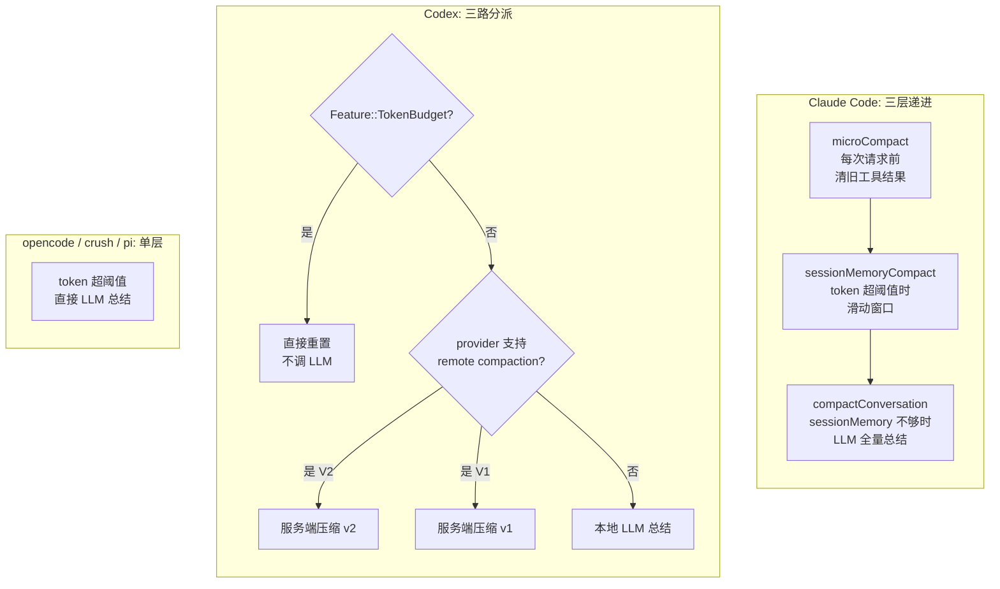
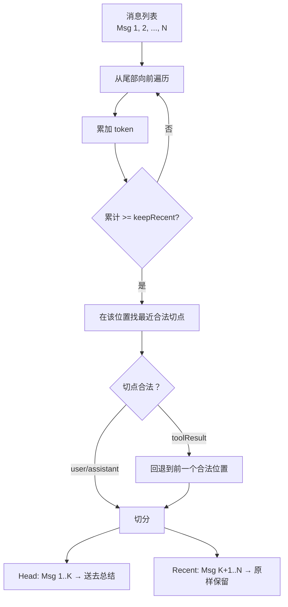
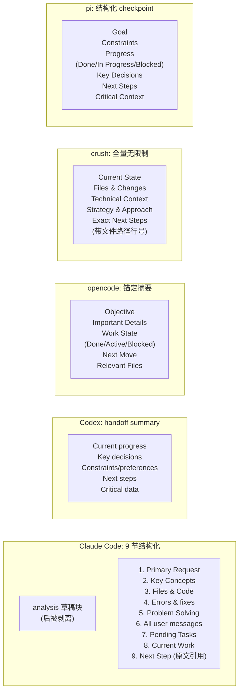
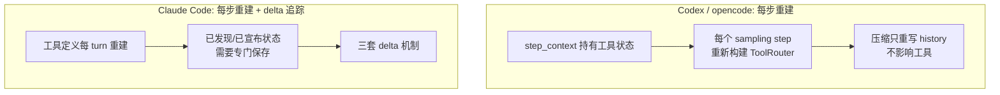
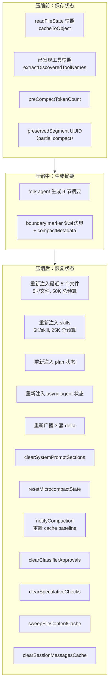
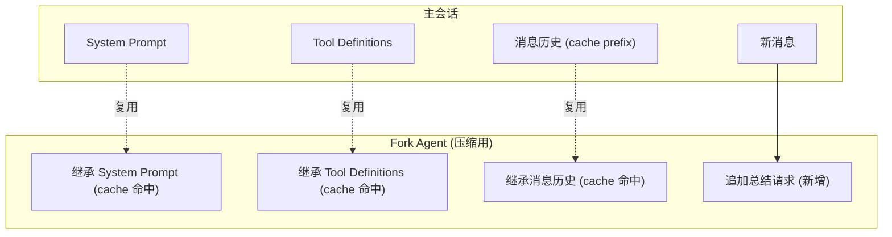

[原理篇](/posts/code-agent-compaction-原理/)讲了上下文管理工程的七个设计问题。这篇按问题组织，每个问题下对比 5 个项目的源码实现，看它们各自怎么解决的。

源码路径：
- Claude Code: `G:/ai-project/claude-code-cli/`（TypeScript）
- Codex: `G:/ai-project/codex/`（Rust）
- opencode: `G:/ai-project/opencode/`（TypeScript, effect 框架）
- crush: `G:/ai-project/crush/`（Go, fantasy 框架）
- pi: `G:/ai-project/pi/`（TypeScript, monorepo）

## 问题一：触发条件怎么设计

### 各项目的触发机制对比



### Claude Code 的三层递进：为什么不是一步到位

Claude Code 在触发全量 LLM 总结之前，先尝试两个轻量操作。为什么要分层？因为三种压缩的代价差距很大：

| 层 | 操作 | 调 LLM | 破坏 cache | 丢消息 | 代价 |
|---|---|---|---|---|---|
| microCompact | 清旧工具结果 | 否 | 否 | 只丢工具返回 | 最低 |
| sessionMemoryCompact | 滑动窗口 | 否 | 是（丢前面的） | 丢旧消息 | 中 |
| compactConversation | LLM 全量总结 | 是 | 是 | 全部替换成摘要 | 最高 |

先试代价最低的，不够再升级。microCompact 不调 LLM、不破坏 cache，应该最先尝试。compactConversation 要调 LLM、有延迟和 token 成本，应该最后才用。

microCompact 只清理 `FileRead`, `Bash`, `Grep`, `Glob`, `WebSearch`, `WebFetch`, `FileEdit`, `FileWrite` 的旧结果。为什么只清这些？因为它们是 token 占比最大、信息密度最低的部分。一个 2000 行文件读取占 8000 token，但关键信息只有"auth 函数在第 42 行"。模型已经看过了，清掉旧结果不会丢关键信息。

microCompact 有两种触发方式：

```typescript
// microCompact.ts:422-444 - 基于时间
// 距上一条 assistant 消息超过 gapThresholdMinutes
// prompt cache 已过期，清理不增加成本

// microCompact.ts:305 - 基于 cache_edits
// 用 cache_edits API 在不破坏 prompt cache 前缀的前提下删除旧工具结果
```

基于时间的触发为什么合理？因为如果 cache 已经过期了（间隔太久），清理旧消息不会增加 prefill 成本，反正都要重新 prefill。这时候清理是"免费的"。

### Codex 的三路分派：为什么不是一个统一路径

Codex 根据 feature flag 和 provider 能力分派到三种实现。为什么要分？因为不同 provider 的能力不同：

```rust
// turn.rs:956-1032
async fn run_auto_compact(...) -> CodexResult<()> {
    if turn_context.config.features.enabled(Feature::TokenBudget) {
        // 路径 1：直接重置，不调 LLM
        crate::compact_token_budget::run_inline_auto_compact_task(...).await?;
        return Ok(());
    }
    if should_use_remote_compact_task(turn_context.provider.info()) {
        if features.enabled(Feature::RemoteCompactionV2) {
            // 路径 2a：服务端 v2
        } else {
            // 路径 2b：服务端 v1
        }
    } else {
        // 路径 3：本地 LLM 总结
    }
}
```

`should_use_remote_compact_task` = `provider.supports_remote_compaction()` = `is_openai() || is_azure_responses_provider()`。

为什么只有 OpenAI/Azure 走服务端？因为服务端压缩依赖 `/responses/compact` 端点，这是 OpenAI 专有 API。其他 provider（Bedrock、Ollama、LMStudio）只能走本地或 TokenBudget。

TokenBudget 路径为什么不需要 LLM？

```rust
// compact_token_budget.rs:45-90
// "Token-budget compaction skips model/server summarization
//  and installs a fresh context window instead."
sess.start_new_context_window(turn_context, world_state).await;
```

因为 Codex 的 world_state 是结构化的状态容器，能完整描述当前任务状态。不需要 LLM 总结对话历史，直接从 world_state 重建。但这要求 world_state 足够完整，如果任务状态散落在对话里没被 world_state 捕获，TokenBudget 路径会丢信息。

### 各项目阈值实现

crush 的分档阈值：

```go
// crush/internal/agent/agent.go:53-55, 432-451
largeContextWindowThreshold = 200_000
largeContextWindowBuffer    = 20_000
smallContextWindowRatio     = 0.2

cw := int64(largeModel.CatwalkCfg.ContextWindow)
if cw == 0 { return false }  // 未知窗口跳过，给本地模型留口
if cw > largeContextWindowThreshold {
    threshold = largeContextWindowBuffer          // 20K
} else {
    threshold = int64(float64(cw) * smallContextWindowRatio)  // 20%
}
```

为什么 `cw == 0` 时跳过？因为本地/自定义模型可能不报告 context window 大小。如果不知道窗口多大就触发压缩，可能误截断。宁可不压缩也不误操作。

pi 的阈值 + 溢出恢复 + 防陈旧触发：

```typescript
// pi/compaction.ts:106-110, 209-212
export const DEFAULT_COMPACTION_SETTINGS = {
    enabled: true,
    reserveTokens: 16384,
    keepRecentTokens: 20000,
};

export function shouldCompact(contextTokens, contextWindow, settings) {
    if (!settings.enabled) return false;
    return contextTokens > contextWindow - settings.reserveTokens;
}
```

```typescript
// agent-session.ts:1919-1924 - 防陈旧触发
// 若 assistant 消息时间戳 <= 最新 compaction 时间戳，跳过
// 防止压缩后第一条 prompt 误用压缩前的旧 usage/error 重触压缩
```

为什么需要防陈旧触发？因为压缩刚完成时，最后一条 assistant 消息的 usage 是压缩前的（token 很高）。如果不检查，可能压缩完立刻又被触发压缩，形成"压缩螺旋"。

opencode 的预发送估算 + 溢出恢复：

```typescript
// opencode/compaction.ts:225-236
if (estimate({ system, messages, tools }) <= context - Math.max(output, config.buffer))
  return false  // 不会超限
return yield* compactAfterOverflow(input)
```

```typescript
// llm.ts:355-367 - 溢出恢复安全阀
if (defect.transition._tag === "ContinueAfterOverflowCompaction")
  return yield* Effect.die("Post-compaction provider attempt cannot recover another overflow")
```

为什么用 defect（不可恢复异常）而不是普通 error？因为溢出恢复需要"重启"当前 turn 的状态，普通 error 处理会污染 turn 状态。defect 抛掷让控制流直接跳到外层重入点，干净利落。

## 问题二：压缩算法怎么选

### 切点选择算法



pi 的切点算法：

```typescript
// pi/compaction.ts:389-413
let accumulatedTokens = 0;
for (let i = endIndex - 1; i >= startIndex; i--) {
    accumulatedTokens += messageTokens;
    if (accumulatedTokens >= keepRecentTokens) {  // 默认 20000
        for (let c = 0; c < cutPoints.length; c++) {
            if (cutPoints[c] >= i) { cutIndex = cutPoints[c]; break; }
        }
        break;
    }
}
```

切点合法性（`isCutPointMessage`，`compaction.ts:282`）：`user`, `assistant`, `bashExecution`, `custom`, `branchSummary`, `compactionSummary` 可以切，**`toolResult` 绝不能切**。当切点落在一个带 tool call 的 assistant 消息处时，其后续的 tool result 会跟着保留。

token 估算用 `chars/4` 启发式。为什么不用精确 tokenizer？因为 keepRecent 是预算不是硬限制，估算差一点不影响正确性。精确 tokenize 每条消息的开销太大，在每次压缩时都跑一遍不划算。图片按 4800 字符估算。

opencode 的切点（`compaction.ts:128-159`）类似，但 keepRecent 更小（8000 vs pi 的 20000）。为什么 opencode 用更小的值？因为 opencode 的摘要是增量更新的（锚定摘要），旧信息已经保留在摘要里了，不需要太多 recent 原文做冗余。

### 摘要 prompt 对比



Claude Code 的第 6 节"All user messages"为什么要逐条列出？因为用户消息是最不能丢的信息。工具结果可以总结，assistant 回复可以概括，但用户的原始指令必须完整保留。第 9 节要求"包含对话中关于你正在做什么、停在哪里的直接引用"，逐字引用用户原始措辞。为什么用原文引用而不是改写？因为改写会引入模型的"理解偏差"。

Claude Code 强制先写 `<analysis>` 草稿块再写 `<summary>` 块。`formatCompactSummary`（`prompt.ts:311`）最后剥离 `<analysis>`。为什么先写草稿？因为直接写总结容易遗漏，先按时间顺序梳理一遍能提高完整性。

`NO_TOOLS_PREAMBLE` 放最前。因为 cache-sharing fork 继承父线程完整工具集（cache key 必须匹配），Sonnet 4.6+ adaptive-thinking 模型有时仍会尝试调工具。`maxTurns:1` 下被拒绝的工具调用会导致无文本输出。

crush 的模板强调"Exact Next Steps"必须具体化："Don't write 'implement authentication' - write: 1. Add JWT middleware to src/middleware/auth.js:15"。且"Length: No limit. Err on the side of too much detail"。为什么不限长度？因为 crush 不保留近期消息，摘要是唯一上下文，信息越少越容易漂移。

### 增量更新机制

opencode 的增量更新：

```typescript
// opencode/compaction.ts:161-168
export const buildPrompt = (input) =>
  [
    input.previousSummary
      ? `Update the anchored summary below using the conversation history above.
Preserve still-true details, remove stale details, and merge in the new facts.
<previous-summary>\n${input.previousSummary}\n</previous-summary>`
      : "Create a new anchored summary from the conversation history.",
    SUMMARY_TEMPLATE,
    ...input.context,
  ].join("\n\n")
```

旧摘要作为 `<previous-summary>` 喂回去。摘要本身在压缩范围内被排除（`compaction.ts:133` 过滤 `type !== "compaction"`），不会被重复摘要。

pi 有专门的 `UPDATE_SUMMARIZATION_PROMPT`（`compaction.ts:474`），从最近的 `CompactionEntry` 取出 `previousSummary` 作为基础。为什么 pi 需要专门从 CompactionEntry 取？因为 pi 的会话是树结构，摘要存在 entry 里，需要沿着 parentId 链找到最近的 compaction entry。

### pi 的 split-turn 双摘要

```typescript
// pi/compaction.ts:718-731
TURN_PREFIX_SUMMARIZATION_PROMPT:
"This is the PREFIX of a turn that was too large to keep.
The SUFFIX (recent work) is retained.
Summarize the prefix to provide context for the retained suffix:
## Original Request
## Early Progress
## Context for Suffix"

// compaction.ts:765-810
summary = `${historyResult}\n\n---\n\n**Turn Context (split turn):**\n\n${turnPrefixResult}`;
```

为什么需要单独总结 turn prefix？因为切点落在一个 turn 中间时，切点之前的同一 turn 内的消息既不属于"旧历史"也不属于"保留的 recent"。它们是当前正在进行的 turn 的前缀。如果跟旧历史一起总结，turn 的语义会被打散。如果直接丢弃，保留的 turn 后缀缺少上下文。

turn prefix 摘要的 maxTokens 预算更小（`0.5 * reserveTokens` vs 历史摘要的 `0.8 * reserveTokens`）。为什么更小？因为 prefix 摘要只需提供足够的上下文让保留的 suffix 能被理解，不需要像历史摘要那样全面。

## 问题三：系统提示词怎么管理

### Claude Code 的 section 注册机制

```typescript
// systemPromptSections.ts:20-38
export function systemPromptSection(name, compute): SystemPromptSection {
  return { name, compute, cacheBreak: false }   // 计算一次，缓存到 /clear 或 /compact
}
export function DANGERE_uncachedSystemPromptSection(name, compute, _reason): SystemPromptSection {
  return { name, compute, cacheBreak: true }     // 每个 turn 重算，破坏 prompt cache
}
```

为什么用两种类型？系统提示词里有些内容是静态的（角色定义、行为规范），算一次就够了；有些是动态的（MCP 连接状态、环境信息），每轮都可能变。如果不区分，要么每轮都重算所有内容（破坏 cache），要么都不重算（动态内容过期）。

`DANGERE_` 前缀强制开发者写 `_reason` 参数。`mcp_instructions` 是唯一一个 DANGERE_ 的 section，因为 MCP servers 在 turns 之间连接/断开。但有个 `isMcpInstructionsDeltaEnabled()` 开关：启用后改为通过 delta attachment 通知，而不是每轮重算。

静态系统提示包含压缩相关指令（`prompts.ts:193`）：
```
The conversation has unlimited context through automatic summarization.
The system will automatically compress prior messages in your conversation
as it approaches context limits.
```

为什么要告诉模型"你会被压缩"？因为模型不知道压缩机制，压缩后可能困惑"为什么前面的对话不见了"或重复之前的工作。

压缩后 `clearSystemPromptSections()` 清空缓存，下个 turn 重算所有 section。为什么不直接追加指令到 system prompt？因为 system prompt 是 cache 的关键部分，追加内容会改变 cache key。用 attachment 消息注入对流式处理更友好。

### Codex 的 base_instructions

```rust
// session/mod.rs:1210-1215
pub(crate) async fn get_base_instructions(&self) -> BaseInstructions {
    let state = self.state.lock().await;
    BaseInstructions {
        text: state.session_configuration.base_instructions.clone(),
    }
}
```

`base_instructions` 是会话级静态状态，压缩完全不触碰它。压缩后真正重建的是注入 history 的 developer/contextual-user 片段，入口是 `build_initial_context_with_world_state_and_mcp`（`session/mod.rs:3150`），聚合了 permissions、personality、skills、collaboration_mode、world_state 渲染片段等。

`has_baked_personality` 检查（`:3246-3257`）避免 base_instructions 与 personality developer 消息重复：

```rust
let has_baked_personality = model_info.supports_personality()
    && base_instructions == model_info.get_model_instructions(Some(personality));
if !has_baked_personality && let Some(personality_message) = ... {
    developer_sections.push(PersonalitySpecInstructions::new(personality_message).render());
}
```

为什么需要检查？因为有些模型的 personality 已经 baked 进 base_instructions 了，如果再注入 personality developer 消息就重复了。

### Codex 的 mid-turn vs pre-turn 注入

```rust
// compact.rs:56-69
/// Mid-turn compaction must use `BeforeLastUserMessage` because the model is
/// trained to see the compaction summary as the last item in history after
/// mid-turn compaction; we therefore inject initial context into the
/// replacement history just above the last real user message.
///
/// Pre-turn/manual compaction variants use `DoNotInject`: they replace history
/// with a summary and clear `reference_context_item`, so the next regular turn
/// will fully reinject initial context after compaction.
```

mid-turn 触发（`turn.rs:348-372`）：工具继续需要时，在最后 user message 前注入 world_state。pre-turn 触发（`turn.rs:800-825`）：不注入，清空 reference，下一轮自然重注入。

注入位置算法（`compact.rs:539-584`）优先级链：最后一条真实 user message -> 最后一条 summary 消息 -> 最后一个 Compaction item -> append。为什么有优先级？因为要保证摘要始终在历史末尾（模型训练假设），初始上下文不能插在摘要后面。

## 问题四：工具链路怎么保证

### 工具定义的存活方式



Codex 的 `built_tools`（`turn.rs:1219`）每个 sampling step 都重新组装：MCP tools、loaded plugins、connectors、dynamic tools。`build_prompt`（`turn.rs:1086`）把 router 的 specs 喂给 Prompt。压缩只重写 history，不影响工具可用性。

opencode 的 `toolMaterialization`（`llm.ts:203`）：

```typescript
const toolMaterialization = isLastStep ? undefined : yield* tools.materialize(agent.info?.permissions)
```

`materialize`（`registry.ts:106`）从 `applications` 和 `local` 合并出新的 registrations Map，应用权限规则过滤，生成全新 definitions 数组。纯函数式，无状态需要压缩。`isLastStep` 时置 `undefined`，配合 `toolChoice: "none"` 强制收尾。

### Claude Code 的三套 delta 机制

**Deferred tools delta**：MCP 工具通过 `ToolSearchTool` 按需发现。压缩前快照：

```typescript
// compact.ts:606-611
const preCompactDiscovered = extractDiscoveredToolNames(messages)
if (preCompactDiscovered.size > 0) {
  boundaryMarker.compactMetadata.preCompactDiscoveredTools = [...preCompactDiscovered].sort()
}
```

恢复时从 boundary 读回。`getDeferredToolsDelta`（`toolSearch.ts:646`）做差分，压缩时传 `[]` 全量重新宣布。

**Agent listing delta**（`attachments.ts:1490`）：Agent 列表移到 delta attachment。为什么？因为 AgentTool 描述里曾内嵌 agent 列表，MCP 异步连接或权限变更会导致描述变化，全 tool-schema cache bust（~10.2% 的 fleet cache_creation）。

**MCP instructions delta**（`attachments.ts:1559`）：同上。压缩时传 `[]` 全量重新宣布（`compact.ts:570-584`）。

为什么用 delta 而不是全量？"delta 优于全量"是 Claude Code 的核心设计哲学。变化不频繁的东西用 delta 通知，避免每轮重算破坏 cache。压缩时传 `[]` 等于"已宣布集合为空"，因此全量重新宣布。

### 压缩时的工具集

Claude Code 的 `createCompactCanUseTool`（`compact.ts:1125`）返回一个全部 deny 的 `canUseTool`。为什么？因为压缩 agent 只应该产出文本摘要，不应该执行任何工具调用。cache-sharing fork 继承父线程完整工具集（cache key 必须匹配），所以工具定义还在，但 `canUseTool` 拒绝所有调用。

fallback 流式路径用最小工具集 `[FileReadTool]`，或当 toolSearch 启用时用 `[FileReadTool, ToolSearchTool, ...MCP tools]`（带 `defer_loading: true`，API 不计入 context）。

## 问题五：状态怎么保存恢复

### Claude Code 的状态保存/恢复流程



文件重新注入选择策略（`compact.ts:1415`）：

```typescript
// compact.ts:122-130
export const POST_COMPACT_MAX_FILES_TO_RESTORE = 5
export const POST_COMPACT_TOKEN_BUDGET = 50_000
export const POST_COMPACT_MAX_TOKENS_PER_FILE = 5_000
export const POST_COMPACT_MAX_TOKENS_PER_SKILL = 5_000
export const POST_COMPACT_SKILLS_TOKEN_BUDGET = 25_000
```

选择流程：从 `readFileState` 取最近读过的文件 -> 过滤掉 plan 文件和 memory 文件 -> 过滤掉已在 preservedMessages 里的（`collectReadToolFilePaths`，避免重复注入最多 25K token 的浪费） -> 按 timestamp 降序排序 -> 取前 5 个 -> 每个截断到 5K token -> 总预算 50K。

为什么是 5 个？代码中没有显式注释。50K / 5K = 10 个理论上限，实际取 5 是经验性的平衡点。

`postCompactCleanup` 区分主线程和 subagent（`postCompactCleanup.ts:36-40`）。为什么？因为 subagent 在同一进程共享 module-level state，如果 subagent 压缩时重置了主线程的 state，会损坏主线程。

`sentSkillNames` 故意不清空（`compact.ts:524-529`）。为什么？因为重注入 ~4K token 是纯 cache_creation，不清空能复用已有 cache。invokedSkills 也不清空，skill content 必须跨多次压缩存活。

### Codex 的 world_state 差分引擎

```rust
// world_state/mod.rs:180-204
pub(crate) trait WorldStateSection: Send + Sync + 'static {
    const ID: &'static str;
    type Snapshot: DeserializeOwned + Serialize;
    fn snapshot(&self) -> Self::Snapshot;
    fn render_diff(&self, previous: PreviousSectionState<'_, Self::Snapshot>)
        -> Option<Box<dyn ContextualUserFragment>>;
}
```

`PreviousSectionState` 三态：

```rust
// mod.rs:162-169
PreviousSectionState::Absent    // 全新渲染（压缩后首次）
PreviousSectionState::Known(previous)  // 用持久化快照做精确 diff
PreviousSectionState::Unknown   // 历史里有旧格式片段但快照丢失
```

为什么用三态？因为要处理版本迁移：旧版本可能没有结构化快照，但历史消息里有旧格式的文本片段。`Unknown` 让 section 自己决定怎么从旧格式降级恢复。

三种渲染路径（`mod.rs:281-328`）：

```rust
pub(crate) fn render_full(&self) -> ... {
    self.render_with(|_, _| PreviousSectionState::Absent)  // 全量
}
pub(crate) fn render_diff(&self, previous: &WorldStateSnapshot) -> ... {
    self.render_with(|id, _| match previous.sections.get(id) {
        Some(previous) => PreviousSectionState::Known(previous),
        None => PreviousSectionState::Absent,
    })  // 精确 diff
}
pub(crate) fn render_history_diff(&self, previous, items) -> ... {
    // 快照丢失时从历史消息降级恢复
    // 检查 has_retained_fragment / has_legacy_fragment
}
```

快照之间用 RFC 7386 merge patch 表达增量（`mod.rs:219-237`）。为什么用 merge patch？因为 rollout 只需持久化 patch 而非全量，节省存储。`remove_null_object_fields` 在快照序列化前剥离 null 字段，因为 merge-patch 的 null 代表删除。

`ContextManager` 的 `world_state_baseline`（`history.rs:38-57`）：

```rust
pub(crate) fn remove_first_item(&mut self) {
    self.world_state_baseline = None;  // 迫使下次退化为全量
}
pub(crate) fn replace(&mut self, items: Vec<ResponseItem>) {
    self.world_state_baseline = None;
}
```

为什么重写历史时清空 baseline？因为历史被重写了，之前的 baseline 对应的是旧历史，不能再用于 diff。清空后下次渲染退化为全量，保证一致性。

### Codex 的 comp_hash 机制

```rust
// turn.rs:829-833
fn comp_hash_changed(previous: Option<&str>, current: Option<&str>) -> bool {
    previous.zip(current).is_some_and(|(previous, current)| previous != current)
}
```

变化时用**旧模型**重新压缩（`turn.rs:874-883`）。为什么用旧模型？因为新模型可能无法理解旧模型生成的压缩格式。旧模型才能读懂旧历史，生成的摘要才能被新模型理解。同时准备 fallback_step_context（当前模型）备用。

任一 hash 缺失则不触发。为什么？因为信息不足以判断兼容性，不如不触发。

### opencode 的 system-context epoch

```typescript
// context-epoch.ts:40-78
const replacementSeq = compaction !== undefined && compaction.seq > stored.baseline_seq
  ? compaction.seq : undefined
const result = replacementSeq
  ? yield* SystemContext.replace(value, snapshot)   // 压缩后：整体重算
  : yield* SystemContext.reconcile(value, snapshot) // 正常轮：增量对账
```

`reconcile`（`index.ts:218-280`）逐源比较，只渲染变化的源。某源 `Incompatible`（schema 解码失败）时降级为整体 `Replace`。

`replace`（`index.ts:283-291`）的安全阀：

```typescript
// 若有源 Unavailable 且旧 snapshot 里存在，返回 ReplacementBlocked
// 宁可阻塞也不构造残缺基准
```

为什么宁可阻塞？因为残缺基准会导致模型缺失关键环境信息（比如不知道当前工作目录），比阻塞更危险。

### crush 的 todo 外置

```go
// todos.go:98
currentSession.Todos = todos  // 存 session 字段，不进消息流
sessions.Save()

// agent.go:1196-1209 - 摘要时注入
if len(todos) > 0 {
    sb.WriteString("\n\n## Current Todo List\n\n")
    for _, t := range todos {
        fmt.Fprintf(&sb, "- [%s] %s\n", t.Status, t.Content)
    }
    sb.WriteString("Instruct the resuming assistant to use the `todos` tool to continue tracking progress.")
}
```

为什么把 todos 放 session 字段？因为 todos 是结构化状态，放进消息流会被 LLM 总结时可能丢失或改写。放 session 字段确保精确保留。恢复双保险：todos 挂在 session 上 + 摘要里写明任务状态。

todos 工具设计成"全量替换"语义，约束 "Exactly ONE task must be in_progress"。为什么？保证焦点单一，防止模型同时"做多件事"。

### pi 的文件操作追踪

```typescript
// compaction.ts:41-69
function extractFileOperations(messages, entries, prevCompactionIndex): FileOperations {
    const fileOps = createFileOps();
    if (prevCompactionIndex >= 0) {
        const prevCompaction = entries[prevCompactionIndex] as CompactionEntry;
        if (!prevCompaction.fromHook && prevCompaction.details) {
            // fromHook 守卫：扩展生成的摘要 details 不可信
            const details = prevCompaction.details as CompactionDetails;
            if (Array.isArray(details.readFiles)) for (const f of details.readFiles) fileOps.read.add(f);
            if (Array.isArray(details.modifiedFiles)) for (const f of details.modifiedFiles) fileOps.edited.add(f);
        }
    }
    for (const msg of messages) extractFileOpsFromMessage(msg, fileOps);
    return fileOps;
}
```

`modifiedFiles = edited ∪ written`，`readFiles = read - modified`（只读未改的）。为什么这么分？因为改过的文件比只读的更重要，分开追踪让模型知道哪些是"我改过的"vs"我只看过的"。

`fromHook` 守卫：扩展生成的摘要（`fromHook=true`）的 details 结构不可信，不解析。为什么？因为扩展可能用不同格式生成 details，pi 不假设其结构。

### pi 的 buildContextEntries：多条 compaction entry 怎么处理

```typescript
// session-manager.ts:414-466
export function buildContextEntries(entries, leafId?, byId?): SessionEntry[] {
    const path = buildSessionPath(entries, leafId, byId);  // 从 leaf 沿 parentId 回溯到 root
    let compaction: CompactionEntry | null = null;
    for (const entry of path) {
        if (entry.type === "compaction") compaction = entry;  // 总是取最后一个
    }
    if (!compaction) return path;  // 无压缩：全路径
    // [compaction, ...firstKept到compaction之间的, ...compaction之后的]
}
```

为什么只取最后一个 compaction？因为前面的 compaction 已经被后续 compaction 的 summary 涵盖（通过 previousSummary 增量更新）。保留多个会导致摘要嵌套，浪费 token。

### crush 的中断续传

```go
// agent.go:582-597
if shouldSummarize {
    a.Summarize(...)
    if len(currentAssistant.ToolCalls()) > 0 {
        // agent 还没做完，改写 prompt 塞回队列
        call.Prompt = fmt.Sprintf(
            "The previous session was interrupted because it got too long, the initial user request was: `%s`",
            call.Prompt)
        existing = append(existing, call)
        a.messageQueue.Set(call.SessionID, existing)
    }
}
```

为什么改写 prompt？因为压缩后上下文变了，原始 prompt 可能引用了已被压缩掉的内容。改写成"previous session was interrupted"让模型知道这是续传，不是新请求。

摘要后截断历史，role 重映射（`agent.go:815`）：

```go
msgs = msgs[summaryMsgIndex:]  // 截断摘要前的所有消息
msgs[0].Role = message.User    // role 从 assistant 重映射为 user
```

为什么重映射 role？因为摘要本来是 assistant 生成的（assistant role），但喂给 LLM 时应该表现为"给模型的信息"（user role），而不是"模型之前说的话"（assistant role）。

## 问题六：prompt cache 怎么不破坏

### Claude Code 的 fork agent



```typescript
// forkedAgent.ts:57
export type CacheSafeParams = {
  systemPrompt: SystemPrompt
  userContext: { [k: string]: string }
  systemContext: { [k: string]: string }
  toolUseContext: ToolUseContext
  forkContextMessages: Message[]
}
```

5 个参数必须与父请求一致才能命中 cache。为什么不能设 `maxOutputTokens`？因为它会 clamp `budget_tokens` 破坏 thinking config 的 cache key（`forkedAgent.ts:97-103` 注释警告）。

`contentReplacementState` 默认 clone 而非 fresh（`forkedAgent.ts:399-403`）。为什么？因为 cache-sharing fork 处理含父 `tool_use_id` 的父消息，fresh state 会把它们当未见，替换决策发散，wire prefix 不同，cache miss。

默认走 fork 路径（`compact.ts:435` `tengu_compact_cache_prefix` 默认 true）。Jan 2026 实验确认 false 路径 98% cache miss，耗费 ~0.76% fleet cache_creation ~38B tok/day。

### cache_edits：不破坏 cache 前缀删 tool results

```typescript
// microCompact.ts:295-304
// 不修改本地消息内容（cache_reference 和 cache_edits 在 API 层添加）
// 不持久化到磁盘
// 追踪 tool results 并为 API 层排队 cache edits
```

`createCacheEditsBlock` 生成 `{ type: 'cache_edits', edits: [{ type: 'delete', cache_reference: string }] }`。`pinnedEdits`（`microCompact.ts:108`）把 cache_edits 钉到特定 user message 位置，`addCacheBreakpoints`（`claude.ts:3127`）重新插入所有 pinned edits 到原位置。

为什么不直接修改本地消息？因为修改本地消息会改变 cache prefix（消息内容是 cache key 的一部分）。用 cache_edits 在 API 层面删除，本地消息内容和 cache prefix 不变。

### sticky-on latch

```typescript
// bootstrap/state.ts:226-242
// afkModeHeaderLatched、fastModeHeaderLatched、cacheEditingHeaderLatched、thinkingClearLatched
// 一旦首次激活就整个 session 保持发送对应 beta header
```

为什么需要 sticky？因为用户可能中途按 Shift+Tab 切换模式，这会改变 beta header。beta header 是 cache key 的一部分，变了就 cache miss。一个 50-70K token 的 prompt cache miss 代价太大。所以"一旦发过就整个 session 保持"。

### cache 断裂检测

两阶段检测（`promptCacheBreakDetection.ts`）：
- Phase 1（`recordPromptState` `:247`）：调用前记录 system/tools/model/betas hash
- Phase 2（`checkResponseForCacheBreak` `:437`）：调用后看 cache_read_tokens 是否跌 >5% 且超过 2000 token

`notifyCompaction`（`:689`）和 `notifyCacheDeletion`（`:673`）标记"预期内的 cache read 下降"。为什么需要标记？因为压缩和 cache_edits 会合法降低 cache read，不标记的话会被误报为"cache 断裂"。

### Codex 的 remove_first_item

```rust
// compact.rs:285-300
Err(e @ CodexErr::ContextWindowExceeded) => {
    if turn_input_len > 1 {
        history.remove_first_item();  // 从最旧处删
        continue;
    }
}
```

为什么从最旧处删？因为 cache 是前缀匹配的，前面的消息是 cache prefix 的一部分。删了最旧的消息，前面的 cache 还能用。如果删最新的，cache prefix 不变但丢失了最近的上下文，对摘要质量影响更大。

### Claude Code 的 boundary marker 链重连

```typescript
// messages.ts:4530
createCompactBoundaryMessage: {
  type:'system', subtype:'compact_boundary',
  compactMetadata: {
    trigger, preTokens, userContext, messagesSummarized,
    preservedSegment?: { headUuid, anchorUuid, tailUuid },
    preCompactDiscoveredTools?: string[],
  }
}
```

`getMessagesAfterCompactBoundary`（`messages.ts:4643`）通过 `findLastCompactBoundaryIndex` 从后向前扫描找最近的 boundary。为什么从后向前？因为多次压缩时旧 boundary 被新 boundary 覆盖，从后向前保证只认最新的。

partial compact 的 `preservedSegment` 记录保留消息链的头/锚/尾 UUID。`applyPreservedSegmentRelinks`（`sessionStorage.ts:1839`）在 resume 时做链重连：从 tail 向 head 走验证链完整，head 的 parentUuid 改为 anchorUuid。如果链断了（`tengu_relink_walk_broken`），跳过 prune，安全降级。为什么安全降级？因为链断了说明数据可能不一致，宁可不优化也不冒险丢数据。

### Claude Code 的 cacheControl 切分

`splitSysPromptPrefix`（`api.ts:321`）把 system prompt 数组切成带 `cacheScope` 的块。三种模式：

1. MCP tools present：最多 3 块，org 级缓存
2. Global cache + boundary marker（1P only）：最多 4 块，attribution header(null) + system prefix(null) + 静态内容(global) + 动态内容(null)
3. 默认（3P 或无 boundary）：最多 3 块，org 级

boundary marker 把跨用户可共享的静态前缀（scope:'global'）和用户/会话特定的动态内容分开。为什么分开？因为静态前缀可以被多个用户复用（global scope），动态内容只能当前会话用（ephemeral scope）。分开后静态部分的 cache 命中率更高。

## 问题七：扩展性怎么设计

### Claude Code 的 hooks

三个 hook 的执行顺序：PreCompact（`compact.ts:413`）-> 摘要生成 -> SessionStart（`compact.ts:592`，trigger='compact'）-> PostCompact（`compact.ts:723`）。

PreCompact 的 stdout 输出通过 `mergeHookInstructions`（`compact.ts:374`）合并到压缩 prompt 的 `Additional Instructions` 段。`trigger` 字段（`auto`/`manual`）允许按触发方式配置不同 hook。

为什么需要 hook？因为不同项目有不同的"不能丢的信息"。一个安全审计项目可能需要在摘要里保留所有安全相关的决策，一个数据库迁移项目可能需要保留所有 schema 变更。PreCompact hook 让项目自定义这些需求。

SessionStart hook 以 `'compact'` 作为 source 触发，等于"新会话开始"语义。为什么用"新会话开始"？因为压缩后上下文被重置了，对于扩展来说这跟一次新会话没有区别，应该重新初始化。

### pi 的扩展钩子可替换压缩

```typescript
// extensions/types.ts:578-588
export interface SessionBeforeCompactResult {
    cancel?: boolean;        // 取消压缩
    compaction?: CompactionResult;  // 完全替换压缩逻辑
}
```

`agent-session.ts:1765-1814`：返回 `result.compaction` 则跳过默认 `compact()` 调用，直接用扩展提供的 summary/firstKeptEntryId/tokensBefore/details。`fromExtension=true` 标记为 `fromHook`。

`custom-compaction.ts` 示例用 Gemini Flash 替代摘要模型。为什么换模型？因为摘要不需要强模型的能力，用便宜的 Flash 够了。示例把 messagesToSummarize + turnPrefixMessages 全量合并摘要，丢弃所有旧 turn 只留 summary。为什么这个示例不保留 recent？因为它用全量摘要替代，摘要本身就足够详细。但代价是丢失了 recent 原文的精确性。

`fromHook` 字段的意义：`extractFileOperations` 和 `prepareBranchEntries` 都检查 `!entry.fromHook`，只从 pi 生成的摘要里继承文件列表。为什么？因为扩展生成的摘要 details 结构未知，pi 不假设其结构。

## 横向对比

| 维度 | Claude Code | Codex | opencode | crush | pi |
|---|---|---|---|---|---|
| 触发设计 | 三层递进（micro/session/full） | 三路分派（TokenBudget/remote/local） | 预发送估算+溢出恢复 | 剩余 token 分档 | 阈值+溢出+防陈旧 |
| 切点算法 | adjustIndexToPreserveAPIInvariants | build_compacted_history | select（8K keepRecent） | 无切点（全量） | findCutPoint（20K keepRecent）+ isCutPointMessage |
| 摘要 prompt | 9节+analysis草稿+原文引用 | handoff summary | 锚定摘要（增量更新） | 全量无限制+具体化下一步 | 结构化+split-turn双摘要 |
| 系统提示词 | section注册（cache-safe+DANGERE_） | base_instructions会话级静态+developer重建 | 每轮重新附加 | 每轮重新附加 | 不在压缩范围 |
| 工具链路 | 三套delta+deferred快照 | 每步重建ToolRouter | 每轮materialize | 每轮重建 | 不在压缩范围 |
| 状态管理 | 12+项保存/恢复 | world_state+RFC7386 merge patch | system-context epoch | todos外置 | 文件操作XML追踪（跨压缩继承） |
| cache策略 | fork agent+cache_edits+sticky latch+断裂检测+cacheControl切分 | remove_first_item保留prefix | - | - | - |
| 扩展性 | PreCompact/PostCompact/SessionStart hooks | - | - | - | session_before_compact可替换 |
| 语义保证 | 9节prompt+原文引用+NO_TOOLS | mid-turn/pre-turn注入+comp_hash | ReplacementBlocked安全阀 | todo双保险+中断续传 | split-turn+fromHook守卫+防陈旧 |
| boundary | compact_boundary+preservedSegment链重连 | WorldStateSnapshot baseline | epoch baseline_seq | SummaryMessageID | CompactionEntry+firstKeptEntryId |
| 增量更新 | 否 | 否（merge patch是状态diff不是摘要diff） | 是（锚定摘要） | 否 | 是（UPDATE_SUMMARIZATION_PROMPT） |
| 溢出恢复 | PTL重试3次（丢最旧组） | remove_first_item | defect抛掷1次 | 无 | 1次+防陈旧 |
| 熔断 | 连续失败3次 | 无 | 无 | 无 | 无 |

## 设计哲学差异

**Claude Code**：最工程化。把连续性拆成 7+ 个独立维度，每个有专门通道。"delta 优于全量，sticky 优于 dynamic"是核心哲学。fork agent 复用 cache 的设计独此一家。12+ 项状态保存恢复清单是最全的。boundary marker + preservedSegment 链重连保证磁盘存储的完整性。

**Codex**：最分层。world_state 差分引擎把状态管理和对话历史完全分离，TokenBudget 路径可以完全不需要 LLM。mid-turn vs pre-turn 的模型训练假设是最深的设计洞察。comp_hash 用旧模型压缩解决跨模型兼容性。RFC 7386 merge patch 让状态持久化只需要存 patch。

**opencode**：最平衡。双轨制（结构化 epoch + LLM 摘要）互不污染，`ReplacementBlocked` 安全阀保证不构造残缺基准。溢出恢复用 defect 抛掷是最干净的实现。锚定摘要的增量更新设计简洁有效。

**crush**：最务实。单次全量摘要、todos 外置、中断续传。没有花哨的机制，但"Length: No limit"和"Exact Next Steps"带文件路径行号的要求保证了实用性。`cw==0` 给本地模型留口是最贴心的设计。

**pi**：最灵活。树形会话、split-turn 双摘要、文件操作跨压缩继承、扩展钩子可完全替换压缩逻辑。`fromHook` 守卫和 `assistantIsFromBeforeCompaction` 防陈旧触发体现了对边缘情况的考虑。分支总结的嵌套摘要设计是独有特色。
