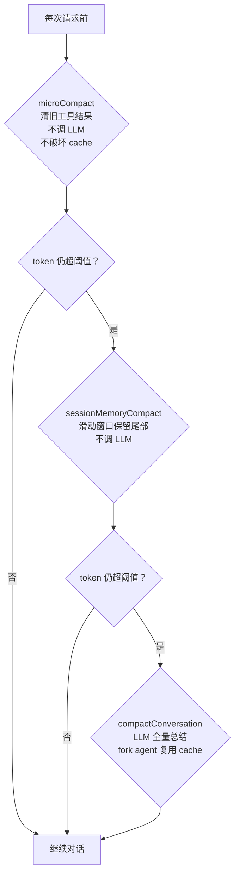

[原理篇](/posts/code-agent-compaction-原理/)讲了上下文管理的设计空间。这篇逐个拆 5 个项目的源码实现，看它们各自怎么解决状态连续性、语义一致性、工具链路保证这些问题。

源码路径：
- Claude Code: `G:/ai-project/claude-code-cli/`
- Codex: `G:/ai-project/codex/`
- opencode: `G:/ai-project/opencode/`
- crush: `G:/ai-project/crush/`
- pi: `G:/ai-project/pi/`

## Claude Code：最复杂的状态管理工程

### 核心文件

| 文件 | 作用 |
|---|---|
| `services/compact/compact.ts` | 主压缩算法、buildPostCompactMessages |
| `services/compact/autoCompact.ts` | 自动压缩触发条件 |
| `services/compact/microCompact.ts` | 微压缩（cache_edits 清旧工具结果） |
| `services/compact/sessionMemoryCompact.ts` | 滑动窗口压缩 |
| `services/compact/prompt.ts` | 9 节总结提示词模板 |
| `services/compact/postCompactCleanup.ts` | 压缩后状态重置 |
| `systemPromptSections.ts` | 系统提示词 section 注册机制 |
| `utils/toolSearch.ts` | deferred tools 发现和 delta |
| `utils/attachments.ts` | delta attachments（agent listing / MCP instructions） |
| `utils/forkedAgent.ts` | cache-safe fork agent |
| `utils/messages.ts` | boundary marker 创建和定位 |
| `utils/api.ts` | cacheControl 切分 |
| `services/api/promptCacheBreakDetection.ts` | cache 断裂检测 |

### 三层递进压缩



microCompact 只清理 `FileRead`, `Bash`, `Grep`, `Glob`, `WebSearch`, `WebFetch`, `FileEdit`, `FileWrite` 的旧结果。两种触发方式：基于时间（cache 已过期，清理不增加成本）和基于 `cache_edits` API（不破坏 cache 前缀删 tool results）。

`cache_edits` 的实现：不修改本地消息内容，只在 API 层添加 `{ type: 'cache_edits', edits: [{ type: 'delete', cache_reference: string }] }`，插入到最后一条 user 消息。这让 API 在 cache 层面删除旧 tool result，但本地消息内容和 cache prefix 不变。

### 系统提示词 section 机制

```typescript
// systemPromptSections.ts:20-38
export function systemPromptSection(name, compute): SystemPromptSection {
  return { name, compute, cacheBreak: false }   // 计算一次，缓存到 /clear 或 /compact
}
export function DANGERE_uncachedSystemPromptSection(name, compute, _reason): SystemPromptSection {
  return { name, compute, cacheBreak: true }     // 每个 turn 重算，破坏 prompt cache
}
```

`DANGERE_` 前缀强制开发者写 `_reason` 参数解释为什么必须破坏 cache。`mcp_instructions` 是唯一一个 DANGERE_ 的 section，因为 MCP servers 在 turns 之间连接/断开。

静态系统提示包含压缩相关指令（`prompts.ts:193`）：
```
The conversation has unlimited context through automatic summarization.
The system will automatically compress prior messages in your conversation
as it approaches context limits.
```

压缩后 `clearSystemPromptSections()` 清空缓存，下个 turn 重算所有 section。

### 三套 delta 机制

**Deferred tools delta**：MCP 工具通过 `ToolSearchTool` 按需发现。压缩前快照已发现工具：

```typescript
// compact.ts:606-611
const preCompactDiscovered = extractDiscoveredToolNames(messages)
if (preCompactDiscovered.size > 0) {
  boundaryMarker.compactMetadata.preCompactDiscoveredTools = [...preCompactDiscovered].sort()
}
```

恢复时从 boundary 读回。`getDeferredToolsDelta`（`toolSearch.ts:646`）做差分，压缩时传 `[]` 全量重新宣布。

**Agent listing delta**（`attachments.ts:1490`）：Agent 列表移到 delta attachment，避免工具描述变化导致 cache bust。压缩时传 `[]` 全量重宣布。

**MCP instructions delta**（`attachments.ts:1559`）：同上。

### boundary marker 机制

`createCompactBoundaryMessage`（`messages.ts:4530`）创建一条 `type:'system', subtype:'compact_boundary'` 消息，携带：

```typescript
compactMetadata: {
  trigger: 'manual' | 'auto',
  preTokens,
  userContext,
  messagesSummarized,
  preservedSegment?: { headUuid, anchorUuid, tailUuid },  // partial compact
  preCompactDiscoveredTools?: string[],
}
```

`getMessagesAfterCompactBoundary`（`messages.ts:4643`）通过 `findLastCompactBoundaryIndex` 从后向前扫描找最近的 boundary，只处理 boundary 之后的消息。多次压缩时旧 boundary 被新 boundary 覆盖。

partial compact 的 `preservedSegment` 记录保留消息链的头/锚/尾 UUID。`applyPreservedSegmentRelinks`（`sessionStorage.ts:1839`）在 resume 时做链重连：从 tail 向 head 走验证链完整，head 的 parentUuid 改为 anchorUuid。如果链断了（`tengu_relink_walk_broken`），跳过 prune，安全降级。

### fork agent 复用 cache

```typescript
// forkedAgent.ts:57
export type CacheSafeParams = {
  systemPrompt: SystemPrompt
  userContext: { [k: string]: string }
  systemContext: { [k: string]: string }
  toolUseContext: ToolUseContext
  forkContextMessages: Message[]   // 父上下文消息，作为 prefix
}
```

5 个参数必须与父请求一致才能命中 cache。不能设 `maxOutputTokens`，因为它会 clamp `budget_tokens` 破坏 thinking config 的 cache key。

`contentReplacementState` 默认 clone 而非 fresh（`forkedAgent.ts:399-403`）。因为 cache-sharing fork 处理含父 `tool_use_id` 的父消息，fresh state 会把它们当未见，替换决策发散，wire prefix 不同，cache miss。

### 9 节总结提示词

```typescript
// prompt.ts:66-77
// 1. Primary Request and Intent
// 2. Key Technical Concepts
// 3. Files and Code Sections（含完整代码片段）
// 4. Errors and fixes
// 5. Problem Solving
// 6. All user messages（逐条列出所有非 tool result 的用户消息）
// 7. Pending Tasks
// 8. Current Work
// 9. Optional Next Step（含原文引用以防任务漂移）
```

强制先写 `<analysis>` 草稿块再写 `<summary>` 块。`formatCompactSummary`（`prompt.ts:311`）剥离 `<analysis>`。

`NO_TOOLS_PREAMBLE` 放最前，`NO_TOOLS_TRAILER` 放最后。因为 cache-sharing fork 继承父线程完整工具集（cache key 必须匹配），Sonnet 4.6+ 有时仍会尝试调工具。

### 文件重新注入

```typescript
// compact.ts:122-130
export const POST_COMPACT_MAX_FILES_TO_RESTORE = 5
export const POST_COMPACT_TOKEN_BUDGET = 50_000
export const POST_COMPACT_MAX_TOKENS_PER_FILE = 5_000
export const POST_COMPACT_MAX_TOKENS_PER_SKILL = 5_000
export const POST_COMPACT_SKILLS_TOKEN_BUDGET = 25_000
```

选择策略：从 `readFileState` 取最近读过的文件，过滤掉 plan 文件和 memory 文件，过滤掉已在 preservedMessages 里的（避免重复注入），按 timestamp 降序排序，取前 5 个，每个截断到 5K token，总预算 50K。

### Hooks

三个 hook 的执行顺序：PreCompact（`compact.ts:413`）-> 摘要生成 -> SessionStart（`compact.ts:592`，trigger='compact'）-> PostCompact（`compact.ts:723`）。

PreCompact 的 stdout 输出通过 `mergeHookInstructions` 合并到压缩 prompt 的 `Additional Instructions` 段。`trigger` 字段（`auto`/`manual`）允许按触发方式配置不同 hook。

### cache 断裂检测

两阶段检测：
- Phase 1（调用前）：记录 system/tools/model/betas hash
- Phase 2（调用后）：看 cache_read_tokens 是否跌 >5% 且超过 2000 token

`notifyCompaction` 和 `notifyCacheDeletion` 标记"预期内的 cache read 下降"，不误报为断裂。

### sticky-on latch

```typescript
// bootstrap/state.ts:226-242
// afkModeHeaderLatched、fastModeHeaderLatched、cacheEditingHeaderLatched、thinkingClearLatched
// 一旦首次激活就整个 session 保持发送对应 beta header
// 避免 Shift+Tab 切换等中途状态翻转破坏 50-70K token 的 prompt cache
```

### 状态保存/恢复完整清单

除了前文列的表格，还有：microcompact state reset、memory files cache reset、classifier approvals clear、speculative checks clear、beta tracing state clear、attribution file content cache sweep、session messages cache clear、prompt cache read baseline reset。

`postCompactCleanup` 区分主线程和 subagent（`postCompactCleanup.ts:36-40`）。Subagent 压缩时不重置主线程的 module-level state，否则会损坏主线程状态。

### postCompactCleanup 中 sentSkillNames 故意不清空

```typescript
// compact.ts:524-529
// sentSkillNames 故意不清空
// 重注入 ~4K token 是纯 cache_creation，不清空能复用已有 cache
```

invokedSkills 也不清空（`postCompactCleanup.ts:17-20`），skill content 必须跨多次压缩存活。

## Codex：world_state 差分引擎 + 三路分派

### 核心文件

| 文件 | 作用 |
|---|---|
| `core/src/context/world_state/mod.rs` | WorldState 核心抽象 + RFC 7386 merge patch |
| `core/src/session/world_state.rs` | per-step 构建器 |
| `core/src/context_manager/history.rs` | baseline 跟踪 + 差分渲染 |
| `core/src/compact.rs` | 本地压缩 + InitialContextInjection |
| `core/src/compact_token_budget.rs` | TokenBudget 路径（直接重置） |
| `core/src/compact_remote.rs` | 服务端 v1 + 保留过滤 |
| `core/src/compact_remote_v2.rs` | 服务端 v2 |
| `core/src/session/turn.rs` | 三路分派决策树 + mid-turn 触发 |
| `core/src/session/mod.rs` | replace_compacted_history / start_new_context_window |

### world_state 差分引擎

```rust
// world_state/mod.rs:180-204
pub(crate) trait WorldStateSection: Send + Sync + 'static {
    const ID: &'static str;
    type Snapshot: DeserializeOwned + Serialize;
    fn snapshot(&self) -> Self::Snapshot;
    fn render_diff(&self, previous: PreviousSectionState<'_, Self::Snapshot>)
        -> Option<Box<dyn ContextualUserFragment>>;
}
```

`PreviousSectionState` 三态：
- `Absent`：全新渲染（压缩后首次）
- `Known`：用持久化快照做精确 diff
- `Unknown`：历史里有旧格式片段但快照丢失，section 自己决定如何降级

快照之间用 RFC 7386 merge patch 表达增量。`ContextManager` 持有 `world_state_baseline`，任何重写历史都清空 baseline：

```rust
// history.rs:187-204
pub(crate) fn remove_first_item(&mut self) {
    self.world_state_baseline = None;  // 迫使下次退化为全量
}
pub(crate) fn replace(&mut self, items: Vec<ResponseItem>) {
    self.world_state_baseline = None;
}
```

四个内置 section：`AgentsMdState`（AGENTS.md 内容）、`EnvironmentsState`（cwd/date/timezone/network/filesystem）、`AppsInstructionsState`、`PluginsInstructionsState`。

### 三路分派

```rust
// turn.rs:956-1032
async fn run_auto_compact(...) -> CodexResult<()> {
    if turn_context.config.features.enabled(Feature::TokenBudget) {
        // 路径 1：直接重置，不调 LLM
        crate::compact_token_budget::run_inline_auto_compact_task(...).await?;
        return Ok(());
    }
    if should_use_remote_compact_task(turn_context.provider.info()) {
        if features.enabled(Feature::RemoteCompactionV2) {
            // 路径 2a：服务端 v2
        } else {
            // 路径 2b：服务端 v1
        }
    } else {
        // 路径 3：本地 LLM 总结
    }
}
```

`should_use_remote_compact_task` = `provider.supports_remote_compaction()` = `is_openai() || is_azure_responses_provider()`。只有 OpenAI 和 Azure Responses 走服务端路径，其他 provider 走本地或 TokenBudget。

TokenBudget 路径（`compact_token_budget.rs:49-62`）：

```rust
// 完全跳过 LLM 总结，靠 world_state 全量重建
sess.start_new_context_window(turn_context, world_state).await;
```

### mid-turn vs pre-turn 注入

```rust
// compact.rs:56-69
/// Mid-turn compaction must use `BeforeLastUserMessage` because the model is
/// trained to see the compaction summary as the last item in history after
/// mid-turn compaction; we therefore inject initial context into the
/// replacement history just above the last real user message.
///
/// Pre-turn/manual compaction variants use `DoNotInject`: they replace history
/// with a summary and clear `reference_context_item`, so the next regular turn
/// will fully reinject initial context after compaction.
```

mid-turn 触发（`turn.rs:348-372`）：工具继续需要时，在最后 user message 前注入 world_state。pre-turn 触发（`turn.rs:800-825`）：不注入，清空 reference，下一轮自然重注入。

### comp_hash 机制

```rust
// turn.rs:829-833
fn comp_hash_changed(previous: Option<&str>, current: Option<&str>) -> bool {
    previous.zip(current).is_some_and(|(previous, current)| previous != current)
}
```

变化时用**旧模型**重新压缩（`turn.rs:874-883`，旧模型才能读懂旧压缩格式），准备 fallback_step_context（当前模型）备用。任一 hash 缺失则不触发。

### 服务端保留过滤

```rust
// compact_remote.rs:340-367
pub(crate) fn should_keep_compacted_history_item(item: &ResponseItem) -> bool {
    match item {
        ResponseItem::Message { role, .. } if role == "developer" => false,  // 丢弃：stale/duplicated
        ResponseItem::Message { role, .. } if role == "user" => {
            matches!(parse_turn_item(item), Some(TurnItem::UserMessage(_) | TurnItem::HookPrompt(_)))
        }
        ResponseItem::Message { role, .. } if role == "assistant" => true,
        ResponseItem::Compaction { .. } | ResponseItem::ContextCompaction { .. } => true,
        // 所有工具调用/输出/reasoning 全部丢弃
        ResponseItem::FunctionCall { .. } | ResponseItem::FunctionCallOutput { .. } | ... => false,
    }
}
```

丢弃 developer 消息的原因：服务端输出可能携带过期或重复的 developer 指令。Codex 不信任服务端回传的 developer 内容，压缩后从当前 session 重新生成权威 canonical context。

### 本地压缩的保留

```rust
// compact.rs:54
const COMPACT_USER_MESSAGE_MAX_TOKENS: usize = 20_000;
// 从 user_messages 末尾向前遍历，累加 token 直到用尽 20K 预算
// 超预算的最后一条 truncate_text 截断
```

保留：近期 user 消息（20K）+ 总结消息。丢弃：所有 assistant 消息、所有工具调用/结果。

## opencode：双轨制 + 锚定摘要

### 核心文件

| 文件 | 作用 |
|---|---|
| `packages/core/src/session/compaction.ts` | 压缩核心逻辑 |
| `packages/core/src/session/context-epoch.ts` | system-context epoch 机制 |
| `packages/core/src/system-context/index.ts` | Source 定义 + reconcile/replace |
| `packages/core/src/session/runner/llm.ts` | 运行循环 + 溢出恢复 |
| `packages/core/src/session/history.ts` | 历史加载（seq 过滤） |
| `packages/core/src/tool/registry.ts` | toolMaterialization |

### system-context epoch

epoch 是持久化的基准快照。每个 `Source<A>` 定义 `baseline` 和 `update` 两个渲染器。比较结果四种：`Incompatible` / `Unchanged` / `Updated` / `Replace`。

```typescript
// context-epoch.ts:40-78
const replacementSeq = compaction !== undefined && compaction.seq > stored.baseline_seq
  ? compaction.seq : undefined
const result = replacementSeq
  ? yield* SystemContext.replace(value, snapshot)   // 压缩后：整体重算
  : yield* SystemContext.reconcile(value, snapshot) // 正常轮：增量对账
```

`reconcile`（`index.ts:218-280`）：逐源比较，只渲染变化的源。某源 `Incompatible` 时降级为整体 `Replace`。

`replace`（`index.ts:283-291`）有安全阀：若有源 `Unavailable` 且旧 snapshot 里存在，返回 `ReplacementBlocked`，宁可阻塞也不构造残缺基准。

内置源：`core/environment`（工作目录/git repo/平台）和 `core/date`（今天日期）。

### 锚定摘要增量更新

```typescript
// compaction.ts:161-168
export const buildPrompt = (input: { previousSummary?: string; readonly context: readonly string[] }) =>
  [
    input.previousSummary
      ? `Update the anchored summary below using the conversation history above.
Preserve still-true details, remove stale details, and merge in the new facts.
<previous-summary>\n${input.previousSummary}\n</previous-summary>`
      : "Create a new anchored summary from the conversation history.",
    SUMMARY_TEMPLATE,
    ...input.context,
  ].join("\n\n")
```

旧摘要作为 `<previous-summary>` 喂回去，模型判断哪些"过时"。完全靠 LLM 语义判断，没有代码层 staleness 检测。

摘要模板（`compaction.ts:16-46`）要求结构化分节：Objective / Important Details / Work State (Completed/Active/Blocked) / Next Move / Relevant Files。

### toolMaterialization

```typescript
// llm.ts:203
const toolMaterialization = isLastStep ? undefined : yield* tools.materialize(agent.info?.permissions)
```

`materialize`（`registry.ts:106`）从 `applications` 和 `local` 合并出新的 registrations Map，应用权限规则过滤，生成全新 definitions 数组。纯函数式，无状态需要压缩。`isLastStep` 时置 `undefined`，配合 `toolChoice: "none"` 强制收尾。

### 溢出恢复：defect 抛掷 + 递归重入

```typescript
// llm.ts:282-288
if (recoverOverflow && !publisher.hasAssistantStarted() && isContextOverflowFailure(...)) {
  return yield* Effect.die(continueAfterOverflowCompaction(currentStep))
}

// llm.ts:355-367 - 安全阀
if (defect.transition._tag === "ContinueAfterOverflowCompaction")
  return yield* Effect.die("Post-compaction provider attempt cannot recover another overflow")
```

用 defect（不可恢复异常）抛掷避免污染 turn 状态。溢出恢复后若再溢出，直接 die，不递归。防止无限压缩循环。

### 序列化和截断

```typescript
// compaction.ts:86-112
const serialize = (messages: Message[]) => {
  // 工具输出截断到 TOOL_OUTPUT_MAX_CHARS = 2000 字符，加 [truncated]
  // 摘要本身在压缩范围内被排除（type !== "compaction"），不会被重复摘要
}
```

压缩消息包装成 `<conversation-checkpoint>` 标签（`to-llm-message.ts:147-165`），包含 `<summary>` 和 `<recent-context>`。

## crush：最简单务实

### 核心文件

| 文件 | 作用 |
|---|---|
| `internal/agent/agent.go` | 主代理、触发器、Summarize()、中断恢复 |
| `internal/agent/templates/summary.md` | 摘要系统 prompt |
| `internal/message/message.go` | IsSummaryMessage 标志 |
| `internal/message/content.go` | ToAIMessage() 序列化 |
| `internal/agent/tools/todos.go` | todos 工具 |

### 全量单次摘要

```go
// agent.go:613-725
func (a *Agent) Summarize(...) error {
    // 1. 加载全部会话消息
    // 2. 创建 IsSummaryMessage: true 的 assistant 消息占位
    // 3. 用 summaryPrompt 作为系统 prompt 建新 agent
    // 4. 以完整历史作为输入流式生成摘要
    // 5. 持久化，设 SummaryMessageID
}
```

不保留近期消息，摘要就是唯一上下文。模板明确："This summary will be the ONLY context available when the conversation resumes. Assume all previous messages will be lost."

### summary prompt 模板

五节：Current State / Files & Changes / Technical Context / Strategy & Approach / Exact Next Steps。

"Exact Next Steps" 强制具体化："Don't write 'implement authentication' - write: 1. Add JWT middleware to src/middleware/auth.js:15"

"Length: No limit. Err on the side of too much detail."

### todos 外置

```go
// todos.go:98
currentSession.Todos = todos  // 存 session 字段，不进消息流
sessions.Save()

// agent.go:1196-1209 - 摘要时注入
if len(todos) > 0 {
    sb.WriteString("\n\n## Current Todo List\n\n")
    for _, t := range todos {
        fmt.Fprintf(&sb, "- [%s] %s\n", t.Status, t.Content)
    }
    sb.WriteString("Instruct the resuming assistant to use the `todos` tool to continue tracking progress.")
}
```

恢复双保险：todos 挂在 session 上 + 摘要里写明任务状态。todos 工具设计成"全量替换"语义，约束 "Exactly ONE task must be in_progress" 保证焦点单一。

### 中断恢复

```go
// agent.go:582-597
if shouldSummarize {
    a.Summarize(...)
    if len(currentAssistant.ToolCalls()) > 0 {
        // agent 还没做完，改写 prompt 塞回队列
        call.Prompt = fmt.Sprintf(
            "The previous session was interrupted because it got too long, the initial user request was: `%s`",
            call.Prompt)
        existing = append(existing, call)
        a.messageQueue.Set(call.SessionID, existing)
    }
}
```

摘要后截断历史，role 重映射：

```go
// agent.go:805-817
msgs = msgs[summaryMsgIndex:]  // 截断摘要前的所有消息
msgs[0].Role = message.User    // role 从 assistant 重映射为 user
```

### ContextWindow 分档阈值

```go
// agent.go:53-55
largeContextWindowThreshold = 200_000
largeContextWindowBuffer    = 20_000
smallContextWindowRatio     = 0.2

// cw == 0 时跳过自动摘要，避免误截断自定义/本地模型
```

## pi：最灵活

### 核心文件

| 文件 | 作用 |
|---|---|
| `packages/coding-agent/src/core/compaction/compaction.ts` | 压缩核心 |
| `packages/coding-agent/src/core/compaction/utils.ts` | 序列化、文件追踪 |
| `packages/coding-agent/src/core/compaction/branch-summarization.ts` | 分支总结 |
| `packages/coding-agent/src/core/agent-session.ts` | 触发逻辑 |
| `packages/coding-agent/src/core/session-manager.ts` | 上下文重建 |
| `packages/coding-agent/src/core/messages.ts` | 消息类型和转换 |
| `packages/coding-agent/src/core/extensions/types.ts` | 扩展钩子 |

### 切点选择 + split-turn

```typescript
// compaction.ts:282
function isCutPointMessage(entry: SessionEntry): boolean {
    // user, assistant, bashExecution, custom, branchSummary, compactionSummary 可以切
    // toolResult 绝不能切
}

// compaction.ts:389-413 - 滑动窗口
for (let i = endIndex - 1; i >= startIndex; i--) {
    accumulatedTokens += messageTokens;
    if (accumulatedTokens >= keepRecentTokens) {  // 默认 20000
        // 找 >= i 的最近合法切点
        break;
    }
}
```

split-turn 时分两次摘要（`compaction.ts:765-810`）：

```typescript
// 先总结旧历史（带 previousSummary 增量更新）
// 再用 TURN_PREFIX_SUMMARIZATION_PROMPT 总结 turn 前缀
// 最后拼接
summary = `${historyResult}\n\n---\n\n**Turn Context (split turn):**\n\n${turnPrefixResult}`;
```

turn prefix 摘要预算更小：`0.5 * reserveTokens` vs 历史摘要的 `0.8 * reserveTokens`。

### 文件操作追踪继承

```typescript
// compaction.ts:41-69
function extractFileOperations(messages, entries, prevCompactionIndex): FileOperations {
    const fileOps = createFileOps();
    // 从前一次 pi 生成的 compaction 的 details 继承
    if (prevCompactionIndex >= 0) {
        const prevCompaction = entries[prevCompactionIndex] as CompactionEntry;
        if (!prevCompaction.fromHook && prevCompaction.details) {
            // fromHook 守卫：扩展生成的摘要 details 不可信
            const details = prevCompaction.details as CompactionDetails;
            if (Array.isArray(details.readFiles)) for (const f of details.readFiles) fileOps.read.add(f);
            if (Array.isArray(details.modifiedFiles)) for (const f of details.modifiedFiles) fileOps.edited.add(f);
        }
    }
    // 叠加本次新消息的工具调用
    for (const msg of messages) extractFileOpsFromMessage(msg, fileOps);
    return fileOps;
}
```

`modifiedFiles = edited ∪ written`，`readFiles = read - modified`（只读未改的）。格式化成 XML 追加到摘要末尾。

### 扩展钩子可替换压缩

```typescript
// extensions/types.ts:578-588
export interface SessionBeforeCompactResult {
    cancel?: boolean;        // 取消压缩
    compaction?: CompactionResult;  // 完全替换压缩逻辑
}
```

`agent-session.ts:1765-1814`：返回 `result.compaction` 则跳过默认 `compact()` 调用。`custom-compaction.ts` 示例用 Gemini Flash 替代摘要模型，把 messagesToSummarize + turnPrefixMessages 全量合并摘要，丢弃所有旧 turn 只留 summary。

`fromHook` 字段的意义：`extractFileOperations` 和 `prepareBranchEntries` 都检查 `!entry.fromHook`，只从 pi 生成的摘要里继承文件列表，扩展生成的结构未知不解析。

### 分支总结

pi 的会话是树结构（id/parentId）。切换分支时对离开的分支做总结：

```typescript
// branch-summarization.ts:102-140
// 找 oldLeaf 和 target 的最近公共祖先
// 从 oldLeaf 回溯到祖先收集 entries
// 注释明说 "Does NOT stop at compaction boundaries - those are included"
// 分支总结会把路上的 compaction entry 也纳入，其 summary 成为更高层摘要的输入（嵌套摘要）
```

分支总结用独立的 `BRANCH_SUMMARY_PROMPT`，无增量更新。`prepareBranchEntries` 对 compaction/branch_summary entry 有特殊宽容：即使超预算也尽量塞进去，因为它们是高密度上下文。

### buildContextEntries

```typescript
// session-manager.ts:414-466
export function buildContextEntries(entries, leafId?, byId?): SessionEntry[] {
    const path = buildSessionPath(entries, leafId, byId);  // 从 leaf 沿 parentId 回溯到 root
    let compaction: CompactionEntry | null = null;
    for (const entry of path) {
        if (entry.type === "compaction") compaction = entry;  // 总是取最后一个
    }
    if (!compaction) return path;  // 无压缩：全路径
    // [compaction, ...firstKept到compaction之间的, ...compaction之后的]
}
```

多条 compaction entry 只取最后一个，前面的被后续 compaction 的 summary 涵盖（通过 previousSummary 增量更新）。

### 溢出恢复

```typescript
// agent-session.ts:1930-1950
if (sameModel && isContextOverflow(assistantMessage, contextWindow)) {
    if (this._overflowRecoveryAttempted) return false;  // 只试一次
    this._overflowRecoveryAttempted = true;
    // 删掉 error 消息，压缩后重试
    return await this._runAutoCompaction("overflow", willRetry);
}

// agent-session.ts:1919-1924 - 防陈旧触发
// 若 assistant 消息时间戳 <= 最新 compaction 时间戳，跳过
// 防止压缩后第一条 prompt 误用压缩前的旧 usage/error 重触压缩
```

## 横向对比

| 维度 | Claude Code | Codex | opencode | crush | pi |
|---|---|---|---|---|---|
| 系统提示词 | section 注册（cache-safe + DANGERE_） | base_instructions 会话级静态 | 每轮重新附加 | 每轮重新附加 | 不在压缩范围 |
| 工具链路 | 三套 delta + deferred tools 快照 | 每步重建 ToolRouter | 每轮 materialize | 每轮重建 | 不在压缩范围 |
| 状态管理 | 12+ 项状态保存/恢复 | world_state + RFC 7386 merge patch | system-context epoch | todos 外置 | 文件操作 XML 追踪 |
| 摘要 prompt | 9 节 + analysis 草稿 + 防漂移引用 | handoff summary | 锚定摘要（增量更新） | 全量摘要（无限制） | 结构化 + split-turn 双摘要 |
| cache 策略 | fork agent + cache_edits + sticky latch + 断裂检测 | remove_first_item 保留 prefix | - | - | - |
| 扩展性 | PreCompact/PostCompact/SessionStart hooks | - | - | - | session_before_compact 可替换 |
| 压缩层次 | 三层递进 | 三路分派 | 单层 | 单层 | 单层 |
| 增量更新 | 否 | 否 | 是 | 否 | 是 |
| 溢出恢复 | PTL 重试 3次 | remove_first_item | defect 抛掷 1次 | 无 | 1次 |
| 熔断 | 连续失败3次 | 无 | 无 | 无 | 无 |

## 设计哲学差异

**Claude Code**：最工程化。把连续性拆成 7+ 个独立维度，每个有专门通道。"delta 优于全量，sticky 优于 dynamic"是核心哲学。fork agent 复用 cache 的设计独此一家。

**Codex**：最分层。world_state 差分引擎把状态管理和对话历史完全分离，TokenBudget 路径可以完全不需要 LLM。mid-turn vs pre-turn 的模型训练假设是最深的设计洞察。

**opencode**：最平衡。双轨制（结构化 epoch + LLM 摘要）互不污染，`ReplacementBlocked` 安全阀保证不构造残缺基准。溢出恢复用 defect 抛掷是最干净的实现。

**crush**：最务实。单次全量摘要、todos 外置、中断续传。没有花哨的机制，但"Length: No limit"和"Exact Next Steps"带文件路径行号的要求保证了实用性。

**pi**：最灵活。树形会话、split-turn 双摘要、文件操作跨压缩继承、扩展钩子可完全替换压缩逻辑。`fromHook` 守卫和 `assistantIsFromBeforeCompaction` 防陈旧触发体现了对边缘情况的考虑。
