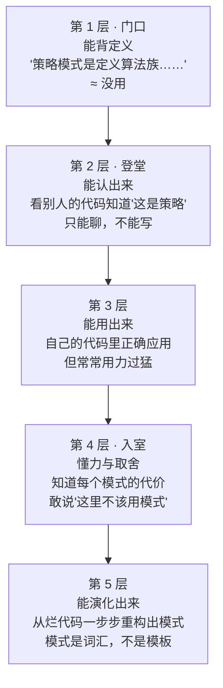
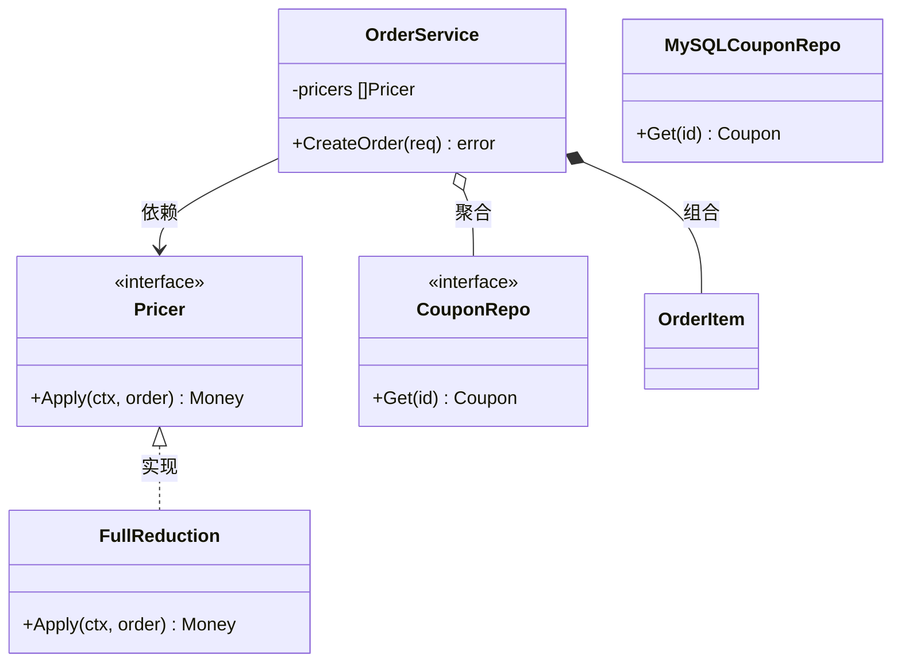
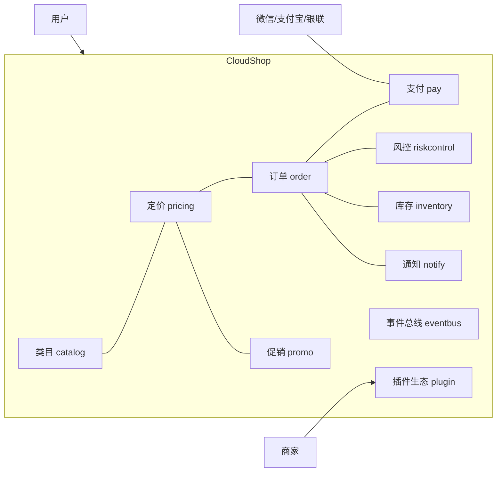

你大概经历过这样一个晚上。

运营提了个需求："把会员折扣挪到优惠券后面计算，另外加一种新促销，第二件 1 元。"你打开 `OrderService.go`，三千行，定价逻辑埋在第 1400 行的一个三层嵌套 if-else 里。你改了 4 处，自测通过，上线。

大促当晚，客服电话被打爆： platinum 会员用券后的价格算错了，资损六位数。

复盘时你盯着那段 if-else 想重构，但无从下手——改任何一处都可能引发另一处资损。最后你在这个函数上加了条注释：`// 别动这里，动了会出事`。

从这一刻起，代码开始腐烂。

## 大多数人学模式的姿势，从第一步就错了

出事之后，你决定学设计模式。你打开一篇教程，看到"策略模式：定义算法族，分别封装起来，让它们之间可以互相替换"，配一个鸭子叫叫的例子。你背了 23 种定义，做了笔记。

三个月后，你遇到了那个三层嵌套 if-else，还是不知道怎么办。

这不是你的问题，是教学的问题。几乎所有模式教程都犯了同一个错：**先给答案，再给问题**。上来就是一张完美的 UML 类图和标准定义，但你不疼，所以那些结构挂不住。三天后你只记得"鸭子会飞"。

Reddit 上有个高赞帖子，标题是[《学设计模式学到崩溃》](https://www.reddit.com/r/developersIndia/comments/1mfydex/frustrated_with_learning_all_of_the_design/)，一万多条回复都在说同一件事：背是背下来了，用不会。

Martin Fowler 写过一篇[《Writing Software Patterns》](https://www.martinfowler.com/articles/writingPatterns.html)，里面有句话点破了本质：模式描述的是**情境中的力（forces）和取舍**，不是一步步照抄的菜谱。你没感受过那个"力"，就永远只是在抄菜谱。

所以这个系列的教法反过来：**先疼，再重构，后命名**。每一篇都从一段你自己写过的烂代码开始，小步重构，直到模式自己浮出来——那一刻你重新发明了它，命名只是给它发身份证。这是 Joshua Kerievsky 在《Refactoring to Patterns》里的路线，也是被验证过最有效的学法。

## 登堂入室：五个层次，你要爬到第几层

"学会设计模式"这个词太糊了。拆开看，它至少有五层：



多数教程只送到第 2 层。面试考的也是第 2 层。但让你在大促当晚不资损的，是第 4 层；让你敢重构那段"别动这里"的，是第 5 层。

这个系列的目标是把你送到 4 和 5。判断标准很具体：**认出模式是入场券，知道什么时候不用才是手艺**。

## SOLID：五条原则，五种疼

后面每一篇都会用到 SOLID 这个词，但它同样不能靠背。每条原则都对应 CloudShop 里一种真实的疼——你先疼，原则才有意义。

### S · 单一职责：一个 OrderService，四个改它的理由

```go
// CloudShop v0：这个函数同时管计价、库存、短信、风控
func (s *OrderService) CreateOrder(req CreateOrderReq) error {
    price := s.calcPrice(req)          // 计价
    s.deductInventory(req.Items)       // 库存
    s.checkRisk(req.UserId, price)     // 风控
    s.sendSMS(req.UserId, "下单成功")   // 短信
    // …
}
```

疼在哪？运营改定价规则、仓促改库存策略、风控加规则、短信改文案——**四个团队，四个改它的理由**，都在 git blame 里撞车。一个模块改它的理由超过一个，它就在替四个东西背锅。

### O · 开闭原则：加一种促销，改十二个文件

CloudShop 加"N 元购"促销那天，你在 `calcPrice`、`refund`、`report`、`settle`……十二处 if-else 里各加了一个 case，其中两处漏了。对扩展开放、对修改关闭的意思是：**加新类型时，应该是加代码，而不是改一圈旧代码**。改旧代码每多一处，漏一处的概率就翻一倍。

### L · 里氏替换：虚拟商品订单，把"发货"覆写成空

```go
type PhysicalOrder struct{ base }
func (o *PhysicalOrder) Ship() error { /* 联系物流 */ }

type VirtualOrder struct{ base }
func (o *VirtualOrder) Ship() error { return nil } // 虚拟商品不发货，先空着？
```

调用方拿到 `[]Order` 逐个 `Ship()`，虚拟单"成功"了但什么都没发生，物流对账炸了。子类必须能无痛替换父类出现的地方——**覆写不是让你毁约的**。这是继承最大的暗坑，后面桥接、组合几篇会反复回到它。

### I · 接口隔离：退款模块被迫实现"发货"

v0 有个巨型接口 `TradingService`，二十多个方法。退款团队只想用其中三个，却被迫"实现"剩下二十个——包括他们根本不该碰的 `ShipGoods`。**依赖你用不到的东西，本身就是负担**。Go 的小接口哲学（`io.Reader` 只有一个方法）是这个原则的极致。

### D · 依赖倒置：想写个单测，先起个 MySQL

```go
func NewOrderService() *OrderService {
    return &OrderService{
        repo: NewMySQLOrderRepo("prod-db:3306"), // 直接 new，写死
    }
}
```

`OrderService` 依赖的是具体的 MySQL 仓库，想测"券叠加顺序算错"这种纯逻辑，得先起个真库灌数据。依赖倒置说：**高层策略不该依赖底层细节，两边都依赖抽象**。测试跑不快、跑不起来的团队，多半疼在这里。

五条原则，五种疼。记住疼，比记住原则的名字有用。

## 五分钟读懂 UML 类图

后面每篇都有类图，先把符号语言学会。一张图认全：



翻译成 Go 的世界：

| UML | 图上长什么样 | 在 Go 里是 |
|---|---|---|
| 实现 | 虚线空心三角 `<\|..` | struct 满足了 interface（隐式，没有 implements 关键字） |
| 依赖 | 虚线箭头 `..>` | 函数参数/局部变量用到它 |
| 聚合 | 空心菱形 `o--` | 结构体持有指针，生命周期各管各的 |
| 组合 | 实心菱形 `*--` | 结构体持有值，生命周期一起的 |
| 继承 | 实线空心三角 `--\|>` | **Go 没有**。用组合+接口替代，这是下一篇起最大的思维转换 |

类图上的 `+` 公开、`-` 私有。够了，这五分钟够你看懂全系列。

## 用 Go 学模式，先拆掉 Java 的旧习惯

这个系列的代码用 Go。但有个坏消息：**照搬 Java 的模式姿势写 Go，会写出四不像**。社区有篇流传很广的文章[*Stop Writing Go Like It's Java*](https://dev.to/gabrielanhaia/stop-writing-go-like-its-java-5-patterns-you-need-to-unlearn-4l2a)，列了要忘掉的 Java 习惯。先给你四个预警：

**一，Go 没有继承。** 一半以上的 GoF 模式靠继承搭骨架（模板方法、工厂方法的原版），Go 里全部要改用"接口 + 组合"。形状不同，灵魂相同——每篇会讲 Go 版长什么样。

**二，接口是隐式满足的。** Java 需要适配器模式抹平接口差异，Go 里很多时候"定义一个双方都满足的小接口"就完了。有些模式在 Go 里直接消失了，这不是损失，是语言替你干了。

**三，小接口定义在消费侧。** 别像 Java 那样先造一个大 `IPricer` 接口再找实现——Go 的惯例是谁用谁定义，接口通常一两个方法（`Effective Go` 原话：*The bigger the interface, the weaker the abstraction*）。

**四，Rob Pike 的告诫**：a little copying is better than a little dependency（一点点复制好过一点点依赖）。不是所有场景都值得上模式。什么时候"复制算了"比"抽象一下"好，收官篇专门讲。

## CloudShop 开业

空讲原则没用，这个系列会一直泡在一个业务系统里。

**CloudShop**：一个虚构的中型电商平台。平台 + 商家入驻，实物商品为主，带虚拟商品和服务类商品。微信、支付宝、银联三家支付。促销体系有满减、折扣、N 元购、券、红包，可叠加。日订单五十万，大促峰值一小时二十万单——这个体量下，任何设计失误都会真实地疼。



它的起点是大多数人真实的样子：一个跑得起来但不敢动的单体，`OrderService` 三千行，定价 if-else 三层嵌套，订单状态二十个分支。全系列二十四篇，就是把这个系统一步步造好——**每篇解决 CloudShop 的一个真实痛点，模式是重构的副产品**。

读到后面你会发现，CloudShop 的插件生态（商家在交易节点上挂自己的逻辑）正好就是你自己产品里"扩展点"该有的样子。业务是虚构的，疼是真的。

## 系列地图

按"你遇到什么疼"组织，四个部分从手边痛点到架构痛点递进：

| # | 你遇到的疼 | 模式 | CloudShop 现场 |
|---|---|---|---|
| 1 | if-else 切定价算法 | 策略 | 运营一天改三次促销规则 |
| 2 | 构造参数爆炸 | 建造者 + Functional Options | 商品/报表构建 |
| 3 | 全局只要一个 | 单例 | 连接池与它的争议 |
| 4 | switch 造对象 | 工厂方法 | 实物/虚拟/服务三类订单 |
| 5 | 加功能不想继承爆炸 | 装饰器 | 会员价套红包套优惠券 |
| 6 | 接口对不上 | 适配器 | 三家支付三张皮 |
| 7 | 子系统一团乱 | 外观 | 一键下单聚合五步 |
| 8 | 两维组合爆炸 | 桥接 | 通知渠道×类型 |
| 9 | 树形结构统一处理 | 组合 | 类目树/权限树 |
| 10 | 控制访问 | 代理 | 大字段懒加载/鉴权 |
| 11 | 冷门三连 | 享元/抽象工厂/原型 | SKU 属性池等 |
| 12 | 状态变了要广播 | 观察者 | 支付成功联动四模块 |
| 13 | 请求要变成对象 | 命令 | 撤销/重做/操作流水 |
| 14 | 行为随状态变 | 状态机 | 订单二十个 if-else 之死 |
| 15 | 骨架固定细节可变 | 模板方法 | 支付流程四步骨架 |
| 16 | 一环扣一环 | 责任链 | 风控规则链 |
| 17 | 冷门五连 | 中介者/备忘录/迭代器/解释器/访问者 | 促销 DSL、价格快照等 |
| 18 | 依赖到处 new | 依赖注入 | 测试替身自由 |
| 19 | 流程串成流水线 | Pipeline | 订单处理管线 |
| 20 | 组件怎么找到彼此 | 注册表 | 支付渠道注册 |
| 21 | 数据访问解耦 | Repository | 订单/商品仓储 |
| 22 | 不改源码扩展 | Hooks/Plugin | 商家插件生态 |
| 23 | 模块间广播 | 事件总线 | 下单事件八处订阅 |
| 24 | 模式的代价 | 收官 | 过度设计与模式瘾 |

金融对账、认证权限、ERP 审批会在更贴合的篇章客串——备忘录那篇是价格快照与审计，访问者那篇是财务/运营/客服看同一笔账的三个视图。

## 这个系列怎么读

每篇都是同一个骨架，冲着"真有收获"设计：

1. **痛点代码**——CloudShop 的 v0 版，先疼
2. **小步重构**——v1、v2，每步讲清解决了什么、又暴露了什么
3. **模式浮现**——结构自己长成了那个形状，"我们重新发明了它"
4. **命名**——此刻才给正式定义，因为它已经挂得住
5. **Go 最小实现** + **"你天天在用"**（Go 标准库同款，比如 io.Reader 就是装饰器）
6. **业务实战**、**好处与代价**、**什么时候不要用**、**易混淆对比**
7. **自测**——检验你到没到第 4 层

三条学习建议。代码自己敲一遍，别只看——手指的记忆比眼睛牢。自测先做再看答案，做错的那道第二天重做。每篇读完隔一周回看一遍要点，能复述出"什么时候不用它"，才算过。

模式不是 23 个答案，是 23 类疼痛的名字。下一篇，从 CloudShop 那个三层嵌套的定价 if-else 开始：运营又提需求了。

---

**参考来源**

- Martin Fowler, *Writing Software Patterns* — 模式是力与权衡，不是菜谱
- Joshua Kerievsky, *Refactoring to Patterns* — 先疼再重构后命名路线的出处
- Jeff Atwood, *Rethinking Design Patterns*（Coding Horror）
- *Stop Writing Go Like It's Java*（Dev.to）
- *Effective Go*（Go 官方）
- 王争，《设计模式之美》（极客时间）— 面向对象→原则→模式→规范→重构的体系顺序
- Refactoring.guru — 结构参考
