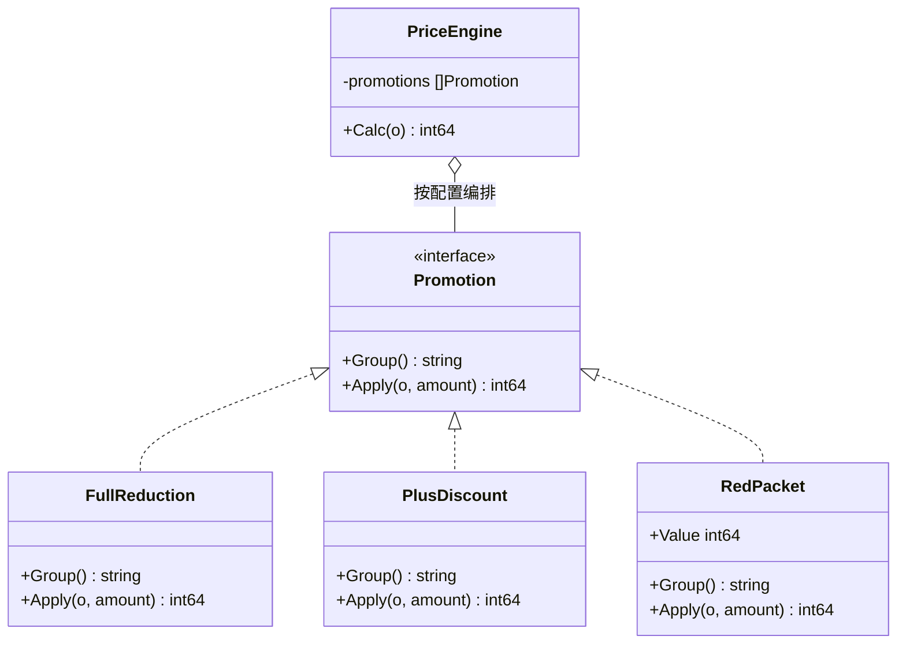
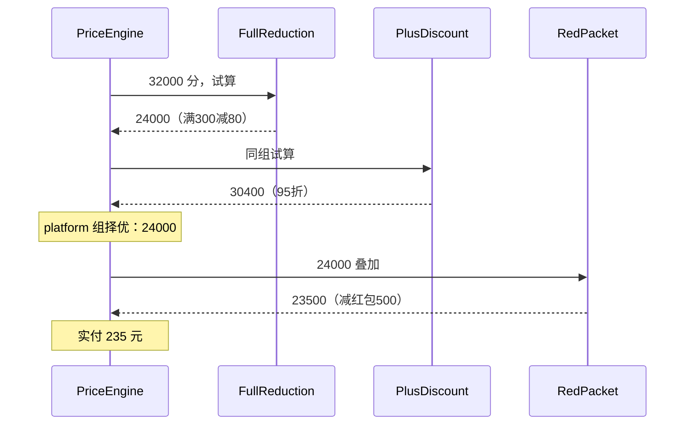

接[第 0 篇](/posts/design-patterns-0-开篇/)的现场。CloudShop——这个系列从头用到尾的虚构电商——运营的需求单躺在桌上：

> 双 12 大促：满 300 减 80、满 100 减 20；PLUS 会员全场 95 折；但**满减和会员折扣互斥择优**——哪个对用户更便宜走哪个；红包不受影响，照常叠加。

互斥择优不是运营刁难。阿里的店铺优惠系统就为同一件事发过[升级公告](https://developer.alibaba.com/support/announcementDetail.htm?source=search&id=25828)：从"叠加"（满 200 减 10 的券 + 满 2 件 9 折同时生效）升级为"互斥择优"。[促销系统的产品分析](https://www.woshipm.com/pd/4877172.html)把互斥规则称为促销系统的核心难点。

行业级的难点，落到每家电商头上，都会砸在同一个地方：那个把所有优惠算成最终实付价的函数。CloudShop 里这个函数叫 `calcPrice`——满减、会员折扣、券、红包全在里面按写死的顺序层层相减，谁跟谁互斥的判断也糊在里面。运营的这张需求单，考验的就是这几十行代码。

## v0：那段所有人都写过的代码

```go
// pricing/calc.go —— CloudShop v0
func (s *OrderService) calcPrice(o *Order) int64 {
	amount := o.BaseAmount

	// 满减
	if s.promoCfg.FullReductionOn {
		switch {
		case amount >= 30000:
			amount -= 8000
		case amount >= 10000:
			amount -= 2000
		}
	}

	// PLUS 会员 95 折（产品说：和满减互斥，择优）
	if o.UserLevel == LevelPlus {
		withVip := o.BaseAmount * 95 / 100 // 拿原价重新算，绕开已减的满减
		if withVip < amount {
			amount = withVip
		}
	}

	// 优惠券
	if o.Coupon != nil && amount >= o.Coupon.Threshold {
		amount -= o.Coupon.Discount
	}

	// 红包
	if o.RedPacket > 0 {
		amount -= o.RedPacket
	}

	return amount
}
```

这段代码能跑，但三件事焊死在了一起：**每种促销怎么算**、**谁跟谁互斥**、**按什么顺序叠**。逐条看它怎么疼：

- 运营要把"会员折扣"挪到"券"后面——改编排顺序，动函数体中部
- 运营要把满减和会员从互斥改成叠加——动那段 `withVip` 的 hack
- 新增"N 元购"——在函数中部插一段 if，插在哪、和谁互斥，全靠读代码的人现场推理
- 第 0 篇说过的开闭原则违反在这里具象化了：**每一类规则变化都要剖开同一个函数**

互斥逻辑那个 `withVip` 尤其危险：它拿原价重新算了一遍会员折扣，再和满减结果比大小。这个技巧只对"两组互斥"成立，第三种平台优惠加进来时它就是埋好的雷。

## v1：先让每个算法可读

第一刀不引任何模式，只做最老实的重构：把每个促销的算法提成独立函数。

```go
func applyFullReduction(amount int64) int64 {
	switch {
	case amount >= 30000:
		return amount - 8000
	case amount >= 10000:
		return amount - 2000
	}
	return amount
}

func applyPlusDiscount(o *Order, amount int64) int64 {
	if o.UserLevel != LevelPlus {
		return amount
	}
	return amount * 95 / 100
}

func applyCoupon(o *Order, amount int64) int64 {
	if o.Coupon != nil && amount >= o.Coupon.Threshold {
		return amount - o.Coupon.Discount
	}
	return amount
}
```

`calcPrice` 的函数体变成了"调用 + 编排"。每个算法现在可以独立单测了，这是实打实的收益。

但编排还是一坨 if：互斥靠 `withVip` hack，顺序靠代码行先后。而且注意一个细节——三个函数的**签名渐渐长得一样了**：都是 `(订单相关, 金额) → 金额`。这个细节是下一步的全部线索。

## v2：签名统一之后，接口自己浮出来

既然每个促销都是"订单进、价格出"，把签名统一，再补上编排真正需要的信息——互斥组：

```go
// Promotion 一种促销 = 一个可替换的定价算法
type Promotion interface {
	Group() string                        // 互斥组：同组择优，跨组叠加
	Apply(o *Order, amount int64) int64   // 算法本体
}

type FullReduction struct{}

func (FullReduction) Group() string { return "platform" }
func (FullReduction) Apply(_ *Order, amount int64) int64 { /* 满减逻辑 */ }

type PlusDiscount struct{}

func (PlusDiscount) Group() string { return "platform" } // 与满减同组 → 互斥择优
func (PlusDiscount) Apply(o *Order, amount int64) int64 { /* 会员折扣 */ }

type RedPacket struct{ Value int64 }

func (RedPacket) Group() string { return "redpacket" } // 独立组 → 叠加
func (r RedPacket) Apply(_ *Order, amount int64) int64 { return amount - r.Value }
```

`calcPrice` 退化成一个只懂编排、不懂任何具体促销的引擎：

```go
type PriceEngine struct {
	promotions []Promotion // 顺序来自运营配置
}

func (e *PriceEngine) Calc(o *Order) int64 {
	// 按配置顺序分 组；同组全部试算，取对用户最优；跨组按序叠加
	groups, order := groupBy(e.promotions)
	amount := o.BaseAmount
	for _, g := range order {
		best := amount
		for _, p := range groups[g] {
			if v := p.Apply(o, amount); v < best {
				best = v
			}
		}
		amount = best
	}
	if amount < 0 {
		return 0
	}
	return amount
}
```

对照需求单逐条验收：互斥择优 = 同组试算取最小；顺序 = 切片顺序，来自配置；加新促销 = 新文件实现 `Promotion`，引擎一行不改。

## 命名时刻

这个形状有名字了。**策略模式：定义一组算法，将每个算法封装成独立对象，使它们可以互相替换**。GoF 的原始意图落在"力"上：调用方需要某种行为，但具体做法有多种且会变化——把"做法"从调用方剥离出去各自封装。

在 CloudShop 里：每种促销是一个策略，定价引擎是策略的编排者。策略模式把"用哪种算法"和"算法怎么写"拆开，让两边各自变化。



运行过程分步看（PLUS 会员，原价 320 元，红包 5 元）：



## 可运行的最小实现

完整代码，`go run` 直接跑：

```go
package main

import "fmt"

type Order struct {
	UserLevel  string // BRONZE / PLUS
	BaseAmount int64  // 单位：分
}

type Promotion interface {
	Group() string
	Apply(o *Order, amount int64) int64
}

type FullReduction struct{}

func (FullReduction) Group() string { return "platform" }
func (FullReduction) Apply(_ *Order, amount int64) int64 {
	switch {
	case amount >= 30000:
		return amount - 8000
	case amount >= 10000:
		return amount - 2000
	}
	return amount
}

type PlusDiscount struct{}

func (PlusDiscount) Group() string { return "platform" }
func (PlusDiscount) Apply(o *Order, amount int64) int64 {
	if o.UserLevel != "PLUS" {
		return amount
	}
	return amount * 95 / 100
}

type RedPacket struct{ Value int64 }

func (RedPacket) Group() string                  { return "redpacket" }
func (r RedPacket) Apply(_ *Order, a int64) int64 { return a - r.Value }

type PriceEngine struct{ promotions []Promotion }

func (e *PriceEngine) Calc(o *Order) int64 {
	groups := map[string][]Promotion{}
	var order []string
	for _, p := range e.promotions {
		if _, ok := groups[p.Group()]; !ok {
			order = append(order, p.Group())
		}
		groups[p.Group()] = append(groups[p.Group()], p)
	}
	amount := o.BaseAmount
	for _, g := range order {
		best := amount
		for _, p := range groups[g] {
			if v := p.Apply(o, amount); v < best {
				best = v
			}
		}
		amount = best
	}
	if amount < 0 {
		return 0
	}
	return amount
}

func main() {
	engine := &PriceEngine{promotions: []Promotion{
		FullReduction{}, PlusDiscount{}, RedPacket{Value: 500},
	}}
	o := &Order{UserLevel: "PLUS", BaseAmount: 32000}
	fmt.Printf("PLUS 会员 320 元订单，实付 %d 分\n", engine.Calc(o))
	// 输出：实付 23500 分（满减 240 vs 95折 304 择优 240，再叠 5 元红包）
}
```

## 标准库里的落地

策略模式不是需要"引入"的东西，标准库里到处是它：

**`sort.Slice` 的 less 参数。** 排序骨架固定，比较规则由调用方注入——`less` 函数就是一个比较策略。按价格排、按销量排，换的是策略，不是排序本身。

```go
sort.Slice(products, func(i, j int) bool {
	return products[i].Sales > products[j].Sales // 换成 Price 就是另一个策略
})
```

**`http.RoundTripper`。** `http.Client` 的传输层是一个接口，`DefaultTransport` 是默认策略；换实现不换 `Client`：

```go
// net/http —— 标准库原文
type RoundTripper interface {
	RoundTrip(*Request) (*Response, error)
}
```

要加重试、代理、Mock 测试，换一个 `RoundTripper` 实现，`Client` 的代码不动。测试里用 `httptest.Server` 配自定义 transport 替掉真实网络，换的正是这个策略。

两个值得记下的设计细节。**其一，无状态策略可以安全复用**：`FullReduction` 这类不携带字段的策略是只读的，做成包级变量全局共享即可，并发调用没有问题——这接上[第 3 篇单例](/posts/design-patterns-3-单例/)的结论：策略对象是"不可变单例"的天然候选，`http.DefaultTransport` 本身就是一个全局共享的策略实例。**其二，策略的粒度由调用方接口决定**：`sort.Slice` 只需要"比较"这一个动作，策略就是一个函数；CloudShop 的促销需要"算价 + 报互斥组"两个动作，策略才升级为接口。从调用方需要的最小接口反推策略形状，而不是先设计一个"完整"接口再找地方用。

## 业务实战：真实大厂的策略落地

美团的"邀请下单"返奖是策略模式在营销业务里的公开样本（[《设计模式在外卖营销业务中的实践》](https://tech.meituan.com/2020/03/19/Software-design-pattern-practice-in-marketing.html)）。业务本身不复杂：用户 A 邀请用户 B，B 完成下单后，平台给 A 一笔现金奖励。复杂的是"给多少"：新用户有普通奖励（固定金额）和梯度奖励（邀请人数越多奖得越多）两种方案；老用户按用户属性套不同的返奖机制——原文的说法是"为了评估不同的邀新效果，老用户返奖会存在多种返奖机制"。这类策略随运营实验增增减减，美团在文中给营销业务下过一个判断：需求"随着市场、用户、环境的变化而多变"，和交易这类稳定业务不同，天生需要易扩展的系统。

他们的落地结构和 CloudShop 的引擎同构，多出来的一个细节正好补齐本篇没讲的角落。抽象层是一个抽象类 `RewardStrategy`：

```java
// 按美团原文结构复原（注释为原文注释，实现体略）
public abstract class RewardStrategy {
    public abstract void reward(long userId);                        // 各策略自己的计算
    public void insertRewardAndSettlement(long userId, int reward) { // 更新用户信息以及结算
        // 公共逻辑：所有奖励都一样
    }
}
```

值得咀嚼的是第二个方法不是 abstract：**"算多少钱"开放给子类，"入账 + 通知结算服务"作为公共步骤下沉到基类**——原文的理由是"这两个模块对于所有的奖励来说都是一样的"。这个"公共步骤上提、可变步骤下放"的形状，原文没有给它命名，但它正是[第 15 篇](/posts/design-patterns-15-模板方法/)模板方法的核心动作——策略和模板在这一个类里握手：变的做成抽象方法，不变的沉到基类。

执行链路：主流程 `InviteRewardImpl.sendReward` 查出被邀请人、按用户类型选定策略类，交给工厂实例化，再包进 `RewardContext`，由它的 `doStrategy` 依次执行"算金额 → 入账 → 结算"。选择和执行分开，策略本身只懂计算；"从类到对象"这一步交给了谁，是[第 4 篇](/posts/design-patterns-4-工厂方法/)的正题。

CloudShop 这边的落地形态：促销策略表存数据库（类型、参数、互斥组、优先级），运营在后台配置，启动时加载成 `[]Promotion`。和美团"加一种返奖 = 实现一个 `RewardStrategy`"同理——运营"一天改三次规则"改的是数据，不是代码。

## 好处与代价

| 好处 | 代价 |
|---|---|
| 加促销零改动引擎（开闭） | 类型数量膨胀：4 种促销 = 4 个文件 |
| 每个策略独立单测，引擎只测编排 | "总有一个 if 在某处"：策略怎么被选中，仍需工厂或注册表 |
| 顺序、互斥从代码升级为配置 | 读代码多一层间接：从引擎跳到具体策略要经过接口 |
| 互斥逻辑从 hack 变成组的语义 | 接口设计要克制：今天只有 `Group` 和 `Apply`，别预埋用不上的方法 |

## 什么时候不要用

- **只有一种算法，且看不到第二种**。直接写函数。为想象中的变化建抽象，是最常见的过度设计。
- **分支是流程步骤而不是平行选择**。先做 A 再做 B 再做 C，那是流程编排，该看[模板方法](/posts/design-patterns-15-模板方法/)（第 15 篇）或责任链（第 16 篇），不是策略。
- **两三个分支且稳定**。裸 switch 或 `map[string]func` 就够，直白、好跳转。策略模式的价值在"经常加"，不在"分支多"。

Go 还有一条特色判断：**单方法策略可以直接用函数类型**。`type ApplyFunc func(*Order, int64) int64` 就够了，不必上接口——直到策略需要多个方法（比如这里的 `Group` + `Apply`）或需要携带状态，接口才成为正当形态。

## 易混淆：策略 vs 状态

结构图几乎一样（接口 + 多实现 + 持有者），差别在**谁驱动切换**：

- 策略：调用方在**入口处选一个**，运行期间通常不换——CloudShop 每单开始时按配置组装促销列表
- 状态：对象**按事件自己流转**，同一对象在不同时刻行为不同——订单从"已支付"流到"已发货"

一个静态选择，一个动态流转。状态模式在第 14 篇拿订单状态机细讲，到时候回头看这条区分会更清楚。

## 自测

1. 需求从"满减与会员互斥"改成"三者互斥：满减、会员、N 元购"，在 v2 的实现里要改哪些代码？如果答案涉及改 `PriceEngine`，说明哪里设计错了。
2. `sort.Slice` 的 `less` 参数为什么算策略模式？调用方、策略接口、具体策略分别对应什么？
3. 什么情况下裸 switch 优于策略模式？给出一个 CloudShop 里的具体例子。
4. v0 的 `withVip` hack 为什么只在"两组互斥"时成立？三组时它会错在哪？

---

**参考来源**

- GoF, *Design Patterns* — 策略模式原始定义与意图
- Refactoring.guru, [Strategy Pattern](https://refactoring.guru/design-patterns/strategy)
- 阿里巴巴，《店铺优惠叠加规则升级公告》— 叠加升级为互斥择优的真实演进
- 《6000字看懂促销系统的底层逻辑》— 互斥规则是促销系统核心难点
- 美团技术团队，《设计模式在外卖营销业务中的实践》— 返奖策略分层的公开实现
