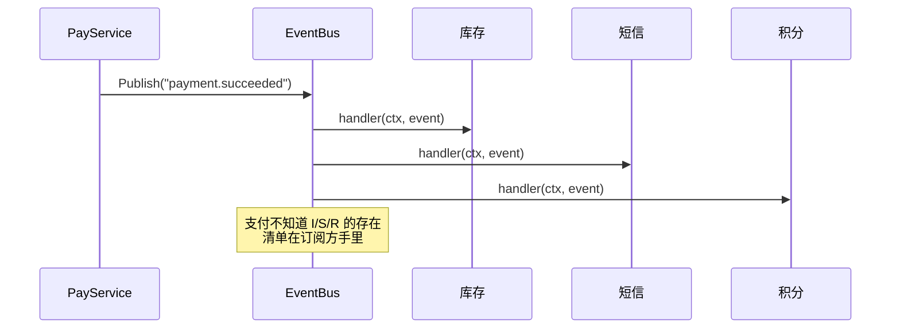

第三部分进入行为级痛点：**对象之间怎么通信**。第一个场景是交易系统的经典时刻——支付成功的那一秒。

要做的事：扣真实库存（之前只锁定）、发确认短信、给用户加积分、把订单推给风控做反查。将来还会有第五件、第六件。

## v0：支付代码认识全世界

```go
// pay/callback.go —— CloudShop v0
func (s *PayService) onPaid(ctx context.Context, order *Order) error {
	if err := s.inventory.Deduct(ctx, order); err != nil { // 库存
		return err
	}
	s.sms.Send(ctx, order.UserID, "支付成功")    // 短信
	s.points.Add(ctx, order.UserID, order.Amount/100) // 积分
	s.risk.PostCheck(ctx, order)                    // 风控
	return nil
}
```

四行代码看起来干净，问题藏在依赖方向里：**支付模块编译期依赖了库存、短信、积分、风控**。下个迭代推荐团队要接"已购商品进推荐池"，改动落在支付代码里；风控要下线，还是改支付代码。支付团队成了全公司需求的集散地——每加一个"关心支付成功"的模块，支付都要发版。这不是比喻，是[第 0 篇](/posts/design-patterns-0-开篇/)里"开闭原则"在团队维度的具象：**模块因不相关的理由被迫修改**。

更隐蔽的疼：v0 是同步串行的，短信网关抖 3 秒，整个支付回调链路就抖 3 秒——**支付成功的响应时间被最慢的旁观者绑架**。

## v1：事件列表，但清单还在支付手里

```go
type PaidHandler func(ctx context.Context, order *Order)

type PayService struct {
	paidHandlers []PaidHandler // 至少：加订阅者不改 onPaid 主体
}

func (s *PayService) onPaid(ctx context.Context, order *Order) {
	for _, h := range s.paidHandlers {
		h(ctx, order)
	}
}
```

循环替代了硬编码调用，加订阅者是 append 一行。但**清单本身仍然由支付的装配代码维护**：推荐团队要订阅，还是得来改支付模块的初始化。耦合从"调用"退到了"装配"，没有消失。

## v2：发布订阅，支付只管喊一嗓子

把清单从支付模块手里拿走，交给一个中立的公共设施：

```go
// eventbus/bus.go —— 进程内事件总线
type Bus struct {
	mu   sync.RWMutex
	subs map[string][]Handler
}

type Handler func(ctx context.Context, payload any)

func (b *Bus) Subscribe(topic string, h Handler) {
	b.mu.Lock()
	defer b.mu.Unlock()
	b.subs[topic] = append(b.subs[topic], h)
}

func (b *Bus) Publish(ctx context.Context, topic string, payload any) {
	b.mu.RLock()
	handlers := make([]Handler, len(b.subs[topic]))
	copy(handlers, b.subs[topic]) // 快照：发布过程中允许订阅变更
	b.mu.RUnlock()

	for _, h := range handlers {
		h(ctx, payload)
	}
}

// pay/callback.go —— 支付只认识事件总线
func (s *PayService) onPaid(ctx context.Context, order *Order) {
	s.bus.Publish(ctx, "payment.succeeded", PaidEvent{OrderID: order.ID, Amount: order.Amount})
}

// inventory/subscribe.go —— 每个模块自己注册自己
func init() { /* 或在装配处： */
	bus.Subscribe("payment.succeeded", func(ctx context.Context, p any) {
		e := p.(PaidEvent)
		inventory.Deduct(ctx, e.OrderID) // 库存自己知道自己关心支付
	})
}
```

推荐团队要订阅"支付成功"，在**自己的模块**里写 Subscribe，支付模块从此零改动。依赖箭头反转了：从"支付 → 全世界"变成"全世界 → 事件"。



## 命名时刻

**观察者模式：一方状态变化时，自动通知所有订阅者**。它回应的力：**事件源与响应方都应该对彼此无知**——源不知道谁在听，听者按需登记，双方各自演化。

但 v2 有两个生产级的坑必须现在补上，它们是观察者从 demo 到生产的距离：

**坑一：同步发布的连带崩塌。** v2 的 `Publish` 串行执行三个 handler，短信 handler 一个 panic，积分 handler 就不执行了，且 panic 沿栈向上冲垮支付回调。生产形态要隔离 + 异步：

```go
for _, h := range handlers {
	go func(h Handler) {
		defer func() { _ = recover() /* 记日志、告警 */ }() // 隔离：一个崩不塌全部
		h(ctx, payload)
	}(h)
}
```

异步换来隔离和响应速度，代价立刻到账：**顺序不再保证**（积分可能先于库存执行）、**进程崩了未执行的事件丢失**。顺序依赖（"积分必须等库存扣完"）和可靠性（"事件不能丢"）的终极解法在事件链与事务性发件箱（transactional outbox：事件与业务数据同事务落库，后台投递）——[第 23 篇](/posts/design-patterns-23-事件总线/)作为主角展开，这里先立牌示坑。

**坑二：订阅泄漏。** 闭包捕获了大对象（比如整个 `*Order`）又长期驻留在订阅表里，GC 永远收不走。长生命周期进程要有 Unsubscribe，测试代码更要记得清订阅——测试间共享的全局 bus 是幽灵 bug 温床。

### 事件 vs 命令：一对必须分清的近亲

"支付成功"是**事件**（事实广播，不关心谁听、听不听得成）；"调用库存扣减"是**命令**（要求对方做事，必须知道结果）。判断题：把"给用户加积分"发成命令合理（要确认加成功），把"支付成功"发成命令不合理（对谁下命令？）。分不清时事件总线会退化成散装 RPC——所有模块假装解耦，实际全是隐式调用。[第 13 篇](/posts/design-patterns-13-命令/)从命令那头把这条线接上。

## 标准库与真实工程里的落地

**`os/signal.Notify`——进程级的观察者。**

```go
ch := make(chan os.Signal, 1)
signal.Notify(ch, syscall.SIGINT, syscall.SIGTERM) // 订阅信号
go func() {
	<-ch // 收到通知
	shutdown()
}()
```

kernel 是发布者，Go runtime 是总线，程序是订阅者。注意它的 Go 特色：**订阅的载体是 channel 而非回调**——订阅方在自己的 goroutine 里等待，天然异步、天然隔离。channel 风格 vs 回调风格是 Go 观察者的两大门派（channel 解耦更彻底，回调更简单直接），CloudShop 的 bus 用回调是因为要扇出到多个订阅者，signal 场景单一订阅者用 channel 更顺。

**真实工程样本：pi 的 `session_before_compact` 钩子。** 上下文压缩系列调研过的开源 code agent [pi](https://github.com/badlogic/pi-mono)（`agent-session.ts` 的扩展系统）：压缩发生前发布事件，扩展订阅后可以**取消压缩、注入指令、甚至整体替换压缩逻辑**——观察者不仅旁观，还能影响发布方行为（带反馈的观察者变体）。这是观察者在真实工程里"长出权限层级"的样子：通知 → 建议 → 授权。

工业级远亲：Kubernetes 的 list-watch 机制（etcd 状态变更推给所有 informer）是把观察者推到分布式规模的标准答案，代价是一整套可靠性工程（重连、重同步、幂等）。

## 业务实战

CloudShop 的 eventbus 最终形态：事件目录成为正式文档（`docs/events.md` 列出全部 topic、载荷、订阅方）——**事件越多，"谁在听"越是全靠文档维护的暗知识**，这份文档是总线架构的配套卫生设施，代码给不了。目前八个订阅方挂在三个核心事件上（下单/支付/发货），其中"积分等库存"的顺序依赖用事件链解决：库存扣减完成后发布 `inventory.deducted`，积分订阅它而不是直接订阅支付——**顺序依赖显式化为事件链**，比隐式的 handler 注册顺序可审计得多。

## 好处与代价

| 好处 | 代价 |
|---|---|
| 源与响应方彻底解耦，各自独立发版 | 调用链不可见，排查全靠事件文档 |
| 加订阅方零改动源模块（开闭） | 异步后：顺序、可靠性、丢失都要另付工程 |
| 扇出天然支持（一次发布多方响应） | 订阅泄漏、测试间污染 |
| 事件目录成为系统行为的清单 | "事件"被滥用成散装 RPC 的伪装 |

## 什么时候不要用

- **订阅方一两个且稳定**：直接调用，别为两个听众搭舞台。
- **调用方需要结果**：事件没有返回值。要确认、要重试、要错误处理的是[命令](/posts/design-patterns-13-命令/)或 RPC。
- **强一致的因果链**："扣库存失败则整单回滚"是事务问题，事件总线的最终一致会让补偿逻辑翻倍（那是 Saga 的领域，[第 23 篇](/posts/design-patterns-23-事件总线/)展开）。
- **事件风暴的苗头**：全公司都订阅一切，等于什么都没解耦——每个事件都该有明确的业务命名（`payment.succeeded` 是事实，`please.add.points` 是命令伪装）。

## 易混淆

**观察者 vs 责任链**（[第 16 篇](/posts/design-patterns-16-责任链/)）：观察者**广播**（所有订阅者都被通知，互不相关）；责任链**串行裁决**（请求沿链传递，每环决定拦截还是放行）。

**观察者 vs [中介者](/posts/design-patterns-17-冷门五连/)（第 17 篇）**：观察者单向广播（源不认识听众）；中介者双向协调（同事通过它互相对话）。

**观察者 vs 发布订阅**：教科书区分是观察者=进程内直接引用、Pub/Sub=经中间件按主题路由。工程语境两者混用，CloudShop 的进程内 bus 自称事件总线也不算僭越——重要的是"谁持清单"这个结构问题，不是名字。

## 自测

1. v1（事件列表在支付手里）和 v2（总线）的依赖方向差在哪？"耦合从调用退到装配"具体指什么？
2. 异步 Publish 换来隔离和速度，列出让出的三样东西。哪一样在 CloudShop 用事件链补救，哪一样要等 outbox？
3. `signal.Notify` 为什么选 channel 而不是回调？CloudShop 的 bus 为什么反着选？
4. "please.add.points" 这个 topic 名暴露了什么问题？改成什么才算事件？

---

**参考来源**

- GoF, *Design Patterns* — 观察者原始定义
- `os/signal.Notify` 源码 — channel 风格订阅
- pi（badlogic/pi-mono）扩展系统 — 可反馈的观察者真实工程
- Kubernetes list-watch — 分布式观察者
