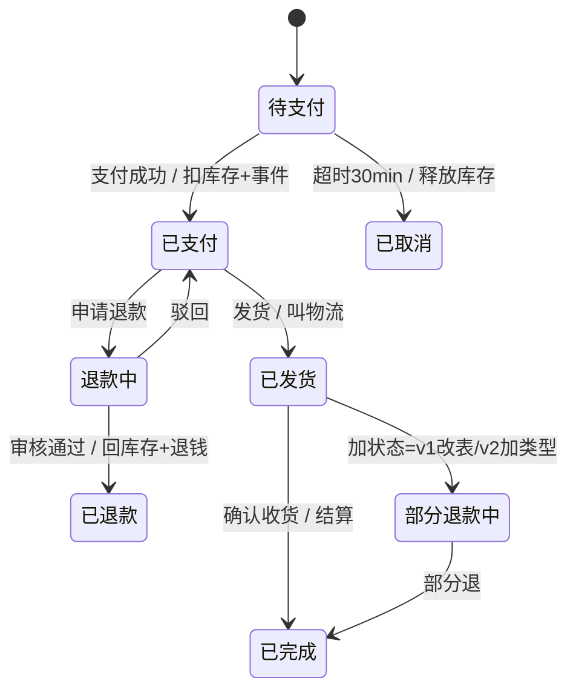

这是整个系列呼声最高的场景，设定集第一天就给它留好了位置。

先把业务摊开。一笔订单的一生，是买家和商家共同走过的一段旅程：买家拍下（待支付）→ 付款（已支付，从此商家负有发货义务、买家开始期待）→ 商家发货（已发货，货在路上）→ 确认收货（已完成，交易闭环）。每个状态背后是一份"双方此刻能做什么"的契约：待支付时买家能取消、商家不能发货；已支付后买家改不了收货地址，想反悔只能走退款。状态还是一堆定时规则的锚点：拍下 30 分钟不付款就自动取消、把锁住的库存还给其他买家——不设这条，热销商品的库存会被永远不付款的订单占着。旅程还有逆向：付了款没发货是退款，收到货不满意是退货退款，各自又是一条状态序列。

而且这是电商，订单不止一种：实物单有物流态，虚拟单的"发货"是发码，服务单的"发货"是预约工程师上门（[第 4 篇](/posts/design-patterns-4-工厂方法/)的老朋友）。状态多、转换多、每一步都带副作用——而所有这些"谁能到哪、到了干什么"，v0 全部糊在同一个函数里。CloudShop 的 `UpdateStatus`：

```go
// order/status.go —— CloudShop v0
func (s *Service) UpdateStatus(ctx context.Context, id int64, next Status) error {
	o, err := s.repo.Get(ctx, id)
	if err != nil {
		return err
	}

	// ── 第一坨：转换合法性（20 行）──
	switch o.Status {
	case StatusPendingPayment:
		if next != StatusPaid && next != StatusCancelled {
			return ErrInvalidTransition
		}
	case StatusPaid:
		if next != StatusShipped && next != StatusRefunding {
			return ErrInvalidTransition
		}
	case StatusShipped:
		if next != StatusCompleted && next != StatusReturning {
			return ErrInvalidTransition
		}
	case StatusRefunding:
		if next != StatusRefunded && next != StatusPaid {
			return ErrInvalidTransition
		}
	// ... 六种状态，每种一段
	}

	// ── 第二坨：副作用（40 行）──
	switch next {
	case StatusPaid:
		s.inventory.Deduct(ctx, o)   // 扣库存
		s.bus.Publish(ctx, "payment.succeeded", ...) // 事件（第 12 篇）
	case StatusShipped:
		s.logistics.Create(ctx, o)   // 叫物流
		s.notify.Shipped(ctx, o)
	case StatusRefunded:
		s.inventory.Return(ctx, o)   // 回库存
		s.pay.RefundBack(ctx, o)     // 原路退回
	case StatusCancelled:
		s.inventory.Release(ctx, o)  // 释放锁定
	// ...
	}

	return s.repo.UpdateStatus(ctx, id, next)
}
```

需求单上写着"支持部分退款"——要加一种状态 `PartRefunding`，还要允许"已发货 → 部分退款中"。v0 的两坨 switch **全体重新审视**：每段转换合法性都要过一遍，每个副作用分支都要想一遍。[高德的订单状态机引擎设计](https://developer.aliyun.com/article/783803)把这类系统的特征总结得很准：**状态多、链路长、逻辑复杂，多场景、多类型、多业务维度**——实物单有物流态、虚拟单没有、服务单有预约态，v0 想用一套 switch 糊住所有维度。

## v1：转换合法性先上表

第一坨 switch 的本质是**一张转换表**。那就让它真的是一张表：

```go
// order/transitions.go
var transitions = map[Status][]Status{
	StatusPendingPayment: {StatusPaid, StatusCancelled},
	StatusPaid:           {StatusShipped, StatusRefunding},
	StatusShipped:        {StatusCompleted, StatusReturning},
	StatusRefunding:      {StatusRefunded, StatusPaid}, // 驳回回到已支付
	StatusReturning:      {StatusRefunded},
	// 加"部分退款"：改两行数据
	StatusShipped:  append(transitions[StatusShipped], StatusPartRefunding),
}
```

合法性检查变成一次查表。**数据驱动替换代码分支**——加状态改表不改逻辑，第一坨 switch 之死。副作用那坨（v0 的第二坨）还活着，但已经能看出它也可以表驱动（`map[Status]func` 的副作用清单）。

v1 是个重要路标：**Go 里状态机经常停在 v1 就够了**。三个状态两种转换的场景，表 + 一个检查函数就是终点。

## v2：状态对象——当副作用重到值得发类型

副作用那坨的问题不是判断多，是**每个状态的行为不一样且都很重**（扣库存叫物流原路退款各成一摊）。让每个状态成为一个类型，把"我能去哪、进入我时做什么"还给状态自己：

```go
// order/states.go
type StateHandler interface {
	Allowed() []Status                    // 转换表（这个状态说了算）
	OnEnter(ctx context.Context, o *Order, deps Deps) error // 进入时的副作用
}

type paidState struct{}

func (paidState) Allowed() []Status { return []Status{StatusShipped, StatusRefunding} }
func (paidState) OnEnter(ctx context.Context, o *Order, d Deps) error {
	if err := d.Inventory.Deduct(ctx, o); err != nil {
		return err // 副作用失败 → 状态不变（事务语义）
	}
	d.Bus.Publish(ctx, "payment.succeeded", PaidEvent{OrderID: o.ID})
	return nil
}

type refundedState struct{}

func (refundedState) OnEnter(ctx context.Context, o *Order, d Deps) error {
	d.Inventory.Return(ctx, o)
	return d.Pay.RefundBack(ctx, o)
}

var stateHandlers = map[Status]StateHandler{
	StatusPaid:     paidState{},
	StatusRefunded: refundedState{},
	// ...
}

// UpdateStatus 退化成引擎，不再懂任何具体状态
func (s *Service) UpdateStatus(ctx context.Context, id int64, next Status) error {
	o, err := s.repo.Get(ctx, id)
	if err != nil {
		return err
	}
	h := stateHandlers[o.Status]
	if !contains(h.Allowed(), next) {
		return fmt.Errorf("%w: %s → %s", ErrInvalidTransition, o.Status, next)
	}
	if err := stateHandlers[next].OnEnter(ctx, o, s.deps); err != nil {
		return err // 副作用失败回滚，状态停留原地
	}
	return s.repo.UpdateStatus(ctx, id, next)
}
```

二十个 if-else 死了：`UpdateStatus` 剩五行引擎逻辑。加"部分退款" = 新建一个状态类型 + 表里挂两行，既有状态零改动。**每个状态的行为内聚在它的类型里**——读 `refundedState` 就读完退款会发生的一切。



## 命名时刻，与一场诚实的对比

**状态模式：对象行为随内部状态改变，状态切换由状态自己驱动**。[第 1 篇](/posts/design-patterns-1-策略模式/)埋的对比在这里兑现——两者结构同构，差别在**谁驱动**：

- 策略：**调用方在入口选一个**，运行期不换（每单开始时组装促销列表）
- 状态：**对象按事件自己流转**，同一订单在不同时刻行为不同（待支付→已支付→已发货）

一个静态选择、一个动态流转，CloudShop 的定价用策略、订单用状态，正好各站一边。

但比命名更重要的是 v1 和 v2 的**选择标准**，这是状态模式在 Go 里的真深度：

| 维度 | v1 表驱动 | v2 状态对象 |
|---|---|---|
| 转换规则 | 数据，可进 DB 给运营配 | 代码，类型系统背书 |
| 副作用 | 另挂 `map[Status]func` 副作用表 | 状态类型内聚 |
| 何时合适 | 状态多、转换密、副作用轻 | 副作用重、每状态逻辑成摊 |
| 极限形态 | 可热更新的规则引擎 | 每状态一个包的领域模型 |

这套 v0/v1/v2 的走法在王争《设计模式之美》里有个正式名字——**状态机实现三分法**，判据比上面那张表更锋利：**分支逻辑法**（本文 v0）简单状态机首选，直译状态图；**查表法**（v1）状态多、转换复杂、但动作简单时首选——他举的游戏（加减积分类动作）是典型；**状态模式**（v2）状态不多、转换简单、但**动作里的业务逻辑复杂**时首选——点名电商下单正是此列。一句话判据：复杂性在"转换"就查表，复杂性在"动作"就上状态类。CloudShop 的订单恰好落在"动作重"这一侧（扣库存、原路退款各成一摊），选 v2 的理由从此有了外部印证。

高德的"可编排状态机引擎"是 v1 推到极致（转换和副作用全部数据化、可运营配置）；再复杂的场景社区有成熟库（`looplab/fsm`、`qifeng/stateflow` 一类），自造引擎前先看库。**模式的价值不在"用了状态对象"，在"转换真理只有一份、藏在哪、谁能改"**。

### 并发补丁：谁按住了重复流转

状态机上生产必须回答：两个并发请求（用户点退款 + 系统超时取消）同时通过 v0/v1/v2 的检查怎么办？答案不在模式里，在存储层——**条件更新**：

```sql
UPDATE `order` SET status = 'REFUNDING', version = version + 1
WHERE id = ? AND status = 'PAID' AND version = ?  -- 只有一个请求能改成功
```

影响行数为 0 的那个请求，拿到的就是 `ErrInvalidTransition`。状态机的最后一道防线永远在数据库的条件更新上，这是所有真实订单系统的标配。

## 标准库与真实工程里的落地

**Go runtime 的 goroutine 状态**——每个 gopher 都见过的状态机：`_Grunnable`/`_Grunning`/`_Gwaiting`/`_Gsyscall`，channel 阻塞进 waiting、被唤醒回 runnable、拿到调度进 running。`gopark`/`goready` 就是它的转换函数。runtime 没有把它做成状态对象（性能禁区），转换以函数直接改 `g.status` 字段实现——**恰恰印证了"表/对象/裸字段"是按复杂度选档**，连标准库也不为三五种状态上类型。

**美团返奖状态机**（[《设计模式在外卖营销业务中的实践》](https://tech.meituan.com/2020/03/19/Software-design-pattern-practice-in-marketing.html)）——业务级真实样本：待校验 → 预返奖/不返奖 → 待返奖/失败 → 完成/待补偿，配延迟队列（T+N 天后才判断是否退款）。他们做了一个值得咀嚼的取舍：**因转换不复杂，没有为状态建独立类，而是"状态只管状态的事，流转由第三方类负责"**——这是 v1 和 v2 之间的务实站位，原文的判断依据（转换复杂度）正是本篇对比表的第一行。

## 业务实战

CloudShop 最终采用 **v2 为主、v1 为辅**的混合：主状态机用状态对象（副作用重、每状态一摊逻辑），但"允许的转换"仍以表的形式暴露给运营后台做可视化（画状态图的原料）。三个订单类型（实物/虚拟/服务）的差异用[第 8 篇](/posts/design-patterns-8-桥接/)的思路解：状态定义共享，"已发货"的 `OnEnter` 在虚拟单上被替换为发码逻辑——状态机是骨架，类型差异是装配。

## 好处与代价

| 好处 | 代价 |
|---|---|
| 转换真理唯一，加状态局部化 | 状态类数量与状态数线性 |
| 副作用内聚，状态即文档 | 比表驱动重（简单场景是过度设计） |
| 引擎（UpdateStatus）稳定可测 | 并发防线仍要自己建（条件更新） |
| 和状态图一一对应，可生成可视化 | 跨状态的查询（"所有卡在退款中的"）反而绕 |

## 什么时候不要用

- **两三个状态**：`bool`/enum + 两行检查，表都嫌重。
- **转换密但副作用轻**：v1 表驱动是终点，别为"模式完整"上对象。
- **"状态"其实是数据字段**：订单的金额、类目不是状态——状态是**影响行为分支**的离散量，不影响行为的字段放状态机里是自找复杂。
- **流程需要人工节点/持久等待数天**：那是工作流引擎（Temporal、状态机库）的领域，手写状态机管不了持久化和补偿。

## 易混淆

**状态 vs [策略](/posts/design-patterns-1-策略模式/)（第 1 篇）**：本篇主对比——静态选择 vs 动态流转，驱动者在谁手里。

**状态 vs [责任链](/posts/design-patterns-16-责任链/)（第 16 篇）**：状态机是"一个对象随时间换行为"；责任链是"一次请求过多个处理者"。审批流既是状态（草稿→审批中→通过）又是链（多级审批人依次裁决），两者正交组合。

**状态 vs [备忘录](/posts/design-patterns-17-冷门五连/)（第 17 篇）**：状态管"现在在哪、能去哪"；备忘录管"回到过去"。带"驳回重填"的审批流两者都要：状态机管流转，备忘录存表单历史版本。

## 自测

1. v0 的两坨 switch 各自的病是什么？v1 和 v2 分别治哪一坨？
2. "Go 里状态机经常停在 v1 就够了"——给出留 v1 的三个判据和升级 v2 的三个判据。
3. 美团"状态只管状态的事，流转由第三方类负责"对应 v1/v2 谱系的哪个位置？他们这样选的依据是什么？
4. 条件更新 `WHERE status = 'PAID'` 防住了什么并发场景？没有它，v2 的引擎在两个并发请求下会怎么错？

---

**参考来源**

- GoF, *Design Patterns* — 状态原始定义
- 高德，《通用可编排订单状态机引擎设计》— "状态多链路长多业务维度"
- 美团技术团队，《设计模式在外卖营销业务中的实践》— 返奖状态机与取舍
- Go runtime scheduler 相关文档/源码 — goroutine 状态
- 王争《设计模式之美》（状态篇）— 状态机三分法及判据（游戏查表、电商下单用状态模式）
