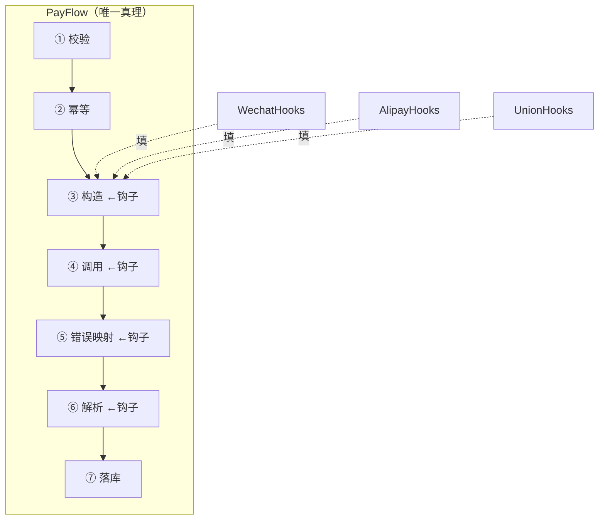

[第 6 篇](/posts/design-patterns-6-适配器/)把三家支付渠道的差异关进了适配器。但适配器只管"接口翻译"，还有一个更隐蔽的疼没治：**流程骨架的拷贝**。它藏得很深——三家渠道各自接完、各自跑通，谁也没觉得有问题，直到一次跨渠道的代码评审把三个文件并排放在了大屏上。

## v0：三份 90% 相同的支付流

适配器之后的代码长这样：

```go
// pay/wechat.go
func (a *WechatAdapter) Payflow(ctx context.Context, o *Order) (*PayResult, error) {
	if err := validateOrder(o); err != nil {          // ① 参数校验（三家一样）
		return nil, err
	}
	if err := a.checkIdempotent(ctx, o); err != nil { // ② 幂等检查（三家一样）
		return nil, err
	}
	req := a.buildRequest(o)                            // ③ 构造渠道请求（三家不同）
	resp, err := a.client.Call(ctx, req)                // ④ 调渠道（各家 SDK）
	if err != nil {
		return nil, a.mapError(err)                     // ⑤ 错误映射（三家不同）
	}
	result := a.parseResponse(resp)                     // ⑥ 解析响应（三家不同）
	a.saveRecord(ctx, o, result)                        // ⑦ 落库（三家一样）
	return result, nil
}

// pay/alipay.go —— 又一份
// ①②⑦ 一字不差抄过来，③④⑤⑥ 各自不同

// pay/union.go —— 再一份
```

①②⑦ 被抄了三份。某次安全评审要求"幂等检查要加防重放窗口"——改了微信的、支付宝的，银联那份在 reviewer 眼皮底下漏了。**骨架步骤的拷贝，和[第 4 篇](/posts/design-patterns-4-工厂方法/)三份 switch 是同一类病**：修改热点散落，漏一处是概率问题。这次漏的还是安全相关的步骤。

## v1：Java 直译的弯路——Go 没有继承

教科书答案"模板方法"长这样：抽象基类写好骨架（final 方法调用若干抽象钩子），子类填钩子。Go 没有继承，直接抄会写成嵌入模拟：

```go
type PayFlowBase struct{ /* 公共依赖 */ }

func (b *PayFlowBase) Payflow(ctx context.Context, o *Order, hooks ...) // 钩子从哪来？
```

嵌入给不了"子类必须实现钩子"的强制力——base 无法调用"派生类的方法"（Go 的方法解析没有虚函数表）。这条路在 Go 里天生残疾，硬写出来的是依赖倒置的扭捏形态。**放弃直译，回到力本身：骨架要单一真理，步骤可被替换。**

## v2：函数形态——骨架收参数

最小改动版：骨架是一个函数，差异步骤作为函数参数传入：

```go
// pay/flow.go —— 全系统唯一一份支付骨架
func PayFlow(
	ctx context.Context,
	o *Order,
	deps Deps,
	build func(*Order) any,                        // ③ 构造
	call func(context.Context, any) (any, error),  // ④ 调用
	parse func(any) *PayResult,                    // ⑥ 解析
	mapErr func(error) error,                      // ⑤ 错误映射
) (*PayResult, error) {
	if err := validateOrder(o); err != nil { // ①②⑦ 只存在这一份
		return nil, err
	}
	if err := checkIdempotent(ctx, deps, o); err != nil {
		return nil, err
	}
	resp, err := call(ctx, build(o))
	if err != nil {
		return nil, mapErr(err)
	}
	result := parse(resp)
	saveRecord(ctx, deps, o, result)
	return result, nil
}

// pay/wechat.go —— 三家各只剩自己的差异
func (a *WechatAdapter) Pay(ctx context.Context, o *Order) (*PayResult, error) {
	return PayFlow(ctx, o, a.deps, a.buildRequest, a.call, a.parse, a.mapError)
}
```

防重放窗口那次的需求改一处（`checkIdempotent`），三渠道同时生效。**骨架从"三份拷贝"变成"一个函数 + 三个参数组"**。

## v3：接口形态——当钩子多到参数列装不下

四个钩子参数已经是签名忍耐极限。渠道继续接入后钩子涨到六个（加签名、对账钩子），切换成接口形态——其实**读者已经见过它**：第 6 篇的 `Channel` 接口自然长成了钩子接口，`PayFlow` 成为引擎：

```go
type ChannelHooks interface {
	Build(o *Order) any
	Call(ctx context.Context, req any) (any, error)
	Parse(resp any) *PayResult
	MapError(err error) error
}

func PayFlow(ctx context.Context, o *Order, deps Deps, ch ChannelHooks) (*PayResult, error) {
	// ①②⑦ 骨架不变，④⑤⑥ 走接口
}
```

v2 和 v3 的选择标准：钩子 ≤3 个且无状态 → 函数；钩子多、带状态（渠道配置）或要多个流程复用同一钩子集 → 接口。

## 命名时刻

**模板方法：骨架固定，步骤的实现延迟到具体实现者**。它回应的力：**流程结构稳定且必须唯一，步骤实现多样**——和[策略](/posts/design-patterns-1-策略模式/)的边界在这里（[第 1 篇](/posts/design-patterns-1-策略模式/)埋的问题正式回收）：**整个算法可换是策略，算法的骨架锁死、只有步骤可换是模板**。CloudShop 定价的促销"整个可插拔"用策略，支付流程"七步锁死"用模板，一页之内两边都在。

Go 翻译的关键认知：Java 模板方法的核心机制是继承+虚方法，**Go 版本把"继承"翻译成了"依赖注入的钩子"**——力（骨架唯一+步骤开放）不变，形（类层次 → 函数/接口参数）全变。这是全系列"模式是力不是形"最典型的一例。



## 标准库里的落地

**`sort.Sort`——教科书级的接口形态模板。** 排序骨架（归并/快排的实现）在标准库里锁死，`sort.Interface` 的 `Len/Less/Swap` 三个钩子由数据填：

```go
type Interface interface {
	Len() int
	Less(i, j int) bool
	Swap(i, j int)
}
```

任何类型实现三钩子，立即获得整套排序算法——**骨架的价值（经过打磨的算法）一次性复用，步骤（怎么比较）由各数据类型自理**。对照之下 `sort.Slice` 是同一骨架的函数形态（`less` 单钩子），双形态并存的官方示范。

**`net/http` 的请求处理**：解析请求 → 路由 → 调用 Handler → 写响应，骨架在 `ServeMux`/`Server` 里锁死；`Handler` 是唯一的大钩子，全世界的 Go Web 框架都在填这一个钩子。（中间件链是在这个钩子外面再叠[装饰器](/posts/design-patterns-5-装饰器/)，三个模式在一条请求链上各司其职。）

**`testing` 框架**：`TestMain`（可选的Setup/Teardown 骨架）+ `t.Cleanup`（收尾钩子）+ 每个测试函数（步骤）——测试基建的骨架钩子结构。

## 业务实战

CloudShop 的第二个落点：**对账流程**（金融客串，[设定集](https://smilingwalker.github.io/posts/design-patterns-11-冷门三连/)里账务场景的延续）。每日对账骨架六步锁死：拉平台流水 → 拉渠道账单 → 逐笔核对 → 差异分类 → 生成报告 → 归档。三渠道的钩子只有"拉账单"和"解析格式"两处不同——模板方法落地后，新增渠道的对账接入从"抄六步"变成"填两钩"。

第三个落点带一个反面教训：曾把"用户通知"也做成钩子塞进支付骨架，结果短信挂了会阻塞支付。**钩子边界要沿着"骨架步骤是否必须成功"画**——支付七步是强一致链，通知不是。不该进骨架的进骨架，模板就从"复用结构"变成了"制造耦合"。

## 好处与代价

| 好处 | 代价 |
|---|---|
| 骨架唯一真理，骨架级需求改一处生效全部 | 骨架变更波及所有实现（这正是双刃剑的本体） |
| 新实现只填差异，接入成本断崖下降 | 钩子粒度是持续的设计判断（太少塞不下，太多碎片化） |
| 骨架与步骤可独立测试 | 函数形态的参数列表容易膨胀 |
| 和适配器天然配合（钩子接口=适配器接口的演化） | 调试时骨架↔钩子来回跳 |

## 什么时候不要用

- **流程只有一份实现**：直接写函数，模板为"第二份"而存在。
- **每个实现的步骤顺序都不同**：那是流程编排引擎/流水线（[第 19 篇](/posts/design-patterns-19-流水线/)）的场景——模板的前提恰恰是"骨架稳定"。
- **差异不是步骤级而是整段级**：用[策略](/posts/design-patterns-1-策略模式/)整体替换。
- **钩子被迫返回"跳过自己"的标志**：设计已变形——不是所有差异都该硬塞进一个骨架，拆两个骨架比一个骨架装满 if 干净。

## 易混淆

**模板 vs 策略**（回收第 1 篇伏笔）：骨架锁死换步骤=模板；整个算法可换=策略。检验问句："替换的是**一段**还是**整个**？"

**模板 vs [责任链](/posts/design-patterns-16-责任链/)（第 16 篇）**：模板的步骤顺序**编译期固定**；责任链的顺序**运行期可装配**、且每环可中断。支付七步不希望被运营改顺序 → 模板；风控规则的顺序要随大促调整 → 链。

**模板 vs [外观](/posts/design-patterns-7-外观/)（第 7 篇）**：外观收敛的是**调用方视角**（一键下单）；模板收敛的是**实现方视角**（渠道接入只写差异）。一个对上游负责，一个对下游负责。

## 自测

1. v0 漏改银联幂等检查的事故，和第 4 篇漏改退款 switch 的事故，为什么是同一类病？两个模式各自的"治法"有何不同？
2. v1（继承直译）在 Go 里残疾的根因是什么？v2/v3 分别用什么机制补上"钩子必须被实现"的强制力？
3. `sort.Sort` 是模板方法的接口形态：三个钩子分别对应排序算法里的什么可变点？`sort.Slice` 为什么退化成单钩子？
4. "钩子边界沿'骨架步骤是否必须成功'画"——用户通知塞进支付骨架的具体危害链是什么？

---

**参考来源**

- GoF, *Design Patterns* — 模板方法原始定义（继承形态）
- `sort.Interface`/`sort.Slice`、`net/http.Handler`、`testing` 源码 — Go 的钩子化模板
- Refactoring.guru, [Template Method](https://refactoring.guru/design-patterns/template-method)
