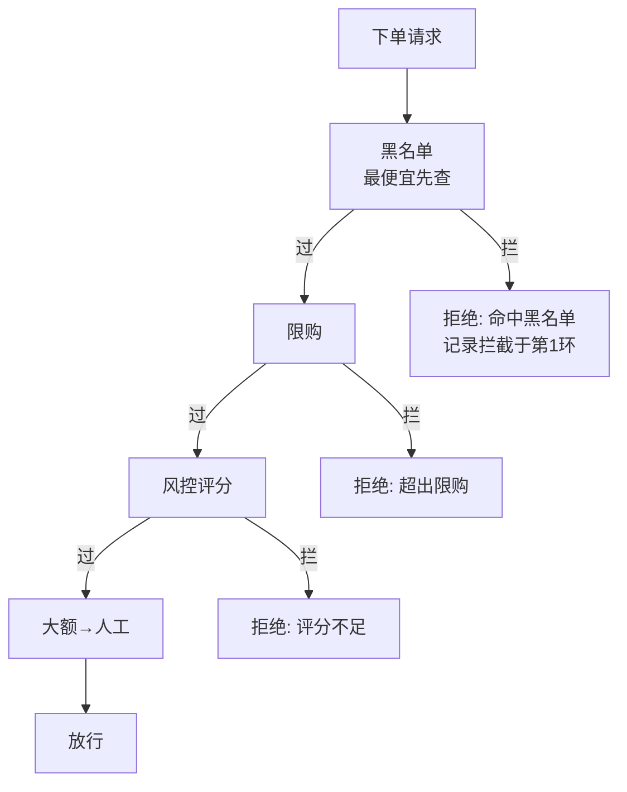

行为级痛点进入第二弹。这个模式有一条全系列最著名的"官司"要断：[第 5 篇](/posts/design-patterns-5-装饰器/)和[第 15 篇](/posts/design-patterns-15-模板方法/)都欠着它一笔辨析债。

CloudShop 下单前的风控检查：黑名单 → 限购校验 → 风控评分 → 大额转人工。

## v0：不断膨胀的单函数

```go
// riskcontrol/check.go —— CloudShop v0
func (s *Service) CheckRisk(ctx context.Context, o *Order) (bool, string, error) {
	if s.blacklist.Hit(o.UserID) { // 黑名单：最便宜的检查放最前
		return false, "命中黑名单", nil
	}
	if n := s.repo.CountPaid(o.UserID, o.SKU); n >= o.LimitPerUser {
		return false, "超出限购", nil
	}
	score, err := s.model.Score(ctx, o)
	if err != nil {
		return false, "", err
	}
	if score < s.cfg.Threshold {
		return false, "风控评分不足", nil
	}
	if o.Amount > 1000000 { // 大额转人工
		s.manual.Enqueue(o)
		return false, "转人工审核", nil
	}
	return true, "", nil
}
```

规则会增删：大促前风控说"临时下掉评分规则，黑名单后直接放"；新增"同 IP 聚集下单检测"。每次都是**剖开函数中部**，且规则的顺序调整（把便宜的检查放前面省成本）变成了搬代码。和[第 1 篇](/posts/design-patterns-1-策略模式/)的定价 if-else 结构相似，但多了两个要件：**规则有顺序，且可以提前终止**（黑名单命中就不必再查限购）。

## v1：规则提函数，链为切片

```go
type Rule func(ctx context.Context, o *Order) (pass bool, reason string, err error)

func CheckRisk(ctx context.Context, o *Order, rules []Rule) (bool, string, error) {
	for _, r := range rules {
		pass, reason, err := r(ctx, o)
		if err != nil {
			return false, "", err
		}
		if !pass {
			return false, reason, nil // 提前终止：一条不过即断
		}
	}
	return true, "", nil
}

// 装配处：顺序显式化
rules := []Rule{blacklistRule, purchaseLimitRule, ipClusterRule}
if !cfg.SkipScore {
	rules = append(rules, scoreRule) // 大促下掉评分=装配处一行
}
if cfg.ManualOn {
	rules = append(rules, manualRule)
}
```

规则的增删变成装配处改切片，顺序调整变成移动元素。**"大促临时下掉评分"从代码分支变成配置分支**。v1 已经是很多场景的终点。

## v2：规则带身份——当规则需要被独立管理和发现

规则要按租户配置、要在后台启停、要记录"这条链在哪一环拦下的"（排障刚需）时，函数没有名字没有元数据，升级为接口：

```go
type Rule interface {
	Name() string
	Check(ctx context.Context, o *Order) Decision // Decision{Pass, Reason, interrupt}
}

type Chain struct{ rules []Rule }

func (c *Chain) Check(ctx context.Context, o *Order) (Decision, error) {
	for _, r := range c.rules {
		d, err := r.Check(ctx, o)
		if err != nil {
			return d, fmt.Errorf("rule %s: %w", r.Name(), err) // 哪环出错，带名报
		}
		if !d.Pass {
			d.Rule = r.Name() // 拦截发生在哪一环，写进决策
			return d, nil
		}
	}
	return Decision{Pass: true}, nil
}
```

和第 1 篇的促销接口、第 15 篇的钩子接口是同一个演化逻辑：**函数够用直到需要身份与元数据**。

### 拦截链 vs 收集链：一个被忽略的分叉

v1/v2 写的是**拦截链**（一条不过，立即返回）。但下单参数校验是另一种语义：**收集链**——用户希望一次看到全部错误（"手机号格式不对，且收货地址不能为空"），逐条短路反而招人恨。同一个结构，两种遍历策略：

```go
// 收集链：全链走完，错误聚合
var errs []error
for _, r := range c.rules {
	if d, _ := r.Check(ctx, o); !d.Pass {
		errs = append(errs, errors.New(d.Reason))
	}
}
return errors.Join(errs...) // Go 1.20+ 错误聚合
```

识别这的分叉是产品语义不是技术选型——风控要"尽早拦住省算力"，表单校验要"一次报全"。同一模式两副面孔，需求单上写得清楚，代码里却常常抄错模板。

## 命名时刻，与那场官司的终审

**责任链模式：请求沿处理者链传递，每个处理者决定处理掉还是传给下一个**。两个要件：**顺序有意义、每环可终结传递**。

现在断[第 5 篇](/posts/design-patterns-5-装饰器/)的官司。`http` 中间件 `loggingMiddleware(authMiddleware(h))` 的形状和本篇的链一模一样——它到底是装饰器还是责任链？诚实的回答是：**结构同源，语义看层**：

- 从**组装视角**看，每层包裹下一个 handler 并返回同类型，是装饰器的洋葱——这正是第 5 篇的写法
- 从**请求视角**看，请求逐层穿行，鉴权层可以直接 `401 return` **中断**后续所有层——中断传递是责任链的灵魂

所以社区的混用不是混乱，是**同一结构在两个语义层都成立**。实用的裁决口诀：

> **看中断权。层能决定"到此为止"的是链；每层只加工、从不喊停的是装饰器。**

`authMiddleware` 能 401 短路 → 它在承担链的语义；`loggingMiddleware` 只记录不拦截 → 它是纯粹的装饰器。一条"链"上混着两者，在 Go 里完全正常——命名时按层的实际语义叫 middleware，辨析时按中断权归类。

[第 15 篇](/posts/design-patterns-15-模板方法/)的辨析也顺手结清：模板的顺序**编译期锁死**（支付七步不许运营改序），链的顺序**运行期装配**（风控规则大促要调序）。锁不锁顺序，是选型的分水岭。



## 标准库与真实工程里的落地

**`image.Decode`——藏在解码器里的链。** `png`、`jpeg`、`gif` 各自注册（[第 4 篇](/posts/design-patterns-4-工厂方法/)的注册表），`image.Decode` 拿到字节流后**按注册顺序逐个试解码，谁能处理谁接手**——第一个成功的解码器终结传递。这是责任链的"能力探测"形态：每一环不是"裁决"而是"认领"，谁认领谁处理。

**`net/http` 中间件生态**：negroni、chi、gin 的 middleware 数组本质都是本篇 v1 的工业化版本——`[]func(http.HandlerFunc) http.HandlerFunc` 的装配、`next` 显式传递、中断即 return。读完本篇再看任何一个 Web 框架的中间件文档，结构应该一眼见底。

**真实工程样本：美团的投放资源位过滤链**（[《设计模式在外卖营销业务中的实践》](https://tech.meituan.com/2020/03/19/Software-design-pattern-practice-in-marketing.html)）——业务级印证：`ServiceAvailableRule → UserGroupRule → CityInfoRule → UserPortraitRule` 四环，用 Spring 的有序 List 注入装配。他们的原文点出了选型的关键观察：**"大部分规则可重用但有扩展；不同资源位的规则集与顺序不同；同一资源位不同阶段规则不同"**——三条观察分别对应链的三个卖点（复用、重排、演化）。CloudShop 的"猜你喜欢"资源位过滤链直接对标这个结构。

## 业务实战

CloudShop 落地两条链：风控拦截链（v2 接口形态，带拦截环记录）和下单校验收集链（`errors.Join` 聚合）。风控链的顺序按**成本升序**装配——黑名单是本地 set 查询（微秒）放最前，模型评分要调远端（百毫秒）放最后，**链的顺序就是性能预算的分配**，这也是"顺序有意义"的最硬理由。大促开关（下掉评分）在配置中心，装配器读配置渲染链——风控规则的热更新不需要发版。

## 好处与代价

| 好处 | 代价 |
|---|---|
| 规则增删改序=装配处一行 | 长链调试要跟着请求走（拦截环记录是刚需不是锦上添花） |
| 每环独立测试，链结构独立测试 | 全链走完的收集链无短路，算力全额支付 |
| 拦截点/认领点显式可记 | 环之间通过 Order 传状态容易发展成隐式耦合 |
| 顺序即性能预算（便宜的在前） | 规则间的依赖顺序（评分依赖限购结果？）要文档背书 |

## 什么时候不要用

- **规则一两条且稳定**：两个 if 写完，链是仪式感。
- **顺序无意义**：规则可以任意并行——并发跑完聚合结果比串行链快，此时该用的是无序规则组。
- **每环必须执行且顺序锁死**：那是[模板方法](/posts/design-patterns-15-模板方法/)的骨架，不是链——链的环要有"跳过/中断"的自由才配叫链。
- **环需要回滚已做的动作**：链是前向裁决，带补偿的编排是 Saga/工作流的领域。

## 易混淆

**链 vs [装饰器](/posts/design-patterns-5-装饰器/)（终审）**：中断权——能喊停的是链，只加工的是装饰器。中间件是两者混居的住宅。

**链 vs [模板](/posts/design-patterns-15-模板方法/)（终审）**：顺序锁不锁——编译期锁死是模板骨架，运行期装配是链。

**链 vs [策略](/posts/design-patterns-1-策略模式/)**：策略选**一个**执行到底；链是**一串**依序过。风控是链（每环都要过），定价促销是策略（组内择优）。

**链 vs [流水线](/posts/design-patterns-19-流水线/)（第 19 篇）**：链传递的是**裁决**（过/不过）；流水线传递的是**数据**（半成品逐步加工）。风控是链，订单处理管线是流水线——第 19 篇会把这条线接上。

## 自测

1. v0 的"剖函数中部"病，与第 1 篇定价的病有什么共同结构？链比策略多出来的两个要件是什么？
2. 拦截链和收集链分别适配什么产品语义？下单校验如果做成拦截链，用户体验的具体损失是什么？
3. 用"中断权"口诀裁决：`loggingMiddleware`、`authMiddleware`、`rateLimitMiddleware`（限流 429）各归哪门？哪一层让整条链获得了责任链语义？
4. 美团原文的三条观察（可复用、不同资源位不同顺序、同资源位阶段演化）分别对应链模式的哪个能力？

---

**参考来源**

- GoF, *Design Patterns* — 责任链原始定义
- `image.Decode` 注册解码器、`net/http` 中间件生态（negroni/chi/gin）— 结构同源的两种形态
- 美团技术团队，《设计模式在外卖营销业务中的实践》— 投放资源位过滤链的选型观察
