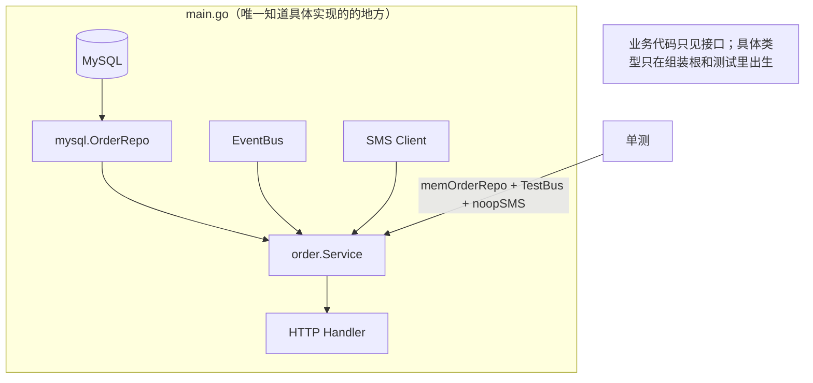

第四部分进入架构级。[第 3 篇单例](/posts/design-patterns-3-单例/)埋的伏笔在这里兑现：**可变单例的三宗罪，解药是依赖注入（DI）**。它不是 GoF 的成员，却是 [第 0 篇](/posts/design-patterns-0-开篇/) SOLID 里那个 D（依赖倒置）的工程落地——也是这个系列从"代码级"走向"架构级"的第一步。

CloudShop 的测试现状：全量单测跑 8 分钟，CI 上没人等它，大家本地只跑自己那个包。追进去看，根源只有一个。

## v0：依赖自己拿，测试全遭殃

```go
// order/service.go —— CloudShop v0
type Service struct{}

func NewService() *Service { return &Service{} }

func (s *Service) CreateOrder(req CreateReq) error {
	repo := NewMySQLOrderRepo("prod-db:3306") // 依赖①：自己 new，写死 MySQL
	bus := GetGlobalBus()                      // 依赖②：全局单例（第 3 篇的坑）
	sms := NewSMSClient(cfg)                   // 依赖③：真发短信的客户端
	// ...
}
```

想测"券叠加顺序算错没有"这段纯逻辑，得：起 MySQL 灌商品和券数据、注册全局 bus 的处理器、祈祷测试短信不发到真用户（于是又加了个 `if testing` 分支——测试代码污染生产代码的开始）。

三个依赖没一个能换。**测试慢不是因为测试写得差，是因为被测代码把依赖焊死了**——这句话值得贴在每一个测试金字塔倒置的团队墙上。

## v1：构造函数注入——依赖变参数

最小、也最关键的一步：依赖从"自己拿"改成"别人给"。

```go
type Service struct {
	repo OrderRepo  // 接口（第 21 篇 Repository 的伏笔）
	bus  Bus
	sms  SMS
}

func NewService(repo OrderRepo, bus Bus, sms SMS) *Service {
	return &Service{repo: repo, bus: bus, sms: sms}
}
```

测试的世界立刻变了：

```go
func TestCouponStacking(t *testing.T) {
	svc := NewService(
		&memOrderRepo{},          // 内存实现：毫秒级，不用起库
		NewTestBus(),             // 记录发布的事件，供断言
		&noopSMS{},               // 短信变空操作
	)
	// 全程内存，微秒级，t.Parallel() 随便开（第 3 篇的测试污染问题连根消失）
}
```

这一步没有任何框架参与，纯手写，却是 DI 的 90% 价值所在：**依赖从暗处（函数体内的 new 和全局变量）搬到明处（构造函数签名）**。签名即文档——`NewService` 的参数列表就是它的依赖清单，[第 0 篇](/posts/design-patterns-0-开篇/)"依赖倒置"里"测试跑不起来"的那种疼，到这里药到病除。

顺手收一张反模式清单。王争总结的"可测试性差的五种代码"，每种在 CloudShop 里都有对应物：**未决行为**（直接调 `time.Now()`、随机数——判定结果不可复现；解法是时间入参或注入 clock）；**可变全局变量**（第 3 篇的主案）；**滥用难以替换的依赖**（函数体内 new 的外部资源——本篇 v0 的病根；纯函数如 `strings.ToUpper` 不算）；**深继承链**（Go 无继承，天然免疫）；**高耦合**（依赖十几个对象就要替身十几个）。这张清单的价值在它的反向承诺，王争的原话："可测试性差的代码，本身代码设计得也不够好"——测试的别扭是设计问题的体温计。

## v2：组装根——对象图的总装车间

依赖都变成参数后，新的疼在 main 里：三十个服务的构造互相依赖（repo 要 DB 连接、service 要 repo 和 bus、handler 要 service），手写组装很快长成一百行意大利面。**组装逻辑本身需要归宿**——组装根（composition root）：整个进程唯一一处"知道所有具体实现"的地方。

```go
// main.go —— 组装根：全项目唯一允许出现具体类型 new 的地方
func main() {
	db := mustOpenDB()                    // 具体实现在此诞生
	bus := eventbus.New()
	orderRepo := mysql.NewOrderRepo(db)   // 具体类型
	risk := riskcontrol.New(blacklist, bus)
	orders := order.NewService(orderRepo, bus, sms, risk) // 一路注入
	http.ListenAndServe(":8080", newRouter(orders))
}
```

组装根的纪律：**具体类型的构造只发生在这里，业务代码只依赖接口**。当组装复杂到手动难以维护，两个 Go 生态的标准答案（都源于同一个认知：Go 社区 distrust 大框架，偏好显式）：

**wire（编译期代码生成）**：用注解描述依赖关系，`go generate` 生成组装代码——生成的就是 v2 那样的手写代码，零反射、零运行时魔法，性能与手写相同。代价是要学一套 provider 声明。

**fx（运行时装配）**：Uber 的反射容器，声明式注册、生命周期管理（Start/Stop 钩子）。代价是依赖图在运行时才组装、报错栈深、调试隔一层。

选型经验：中小项目**手写组装根就够了**（一百行以内不需要框架），组装超三百行或需要统一生命周期时优先 wire——Go 的气质是"宁可显式啰嗦，不要隐式魔法"。

## 命名时刻

**依赖注入：组件的依赖由外部提供，而非组件自己创建**。三个常被混用的词钉清楚：

- **IoC（控制反转）**：原则——"谁创建、谁控制"这件事反转了（从组件手里转到组装方手里）
- **DI（依赖注入）**：IoC 的落地手法（构造注入/参数注入）
- **DI 框架（wire/fx）**：手法的手法——自动化的组装根。**没有框架也有 DI**，v1 那十一行就是



### 与 Service Locator 的一线之隔

DI 有个孪生兄弟叫 Service Locator（服务定位器）：一个全局容器，`svc := locator.Get("orderRepo").(OrderRepo)`。两者都实现了"可替换"，差别在**依赖可见性**：DI 的依赖在构造函数签名上（显式），Locator 的依赖藏在函数体内的字符串查找里（隐式）。[第 3 篇](/posts/design-patterns-3-单例/)骂单例的"依赖不可见"，Locator 换了个马甲继承了大半。Go 社区几乎一边倒选 DI 弃 Locator，理由就是这条可见性。

## 标准库里的落地

**`database/sql` 的"造一次、传着用"**（第 3 篇引过，DI 视角重看）：`sql.Open` 在组装根造出 `*sql.DB`，全应用作为参数传递——`*sql.DB` 就是被注入的依赖，没有人每个函数里自己 Open。

**`context.Context`——参数注入的极致**。追踪信息、取消信号、超时全部作为**函数第一个参数**流动，而不是藏在全局变量里。Go 把"依赖走参数不走全局"做成了语言级惯例——context 是每天在写的依赖注入。

**`http.Server.Handler` 字段**：`&http.Server{Handler: myHandler}`——handler 是注入的依赖，Server 不知道路由长什么样。所有"接收接口字段"的结构体都是注入点，标准库里俯拾即是。

## 业务实战

CloudShop 落地 DI 的实际回报账单：单测从 8 分钟降到 40 秒（全内存），`t.Parallel()` 全开；定价逻辑（[第 1 篇](/posts/design-patterns-1-策略模式/)）的测试不再需要任何基础设施；新人看 `NewService` 签名就知道这个服务碰哪些东西——**签名审查（review 时只看构造函数）成为依赖治理的日常工具**，谁的构造参数悄悄多出一个 SMS，code review 里一眼抓住。

组装根目前手写 160 行，暂不引 wire——这是有意的决定，等它真的开始疼（预计微服务拆分时）再上，避免[第 24 篇](/posts/design-patterns-24-模式的代价/)要讲的模式瘾提前发作。

## 好处与代价

| 好处 | 代价 |
|---|---|
| 测试替身自由，纯逻辑毫秒级验证 | 构造函数参数变长（依赖多的服务 5-7 个参数） |
| 依赖显式化，签名即文档 | 组装根需要维护（框架又引入自己的复杂度） |
| 具体实现可整体替换（MySQL→内存→分库） | 间接层增加，跳转定义多一步到接口 |
| 生命周期集中管理（连接的创建与关闭） | 团队要守住"业务代码不 new 具体类型"的纪律 |

## 什么时候不要用

- **DI 框架上得太早**：三个服务的项目手写组装根十分钟的事，wire/fx 是给三十个服务的。
- **把所有东西都变成注入**：值对象、纯函数、无依赖的工具类不需要注入——注入的是"会变的依赖"，不是"一切"。
- **为了"架构正确"而注入**：某个依赖只有一种实现、永远只有一种、也不需要测试替换（比如 UUID 生成器），直接用比注入简单。测试需求是注入的第一正当性，不是架构审美。

## 易混淆

**DI vs 单例**（第 3 篇回环）：同一问题的两种答案——单例让依赖全局可摸（省参数、毁测试），DI 让依赖显式传递（多参数、保测试）。CloudShop 最终形态：**资源在组装根单点创建，以注入方式流动**——"造一次"用单例思想，"用"用 DI 思想。

**DI vs [Repository](/posts/design-patterns-21-仓储/)（第 21 篇）**：Repository 是最典型的"被注入的依赖"（接口+多实现），DI 是让它流动的机制。21 篇讲注入的"什么"，本篇讲"怎么流"。

**DI vs [注册表](/posts/design-patterns-20-注册表/)（第 20 篇）**：DI 显式连线（谁都知道自己连着谁），注册表按名查找（运行时才发现彼此）。大型系统两者共存：框架层用注册表装插件，业务层用 DI 连服务——20 篇展开这条边界。

## 自测

1. v0 的测试慢，根因是测试代码还是被测代码？"测试慢"和"测试金字塔倒置"的因果链是什么？
2. 组装根的纪律是"具体类型只在这里 new"。违反这条纪律的最常见形态是什么？（提示：业务代码里某个"顺手"的 new）
3. wire 和 fx 都解决组装爆炸，取舍维度是什么？为什么说 Go 社区的气质偏向 wire？
4. Service Locator 实现了"可替换"却仍被弃用，它输在哪一条？这一条和单例的哪宗罪同源？

---

**参考来源**

- Mark Seemann, *Dependency Injection Principles, Practices, and Patterns* — DI 的体系化论述
- google/wire、uber/fx 文档 — Go 生态两个方向的组装答案
- *Effective Go* / Go 官方博客 — 显式优于隐式的语言气质
- 王争《设计模式之美》（可测试性篇）— 五种反模式清单；"可测试性差的代码，本身设计得也不够好"
