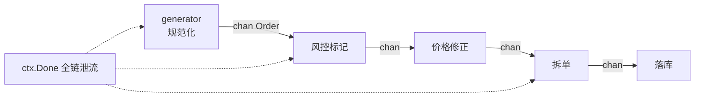

[第 16 篇](/posts/design-patterns-16-责任链/)结尾留了条线：链传**裁决**，管道传**数据**。这篇把线接上，并给出 Go 并发世界里最漂亮的那条管道。

CloudShop 的订单处理：一笔订单进来，要依次过参数规范化 → 风控标记 → 价格修正 → 拆单（大单拆包裹）→ 落库。五个步骤，每一步**吃进一个订单、吐出一个加工后的订单**。而且步骤要可插拔——A/B 实验期间给实验组插一步"赠品策略"。

## v0：五百行的顺序调用

```go
// order/ingest.go —— CloudShop v0
func (s *IngestService) Process(ctx context.Context, o *RawOrder) (*Order, error) {
	o = normalize(o)                       // ① 规范化：字段清洗、编码统一
	if o.Amount > riskThreshold {
		o.RiskTagged = true                // ② 风控标记
	}
	o.FinalAmount = applyPriceFix(o)       // ③ 价格修正（运费、凑单）
	orders := splitOrder(o)                // ④ 拆单
	// ④.5 A/B 实验组要插"赠品"——剖开这里
	for _, sub := range orders {
		if err := s.repo.Save(ctx, sub); err != nil { // ⑤ 落库
			return nil, err
		}
	}
	return orders[0], nil
}
```

熟悉的病：实验插一步 = 剖函数中部；步骤顺序调整 = 搬代码；每步没有独立的错误语义（失败全糊在 Process 的一个 error 里）。和[第 1 篇](/posts/design-patterns-1-策略模式/)、[第 16 篇](/posts/design-patterns-16-责任链/)的 v0 是同一族，但这次的每一步都在**变换同一份数据**——这个特征决定了解法是管道而不是链。

## v1：步骤提函数，数据串着走

```go
type Stage func(ctx context.Context, o *Order) (*Order, error)

func Process(ctx context.Context, raw *RawOrder, stages []Stage) (*Order, error) {
	o := normalize(raw)
	for i, st := range stages {
		var err error
		if o, err = st(ctx, o); err != nil {
			return nil, fmt.Errorf("stage %d: %w", i, err) // 哪一步失败，带编号报
		}
	}
	return o, nil
}

// 装配处
stages := []Stage{riskTag, priceFix, split, save}
if exp.IsExperiment(order.UserID) {
	stages = append(stages[:2], append([]Stage{giftStrategy}, stages[2:]...)...) // 实验组插一步
}
```

插拔变成切片操作，顺序变成数据。**核心特征显形：每个 Stage 的签名是 `(订单) → (订单)`——数据进、数据出，被逐步加工**。对照第 16 篇的 Rule 签名 `(订单) → (裁决)`：返回值的类型决定了一切。

## v2：并发管道——Go 的本命形态

单笔订单串行走五步没有问题，但大促洪峰要**同时处理一万笔**。Go 给管道准备的原生答案是一串 goroutine + channel：

```go
// Go 官方博客 "Go Concurrency Patterns: Pipelines" 的经典形态
func generator(ctx context.Context, raws <-chan *RawOrder) <-chan *Order {
	out := make(chan *Order)
	go func() {
		defer close(out)
		for r := range raws {
			select {
			case out <- normalize(r):
			case <-ctx.Done(): // ctx 取消，全链泄流
				return
			}
		}
	}()
	return out
}

func stage(ctx context.Context, in <-chan *Order, fn func(*Order) *Order) <-chan *Order {
	out := make(chan *Order)
	go func() {
		defer close(out)
		for o := range in {
			select {
			case out <- fn(o):
			case <-ctx.Done():
				return
			}
		}
	}()
	return out
}

// 装配：每步一个 goroutine，channel 相连
ch := generator(ctx, raws)
ch = stage(ctx, ch, riskTag)
ch = stage(ctx, ch, priceFix)
for o := range ch { // 消费端
	save(ctx, o)
}
```



并发管道的三个要点，每个都是踩坑换来的共识：

**背压天然存在**：channel 满了上游自动阻塞——洪峰时慢步骤自动"掐住"快步骤的产量，不需要手写限流。`make(chan *Order, 128)` 的缓冲就是每级允许的积压量。

**取消要靠 ctx 贯穿**：每个 select 都挂 `ctx.Done()`，一处取消全链泄流——否则 goroutine 泄漏，pprof 里看全是不退出的管道。

**close 的方向纪律**：发送方 close、接收方 range——方向反了是 panic。多阶段扇出/合并（fan-in/fan-out）时 close 管理立刻变复杂，用 `errgroup` + `sync.WaitGroup` 收口。

## 命名时刻

**管道模式：数据流经一串阶段，每个阶段做一种变换**。它回应的力：**加工步骤多、可重组、数据是主角**。Unix 哲学 `ps aux | grep go | wc -l` 是它的祖师爷——每个程序只做一件事、文本流相连。Go 把这个哲学带进了语言：channel 就是管道符，goroutine 就是进程。

三种"链状结构"的最终对照表（全系列辨析的收官）：

| | 数据形态 | 典型问题 | 代表 |
|---|---|---|---|
| [责任链](/posts/design-patterns-16-责任链/) | 裁决（过/不过） | 风控规则 | 中间件、投放过滤 |
| [装饰器](/posts/design-patterns-5-装饰器/) | 保形包裹（接口不变） | 层层加行为 | io.Reader、中间件 |
| 管道 | 变换（进一种数据出同种数据） | 加工流水线 | 订单处理、编译器 |

## 标准库与真实工程里的落地

**`bufio` + `io` 链——同步管道的日常形态。** `bufio.NewReader(f)` → `zr, _ := gzip.NewReader(br)` → `line, _ := zr.ReadString('\n')`：字节流逐级加工（原始字节→带缓冲→解压→按行切分），每一级是[装饰器](/posts/design-patterns-5-装饰器/)（保形）也是管道级（变换）——同一个 io 链，保形视角叫装饰器，数据加工视角叫管道，又一次结构同源、语义分居。

**编译器——管道的极致工程。** `go build` 内部：词法 → 语法（AST）→ 类型检查 → SSA 中间表示 → 优化遍（几十个 pass，每个变换一次 SSA）→ 机器码生成。每一 pass 吃 IR 吐 IR，正是 v1 的 Stage 签名放大到工业级。编译器是"步骤可增删、可重排、可独立测试"的终极受益者——优化 pass 的增删是版本发布的日常操作。

**Go 官方博客《Go Concurrency Patterns: Pipelines and cancellation》**——v2 形态的权威出处，本文 generator/stage 的骨架即源于此，值得对照原文读一遍取消处理的完整细节。

## 业务实战

CloudShop 落地双层管道：**同步管道**（v1 形态）处理单笔订单的五步加工——A/B 实验的赠品步骤是装配处一行 append，下线时删掉；**并发管道**（v2 形态）做大促洪峰的削峰——generator 从 MQ 消费原始单，五级 stage 并行，落库端用批量写（攒 100 笔一次落）。压测数据：串行 2 千单/秒 → 并发管道 1.8 万单/秒，瓶颈从加工转移到 DB 写入（于是落库端自己又成了需要优化的下一级）。

一个真实教训：风控标记那步曾偷偷调外部评分服务（网络 IO 藏在"变换"里），管道整体吞吐被它拖到评分服务的延迟上。**管道级的纪律：stage 尽量纯内存变换，IO 是独立的关注点**——要 IO 的步骤要么挪到管道两端（入口拉数据、出口批量写），要么自己内部做并发。这一条其实是函数式编程"纯函数"直觉在工程上的折现。

## 好处与代价

| 好处 | 代价 |
|---|---|
| 步骤插拔/重排 = 切片操作 | 步骤间只能靠 Order 结构传状态，字段悄悄膨胀 |
| 每步独立测试（纯变换好测） | 错误处理要设计（哪步失败、部分结果怎么办） |
| 并发形态天然背压、削峰 | goroutine/channel 的取消与 close 纪律 |
| 与 Unix/编译器同构，心智模型成熟 | 长管道调试要跨多个 goroutine 追 |

## 什么时候不要用

- **三步以内的固定流程**：普通函数调用直白得很，管道是仪式感。
- **步骤间有复杂分支/回退**（失败退回第三步重做）：管道是前向的，带回退的流程是工作流引擎的领域。
- **数据不是同构变换**：每步输入输出类型都不同且不复用（A→B→C→D 一条路走到黑），抽象成 Stage 接口没有收益，就是四次函数调用。

## 易混淆

**管道 vs [责任链](/posts/design-patterns-16-责任链/)（兑现第 16 篇）**：返回值定生死——链的环返回"裁决"（可以喊停），管道的级返回"加工后的数据"（一直流到出口）。风控用链（拦人），订单处理用管道（变物）。

**管道 vs [装饰器](/posts/design-patterns-5-装饰器/)**：装饰器编译期包好、结构固定；管道运行期装配、序列可变。io 链两种视角都成立（见上文）。

**管道 vs [模板方法](/posts/design-patterns-15-模板方法/)**：模板的骨架锁死、步骤是"填空"；管道的序列可重组、每级是"独立工人"。支付流程锁死七步用模板，订单加工可插拔用管道。

## 自测

1. `(订单) → (订单)` 和 `(订单) → (裁决)` 两个签名，分别长成管道和责任链——签名里的什么特征决定了结构？
2. 并发管道的"背压"是怎么免费获得的？如果把 channel 换成无界队列，大促洪峰下会发生什么？
3. "stage 尽量纯内存变换"的纪律被违反时（风控步骤藏网络 IO），管道的哪个性质被破坏？修复方案为什么是"IO 挪到两端"？
4. io.Reader 链既是装饰器又是管道——两个视角分别强调数据的什么侧面？

---

**参考来源**

- Go 官方博客, *Go Concurrency Patterns: Pipelines and cancellation* — 并发管道权威出处
- Unix 管道哲学 — `do one thing well` 的祖师爷
- Go 编译器 SSA pass 文档 — 工业级管道
