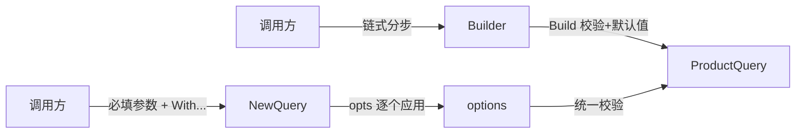

[第 1 篇](/posts/design-patterns-1-策略模式/)解决了"算法怎么换"，这篇解决另一个每天都在发生的疼：**构造参数太多**。

商品中台的新需求：运营后台要按条件筛选商品导报表。筛选条件有十二个：商家、状态、价格区间、类目、页码页大小、排序、是否含已删除、是否只看有货、是否只看 SKU。

## v0：十二个参数的构造函数

```go
// catalog/query.go —— CloudShop v0
func NewProductQuery(userID int64, status int8, minPrice, maxPrice int64,
	categoryID int64, page, pageSize int, sortBy string,
	withDeleted bool, onlyStocked bool, merchantID int64, skusOnly bool) *ProductQuery {
	// ...
}
```

调用现场长这样：

```go
q := NewProductQuery(uid, 1, 100, 500, catID, 1, 50, "sales", false, true, mID, true)
```

两处真实事故（都是机制必然，不是戏剧）：

- `minPrice, maxPrice` 传反了。Go 没有具名实参，两个相邻的同型 `int64`，编译器毫无意见。结果是"100 到 500 元"变成了"500 到 100 元"，价格区间为空，商品列表一片空白，运营以为商品丢了。
- `page, pageSize` 错位。`1, 50` 变成 `50, 1`——查第 50 页每页 1 条。没人报错，只是"导出报表怎么只有一行"。

同型相邻参数是位置参数的天生缺陷。另一个常见套路更糟：**伸缩构造函数**（telescoping constructor）——`NewQuery`、`NewQueryWithPrice`、`NewQueryWithPriceAndStock`……十二个参数的组合是 2 的十二次方，构造函数写到第五个就该意识到这条路不通。这是 [Refactoring.guru 列名的反模式](https://refactoring.guru/design-patterns/builder)。

## v1：配置结构体，先消灭"传反"

Go 的传统答案：把参数打包成结构体，用字段名消除位置歧义。

```go
type ProductQuery struct {
	UserID      int64
	Status      int8
	MinPrice    int64
	MaxPrice    int64
	CategoryID  int64
	Page        int
	PageSize    int
	SortBy      string
	WithDeleted bool
	OnlyStocked bool
	MerchantID  int64
	SkusOnly    bool
}

q := &ProductQuery{
	MerchantID: mID,
	MinPrice:   100, // 字段名在场，传反不可能
	MaxPrice:   500,
	Page:       1,
	PageSize:   50,
}
```

传反的问题消失了。但两个新问题浮出来：

**零值歧义。** `MinPrice: 0` 是"不过滤价格"还是"价格 ≥ 0"？`Status: 0`——如果 0 恰好是"已下架"的枚举值，"没填"和"筛已下架"无法区分。bool 也一样：`false` 是"不含已删除"还是"没填"？

**校验散落。** `MinPrice <= MaxPrice`、`PageSize <= 500` 这些不变式（invariant）该校验，但结构体字面量没有"构造完成"的时机，校验只能散在使用处，每个调用方自求多福。

## v2：建造者——分步配置，一处校验

把"组装"和"校验"收拢到一个对象里，链式配置，`Build()` 是"构造完成"的明确时刻：

```go
typeQueryBuilder struct {
	q ProductQuery
	err error
}

func NewProductQuery() *QueryBuilder { return &QueryBuilder{} }

func (b *QueryBuilder) Merchant(id int64) *QueryBuilder { b.q.MerchantID = id; return b }
func (b *QueryBuilder) PriceRange(min, max int64) *QueryBuilder {
	if min > max {
		b.err = fmt.Errorf("min %d > max %d", min, max)
		return b
	}
	b.q.MinPrice, b.q.MaxPrice = min, max
	return b
}
func (b *QueryBuilder) Page(page, size int) *QueryBuilder { b.q.Page, b.q.PageSize = page, size; return b }
func (b *QueryBuilder) OnlyStocked() *QueryBuilder         { b.q.OnlyStocked = true; return b }

func (b *QueryBuilder) Build() (*ProductQuery, error) {
	if b.err != nil {
		return nil, b.err
	}
	if b.q.PageSize == 0 {
		b.q.PageSize = 20 // 默认值集中在这里
	}
	if b.q.PageSize > 500 {
		return nil, errors.New("pageSize 超上限 500")
	}
	q := b.q
	return &q, nil
}
```

调用侧：

```go
q, err := catalog.NewProductQuery().
	Merchant(mID).
	PriceRange(100, 500).
	Page(1, 50).
	OnlyStocked().
	Build()
```

注意几个设计点：`PriceRange` 把两个关联参数绑成一个方法，传反在方法签名层就被拦住；零值歧义用"方法即设置"化解——调了 `OnlyStocked()` 就是 true，没调就是不过滤，bool 的第三态消失了；校验和默认值全部收在 `Build()`。

## v3：Go 的惯用变体——Functional Options

Go 社区还有另一种解法，2014 年由 Dave Cheney 在[《Functional options for friendly APIs》](https://dave.cheney.net/2014/10/17/functional-options-for-friendly-apis)提出，grpc-go 全线采用：

```go
type Option func(*options)

type options struct {
	minPrice, maxPrice int64
	pageSize           int
	onlyStocked        bool
}

func WithPriceRange(min, max int64) Option {
	return func(o *options) {
		o.minPrice, o.maxPrice = min, max
	}
}

func WithPageSize(n int) Option {
	return func(o *options) { o.pageSize = n }
}

func NewQuery(merchantID int64, opts ...Option) (*ProductQuery, error) {
	o := options{pageSize: 20} // 默认值
	for _, opt := range opts {
		opt(&o)
	}
	if o.minPrice > o.maxPrice {
		return nil, fmt.Errorf("invalid price range")
	}
	return &ProductQuery{MerchantID: merchantID, /* ... */}, nil
}
```

```go
q, err := catalog.NewQuery(mID,
	catalog.WithPriceRange(100, 500),
	catalog.WithPageSize(50),
)
```

留意签名的一个细节：`merchantID` 是位置参数，`opts` 是可选项。这是 grpc/标准库式 API 的真实形态——**必填参数走签名，编译器强制；可选项走 Options，类型安全**。两种机制各司其职。

## 命名时刻

v2 的形状是**建造者模式**：将复杂对象的构建分步进行，同一套构建过程可以产出不同表示。它解决的力：构造参数多、有关联约束、有默认值需求、需要明确的校验时机。v3 不是 GoF 模式，是 Go 语言对同一组力的惯用回应——函数是一等公民，"配置"可以就是一组函数。

两者怎么选：

| 维度 | Builder | Functional Options |
|---|---|---|
| 适合 | 字段多、强校验、一次配齐的复杂对象 | 库 API：构造签名稳定、选项渐进演进 |
| 必填强制 | 弱（靠 Build 报错） | 强（必填走函数签名） |
| 新增选项 | 加方法 | 加 With 函数，旧调用零影响 |
| 生态惯例 | 业务对象内部 | 对外 SDK / 框架（grpc、zap） |



## 标准库里的落地

**`strings.Builder`。** 名字同源但侧重不同：它是"分步组装字符串、最后一次产出"，避免 `+=` 的反复拷贝——建造者"分步构建、终态产出"的核心节奏。

```go
var b strings.Builder
b.WriteString("SELECT * FROM product WHERE merchant = ?")
if onlyStocked { b.WriteString(" AND stock > 0") }
sql := b.String() // 构建完成
```

**`grpc.Dial`。** Functional Options 在真实库里的样子：`grpc.Dial(addr, grpc.WithInsecure(), grpc.WithBlock())`，每个 `With` 都是一个 Option 函数。

grpc-go 的 `DialOption` 还藏着一招值得单独学——**密封接口（sealed interface）**：

```go
// grpc-go clientconn.go —— 真实源码
type DialOption interface {
	apply(*dialOptions) // 未导出方法
}

type funcDialOption struct{ f func(*dialOptions) }

func (fdo *funcDialOption) apply(do *dialOptions) { fdo.f(do) }
```

`apply` 是未导出方法，**包外无人能实现 `DialOption` 接口**——选项集合被密封在包内，外部只能通过 `With...` 构造选项，不能伪造。如果任何人都能实现 Option，调用方就可能注入未文档化的行为，库的演进失去控制。密封接口是 Functional Options 走向公共 API 时的标配手法，代价是选项扩展权完全收归库作者。

## 业务实战

CloudShop 落地时两种都用了，各就各位：

- **报表导出用 Builder**。导出配置十几个字段、互相约束（日期范围≤90 天、字段勾选与模板联动），`Build()` 里集中校验，错误一次报全。
- **开放平台 SDK 用 Functional Options**。商家接入 SDK，`cloudshop.NewClient(appKey, appSecret, cloudshop.WithSandbox(), cloudshop.WithTimeout(5*time.Second))`——必填的密钥编译期强制，可选项向后兼容地加。

## 好处与代价

| 好处 | 代价 |
|---|---|
| 同型参数传反在机制上不可能 | 每个字段一个方法/一个 With 函数，样板代码可观 |
| 校验和默认值有唯一住所 | IDE 跳转链变长，读代码绕 |
| 必填/可选分离（混合式签名） | Option 的错误该在应用时报还是构造时报，团队要统一 |
| API 演进不破坏旧调用 | 简单场景下，这层间接是纯开销 |

## 什么时候不要用

- **参数四个以内、无关联约束**：位置参数加好注释就够。
- **配置是纯数据、没有不变式**：导出 `Config` 结构体让调用方填字面量，比 Builder 直白——没有校验需求的 Builder 只是换皮的结构体。
- **Go 社区的另一种声音**：Rob Pike 一贯倾向显式和简单（[*Effective Go*](https://go.dev/doc/effective_go) 的整体气质），公开导出 Config 结构体、让调用方自己填，也是正当设计。Builder/FO 的正当性来自"约束真的存在"，不是来自模式名。

## 易混淆

**建造者 vs 工厂**（[第 4 篇](/posts/design-patterns-4-工厂方法/)）：建造者管"一个对象的分步配置"，工厂管"按类型造出哪一种对象"。一个对内配参数，一个对外选类型，经常配合——工厂造出哪种，建造者配它。

**Builder vs 结构体字面量**：有不变式（min≤max、页大小上限）用 Builder/校验函数；没有就用字面量，别为了链式调用的好看上 Builder。

## 自测

1. v0 的两起事故（价格传反、页码错位），分别在 v1/v2/v3 哪一层被机制性消灭？
2. `NewQuery(merchantID int64, opts ...Option)` 为什么把 merchantID 留在位置参数里？全改成 Option 会失去什么？
3. 零值歧义：`Status int8` 的 0 值既是"未填"又可能是合法枚举值，Builder 和 Options 各自怎么化解？
4. 什么情况下"导出 Config 结构体"比 Builder 和 Options 都好？

---

**参考来源**

- GoF, *Design Patterns* — 建造者模式
- Refactoring.guru, [Builder Pattern](https://refactoring.guru/design-patterns/builder) — 伸缩构造函数反模式
- Dave Cheney, [*Functional options for friendly APIs*](https://dave.cheney.net/2014/10/17/functional-options-for-friendly-apis)（2014）— FO 的提出文
- *Effective Go* — 显式与简单的设计气质
- grpc-go `DialOption` — FO 在大型库中的实际形态
