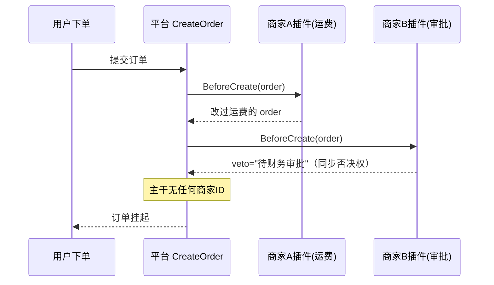

系列终局之战。设定集第一天就埋的伏笔（"CloudShop 插件生态，正好呼应 frank 云端平台的扩展点设计"）在这里兑现。它要解决的疼，是所有平台型产品的宿命：**平台不能为每个客户改代码**。

CloudShop 做大了，头部商家开始提需求："下单后给我自己的 ERP 发通知"、"用我自己的运费模板参与计价"、"超过 5 万元的订单先过我们财务的审批"。平台不能为三家商家在主干里写三个 if——但 v0 的现实是，已经写了。

## v0：补丁地狱

```go
// order/create.go —— CloudShop v0（节选，真实的惨状）
if o.MerchantID == 10086 { // 商家A：走他的运费
	o.Freight = merchantAFreight(o)
}
if o.MerchantID == 10010 { // 商家B：先过他财务
	if !callBFinance(o) {
		return ErrPendingApproval
	}
}
if o.Amount > 5000000 && o.Merchant.CustomERP { // 商家C：发他ERP
	notifyCustomERP(o)
}
```

主干代码里商家的名字越来越多，每上一个商家发一次版，回归测试范围=全平台。[第 0 篇](/posts/design-patterns-0-开篇/)开闭原则在"平台级"的形态：**为新增一方修改核心，就永远追不上需求**。

## v1：事件不够用——扩展要的不只是知情

第一反应可能是"用[事件](/posts/design-patterns-12-观察者/)啊"：商家订阅 `order.created`、`order.paid`。商家 A 的"发通知"确实解决了——事后知情类扩展，事件正解。

但商家 B 的审批和商家 A 的运费不行：审批要**拦截**流程（财务没批，订单不能往下走），运费要**参与计算**（改数据）。事件是事后广播，不给参与权——等 `order.created` 发出来，运费早算完了。

**知情用事件，参与要钩子**——这条分界线是本篇的地基，也是 v1 失败的原因。

## v2：钩子——带返回值的扩展点

钩子挂在流程的关键节点上，给扩展方**同步参与**的权力：可以改数据、可以否决。

```go
// platform/hooks.go —— 平台定义扩展点契约
type OrderHooks interface {
	// 前置钩子：可修改订单、可否决整个创建
	BeforeCreate(ctx context.Context, o *Order) (modified *Order, veto string, err error)
	// 后置钩子：只读通知 + 可追加副作用（发商家自己的ERP）
	AfterPaid(ctx context.Context, o *Order) error
}

// order/create.go —— 主干只留钩子调用点
func (s *Service) CreateOrder(ctx context.Context, o *Order) error {
	for _, h := range s.hooks { // 商家插件们
		var veto string
		o, veto, err = h.BeforeCreate(ctx, o)
		if err != nil {
			return s.isolate(err, h) // 插件出错不能拖垮平台（下文）
		}
		if veto != "" {
			return fmt.Errorf("vetoed by %s: %s", hookName(h), veto)
		}
	}
	// ……平台核心逻辑（不含任何商家ID）
}
```

商家的差异化逻辑住进各自的插件包，实现 `OrderHooks`，通过[注册表](/posts/design-patterns-20-注册表/)挂到自己店铺的扩展点上（按商家路由到对应插件链）。主干里 `10086` 们全部消失——**平台代码回到"不知道有任何具体商家"的状态**，这就是插件化的全部目标。



### 钩子设计三问（本篇的干货核心）

把扩展点开放出去，等于签发权力。三问定生死：

**一问：挂哪些点？** 节点少了扩展不了（商家要的时机没有钩子），多了接口爆炸（每个钩子都是永久 API 承诺）。经验值：沿着**业务状态机的迁移边**挂（[第 14 篇](/posts/design-patterns-14-状态/)的状态图就是钩子点位的候选清单）——下单前/支付后/发货后，六到十个点覆盖 90% 需求，而且状态机语义稳定，钩子契约跟着稳。

**二问：给多大权？** 权限要分层，从只读到全能：

| 层 | 权力 | 例 | 风险 |
|---|---|---|---|
| L1 只读通知 | 收到事实 | AfterPaid 发 ERP | 低（就是事件） |
| L2 可改数据 | 修改流经的数据 | 运费模板改 Freight | 中（改坏数据=平台资损） |
| L3 可否决 | 中断主流程 | 财务审批 veto | 高（插件挂了平台停摆） |

权限只升不降地贵——L3 钩子要配超时和兜底（审批服务 3 秒不回，按放行还是按挂起？这是产品决策，写进契约）。

**三问：插件出错怎么办？** 商家代码不可信（写得烂、会 panic、可能恶意），平台的鲁棒性不能寄望于插件作者。CloudShop 的三件套：`recover` 包住每个钩子调用（panic 不外溢）；钩子超时熔断（ctx 加 deadline）；错误降级策略按权限层配置（L1 错了忽略记日志，L3 错了按默认策略走 + 告警）。**沙箱是平台对商家的礼貌，也是平台对自己的保险**。

## 标准库与生态里的落地

**git hooks——最老牌的钩子系统。** `.git/hooks/pre-commit` 是 L3 权限的前置钩子：非零退出码**否决**这次 commit。git 的设计（可执行文件约定、无中心注册、用户自主启停）是 1970s Unix 传统给钩子设计的教科书——注意它同时暴露了钩子的经典痛点：钩子脚本坏了用户第一反应是"git 有问题"，CloudShop 的商家也会觉得"平台有问题"——**用户分不清平台和插件，出了事故平台背锅**，所以三问的第三问不是技术问题是品牌问题。

**`testing` 的生命周期钩子。** `TestMain`（包级 setup/teardown）、`t.Cleanup`（用例级收尾）、`b.ResetTimer`——测试框架把"每个测试前后的扩展点"做成了钩子，用户不修改 testing 源码就能改变其行为（加临时目录、起容器、清理数据），正是本篇标题的后半句。

**pi 的扩展系统——可否决钩子的真实工程样本。** [第 12 篇](/posts/design-patterns-12-观察者/)引过它的 `session_before_compact`：这里补全它的权限分层设计——扩展返回 `{cancel: true}` 可**取消**压缩（L3 否决权），返回 `{compaction: ...}` 可**整体替换**默认压缩逻辑（比 L3 更高的"接管权"）。配套的 `fromHook` 守卫（[上下文压缩系列](https://smilingwalker.github.io/posts/code-agent-compaction-源码实现/)调研过：pi 的 `extractFileOperations` 只信任自家生成的摘要）体现了钩子生态的信任问题——**平台要能区分"自己产出的"和"扩展注入的"**。这套 L1→L3→接管的分层，正是 CloudShop 钩子契约的参照系。

**Go 官方 `plugin` 包的现实**顺带一提：`.so` 动态加载受平台限制（Linux only、版本脆弱），生产实践里"插件"基本是**进程内注册**（本篇 v2，实为编译期链接+运行期启用）或**进程外 RPC**（插件独立部署，平台经网络调用）。形式退让，模式不变。

## 业务实战

CloudShop 插件平台最终形态：六个钩子点（挂状态机迁移边）、L1/L2/L3 三档权限、商家后台自助上传插件包（校验签名→注册表登记→灰度启用）、全套隔离三件套。头部三家的定制全部迁出主干（v0 的三个 if 变成三个插件仓库），平台回归通用——**发版回归范围从"全平台"缩回"核心"**，这是插件化最值钱的回报。

对照 frank 的云端 AI Coding 平台规划：MCP 连通需求系统/测试平台的扩展点、human gate 的否决权、租户自定义工作流——分别对应本篇的 L2（改数据）、L3（否决）、按商家路由插件链。CloudShop 的三问（挂哪些点/给多大权/错了怎么办）可以直接搬去当平台扩展点设计的评审清单。

## 好处与代价

| 好处 | 代价 |
|---|---|
| 主干零定制，平台回归通用 | 钩子契约 = 永久 API 承诺，改一处全生态疼 |
| 商家差异化独立演进、独立部署 | 用户分不清平台和插件，插件事故平台背锅 |
| 权限分层让开放有边界 | 隔离/超时/降级是硬工程量 |
| 与注册表/事件/DI 全部接通（系列集大成） | 插件生态需要文档、示例、审核——平台化承诺 |

## 什么时候不要用

- **扩展需求就一两个且稳定**：一个事件订阅够了，插件体系是重武器。
- **扩展点是想象出来的**："未来可能有人想扩展"是过度设计之王（[第 24 篇](/posts/design-patterns-24-模式的代价/)的主角场景）——等第一个真实需求出现，它会长出正确的钩子形状。
- **团队养不起生态**：插件体系=API 稳定性承诺+文档+审核+版本管理，没有这些配套，开放钩子等于对外负债。

## 易混淆

**钩子 vs [事件](/posts/design-patterns-12-观察者/)**（系列最重要的分界线之一）：事件**事后广播**、异步、不阻塞、不管结果；钩子**同步参与**、阻塞流程、可改数据可否决。判断口诀：**要不要等它、要不要听它的**——等且听=钩子，不等不听=事件。CloudShop 的 AfterPaid 表面上是钩子形状的 L1 事件（其实应该降级为事件——L1 权限的钩子是浪费同步成本，这是个值得在 review 里盯的坏味道）。

**钩子 vs [管道](/posts/design-patterns-19-流水线/)**：管道级是平台自己的加工序列（内部结构）；钩子点是序列上对外开的口子（外部接口）。管道管数据怎么流，钩子管别人在哪里插手。

**钩子 vs [模板方法](/posts/design-patterns-15-模板方法/)**：模板的钩子位留给**子类**（继承体系内）；本篇的钩子位留给**外部插件**（跨边界）。同一个"骨架留空位"的思想，作用域从类内扩展到了平台级。

## 自测

1. 商家A的运费和发通知，为什么一个必须是钩子、一个是事件就够了？"要不要等它、要不要听它的"分别怎么判定？
2. 钩子设计三问里，"挂哪些点"为什么沿着状态机迁移边挂是稳的？如果沿技术分层挂（DB 前/DB 后），契约会怎么烂？
3. L3 否决权为什么必须配超时和兜底策略？"审批服务 3 秒不回，按放行还是挂起"如果是你来定，定价/风控/法务各自会主张什么？
4. pi 的 `fromHook` 守卫防御的是什么攻击面？CloudShop 的插件摘要/配置如果可被商家插件篡改，会出什么事？

---

**参考来源**

- git hooks 文档 — L3 前置钩子的鼻祖
- Go `testing`（TestMain/t.Cleanup）、`plugin` 包文档 — 生命周期钩子与插件装载的现实
- pi 扩展系统（badlogic/pi-mono）— 可否决/可接管钩子的真实工程
