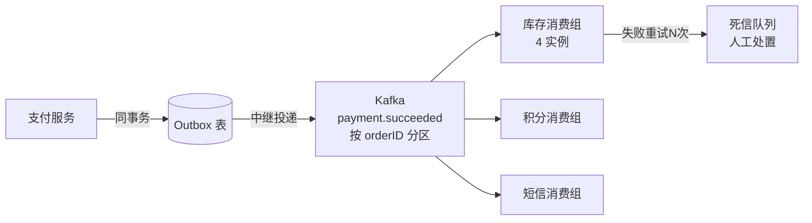

[第 12 篇观察者](/posts/design-patterns-12-观察者/)写了进程内的总线，末尾立了两块牌：顺序依赖与可靠性（"进程崩了事件丢失"）。微服务化之后，这两块牌全被踩中——本篇是观察者的工业化大结局，也是系列倒数第二篇。

CloudShop 拆成微服务后的新现实：支付服务发的"支付成功"，订阅者库存、积分、短信**在另外三个进程里**；大促晚发布事件后支付服务重启，内存里未投递的事件全灭；新订阅方（推荐服务）上线，问"能把上个月的事件给我回放一遍吗"。

## v0 → v1：发件箱——先解决"发出去就丢"

第 12 篇的内存 Publish 有个致命窗口：业务成功 → 事件在内存 → 进程崩 → 事件蒸发，而库存永远不知道支付成功。**事务性发件箱（transactional outbox）**用一句洞察解决它：**事件的落库和业务的落库写同一个事务**。

```go
// pay/service.go —— v1：业务与事件同事务
func (s *PayService) onPaid(tx *gorm.DB, o *Order) error {
	if err := tx.Save(paidRecord(o)).Error; err != nil {
		return err // 回滚：业务和事件一起不发生
	}
	return tx.Create(&OutboxEvent{ // 发件箱表，与业务同库同事务
		Topic:   "payment.succeeded",
		Payload: mustJSON(PaidEvent{OrderID: o.ID, Amount: o.Amount}),
	}).Error
}

// 中继：后台 goroutine 轮询发件箱，投递到 MQ，成功后标记
func (s *Relay) Run(ctx context.Context) {
	for {
		events := s.outbox.FetchPending(ctx, 100) // 待投递事件
		for _, e := range events {
			if err := s.mq.Publish(e.Topic, e.Payload); err != nil {
				break // 投递失败，下轮重来（事件还躺在库里）
			}
			s.outbox.MarkSent(ctx, e.ID)
		}
	}
}
```

业务成功则事件必在库里（事务保证），中继慢慢投——**至少一次投递（at-least-once）**从机制上成立。这个小小的发件箱表是整个事件驱动架构的地基。

## v2：引入消息中间件——分区、消费组、死信

发件箱解决"不丢"，跨进程广播交给中间件（Kafka/RocketMQ）。三个核心概念的 CloudShop 用法：

- **Topic + 分区**：`payment.succeeded` 按 `orderID` 分区——**同一订单的事件进同一分区、被顺序消费**（库存先扣款成功、再处理退款，顺序不乱）
- **消费组**：库存服务部署 4 个实例，同组内分摊分区（扩容消费能力）；积分服务是另一个组，**各自独立消费全量**（订阅者之间互不干扰）
- **死信队列（DLQ）**：某条事件重试 N 次仍失败，移入 DLQ 挂起，人工处理——**毒丸消息不能堵死整条管道**



## 命名时刻，与四个必须踩过才懂的深坑

**事件总线：跨进程、可靠、可回放的事件传播基础设施**——观察者模式的分布式工业化。但"用上 Kafka"和"事件架构做对"之间隔着四个坑，每个都是真实事故换来的：

**坑一：重复投递——消费者必须幂等。** at-least-once 意味着**同一条事件会来不止一次**（中继重投、消费位移回滚）。库存扣减收到两次"支付成功"就双倍扣减。幂等的实现两件套：去重表（`event_id` 唯一键，插冲突即跳过）或版本判断（事件带 `orderVersion`，旧版本忽略）。**幂等是消费者的义务，不是中间件的恩赐**——这条写进每个新消费方的 onboarding 文档。

**坑二：顺序的边界。** 分区键保的是**单分区内有序**，不是全局有序。跨订单的事件本来就不需要全序（互不相干），但**同一订单的"支付成功"和"退款发起"如果落进不同分区**（键选错，比如用了 `eventID` 而不是 `orderID`），顺序就乱。分区键的选择=声明"谁和谁之间有顺序依赖"，选错是设计期埋的雷。

**坑三：事件版本演化。** `PaidEvent` 加了字段 `channel`，新版生产者发的旧消费者读不懂（或 JSON 宽容读出零值静默出错）。规则：只加不删、加可选字段、消费者对未知字段宽容——想清楚**事件是历史事实**，1 年前的旧事件今天还要能被新代码消费（回放场景下这是硬要求）。

**坑四：循环事件风暴。** 库存扣减失败→发 `inventory.failed`→某服务收到后又触发重下单流程→再发 `order.created`→……事件因果链成环，深夜自我放大。防御：**每个事件携带因果链 ID（causation id）**，发现环（链里出现自己发起的事件类型）即断路。CloudShop 的一次未遂事故：事件链上第 7 跳时告警系统自己发的事件又被监控消费，幸运地在压测环境先暴露。

### 用户的视角：最终一致不是免死金牌

事件架构下"下单成功"和"积分到账"之间隔着秒级延迟。**前端不能假设同步**——下单页立即显示"积分 +50"是谎言（可能还没到账）。诚实的设计：显示"积分将在稍后到账"或干脆拉取式确认。技术选了最终一致，产品就要为它设计体验，这笔账不能赖给用户。

## 标准库与生态里的落地

标准库到不了这个层（分布式基础设施），两个真实参照系：

**Kubernetes 的 list-watch——事件流的完全体。** informer 的机制：List（全量拉一次建本地缓存）+ Watch（增量事件流维护缓存新鲜度）、断线自动重新 List 收敛、事件带 ResourceVersion 判新旧。它把本篇四个坑全部工程化：ResourceVersion 是版本演化+幂等的答案，重同步是丢消息的兜底，本地缓存让消费者与集群解耦。**读一遍 informer 的设计文档，等于把本篇四个坑的工业解各看一遍**。

**CloudShop 的事件目录**（第 12 篇 `docs/events.md` 的升级版）：每个 topic 一节——载荷 schema（含版本历史）、生产者、消费者组、分区键、幂等策略、DLQ 处理人。这份文档从"卫生设施"升级为"关键基础设施"：跨团队的事件契约变更，先改文档评审，再动代码。

## 业务实战

CloudShop 上线发件箱+Kafka 后的架构账：支付服务与四个下游彻底解耦（互相不知道彼此存在）；大促重启零事件丢失（发件箱兜底）；推荐服务冷启动靠**历史回放**（消费两周前的事件流补训练数据）——回放是事件总线的独门能力，RPC 世界给不了。

代价同样真实：运维多了一个 Kafka 集群（故障、扩容、成本）；排障从"看一个栈"变成"追一条事件链"（全链路的事件 trace 靠 causation id 串起来，工具要自建）；四个坑的每一个都交过学费。**事件总线是用运维复杂度换解耦与回放**，这笔交易值不值，取决于订阅方的数量和演化速度——两个稳定订阅方，别上这套；八个且持续增加（CloudShop 现状），值。

## 好处与代价

| 好处 | 代价 |
|---|---|
| 跨进程解耦，生产者消费者互不知晓 | 幂等/顺序/版本/循环四坑的持续工程 |
| 发件箱+重试：不丢（at-least-once） | 运维一个中间件集群的全面成本 |
| 分区保序、消费组扩容、DLQ 隔毒丸 | 排障跨进程，需要事件 trace 工具 |
| 历史回放（新消费者补数据）——独门能力 | 最终一致的体验要产品设计兜住 |

## 什么时候不要用

- **进程内解耦**：[第 12 篇](/posts/design-patterns-12-观察者/)的内存总线够了，MQ 是跨进程才配得上的重量。
- **强一致链路**："扣库存失败则整单回滚"用同步调用+事务，最终一致会把补偿逻辑翻倍。
- **订阅方一两个且稳定**：直接 RPC 调用，简单三倍。
- **没人管运维**：Kafka 不是装完就完的，没有 oncall 能力的团队上事件总线=埋雷。

## 易混淆

**事件总线 vs [观察者](/posts/design-patterns-12-观察者/)（回环）**：同一意图的两个量级——进程内回调广播 vs 跨进程可靠传播回放。选择线：订阅者跨不跨进程、丢不丢得起、要不要回放。

**事件总线 vs [中介者](/posts/design-patterns-17-冷门五连/)（第 17 篇）**：总线广播（谁爱听谁听，无剧本）；中介者编排（按剧本依次驱动，有补偿）。退款这种多步协调流程，CloudShop 用的是 saga 编排（中介者形态）**建在**事件总线之上——事件传信，中介指挥。

**事件总线 vs 消息队列**：概念上队列偏点对点（取走即删）、总线/topic 偏多订阅（留痕可回放）。工程产品（Kafka/RocketMQ）早已兼具两副面孔，辨析的价值在于设计时想清楚**要不要多订阅、要不要回放**——这两个"要"才是事件总线的本体特征。

## 自测

1. 发件箱为什么必须和业务同库同事务？如果事件表单独一个库，哪个故障场景会打破"业务成功事件必达"？
2. "同一订单的事件必须有序"和"全局有序"差在哪？分区键选 `orderID` 和选 `eventID`，各得到什么顺序保证？
3. 四坑里哪一坑的解法在消费者侧、哪一坑在生产者侧、哪一坑在设计期？各自的具体动作是什么？
4. K8s informer 的 ResourceVersion 同时回应了哪两个坑？重新 List（resync）兜的是什么底？

---

**参考来源**

- *Transaction Outbox* 模式（microservices.io）— 发件箱出处
- Kafka 文档（分区/消费组/死信）— 概念的权威定义
- Kubernetes client-go informer 设计 — list-watch 工业完全体
