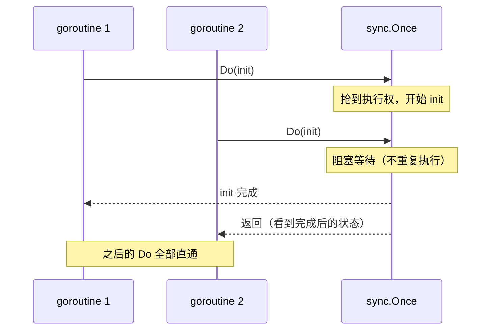

前两篇都在解决"怎么造对象"，这篇解决"这个对象**只造一次**"。单例是 23 个 GoF 模式里最出名的一个，也是被骂得最狠的一个。CloudShop 会把两边都演完：什么时候它是正解，什么时候它是反模式。

事情从风控团队新人的一次接入开始。策略分析师入职第一周提了个朴素要求：有三个城市刷单严重，先全域拉黑，名单他来维护。开发看了眼需求——一个几 MB 的配置文件，读进来放进 set 里查，半小时的活。最直觉的写法顺手就写出来了：

## v0：每次都读文件的黑名单

风控模块要用城市黑名单：一个几 MB 的配置文件，进程内不会变。

```go
// riskcontrol/blacklist.go —— CloudShop v0
func CityBlocked(city string) bool {
	data, err := os.ReadFile("city_blacklist.conf") // 每次调用都读盘
	if err != nil {
		return false
	}
	set := parseCities(data)
	return set[city]
}
```

下单链路每次风控都读一次文件、解析一遍。大促压测时，这个函数在火焰图里烧出显眼的一块。**读盘和解析只需要发生一次**——这就是单例模式要解决的原始的力。

## v1：加缓存，撞上 data race

最直觉的改法：

```go
var blacklist map[string]struct{}

func CityBlocked(city string) bool {
	if blacklist == nil { // 并发下这段是竞态
		data, _ := os.ReadFile("city_blacklist.conf")
		blacklist = parseCities(data)
	}
	return blacklist[city]
}
```

`go run -race` 会当场抓到（简化示意输出）：

```
WARNING: DATA RACE
Write at 0x00c0000a0180 by goroutine 7:
  riskcontrol.CityBlocked()
Previous write at 0x00c0000a0180 by goroutine 6:
  riskcontrol.CityBlocked()
```

竞态不只是"可能初始化两次"这么轻：一个 goroutine 写 `map` 的同时另一个在读，Go 的 runtime 会直接 panic（`fatal error: concurrent map read and map write`）。这个版本在低流量测试里一切正常，大促并发一上来才炸——正是最难排查的那种 bug。

## v2：加锁，对了但啰嗦

```go
var (
	mu        sync.Mutex
	blacklist map[string]struct{}
)

func CityBlocked(city string) bool {
	mu.Lock()
	defer mu.Unlock()
	if blacklist == nil {
		data, _ := os.ReadFile("city_blacklist.conf")
		blacklist = parseCities(data)
	}
	return blacklist[city]
}
```

正确了，但每次读都付锁的代价——为了只在第一次发生的事，全体调用陪跑。

## v3：sync.Once——"只做一次"的语言级原语

Go 给这件事一个正式的写法：

```go
var (
	once       sync.Once
	blacklist map[string]struct{}
)

func CityBlocked(city string) bool {
	once.Do(func() {
		data, err := os.ReadFile("city_blacklist.conf")
		if err != nil {
			blacklist = map[string]struct{}{} // 失败也要有安全初值
			return
		}
		blacklist = parseCities(data)
	})
	return blacklist[city]
}
```

`sync.Once.Do` 的契约：同一个 `Once` 的函数体**恰好执行一次，且所有并发调用者看到执行完成后的状态**。第一次调用执行初始化并让其他人等它完成，之后的调用近乎零开销（一次原子读）。这是 Go 单例的标准答案——不需要类、不需要私有构造函数，语言原语直接表达"只做一次"。



## 转折：单例为什么被骂得最狠

上面的代码正确、高效，但[第 0 篇](/posts/design-patterns-0-开篇/)说过——认出模式是入场券，知道代价才是手艺。单例的三宗罪在 CloudShop 里会逐个现形：

**一，全局可变状态污染测试。** 单测想换成测试城市集？改全局变量，跑完还得改回来；`t.Parallel()` 一开，两个用例互相踩全局。测试的不稳定从这里来。

**二，隐藏依赖。** `OrderService.CreateOrder` 的签名看不出它用了黑名单。想梳理"风控到底影响哪些链路"，grep 是唯一手段——依赖关系从类型系统里消失了。

**三，初始化顺序。** 包级 `init()` 链式的加载顺序是 Go 项目经典的坑，全局单例把初始化逻辑摊在各处，启动失败时的报错现场离根因越来越远。

Go 社区因此有两个更被推荐的形态：

**包级变量 + Must 惯例（不可变单例）。** 数据在启动时初始化、之后只读，就没有上述任何问题：

```go
var cityBlacklist = mustParseCities("city_blacklist.conf") // 启动即解析，失败即 panic
```

标准库的 `regexp.MustCompile`、`template.Must` 就是这个惯例：编译期（启动期）确定，进程内不可变。**不可变的单例没有灵魂问题**——测试不污染（没有可变状态），依赖虽然隐式但从不变化。

**显式传递（可变或有状态的"单例"）。** 黑名单若会热更新，正确形态是 `RiskService` 持有它、构造时注入、方法里使用。依赖回到签名上，测试时传个假的即可。这是[第 18 篇依赖注入](/posts/design-patterns-18-依赖注入/)的伏笔。

判断表：

| 场景 | 正解 |
|---|---|
| 进程唯一 + 不可变（正则、配置快照） | 包级 var + Must |
| 进程唯一 + 懒加载 + 初始化有成本 | sync.Once |
| 有状态 / 会变 / 需要测试替换 | 显式注入，别用单例 |
| 并发安全的重资源（连接池） | 造一次，传着用（见下） |

即时还是懒加载，还有一派反向论证值得记。王争为饿汉式（对应 Go 的包级 var 启动即初始化）翻案的理由有两条：初始化耗时的对象，**别等真正要用时才做**——首请求扛不住冷启动尖刺的正是懒加载；占用资源多的对象，启动就暴露（内存不够当场报错）比运行到半夜崩溃好，这是 fail-fast。Go 语境的裁定：启动耗时能接受就包级 var 即时初始化（Must 惯例），启动速度敏感或初始化可能失败需要兜底才用 `sync.Once`/`OnceValue` 懒加载——两个方向都有正当性，分歧在启动预算，不在谁更"高级"。

另外，谈"唯一"先问作用域。王争把单例的唯一性划成四种范围：**进程唯一**（上面讨论的常态）、线程唯一（Java 的 ThreadLocal；Go 没有 goroutine-local 存储，对应物是把值挂进 `context.Context` 显式传递）、集群唯一（进程间也要唯一——分布式锁 + 外部存储，第八篇事件总线的中继会真正用到）、类加载器唯一（Java 特有的坑，Go 无此概念）。大多数"单例问题"其实是没先回答"在哪个范围内唯一"。

## 标准库里的落地

**`http.DefaultClient` / `http.DefaultTransport`。** 标准库里真实的包级单例：全进程共享的默认客户端和传输器。注意它们的命运恰恰是反面教材——因为全局共享又难以替换，社区（包括 Go 官方文档）长期建议生产代码自己持有 `http.Client` 而不是用 `DefaultClient`（它没有超时）。单例的问题在这个例子里完整演示了一遍。

**`regexp.MustCompile` / `template.Must`。** 不可变单例的 Must 惯例：包级声明、启动时初始化、永不修改。项目里几乎都有它们的身影。

**`database/sql` 的连接池。** `sql.DB` 是并发安全的重资源，符合"单例"的形态——但标准库的设计是**调用方 `sql.Open` 拿到它，然后作为依赖传递**，而不是藏在一个全局函数后面。造一次、传着用，这就是"单例的资源、非单例的用法"。

**`sync.OnceValue` / `sync.OnceFunc`（Go 1.21+）。** 懒加载单例的现代一行式。前面 v3 那套 `var once sync.Once` + 包级变量的样板，现在是一个泛型函数：

```go
var getBlacklist = sync.OnceValue(func() map[string]struct{} {
	data, err := os.ReadFile("city_blacklist.conf")
	if err != nil {
		return map[string]struct{}{}
	}
	return parseCities(data)
})

func CityBlocked(city string) bool {
	return getBlacklist()[city] // 首调初始化，之后直通
}
```

`OnceValue` 把"零值 + Once + 函数"三件套压成一个值，语义与手写版一致（失败也只执行一次）。新代码里懒加载单例应当默认写这个形态，手写 `sync.Once` 样板留给需要自定义失败重试的场景。

## 业务实战

CloudShop 的最终落法，三种形态并存：

- 城市黑名单（启动加载、低频变更）→ 包级 var + 热更新时替换整个不可变快照（原子写指针）
- 促销策略表（依赖 DB，懒加载省启动时间）→ `sync.Once` + 版本号，后台定时重建快照
- 风控规则集（测试要替换、按租户不同）→ 构造注入 `RiskService`，全局只有一份由 main 组装

同一个系统里"唯一性"有三种实现，因为它们的**变化频率和测试需求**不同——这才是决策变量，"要不要单例"只是它的表象。

## 好处与代价

| 好处 | 代价 |
|---|---|
| 重资源只初始化一次 | 全局可变状态污染测试 |
| 调用方零参数，用起来"方便" | 依赖隐藏在签名之外，梳理靠 grep |
| sync.Once 接近零开销的懒加载 | 初始化失败的处理容易含糊（Once 只执行一次，失败也是那一次） |
| 不可变单例（Must）几乎无缺点 | 多实现/多租户场景直接锁死 |

`Once` 失败语义值得专门记一笔：`Do` 里的函数**失败也只执行一次**。上面 v3 里"失败时置空 map"就是在处理这个坑——想重试就不能裸用 `Once`，要么启动期 Must 直接失败，要么换成带版本的重载机制。

## 什么时候不要用

- **会变的状态**：热更新配置、按请求不同的上下文，全局单例 = 埋竞态和测试污染。
- **测试想替换它**：注入。这条几乎一票否决。
- **多实现可能**（多租户、多渠道）：单例的"唯一"和业务需求直接冲突。
- **只是懒得传参数**：单例最常见的滥用动机。"用起来方便"和"设计上正确"经常反向。

## 易混淆

**单例 vs 包级变量**：Go 里"单例"首先是一个包级 `var` 的事实问题，模式讨论的其实是**生命周期**（何时初始化）、**可见性**（谁能改）、**获取方式**（全局函数还是注入）三个决策，不是一个类图。

**单例 vs 依赖注入**（第 18 篇）：同一个"唯一资源"，单例让调用方伸手去拿，注入让组装方递进来。前者省参数、后者保可测，天平往哪边倒是团队风格和测试文化的选择。

## 自测

1. v1 的竞态在低流量下为什么测不出来？`concurrent map read and map write` 的 panic 和 `DATA RACE` 告警是什么关系？
2. `sync.Once` 里的函数失败了，下次调用会重试吗？这个语义下 v3 为什么要给失败分支置空 map？
3. `http.DefaultClient` 被社区建议避开的原因，如何映射到单例的三宗罪？
4. CloudShop 最终方案里，为什么促销策略表用 `sync.Once` 而城市黑名单用包级 var？决策变量是什么？

---

**参考来源**

- GoF, *Design Patterns* — 单例原始定义
- Refactoring.guru, [Singleton](https://refactoring.guru/design-patterns/singleton) — 单例的问题清单
- Go 标准库 `sync.Once` 文档 — "只执行一次"契约
- *Effective Go* — 包初始化与 Must 惯例
- `database/sql` 文档 — 并发安全资源"造一次、传着用"的形态
- 王争《设计模式之美》（单例三篇）— 饿汉式 fail-fast 论证、唯一性的四种作用域
