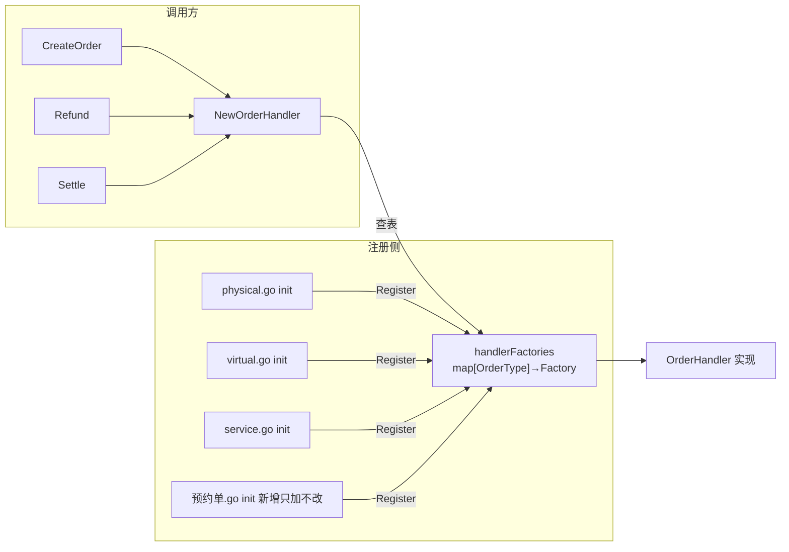

[第 1 篇](/posts/design-patterns-1-策略模式/)留了个尾巴：定价引擎解决了"促销怎么算"，但"这个订单用哪些促销"仍然散落在一堆 if 里。这篇把这个尾巴连同它的孪生问题一起解决——**按类型造对象**。

CloudShop 起家时只卖实物：订单类型一种，发货就是叫物流，世界简单。半年后上了会员卡和充值卡——虚拟商品，没有物流，"发货"变成发码，第一份 switch 就此埋下。又过仨月，"上门安装服务"上架：服务单要预约工程师，退款规则也和实物不同。每加一种类型，就是在既有的 switch 上再摞一层 case——三份拷贝的 switch，就这样一份一份长齐了。

## v0：三处一模一样的 switch

```go
// order/create.go —— CloudShop v0
func (s *Service) CreateOrder(t OrderType, req CreateReq) (*Order, error) {
	var h OrderHandler
	switch t {
	case TypePhysical:
		h = &PhysicalHandler{repo: s.repo, logistics: s.logistics}
	case TypeVirtual:
		h = &VirtualHandler{repo: s.repo, coder: s.coder}
	case TypeService:
		h = &ServiceHandler{repo: s.repo, scheduler: s.scheduler}
	}
	return h.Create(req)
}
```

`Refund` 里一份同样的 switch，`Settle`（结算）里又一份。疼在两处：

**构造细节泄露。** 每种 handler 需要什么依赖（物流客户端、发码器、预约系统）被创建方全部知道——调用方明明只想"下个单"。

**三份 switch 演三份错。** 接"预约服务单"新类型那周，创建和结算的 switch 都加了 case，退款的漏了。服务单的退款走进了实物流程，仓库收到一张"虚拟商品的退货单"。三份拷贝的 switch，漏一份是概率问题，不是运气问题。

## v1：简单工厂——new 至少只写一处

```go
func NewOrderHandler(t OrderType, deps Deps) (OrderHandler, error) {
	switch t {
	case TypePhysical:
		return &PhysicalHandler{repo: deps.Repo, logistics: deps.Logistics}, nil
	case TypeVirtual:
		return &VirtualHandler{repo: deps.Repo, coder: deps.Coder}, nil
	case TypeService:
		return &ServiceHandler{repo: deps.Repo, scheduler: deps.Scheduler}, nil
	default:
		return nil, fmt.Errorf("unknown order type: %d", t)
	}
}
```

三处调用改成 `NewOrderHandler(t, deps)`，构造细节收拢，漏改的风险从"三处"降到"一处"。这是**简单工厂**（也叫静态工厂）——不是 GoF 23 个里的正式成员，却是日常最常用的形态。

但开闭还没达成：加第四种订单类型，仍要修改这个工厂的 switch。工厂成了修改热点——所有新类型都往这一个文件里挤。

## v2：注册表式工厂——加新类型零改动老代码

把"类型 → 构造方式"的映射从 switch 硬编码改成运行时可写的注册表：

```go
// order/factory.go
type HandlerFactory func(deps Deps) OrderHandler

var handlerFactories = map[OrderType]HandlerFactory{}

func RegisterOrderHandler(t OrderType, f HandlerFactory) {
	handlerFactories[t] = f
}

func NewOrderHandler(t OrderType, deps Deps) (OrderHandler, error) {
	f, ok := handlerFactories[t]
	if !ok {
		return nil, fmt.Errorf("no handler registered for type %d", t)
	}
	return f(deps), nil
}

// order/physical.go —— 每种类型自己注册
func init() {
	RegisterOrderHandler(TypePhysical, func(d Deps) OrderHandler {
		return &PhysicalHandler{repo: d.Repo, logistics: d.Logistics}
	})
}
```

加"预约服务单" = 新建一个文件、实现 handler、`init` 里注册一行。`factory.go` 和三个旧文件**零改动**。v0 那个"漏一处退款 switch"的事故类别被整体消灭：不再存在需要同步修改的多份清单。

## 命名时刻，以及一次诚实的澄清

**工厂方法**在 GoF 里的原始定义是通过继承实现的：Creator 子类决定实例化哪个 Product。**Go 没有继承**，抄不了原版——但 v2 的注册表达成了完全相同的开闭意图。这正是[第 0 篇](/posts/design-patterns-0-开篇/)引 Fowler 那句话的实例：模式是力与权衡，语言不同，形状不同。Go 生态里"工厂"的惯用形态就是注册表。

顺手把三个容易混的名字钉清楚（抽象工厂[第 11 篇](/posts/design-patterns-11-冷门三连/)细讲）：

| 名字 | 管什么 | CloudShop 对应 |
|---|---|---|
| 简单工厂 | 一个函数里 switch 造对象 | v1 的 `NewOrderHandler` |
| 工厂方法 | 把"造哪种"下放/开放出去，加类型不改工厂 | v2 的注册表 |
| 抽象工厂 | 一次造**一族**相关对象 | 多币种账务族（第 11 篇） |



## 标准库里的落地

Go 标准库把这个模式用成了基础设施级惯例：

**`database/sql` 的 `sql.Register`。** 驱动包通过 blank import（`_ "github.com/go-sql-driver/mysql"`）触发 `init()`，里面调用 `sql.Register("mysql", &MySQLDriver{})` 把自己注册进全局驱动表。`sql.Open("mysql", dsn)` 查表拿驱动——`sql.Open` 从不知道 mysql 的存在。加新数据库 = 加一个 import，标准库零改动。

`sql.Register` 的实现值得贴——注册表工厂的全部要素，标准库只用了十行不到：

```go
// database/sql/sql.go —— 真实源码（节选）
var (
	driversMu sync.Mutex
	drivers   = make(map[string]driver.Driver)
)

func Register(name string, driver driver.Driver) {
	driversMu.Lock()
	defer driversMu.Unlock()
	if driver == nil {
		panic("sql: Register driver is nil")
	}
	if _, dup := drivers[name]; dup {
		panic("sql: Register called twice for driver " + name)
	}
	drivers[name] = driver
}
```

三个细节都是生产级注册表的必修课：**互斥锁**（多个包的 `init()` 理论上可并发触发的防御）；**nil 驱动直接 panic**（注册期失败优于运行期诡异错误——与[第 3 篇](/posts/design-patterns-3-单例/)Must 惯例同一哲学：启动期大声失败）；**重复注册 panic**（两个包注册同名"mysql"是明确的装配错误，静默覆盖会把问题推迟到深夜的线上）。

**`image.RegisterFormat`。** png、jpeg、gif 各自的包在 `init()` 里注册格式名、魔数和解码器，`image.Decode` 靠注册表识别格式。`import _ "image/png"` 的那一刻，就是在参与一次工厂注册。

**每一个 blank import，都是一次安静的工厂调用。**

## 业务实战：美团的策略工厂

第 1 篇留的线索在这里兑现：返奖策略有了好几个实现，**"这一次用哪个"谁来管**？美团返奖系统（[《设计模式在外卖营销业务中的实践》](https://tech.meituan.com/2020/03/19/Software-design-pattern-practice-in-marketing.html)）把这件事交给了工厂。结构分两层：抽象工厂 `StrategyFactory` 定契约——`createStrategy(Class c)` 进策略类、出策略实例；具体工厂 `FactorRewardStrategyFactory` 实现它，用的是 Java 反射：

```java
// 按美团原文结构复原（异常处理从简）
public class FactorRewardStrategyFactory extends StrategyFactory {
    @Override
    public RewardStrategy createStrategy(Class c) {
        RewardStrategy product = null;
        try {
            product = (RewardStrategy) Class.forName(c.getName()).newInstance();
        } catch (Exception e) {
            // 原文此处异常被吞掉
        }
        return product;
    }
}
```

调用方是主流程 `InviteRewardImpl.sendReward`：查出被邀请人、判断新老用户、选定策略类，再交给工厂产出实例。**"选哪个类"的判断在调用方，工厂负责"从类到对象"这一步**——选择没有魔法，只是被搬到了一个专职的位置。

这段代码值得盯着看一会儿，两处妥协都是 Java 习惯的产物。其一，反射拿实例：类在运行时才被加载和构造，绕过了编译期检查；异常被 catch 后吞掉、返回 null，调用方拿到的是颗哑弹。其二，工厂里没有缓存也没有注册表，每次调用都反射新建实例。Go 的惯用形状不这么写——v2 的 map 存构造函数：类型在编译期就被 `func() Promotion` 签名约束，拼错 key 是查表 miss 而不是运行时崩溃，构造函数本身即注册。**同一个意图，语言惯用形状不同**，这也回应第 0 篇"Go 学模式先拆 Java 习惯"：学的是"创建要收口"这个意图，不是抄反射的实现。

第 1 篇的另一个尾巴也在这篇收掉：定价引擎的 `[]Promotion` 从哪来？促销类型注册表 + 数据库配置（类型、参数、互斥组、优先级），启动时查表组装。策略管算法，工厂管选择，两边各自变化。

## 好处与代价

| 好处 | 代价 |
|---|---|
| 加类型只增不改（开闭） | "隐藏的接线"：新人 grep `NewOrderHandler` 找不到谁注册了预约单 |
| 构造细节收拢，调用方只懂抽象 | import 副作用：注册发生在 `init()`，顺序依赖要小心 |
| 三份 switch 合并为一份真理 | 未注册类型的错误延迟到运行时（编译器不再帮你查 switch 漏 case） |
| 标准库同款，Go 工程师都认识 | map 本身无序，若顺序有意义要另行处理 |

## 什么时候不要用

- **类型少且稳定**：三个 case 的 switch 直白、可跳转、编译期查漏，没罪。为"可能的扩展"提前建注册表，是模式瘾的典型发作。
- **只在一个地方造对象**：一处调用的 switch 收进简单工厂都嫌多余，何况注册表。
- **依赖注入框架在场**：团队已经用 wire/fx 管组装时，对象图的构造交给框架，手写注册表反而制造两套真理。
- Rob Pike 的告诫再念一遍：a little copying is better than a little dependency。三行重复的 switch，好过一套为消灭它而生的注册机制。

## 易混淆

**工厂 vs 建造者**（[第 2 篇](/posts/design-patterns-2-建造者与函数选项/)）：工厂回答"造**哪一种**"，建造者回答"这一种**怎么配**"。造哪种订单是工厂，配十二个查询条件是建造者，两者经常串联：工厂造出 handler，建造者配它的参数。

**工厂 vs 注册表**（[第 20 篇](/posts/design-patterns-20-注册表/)）：这篇的注册表既是工厂的实现手段，本身也是一个独立模式（服务发现、插件系统）。工厂视角看它"造对象"，注册表视角看它"管理映射"。同一结构，两个意图，第 20 篇从另一个视角重游。

## 自测

1. v0 的事故（退款 switch 漏改）在 v1 里风险降了多少？为什么 v2 能把这类事故**整体**消灭而不是降低概率？
2. `_ "github.com/go-sql-driver/mysql"` 这个 blank import 拆开来看，注册表模式里每个角色分别由什么承担？
3. 美团用反射、CloudShop 用 map 注册，两者在"力与意图"上哪里相同？Go 不用反射的理由是什么？
4. 什么时候"三行重复 switch"优于注册表？给一个你项目里的判断实例。

---

**参考来源**

- GoF, *Design Patterns* — 工厂方法定义（继承形态）；Go 语境下的形态转换
- Go 标准库 `database/sql.Register`、`image.RegisterFormat` 源码 — 注册表式工厂的官方实现
- Refactoring.guru, [Factory Method](https://refactoring.guru/design-patterns/factory-method)
- 美团技术团队，《设计模式在外卖营销业务中的实践》— `FactorRewardStrategyFactory` 真实实现
