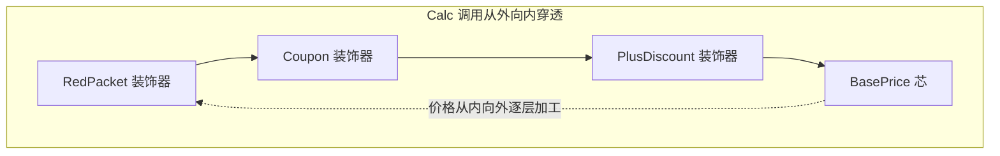

第 1 篇解决了"平行选择"（一组促销里挑哪个），这篇解决另一半：**层层包裹**。两种疼长得像，解法完全不同。

双 12 之后，运营的新需求单：

> 红包之后要能叠店铺券；另外有个 A/B 实验——凌晨时段对 PLUS 会员开"额外 97 折"。优惠是**一层压一层**的：上一层算完的价，是下一层的输入。

## v0：布尔参数的笛卡尔积

```go
// pricing/calc.go —— CloudShop v0 又膨胀了
func (s *OrderService) calcPrice(o *Order,
	applyVip bool, applyCoupon bool, applyShopCoupon bool,
	applyRedPacket bool, applyExpDiscount bool) int64 {

	amount := o.BaseAmount
	if applyVip && o.UserLevel == LevelPlus {
		amount = amount * 95 / 100
	}
	if applyCoupon && o.Coupon != nil {
		amount -= o.Coupon.Value
	}
	if applyShopCoupon && o.ShopCoupon != nil {
		amount -= o.ShopCoupon.Value
	}
	if applyRedPacket {
		amount -= o.RedPacket
	}
	if applyExpDiscount && s.expOn() {
		amount = amount * 97 / 100
	}
	return amount
}
```

五个 bool，32 种组合，调用方自己拼。而且这些优惠不是平行关系——**顺序就是钱**：先 95 折再减 20 元券，和先减券再打折，价差能到几块钱。这个函数体把"每层是什么"和"层怎么叠"又一次焊死了，和第 1 篇的 v0 是同一类病，只是从"平行分支"变成了"串行层叠"。

## v1：一条 Java 会走、Go 走不通的弯路

教科书对"动态加功能"的第一反应是继承：`PlusWithCouponOrder` 继承 `PlusOrder`，`PlusWithCouponWithRedPacketOrder` 继承 `PlusWithCouponOrder`……会员等级 × 优惠组合，子类数量按乘法爆炸。而且每个子类只是重写一个方法，改一层要检查整条继承链。

Go 的好消息是**这条路直接不存在**——没有继承。想抄 Java 的答案都抄不了，语言逼着换思路：给对象加行为，不靠"是什么"（继承），靠"包一层"（组合）。

## v2：函数组合——装饰的函数形态

先看穿一件事：每一层优惠都是同一个签名 `价格 → 价格`。

```go
type PriceStage func(o *Order, amount int64) int64

func plusDiscount(o *Order, a int64) int64 {
	if o.UserLevel != LevelPlus {
		return a
	}
	return a * 95 / 100
}

func coupon(o *Order, a int64) int64 {
	if o.Coupon == nil {
		return a
	}
	return a - o.Coupon.Value
}

// 组装：切片顺序 = 叠加顺序
stages := []PriceStage{plusDiscount, coupon, redPacket}
amount := o.BaseAmount
for _, s := range stages {
	amount = s(o, amount)
}
```

加店铺券 = 追加一个函数进切片；实验折扣 = 再追加一个。叠加顺序从代码的物理布局（if 的先后）升级为数据的顺序（切片下标）——运营要调顺序，改配置就行。

这已经是装饰器的全部灵魂了：**每层拿上一层的输出往下算，层与层彼此不知存在**。

## v3：接口形态——当层需要状态和多个方法

函数形态够用到大半场景。但 CloudShop 的层开始携带状态（券有自己的阈值和面额）和辅助行为（调试时要打印每层结果），这时上接口形态——**装饰器实现被装饰者的接口，并持有下一个被装饰者**：

```go
type Calculator interface {
	Calc(o *Order) int64
}

// 基础价：洋葱的芯
type BasePrice struct{}

func (BasePrice) Calc(o *Order) int64 { return o.BaseAmount }

// 每层装饰器：持有 next，实现同一接口
type PlusDiscount struct{ Next Calculator }

func (d PlusDiscount) Calc(o *Order) int64 {
	a := d.Next.Calc(o)
	if o.UserLevel != "PLUS" {
		return a
	}
	return a * 95 / 100
}

type Coupon struct {
	Next      Calculator
	Threshold int64 // 层可以带状态了
	Cut       int64
}

func (c Coupon) Calc(o *Order) int64 {
	a := c.Next.Calc(o)
	if a >= c.Threshold {
		return a - c.Cut
	}
	return a
}

type RedPacket struct {
	Next  Calculator
	Value int64
}

func (r RedPacket) Calc(o *Order) int64 {
	return max(0, r.Next.Calc(o)-r.Value)
}
```

```go
// 组装：包的顺序就是叠加顺序，从内向外读
var c Calculator = BasePrice{}
c = PlusDiscount{Next: c}
c = Coupon{Next: c, Threshold: 10000, Cut: 2000}
c = RedPacket{Next: c, Value: 500}

c.Calc(&Order{UserLevel: "PLUS", BaseAmount: 32000})
// 32000 →95折 30400 →满100减20 28400 →红包5元 27900
```

**命名时刻**：装饰器模式——动态地给对象叠加行为，每层实现同一接口并包裹前一层，接口形状不变、行为层层增加。它解决的力：功能的组合是运行时才确定的，且组合方式按乘法增长，继承追不上。



对照第 1 篇，同与异一眼看清：

| | 策略（第 1 篇） | 装饰器（本篇） |
|---|---|---|
| 关系 | 多个策略**平行**，编排者挑用 | 多层装饰**串行**，一层包一层 |
| 数据流 | 每个策略独立算，引擎汇总 | 每层消费上一层的输出 |
| 典型问题 | 互斥择优 | 叠加顺序 |

## 你天天在用

**`io.Reader` 套娃——标准库里最著名的一串洋葱。**

```go
f, _ := os.Open("data.gz")
br := bufio.NewReader(f)        // 加缓冲层
zr, err := gzip.NewReader(br)   // 加解压层
```

`bufio.Reader` 实现了 `io.Reader`，内部包着另一个 `io.Reader`；`gzip.Reader` 又包着它。加缓冲、加解压、加限速（`io.LimitReader`）、加校验，全是往上包洋葱——`gzip` 的代码不知道也不关心自己包的是文件还是网络连接。这就是为什么 Go 的 IO 库能像积木一样拼。

**`http.Handler` 中间件。**

```go
http.Handle("/", loggingMiddleware(authMiddleware(h)))
```

`func(http.ResponseWriter, *http.Request)` 签名的函数包装另一个同签名函数——日志层包着鉴权层包着业务。每个中间件是一个装饰器，这是 Go Web 生态的通用语。（它和责任链的微妙区别，[第 16 篇](/posts/design-patterns-16-责任链/)专门辨析。）

## 业务实战

CloudShop 的两个落点：

**定价管线**：装饰器形态上线，层的顺序从运营配置渲染——"叠加顺序就是钱"从注释变成了显式的组装代码，review 时一眼看清。

**风控的审计包装**：风控服务要记操作流水（谁、何时、过了哪条规则），但不想把审计逻辑搅进规则本身。给 `RiskService` 上一个装饰层：

```go
type AuditedRisk struct{ Next RiskService }

func (a AuditedRisk) Check(ctx context.Context, o *Order) (bool, error) {
	start := time.Now()
	pass, err := a.Next.Check(ctx, o)
	audit.Log(ctx, map[string]any{ // 审计是"包"上去的，业务零改动
		"order": o.ID, "pass": pass, "cost": time.Since(start),
	})
	return pass, err
}
```

审计不是风控的一部分，是风控外面的一层——将来要加监控、加灰度开关，继续往外包，`RiskService` 本体不动。

## 好处与代价

| 好处 | 代价 |
|---|---|
| 组合运行时决定，乘法增长的功能不靠乘法数量的类 | 排错难：一个价错了，得还原"经过了哪几层、什么序" |
| 每层独立实现、独立测试 | 顺序语义必须显式（文档/组装处注释），顺序错=钱错 |
| 接口保形，调用方完全无感 | 装饰器必须实现**整个**接口：10 个方法的接口装饰一次要写 10 个转发（接口隔离的又一场胜利） |
| 加功能零改动被装饰者 | 层数超过四五层，可读性开始崩 |

## 什么时候不要用

- **只给一个方法加日志/计时**：写个普通函数调用比包装整个接口直接得多。装饰器的成本在"保形"，一个方法的接口才划算。
- **层的组合固定且简单**：两层永远按固定顺序，显式函数调用（`price(coupon(vip(base)))`）比三层 struct 更好读。
- **需要"跳过某层"的复杂动态逻辑**：那更像流水线（[第 19 篇](/posts/design-patterns-19-流水线/)），每层可插拔可编排，比手包洋葱清晰。

## 易混淆

**装饰器 vs 代理**（[第 10 篇](/posts/design-patterns-10-代理/)）：结构图一模一样（都实现接口并包着同类）！差别在**意图**：装饰器是"往上加行为"，代理是"控制对目标的访问"（懒加载、鉴权、远程转发）。同一结构，两个意图——读代码时判断依据是它包裹后**多了什么**还是**拦了什么**。

**装饰器 vs 责任链**（第 16 篇）：装饰器每层都**加工**数据后必传给下一层；责任链每层**决定**处理完就停还是放行。一个全链穿透，一个可中断。

**装饰器 vs 组合**（[第 9 篇](/posts/design-patterns-9-组合/)）：装饰器包**一个**同类（纵向叠加），组合持**多个**孩子（横向成树）。

## 自测

1. v2 的函数形态和 v3 的接口形态，分界线在哪？CloudShop 为什么最终选了 v3？
2. `gzip.NewReader(bufio.NewReader(f))` 这一行里，洋葱的芯和各层分别是什么？把缓冲层和解压层换个顺序，行为有什么差别？
3. 装饰器和代理结构相同、意图不同。给 `AuditedRisk` 和"懒加载商品大字段的代理"各写一句"它包着 next 之后干了什么"，体会两种意图。
4. 运营把"会员折扣"从最内层挪到最外层，价格为什么变？用 32000、95 折、满 100 减 20 的例子算出前后差。

---

**参考来源**

- GoF, *Design Patterns* — 装饰器原始定义
- Go 标准库 `io` 包文档 — Reader 组合的设计哲学
- Refactoring.guru, [Decorator](https://refactoring.guru/design-patterns/decorator) — 组合优于继承的论证
- Go 社区 `http` 中间件惯例 — 函数式装饰器在 Web 生态的形态
