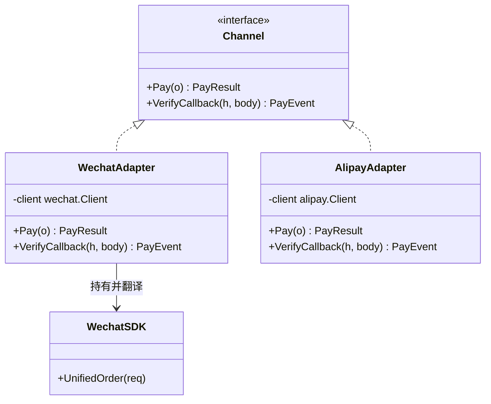

第一部分解决的是"对象怎么造、怎么叠"。第二部分进入结构级痛点：**模块与模块之间怎么接**。第一个场景是每个交易系统都逃不掉的：对接第三方。

CloudShop 起步时只接了微信支付。一家渠道的日子很滋润：SDK 拉进来，参数怎么传、回调怎么验，全都照着微信一家写，谈不上什么设计——也不需要。变化在半年后到来：用户增长撞上了支付宝用户的墙，"付不了款就走人"的流失数据摆上桌，第二家渠道接入开工。那次重构已经隐约不舒服了——支付代码里开始出现按渠道分叉的 if。又过了三个月，银行侧的合作把银联也送了进来。第三家接入排期评审时，负责的工程师把 `PayService` 拉出来给大家看：三家的参数名、签名算法、回调格式完全没有商量余地，而这三张皮的差异，已经和业务逻辑搅在同一团代码里了。

## v0：三张皮塞进一个函数

```go
// pay/service.go —— CloudShop v0
func (s *PayService) Pay(ctx context.Context, ch Channel, o *Order) error {
	switch ch {
	case ChannelWechat:
		req := map[string]string{
			"appid":        s.cfg.WechatAppID,
			"mch_id":       s.cfg.WechatMchID,
			"out_trade_no": o.ID,
			"total_fee":    strconv.FormatInt(o.Amount, 10),
			// ... 还有 14 个字段
		}
		req["sign"] = s.wechatSign(req) // MD5 拼接
		resp, err := s.wechatClient.UnifiedOrder(ctx, req)
		if err != nil || resp.ReturnCode != "SUCCESS" {
			return err
		}
		o.PrepayID = resp.PrepayID

	case ChannelAlipay:
		biz := fmt.Sprintf(`{"out_trade_no":"%s","total_amount":"%s"}`, o.ID, fenToYuan(o.Amount))
		sign := s.alipaySign(biz) // RSA2
		resp, err := s.alipayClient.TradePrecreate(ctx, biz, sign)
		if err != nil || resp.Code != "10000" {
			return err
		}
		o.QRCode = resp.QRCode

	case ChannelUnion:
		// 证书文件读取 + Dict 排序签名 + 报文头 ...
	}
	return nil
}
```

回调处理是另一坨同样的三路 switch。疼在结构性：**统一流程（下单→签名→调用→解析→落库→回调）被三家差异搅成一团**。接第四家渠道 = 这两坨 switch 各剖开一次；v0 的每一处改动都要同时理解三种协议。

## v1：一条注定失败的"统一"路

先试最直觉的方案：定义一个超集请求结构，三家字段都放进去。

```go
type UnifiedPayReq struct {
	OrderID    string
	Amount     int64
	AppID      string  // 微信用
	MchID      string  // 微信用
	BizContent string  // 支付宝用
	CertPath   string  // 银联用
	// ...
}
```

这条路走不通的原因值得想透：**超集没有消除差异，只是把差异从"编译期类型"挪进了"运行时空字段"**。渠道 A 的必填字段在 B 是空的，漏填哪个要到渠道服务器报错才知道；签名方式仍然三套；回调格式仍然三种。字段统一了，语义没统一。

## v2：每家一个适配器

换思路：不统一"参数"，统一"接口"。系统内部只认一个 `Channel` 接口，每家渠道写一个适配器，**转换逻辑（内部统一请求 → 渠道参数，渠道回调 → 内部统一事件）关在适配器里**：

```go
// pay/channel.go —— 内部唯一的支付渠道抽象
type Channel interface {
	Pay(ctx context.Context, o *Order) (*PayResult, error)
	VerifyCallback(headers http.Header, body []byte) (*PayEvent, error)
}

// pay/wechat_adapter.go
type WechatAdapter struct {
	client *wechat.Client // 厂商 SDK，一个字不改
	cfg    WechatConfig
}

func (a *WechatAdapter) Pay(ctx context.Context, o *Order) (*PayResult, error) {
	req := a.buildUnifiedOrder(o)     // Order → 微信 17 个字段的映射
	req["sign"] = a.sign(req)         // MD5 拼接签名
	resp, err := a.client.UnifiedOrder(ctx, req)
	if err != nil {
		return nil, err
	}
	return &PayResult{PrepayID: resp.PrepayID}, nil // 微信响应 → 统一结果
}

func (a *WechatAdapter) VerifyCallback(h http.Header, body []byte) (*PayEvent, error) {
	n := wechat.ParseNotify(body)    // XML → 结构
	if !a.verifySign(n) {
		return nil, ErrBadSign
	}
	return &PayEvent{OrderID: n.OutTradeNo, Paid: n.ResultCode == "SUCCESS"}, nil
}

// AlipayAdapter、UnionAdapter 同构：各管各的映射与签名
```

`PayService` 从此只认 `Channel`：

```go
func (s *PayService) Pay(ctx context.Context, chName string, o *Order) error {
	ch, err := s.channel(chName) // 查注册表（第 4 篇）
	if err != nil {
		return err
	}
	res, err := ch.Pay(ctx, o) // 统一流程，无渠道分支
	if err != nil {
		return err
	}
	return s.save(ctx, o, res)
}
```

接第四家渠道 = 新建一个适配器文件 + 注册，`PayService` 零改动。三家的协议差异被压缩到三个文件里，每个文件只说一种语言。

## 命名时刻

**适配器模式：将一个类的接口转换成调用方期望的另一个接口**。它回应的力很具体：**两个接口都要用，但一个也改不了**——厂商 SDK 改不了，内部统一接口也不该为任何一家厂商扭曲。适配器站在边界上做翻译，双方保持原样。



判断适配器做对了的标志：**适配器里只有翻译，没有业务**。如果 `WechatAdapter.Pay` 里开始写"满 100 减 20"的判断，边界就烂了——业务属于 `PayService`，适配器只该出现"字段怎么映射、签名怎么算"。

## 标准库里的落地

**`http.HandlerFunc`——把函数适配成接口的官方三行。**

```go
// net/http/server.go —— 真实源码
type HandlerFunc func(ResponseWriter, *Request)

func (f HandlerFunc) ServeHTTP(w ResponseWriter, r *Request) {
	f(w, r)
}
```

Go 的 handler 参数要求是 `Handler` 接口，但多数时候手上只有一个函数。`HandlerFunc` 给函数"套壳"补上 `ServeHTTP` 方法——函数瞬间满足接口。这是 Go 里最短的适配器，也是 `http.HandleFunc("/", myFunc)` 能工作的全部原因。

**`database/sql` 的驱动体系**是一个双向适配器网络：每个驱动包（go-sql-driver/mysql）把各数据库的私有协议适配到 `driver.Driver`/`driver.Conn` 接口上，`sql.DB` 再把这些接口适配成用户友好的 `Query`/`Exec`。用户代码和数据库协议各自独立演化，两边的变化被驱动适配层吸收。

### Go 特色：有一半的适配器，语言替你写了

Java 里接口不匹配就得写适配器类，Go 的**隐式接口满足**经常让这步直接消失：只要在**消费侧**定义一个小接口，让已有类型天然满足它，什么都不用写。Stack Exchange 上有个[经典讨论](https://softwareengineering.stackexchange.com/questions/157943/are-there-any-design-patterns-that-unnecessary-in-dynamic-languages-like-pyt)专门讲哪些 GoF 模式因此退化——适配器是重灾区。

所以 Go 里写适配器前先问一句：**能不能在消费侧定义接口让双方都满足？** 只有两个类型都动不了（厂商 SDK vs 内部规范接口）时，适配器才真正登场。这也是[第 0 篇](/posts/design-patterns-0-开篇/)"有些模式在 Go 里消失了是语言替你干了"的第一个实例。

## 业务实战

CloudShop 落地后的结构：`pay/` 下 `channel.go`（接口）、`wechat_adapter.go`、`alipay_adapter.go`、`union_adapter.go`，每个适配器 150 行上下，全部是映射和签名。

真实世界对照：支付网关的统一收单层就是适配器模式的产品化——[美团支付通道自动化](https://tech.meituan.com/2017/10/27/pay-paygw-automation-system.html)和 [Stripe 多网关路由](https://stripe.com/zh-sg/resources/more/multiple-payment-gateways-101-what-they-are-and-how-to-use-them)都描述了这层统一接口，之上再叠渠道路由（按成功率、费率、限额、渠道状态选渠道——那是[策略](/posts/design-patterns-1-策略模式/)和[注册表](/posts/design-patterns-4-工厂方法/)的活）。美团技术团队那篇《设计模式在外卖营销业务中的实践》还点了一个高级用法：**DDD 的防腐层用适配器隔离第三方服务**——防止外部的概念模型（比如渠道的"交易单"）渗进内部模型（CloudShop 的 `Order`），适配器就是那道防腐的墙。

## 好处与代价

| 好处 | 代价 |
|---|---|
| 系统内部只见统一接口，协议差异被关押 | 翻译代码琐碎，三家字段映射就是三份体力活 |
| 加渠道 = 加文件 + 注册，主流程零改动 | 渠道 API 升级（v2→v3）时适配器全部重考 |
| 回调验签、幂等这些每家不同的细节有了明确住所 | 接口设计要克制：方法每多一个，新适配器多实现一个 |
| 防腐：外部概念不渗入内部模型 | 多一层跳转，调试时多看一个文件 |

## 什么时候不要用

- **消费侧能定义小接口让双方满足**：隐式满足优先，零成本。
- **只有一家渠道**：统一接口是为"第二家"准备的。等真的要接第二家时再抽，第一次对接时抽的接口往往猜错方向（YAGNI 在这里格外灵验）。
- **接口差异是自家的设计失误**：两套自家接口不兼容，先重构归一，别拿适配器糊——那只是把债务换个账户记账。

## 易混淆

**适配器 vs [外观](/posts/design-patterns-7-外观/)（第 7 篇）**：适配器做**接口转换**，保语义换形状；外观做**入口简化**，把多步调用收拢成一个。一个变接口，一个变粒度。

**适配器 vs [代理](/posts/design-patterns-10-代理/)（第 10 篇）**：适配器改变接口形状（两套接口 → 一套）；代理保持接口形状不变（同一接口，控制访问）。

**适配器 vs [桥接](/posts/design-patterns-8-桥接/)（第 8 篇）**：适配器是**事后缝合**（两个已有接口凑合工作）；桥接是**预先设计**（预见到两个维度都要变，提前分离）。一个是补救，一个是远见。

## 自测

1. v1 的超集方案为什么失败？"字段统一了，语义没统一"具体指什么？
2. `http.HandlerFunc` 的三行源码里，"被适配者"和"目标接口"分别是什么？
3. 什么情况下 Go 不需要写适配器？举一个 CloudShop 里"消费侧定义接口就够"的例子。
4. 美团说的"DDD 防腐层用适配器"，防的是什么腐？如果微信的"交易单"概念直接渗进 `OrderService`，半年后会看到什么？

---

**参考来源**

- GoF, *Design Patterns* — 适配器原始定义
- `net/http.HandlerFunc`、`database/sql/driver` 源码 — 标准库适配器
- Stack Exchange, *Are there any design patterns that are unnecessary in Go* — 隐式接口让模式退化
- 美团技术团队，《设计模式在外卖营销业务中的实践》— DDD 防腐层的适配器用法
- 美团《支付通道自动化管理》+ Stripe 多网关 — 真实统一收单层
