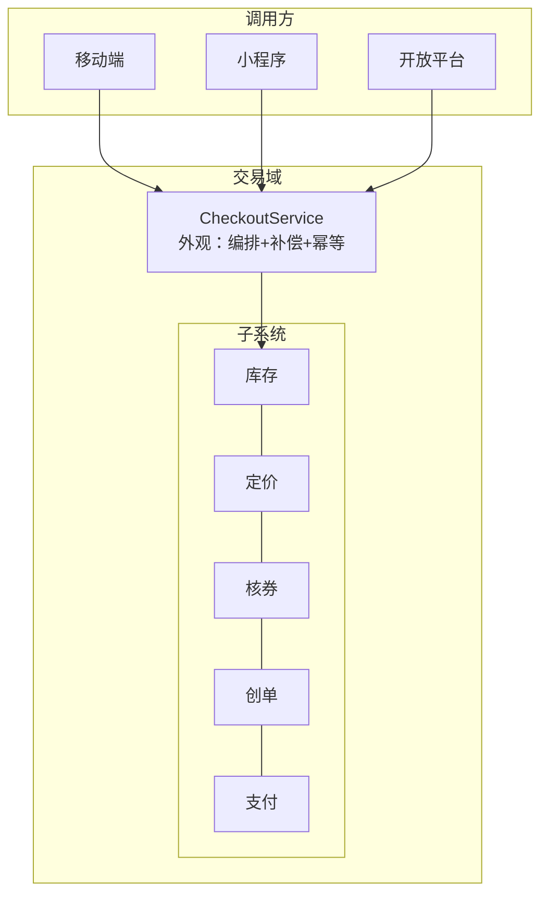

[适配器](/posts/design-patterns-6-适配器/)解决"接口对不上"，这篇解决"接口太多"。子系统本身没病——库存、定价、核券、创单、支付每个都设计良好——但**正确使用它们的流程**，不该是每个调用方都背一遍的常识。

## v0：移动端写了 300 行编排

移动端的"立即购买"按钮，直连五个内部服务：

```go
// mobile/checkout.go —— CloudShop v0
func BuyNow(ctx context.Context, req BuyReq) error {
	// 1. 锁库存
	lockID, err := inventoryClient.Lock(ctx, req.SKU, req.Qty, 10*time.Minute)
	if err != nil {
		return err
	}

	// 2. 算价（失败要释放库存）
	price, err := pricingClient.Calc(ctx, req.SKU, req.Qty, req.CouponID)
	if err != nil {
		inventoryClient.Release(ctx, lockID) // 补偿①
		return err
	}

	// 3. 核销优惠券（失败要释放库存）
	if err := couponClient.Redeem(ctx, req.UserID, req.CouponID); err != nil {
		inventoryClient.Release(ctx, lockID) // 补偿②
		return err
	}

	// 4. 创建订单
	order, err := orderClient.Create(ctx, req.UserID, req.SKU, req.Qty, price)
	if err != nil {
		inventoryClient.Release(ctx, lockID)      // 补偿③
		couponClient.Refund(ctx, req.CouponID)    // 补偿④
		return err
	}

	// 5. 发起支付 ...
	return payClient.Prepare(ctx, order.ID, price)
}
```

三个月后小程序上线，这段编排被**抄写了一遍**——补偿逻辑漏了"补偿④"（失败时不退券），用户投诉"券没了订单也没生成"。抄写第二遍时漏一处，这不是粗心，是概率：**编排知识泄漏给 N 个调用方，就会有 N 份各自腐化的副本**。而且调用方了解到了不该了解的细节：锁库存的 10 分钟超时、失败补偿的顺序——这些是交易域的内部事务。

## v1：把编排收进一个门面

```go
// trade/checkout.go —— 交易域自己管自己的流程
type CheckoutService struct {
	inventory *inventory.Client
	pricing   *pricing.Client
	coupon    *coupon.Client
	order     *order.Client
	pay       *pay.Client
}

func (s *CheckoutService) SubmitOrder(ctx context.Context, req SubmitReq) (*Order, error) {
	lockID, err := s.inventory.Lock(ctx, req.SKU, req.Qty, 10*time.Minute)
	if err != nil {
		return nil, err
	}
	defer s.onFailure(ctx, lockID, req.CouponID) // 补偿收拢成一处

	price, err := s.pricing.Calc(ctx, req.SKU, req.Qty, req.CouponID)
	if err != nil {
		return nil, err
	}
	if err := s.coupon.Redeem(ctx, req.UserID, req.CouponID); err != nil {
		return nil, err
	}
	order, err := s.order.Create(ctx, req.UserID, req.SKU, req.Qty, price, IdempotencyKey(req)) // 幂等键防双击
	if err != nil {
		return nil, err
	}
	return order, s.pay.Prepare(ctx, order.ID, price)
}
```

调用方（移动端、小程序、开放平台 API）全部变成一行：`checkout.SubmitOrder(ctx, req)`。补偿逻辑只有一个真理源；"锁库存超时 10 分钟"回到交易域内部，调用方不再需要知道。

## 命名时刻

**外观模式：为子系统中的一组接口提供一个统一的高层入口，降低使用成本**。它回应的力：**子系统本身复杂且正确，但每个调用方都要重复正确的编排**——把编排知识收敛成一层薄门面，复杂度被关进门后。

两个容易忽略的要点。**其一，外观只编排、不实现**：`SubmitOrder` 里没有一行库存逻辑或定价算法，它只是按正确顺序调用子系统并处理失败——一旦外观里长出业务实现，就开始滑向上帝对象（下文细说）。**其二，外观不封锁子系统**：需要细粒度控制的调用方仍然可以直接调 `inventory.Lock`。外观提供的是"默认的正确用法"，不是唯一的用法。



## 标准库里的落地

**`http.Get`——一次调用的外观。** 完整姿势是四步：`NewRequest` → `DefaultClient.Do` → 读 body → `Close`，漏了 Close 就泄漏连接。`http.Get(url)` 把这四步编排成一行——它没有替你做任何新事情，只是把"正确用法"固化了。这正是外观的定义。

**`sql.DB.QueryRow`。** `Query` 返回 `*Rows`，调用方要 `Next` + `Scan` + `Close` + 错误检查五步。`QueryRow` 把"查一行"的编排收拢，配合 `err` 延迟返回（`Row.Scan` 时才报错）消化了中间错误处理的样板。日常代码里"顺手写出的外观"大多长这个样子：**一个函数，把惯用多步序列固化**。

## 业务实战

CloudShop 的完整落法分了三层外观，粒度不同：

- `SubmitOrder`（粗粒度）：给页面和开放平台的"一键"入口
- `ReserveStock`（中粒度）：给购物车预占的入口
- 底层五个子系统客户端原样暴露（细粒度）：给运营后台做特殊流程

真实世界对照：各电商开放平台的"交易下单 API"就是产品化的外观——淘宝 `trade.create`、拼多多的 order 提交接口，背后都是十几个子系统的一步编排。反过来的教训同样真实：外观层如果开始直接写 SQL、算价格，半年后就没人分得清"交易域"和"外观层"的边界——**上帝对象的起点，往往是一个开始实现业务的外观**。守住"只编排"这条线，是外观模式全部的纪律。

## 好处与代价

| 好处 | 代价 |
|---|---|
| 编排与补偿有唯一真理源，消灭 N 份漂移副本 | 外观层容易膨胀成万物中转站 |
| 调用方与子系统解耦，子系统重构不动调用方 | 多一层，简单场景多一跳 |
| 幂等、超时、补偿这些横切策略有了统一住所 | 粒度设计要花心思（粗/中/细并存） |
| 新调用方接入成本从 300 行降到 1 行 | 外观与子系统的版本耦合（子系统改语义，外观要跟） |

## 什么时候不要用

- **只有一个调用方**：直接编排即可，外观是为复用编排而生的。
- **外观只剩转发**：一个方法一行 `return sub.Do()`，没有编排、没有补偿、没有横切逻辑——这层空气套壳应该删掉。
- **调用方需要的就是细粒度组合**：比如运营后台要"只创单不支付"，硬塞进粗粒度外观反而扭曲接口。
- **系统已经太小**：三个函数的模块配一个外观，是官僚层级，不是设计。

## 易混淆

**外观 vs 适配器**（[第 6 篇](/posts/design-patterns-6-适配器/)）：适配器转换接口**形状**（A 接口变 B 接口）；外观简化接口**数量**（五个变一个）。一个是变压插座，一个是前台窗口。

**外观 vs [中介者](/posts/design-patterns-17-冷门五连/)（第 17 篇）**：外观是**单向简化**——调用方进门，子系统不认识调用方；中介者是**双向协调**——各同事通过它互相通信，谁也不直接找谁。下单是外观（客户端→流程），各域联动是中介者/事件（库存↔积分↔通知）。

**外观 vs [建造者](/posts/design-patterns-2-建造者与函数选项/)（第 2 篇）**：建造者"配置出一个对象"，外观"编排成一个流程"。一个管造，一个管用。

## 自测

1. v0 小程序漏掉"补偿④"的事故，属于外观模式要解决的哪种力？为什么说抄写三遍必漏是概率问题而非态度问题？
2. `SubmitOrder` 里那行 `IdempotencyKey(req)` 防的是什么？为什么幂等键应该放在外观层而不是各子系统自己防？
3. "外观只编排、不实现"——如果 `CheckoutService.SubmitOrder` 里出现一段满减计算代码，具体会发生什么？描述半年后的系统形态。
4. `http.Get` 和 `sql.DB.QueryRow` 分别固化了哪几步"正确用法"？

---

**参考来源**

- GoF, *Design Patterns* — 外观原始定义
- Refactoring.guru, [Facade](https://refactoring.guru/design-patterns/facade) — "提供简化的高级接口"
- `net/http` 的 `Get/Post` 帮助函数、`database/sql` 的 `QueryRow` — 标准库里的惯用外观
