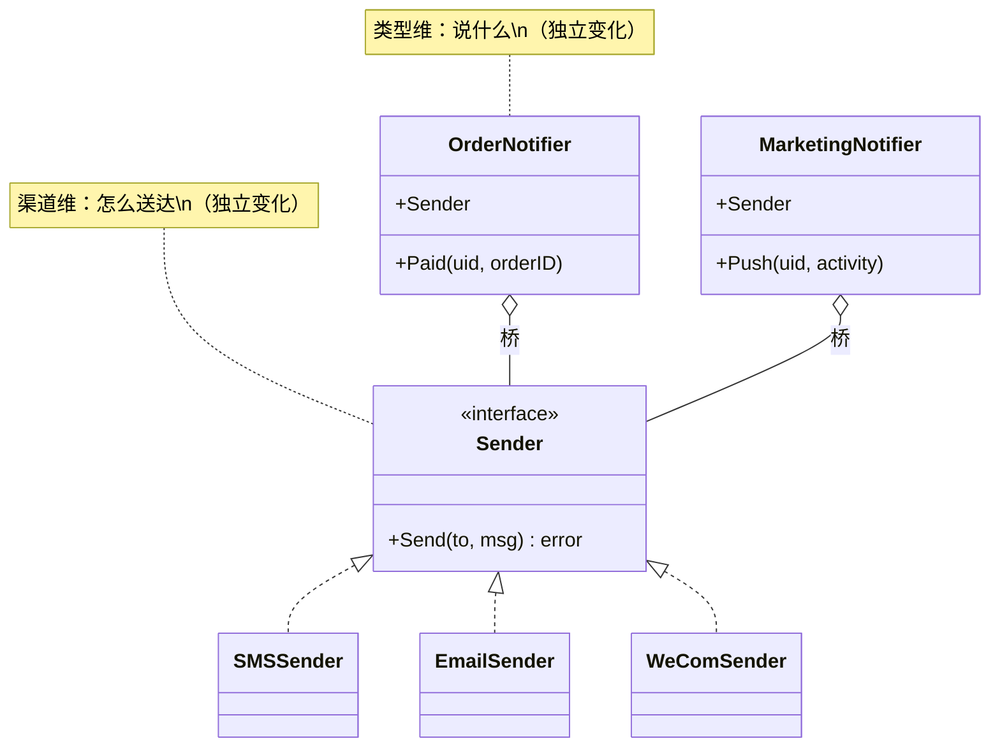

前两篇的疼是"数量"（接口太多、调用太繁），这篇的疼是**乘法**：两个维度各自独立变化，组合数按 M×N 增长。

先把 CloudShop 消息中心的业务摊开。它是平台所有"要把一件事告诉某个人"的出口，三种人三种事：买家收订单消息——支付成功、已发货、签收提醒，内容要准、要必达，发错一条就是客诉；领了券的用户收营销消息——"您有一张 30 元券今晚过期"，营销团队自己写文案、自己挑人群，追求的是打开率和转化；值班工程师收系统消息——支付掉线、订单积压，半夜也要叫得醒人。三种消息，收的人、说话的口气、要紧的程度，完全不同。

这个中心也是从小长到大的。第一版只有一种通知：用户支付成功后发条短信。一个函数，`SendOrderSMS`，十行写完。第二个月 App 上线，装机量上来了——推送免费、短信按条计费，运营要求订单通知能走推送的都切推送，订单通知加了推送。营销团队随即进场：券发出去没人知道等于白发，App 推送触达率不稳、短信打开率高，发券短信上线，短信家族添了营销。再后来一次半夜支付掉线没人发现，复盘的结论是系统告警必须触达值班工程师，邮件登场。某天新同学接手消息中心，打开文件数了数：九个函数排成一个三乘三的矩阵——三个渠道（短信/推送/邮件）乘三种业务类型（订单/营销/系统）。而产品经理此时说，企业微信也要接进来。

回看这段增长史，两条线各有各的推手：**渠道的增加是成本和触达在推**（推送省钱、短信必达、企微在工作场景里人人开着），**类型的增加是业务团队在推**（运营要转化、研发要稳定）。两个维度各自踩着各自的变速器——这正是乘法之疼的根源，也是下面全部重构要回应的事实。

## v0：九个函数的矩阵

```go
// notify/notify.go —— CloudShop v0
func SendOrderSMS(uid, msg string) error     { /* 短信签名、模板、频控 */ }
func SendOrderPush(uid, msg string) error    { /* 推送 token、App 内文案 */ }
func SendOrderEmail(uid, msg string) error   { /* 邮件主题、HTML 模板 */ }
func SendMarketingSMS(uid, msg string) error { /* 短信签名、营销模板、退订检查 */ }
func SendMarketingPush(uid, msg string) error{ /* ... */ }
func SendMarketingEmail(uid, msg string) error{/* ... */ }
func SendSystemSMS(uid, msg string) error    { /* ... */ }
func SendSystemPush(uid, msg string) error   { /* ... */ }
func SendSystemEmail(uid, msg string) error  { /* ... */ }
```

运营说接第四个渠道（企业微信）。九个变十二个：写三个新函数，每个都从现有函数里挑一个抄。下个月产品说加第四种类型（审核通知），十二个变十六个。**每加一个维度选项，全部既有组合都要补齐**——M×N 的矩阵没有尽头，而且抄写漂移已经开始：`SendMarketingSMS` 里做了退订检查，`SendMarketingPush` 里忘了。

## v1：嵌套 switch 收拢形状

```go
func Send(ch Channel, typ MsgType, uid, msg string) error {
	content := render(typ, msg) // 类型维：决定文案长什么样
	switch ch {
	case SMS:
		return sms.Send(uid, content, signFor(typ)) // 短信还要签名
	case Push:
		return push.Send(uid, content)
	case Email:
		return email.Send(uid, subjectFor(typ), content)
	}
	return nil
}
```

九个函数变一个，形状好了。但两个维度仍然**焊在同一个函数里**：加渠道要剖开 `Send`，加类型要同时改 `render`、`signFor`、`subjectFor` 三处。矩阵变成了矩阵的代码投影，耦合没变。

## v2：把一个维度抽成接口，另一个维度持有它

关键一步是认清：**渠道和类型是两个正交的变化轴**。渠道决定"怎么送达"（签名、token、模板格式），类型决定"说什么、何时说"（文案、频控、退订）。让它们各管各的：

```go
// notify/sender.go —— 渠道维：只管送达
type Sender interface {
	Send(ctx context.Context, to string, msg RenderedMsg) error
}

type SMSSender struct{ sign string }

func (s *SMSSender) Send(ctx context.Context, to string, m RenderedMsg) error {
	return sms.Send(to, m.Short(), s.sign) // 短信要短文案+签名
}

type EmailSender struct{}

func (EmailSender) Send(ctx context.Context, to string, m RenderedMsg) error {
	return email.Send(to, m.Subject(), m.HTML()) // 邮件要主题+长文案
}

// notify/notifier.go —— 类型维：管内容与策略，持有渠道
type OrderNotifier struct {
	Sender Sender // 桥：类型维不关心是短信还是邮件
}

func (n *OrderNotifier) Paid(ctx context.Context, uid string, orderID string) error {
	msg := RenderedMsg{
		subject: "支付成功",
		short:   "您的订单已支付",
		html:    orderPaidHTML(orderID),
	}
	return n.Sender.Send(ctx, uid, msg)
}

type MarketingNotifier struct {
	Sender Sender
	// 营销特有的退订检查、频控
}
```

加第四个渠道 = 实现 `Sender`，四个类型维**零改动**。加第四种类型 = 新建 Notifier，渠道维零改动。**乘法（M×N）塌缩成加法（M+N）**——这就是桥接的全部目标。



## 命名时刻

**桥接模式：将抽象与实现分离，使两者可以独立变化**。翻译成 CloudShop 的语言：**内容维**（抽象——订单通知是什么话术什么策略）与**渠道维**（实现——短信还是邮件怎么送达）分离，中间那根"持有接口"的线就是桥。

这里有个 Go 特色必须说透：**在 Java 里桥接要靠两层类层次搭桥，在 Go 里一个接口字段就是桥**。`OrderNotifier` 持有 `Sender` 接口——这就是桥的全部。桥接在 Go 的存在感极低，不是因为它没用，而是因为"组合一个接口字段"太自然，自然到没人觉得需要命名（[第 0 篇](/posts/design-patterns-0-开篇/)"语言替你干了"系列之二）。**真正难的从来不是桥的形状，是识别出"这是两个正交的维度"**——识别错了（比如把流程步骤当维度抽桥），得到的不是解耦而是散装。

## 标准库里的落地

**`database/sql`——标准库最大的一座桥。** 用户侧的 `sql.DB`/`sql.Stmt`/`sql.Tx` 是抽象维（连接、语句、事务的语义），`driver.Conn`/`driver.Stmt` 是实现维（每种数据库的真实协议）。两维各自演化：抽象维加了对 context 的支持、加了重试语义，实现维新添了几十种数据库——**互相零感知**。`sql.DB` 里那个 `connector driver.Connector` 字段，就是横跨两维的桥。

**`http.Client` × `http.RoundTripper`** 是同构的小桥：Client 是行为维（重定向、Cookie、超时策略），RoundTripper 是传输维（HTTP/1.1、HTTP/2、自定义拨号）。传输维换了 HTTP/3 实现，Client 的行为逻辑一行不动。

## 业务实战

CloudShop 消息中心的最终形态：`Sender` 四个实现（短信/推送/邮件/企微），Notifier 按类型四五个，配置决定"订单通知走短信+推送双发"——**双发就是装配两个 Sender 的组合**，桥接天然支持（一个 Notifier 持 []Sender 广播）。

第二个落点在账务：**币种维 × 账务操作维**。记账、对账、结算这些操作（抽象维）在 CNY 和 USD（实现维）下规则不同（汇率折算、精度、监管口径）。抽 `CurrencyOps` 接口做桥，新接一种币种 = 新实现，新加一种结算规则 = 抽象维新方法——两维独立长。（这个例子同时预告了[第 11 篇](/posts/design-patterns-11-冷门三连/)的抽象工厂：当"实现维"是一族相关对象时，造这一族的工厂就是抽象工厂。）

## 好处与代价

| 好处 | 代价 |
|---|---|
| M×N 组合塌缩为 M+N | 接口粒度是设计难点：Sender 5 个方法就太肥 |
| 两维独立演进，互不拖累 | 多一层间接，追代码多一跳 |
| 双发/降级（短信失败转推送）变成装配问题 | "正交"判断错了，拆出来的是散装不是解耦 |
| 新人只需要理解一维就能改对代码 | 维度合并的地方（短信必须带签名）要靠接口设计兜住 |

## 什么时候不要用

- **某一维根本不会变**：类型只有"订单"一种、永远一种，那渠道维就是简单的[策略](/posts/design-patterns-1-策略模式/)，不值得搭"维"的概念。
- **组合数量少且稳定**：2×2=4 个组合，直接写四个函数，比抽象两个维度直白。
- **两个维度不是正交的**：比如"短信"的内容规则强依赖"订单"类型的字段——强行分维，接口会漏成一堆 `if`。
- **为想象中的变化搭桥**：现在只有一维在变，先把在变的抽象掉，另一维等它真变了再说。

## 易混淆

**桥接 vs [适配器](/posts/design-patterns-6-适配器/)**：适配器是**事后缝合**两个已有接口；桥接是**预先设计**的维度分离。一个是出事了补救，一个是预见了解耦。

**桥接 vs [策略](/posts/design-patterns-1-策略模式/)**：结构几乎一样（持有接口字段）！差别在**关系寿命与意图**：策略是"每次调用挑一个算法"，用完即走；桥接是"实现维被抽象维长期持有"， 是组成部分而非可替换零件。同一个结构，问"这根线是策略选择还是维度边界"就分清了。

**桥接 vs 抽象工厂**（[第 11 篇](/posts/design-patterns-11-冷门三连/)）：工厂**生产**某个实现维的整族对象，桥接**使用**实现维。先有桥（需要一个 CurrencyOps），再让工厂负责造哪族的 CurrencyOps。

## 自测

1. v0 的九函数矩阵，"M×N 塌缩为 M+N"的机制性原因是什么？v1 的单 switch 为什么没做到？
2. `OrderNotifier` 持有 `Sender` 这行代码，在 Java 桥接模式的类图里对应哪个部分？Go 省掉了什么？
3. 判断正交性：CloudShop 想再抽一个"优先级维"（普通/加急，影响超时和重试），它和渠道维、类型维正交吗？给出判断依据。
4. 桥接和策略结构相同、意图不同。对 `OrderNotifier.Sender` 这根线，用什么问题检验它是桥而不是策略？

---

**参考来源**

- GoF, *Design Patterns* — 桥接原始定义（抽象/实现分离）
- `database/sql` 与 `driver` 包源码 — 标准库的双维分离
- `net/http` Client/RoundTripper — 行为维与传输维的桥
- Refactoring.guru, [Bridge](https://refactoring.guru/design-patterns/bridge)
