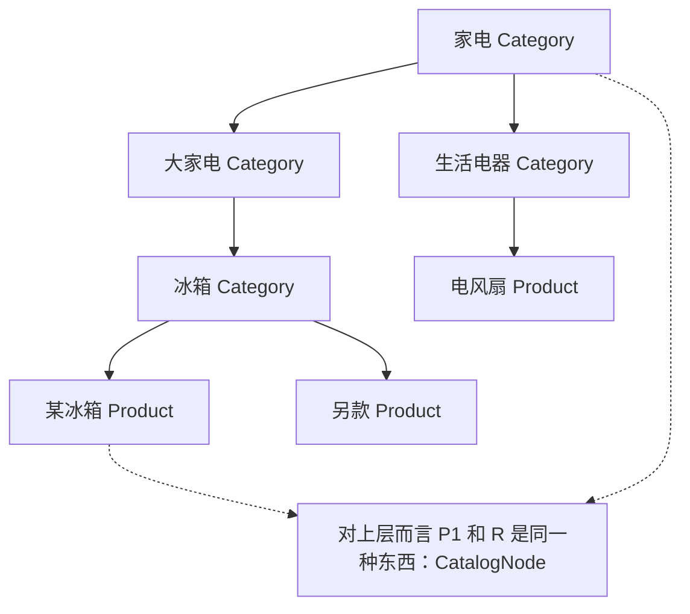

树形结构在业务系统里无处不在：商品类目树、部门权限树、订单主子单、评论楼中楼。组合模式处理树的经典难题：**对叶子和容器做同样的事，代码却总在分叉**。

CloudShop 的类目运营后台：左侧是类目树（"家电 → 大家电 → 冰箱"），叶子类目下挂着商品。产品需求：任意节点上显示"该节点下的价格区间和总库存"——点"家电"要看整棵子树汇总。

## v0：到处都是双分支

```go
// catalog/category.go —— CloudShop v0
type Category struct {
	ID       int64
	Name     string
	Children []*Category // 子类目（可能是叶子类目）
	Products []*Product  // 叶子类目下的商品
}

// 价格区间：容器递归子类目，叶子汇总商品——双分支
func PriceRange(c *Category) (min, max int64) {
	if len(c.Children) > 0 { // 容器分支
		for _, sub := range c.Children {
			smin, smax := PriceRange(sub)
			// 合并子区间 ...
		}
		return
	}
	// 叶子分支：扫商品
	for _, p := range c.Products {
		// 合并商品价格 ...
	}
	return
}

// 库存汇总：又一个双分支函数
func TotalStock(c *Category) int64 {
	if len(c.Children) > 0 {
		var t int64
		for _, sub := range c.Children {
			t += TotalStock(sub)
		}
		return t
	}
	var t int64
	for _, p := range c.Products {
		t += p.Stock
	}
	return t
}
```

疼在**每个操作都重复"容器还是叶子"的判断**：`PriceRange` 一遍、`TotalStock` 一遍，下个需求的"展示整棵树"还会再来一遍。更要命的在前面：产品要加"专题节点"（一种既能挂商品又能挂子专题的新容器）——**所有双分支函数全体陪葬**，每个都要从两分支改三分支。

## v1：叶子和容器，一个接口

统一对待的钥匙：**叶子和容器对外承诺同样的行为**。定义 `CatalogNode` 接口，两类节点各自实现：

```go
// catalog/node.go
type CatalogNode interface {
	PriceRange() (min, max int64)
	Stock() int64
	Display(indent string) string
}

// 叶子：商品
type Product struct {
	ID    int64
	Title string
	Price int64
	Stock int64
}

func (p *Product) PriceRange() (int64, int64) { return p.Price, p.Price }
func (p *Product) Stock() int64               { return p.Stock }
func (p *Product) Display(indent string) string {
	return fmt.Sprintf("%s- %s ¥%d\n", indent, p.Title, p.Price)
}

// 容器：类目/专题——持有的是 []CatalogNode，叶子容器混装
type Category struct {
	ID       int64
	Name     string
	Children []CatalogNode // 关键：Product 和 Category 都能放
}

func (c *Category) PriceRange() (int64, int64) {
	var min, max int64 = -1, -1
	for _, ch := range c.Children {
		cmin, cmax := ch.PriceRange() // 不关心孩子是叶子还是容器
		if min == -1 || cmin < min {
			min = cmin
		}
		if max == -1 || cmax > max {
			max = cmax
		}
	}
	return min, max
}

func (c *Category) Stock() int64 {
	var t int64
	for _, ch := range c.Children {
		t += ch.Stock()
	}
	return t
}
```

`PriceRange` 里那个 `if len(Children) > 0` 的分支消失了：**容器不判断孩子的种类，只调用接口方法**——递归自然处理整棵树。加"专题节点"？它实现 `CatalogNode` 就能直接挂进树，`PriceRange`/`Stock`/`Display` 一个都不用改。



## 命名时刻

**组合模式：将对象组合成树形结构，使单个对象（叶子）与组合对象（容器）被统一使用**。它回应的力：**树形结构 + 一致操作**——客户代码希望"对节点说一句话"，不关心它是零件还是组件。

GoF 原版有个著名的坑：为了让容器支持 `Add/Remove`，让**叶子也被迫实现**这两个方法（叶子加孩子只能抛异常或静默失败）——所谓"透明性与安全性的权衡"。Go 用小接口直接绕开了这个三十年老问题：**接口里只放公共行为**（PriceRange/Stock），`Add` 不进接口，留在 `Category` 具体类型上。要往树上挂节点时做一次类型断言（`if cat, ok := node.(*Category); ok`）。需要增删的代码拿具体类型，只需要遍历的代码拿接口——各取所需，这又是[第 0 篇](/posts/design-patterns-0-开篇/)接口隔离的胜利。

## 标准库里的落地

**`go/ast`——整门语言的树。** 每个 Go 源文件是一棵 `ast.Node` 树：`File`（容器）里有 `Decl`，`FuncDecl`（容器）里有 `Body`，最底下是 `Ident`、`BasicLit`（叶子）。parser 造树、printer 印树、linter 遍历树——所有工具**用同一套接口处理整棵树**，从不区分节点是叶子还是分支。写个遍历改函数名的工具，对 `Ident` 和 `BlockStmt` 的处理在接口层完全一致。

**`io/fs` + `fs.WalkDir`——文件系统的统一树。** `fs.DirEntry` 把"文件"和"目录"统一成条目，`fs.WalkDir` 一套递归走完。妙处在于 `embed.FS`、`os.DirFS`、`zip.Reader`（实现 `fs.FS` 的都是）**形态完全不同的东西，同一套遍历代码**。目录和文件的差异被压在 `IsDir()` 一个方法背后——树的一统性是这套 API 的地基。

## 业务实战

CloudShop 的三个落点：

**类目树**：v1 的形态直接上线，`专题节点`后来真的加了（大促活动页），一个文件接入，汇总代码零改动。

**权限树**：部门 → 子部门 → 成员的 RBAC 树，`HasPermission(perm)` 对成员是"查自己的角色"，对部门是"查自己 + 递归子部门"。同一接口，判断权限的代码一行递归。

**订单主子单**：一单多商品，主单（容器）的 `TotalAmount()` 汇总子单（叶子）；退款按子单走——主单的 `Refundable()` 遍历子单判断。订单树的坑比类目深：**父子双向引用**（子单要拿到主单号做幂等），实现时用 ID 引用替代指针引用，防止序列化成环。

## 好处与代价

| 好处 | 代价 |
|---|---|
| 新节点类型零成本入树 | 叶子被迫实现无意义行为的诱惑（守住小接口） |
| 树操作（遍历/汇总/渲染）写一遍全树通用 | 深树的调试：递归断点跳得眼花 |
| 客户代码彻底忘掉"容器还是叶子" | 父指针/双向引用容易成环（序列化炸） |
| 与访问者配合可对同一棵树做多种遍历（第 17 篇） | 类型断言的散布（妥协点，集中在装配处） |

## 什么时候不要用

- **树里只有一种节点**：纯目录嵌套用一个 `[]*Category` 自引用就够，没有叶子/容器之分就没有组合。
- **操作对叶子和容器语义完全不同**："展示商品详情页" vs "展示类目列表页"根本是两套交互——硬统一接口会把差异漏进方法里的 `if kind ==` 判断，那是比双分支更隐蔽的坏味道。
- **结构扁平**：一层分类一层商品，两层循环写完，别上树。

## 易混淆

**组合 vs [装饰器](/posts/design-patterns-5-装饰器/)（第 5 篇）**：都是"实现接口并持有引用"的结构。装饰器持**一个**同类（纵向包洋葱），组合持**多个**孩子（横向成树）。一个叠行为，一个聚层次。

**组合 vs [访问者](/posts/design-patterns-17-冷门五连/)（第 17 篇）**：组合统一**结构遍历**；访问者在结构稳定时给**多种不同操作**开扩展口。先有组合（树统一了），操作种类爆炸时再上访问者——`go/ast` 恰好两样都用了：`Node` 是组合，`Inspect` 是访问者。

## 自测

1. v0 里加"专题节点"为什么导致所有双分支函数陪葬？v1 的哪个设计决定把它变成"加一个文件"？
2. GoF 的"透明性 vs 安全性"权衡（叶子要不要有 Add），Go 用什么手段消解的？代价是什么？
3. `fs.WalkDir` 能同时走 `embed.FS` 和 `os.DirFS`，组合模式在其中起的作用是什么？`IsDir()` 背后压住了什么差异？
4. 订单主子单用 ID 引用替代父指针防成环——类目树为什么没这个问题？

---

**参考来源**

- GoF, *Design Patterns* — 组合与"透明性/安全性"权衡
- `go/ast`（Node/Inspect）、`io/fs`（DirEntry/WalkDir）源码 — 标准库的树统一
- Refactoring.guru, [Composite](https://refactoring.guru/design-patterns/composite)
